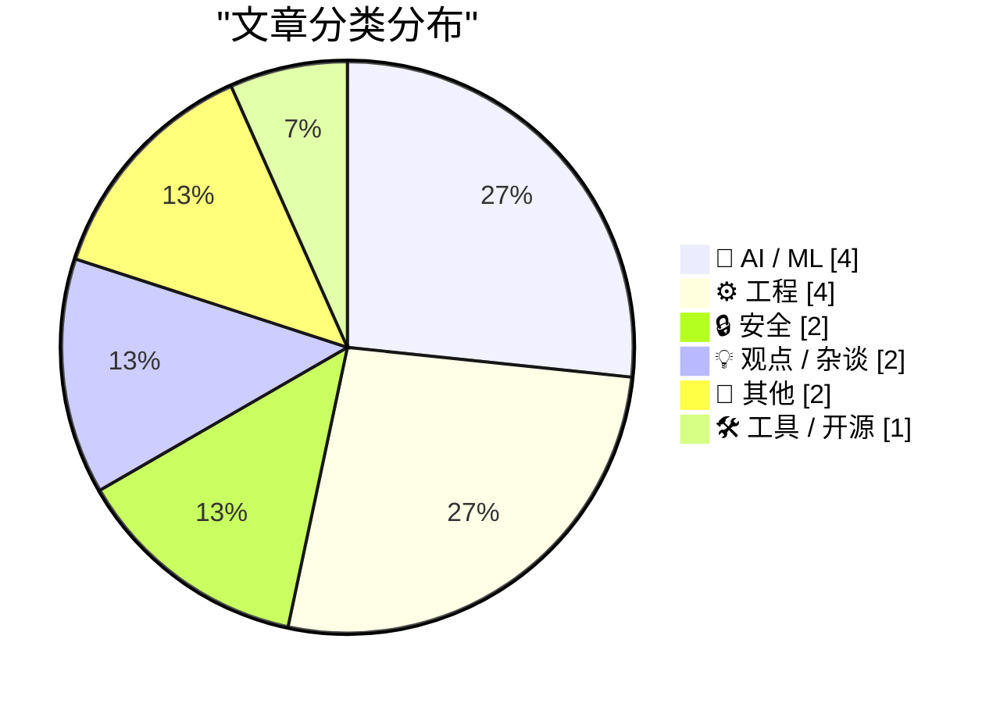
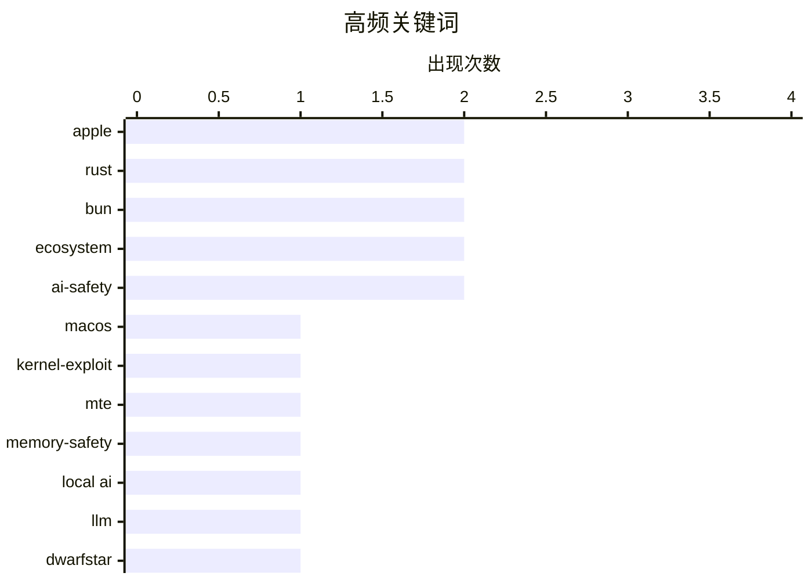

# 📰 AI 博客每日精选 — 2026-05-15

> 来自 Karpathy 推荐的 92 个顶级技术博客，AI 精选 Top 15

## 📝 今日看点

今日技术圈聚焦 AI 技术下沉、安全攻防升级与巨头组织调整三大趋势。本地推理模型走红与编程代理打破技术栈锁定，标志着 AI 正加速向端侧与开发底层渗透；OpenAI 与苹果的合作裂痕及欧盟推动儿童 AI 安全评估，则折射出商业博弈与合规监管的同步收紧。安全领域持续承压，苹果 M5 芯片内存防护机制遭绕过，政府级数据监测网络加速扩张。叠加 Meta 裁员引发的内部士气低迷，科技行业正经历技术迭代、商业重构与组织阵痛的多重考验。

---

## 🏆 今日必读

🥇 **借助 Mythos Preview，研究人员宣布发现可绕过 M5 内存完整性强制执行的 macOS 内核漏洞**

[Aided by Mythos Preview, Researchers Announce MacOS Kernel Exploit Circumventing M5 Memory Integrity Enforcement](https://blog.calif.io/p/first-public-kernel-memory-corruption) — daringfireball.net · 36 分钟前 · 🔒 安全

> Apple M5/A19 芯片引入的硬件辅助内存安全系统 MIE（基于 ARM MTE）旨在防御内存损坏攻击，但已被研究人员成功绕过。Calif 安全研究团队利用 Mythos Preview 环境，公开了首个针对 macOS 内核的内存损坏漏洞利用技术。该漏洞直接突破了 MIE 的硬件级内存标记与完整性检查机制，证明纯硬件辅助方案在复杂内核态攻击面前仍存在绕过路径。硬件级内存安全并非绝对可靠，操作系统与芯片厂商需持续迭代防御策略以应对新型内核攻击。

💡 **为什么值得读**: 揭示了苹果最新旗舰芯片安全架构的实际防御边界，为安全研究人员和系统开发者提供了突破硬件级内存保护的实战参考。

🏷️ macOS, kernel-exploit, MTE, memory-safety

🥈 **关于 DS4 的一些说明**

[A few words on DS4](http://antirez.com/news/165) — antirez.com · 1 小时前 · 🤖 AI / ML

> Redis 作者 antirez 发布的本地 AI 推理模型 DwarfStar 4 (DS4) 迅速走红，验证了单模型本地化体验的市场需求。DS4 凭借足够大且推理速度快的架构，结合极不对称的 2/8 bit 量化方案，仅需 96GB 或 128GB 内存即可流畅运行。该方案大幅降低了本地部署前沿大模型的硬件门槛，使消费级工作站也能胜任复杂推理任务。高效量化与模型架构的协同优化，正在重塑本地 AI 推理的部署范式。

💡 **为什么值得读**: 提供了大模型本地化部署的轻量化实践路径，对受限于算力或隐私需求的开发者极具落地参考价值。

🏷️ local AI, LLM, DwarfStar, inference

🥉 **多元视角：众筹《AI 时代后的“反向半人马”生存指南》（2026年5月14日）**

[Pluralistic: Kickstarting "The Reverse Centaur's Guide to Life After AI" (14 May 2026)](https://pluralistic.net/2026/05/14/who-it-does-it-for/) — pluralistic.net · 13 小时前 · 💡 观点 / 杂谈

> Cory Doctorow 发起众筹新书，探讨在 AI 深度介入工作流后，人类如何保持批判性思维与主体性。文章提出“反向半人马”概念，主张人类不应盲目依赖 AI 辅助，而应成为 AI 的严格审查者与批判者。书中结合数字版权、平台垄断、儿童 AI 安全等现实议题，分析技术红利背后的权力转移与系统性风险。在 AI 普及时代，培养独立判断能力与建立有效的技术制衡机制，比单纯追求效率提升更为关键。

💡 **为什么值得读**: 跳出技术乐观主义叙事，从社会批判视角提供 AI 时代人类定位的深刻反思，适合关注技术伦理与数字权利的读者。

🏷️ AI ethics, digital rights, tech criticism, EFF

---

## 📊 数据概览

| 扫描源 | 抓取文章 | 时间范围 | 精选 |
|:---:|:---:|:---:|:---:|
| 77/92 | 2334 篇 → 22 篇 | 24h | **15 篇** |

### 分类分布



### 高频关键词



<details>
<summary>📈 纯文本关键词图（终端友好）</summary>

```
apple          │ ████████████████████ 2
rust           │ ████████████████████ 2
bun            │ ████████████████████ 2
ecosystem      │ ████████████████████ 2
ai-safety      │ ████████████████████ 2
macos          │ ██████████░░░░░░░░░░ 1
kernel-exploit │ ██████████░░░░░░░░░░ 1
mte            │ ██████████░░░░░░░░░░ 1
memory-safety  │ ██████████░░░░░░░░░░ 1
local ai       │ ██████████░░░░░░░░░░ 1
```

</details>

### 🏷️ 话题标签

**apple**(2) · **rust**(2) · **bun**(2) · ecosystem(2) · ai-safety(2) · macos(1) · kernel-exploit(1) · mte(1) · memory-safety(1) · local ai(1) · llm(1) · dwarfstar(1) · inference(1) · ai ethics(1) · digital rights(1) · tech criticism(1) · eff(1) · openai(1) · ai-integration(1) · business(1)

---

## 🤖 AI / ML

### 1. 关于 DS4 的一些说明

[A few words on DS4](http://antirez.com/news/165) — **antirez.com** · 1 小时前 · ⭐ 25/30

> Redis 作者 antirez 发布的本地 AI 推理模型 DwarfStar 4 (DS4) 迅速走红，验证了单模型本地化体验的市场需求。DS4 凭借足够大且推理速度快的架构，结合极不对称的 2/8 bit 量化方案，仅需 96GB 或 128GB 内存即可流畅运行。该方案大幅降低了本地部署前沿大模型的硬件门槛，使消费级工作站也能胜任复杂推理任务。高效量化与模型架构的协同优化，正在重塑本地 AI 推理的部署范式。

🏷️ local AI, LLM, DwarfStar, inference

---

### 2. Gurman 报道：OpenAI 对与苹果的合作协议表示不满

[Gurman Reports that OpenAI Is Unhappy With Apple Deal](https://www.bloomberg.com/news/articles/2026-05-14/openai-apple-partnership-frays-setting-up-possible-legal-fight?srnd=undefined&amp;embedded-checkout=true) — **daringfireball.net** · 5 小时前 · ⭐ 24/30

> 苹果与 OpenAI 的战略合作出现裂痕，OpenAI 正积极寻求法律途径应对潜在的合同违约问题。据彭博社 Mark Gurman 报道，OpenAI 律师团队已联合外部律所评估多项法律选项，可能首先向苹果发送违约通知而非直接提起诉讼。双方分歧主要源于合作条款执行、数据使用权限及商业利益分配未达预期。科技巨头间的 AI 生态合作高度依赖利益平衡，商业摩擦可能引发新一轮行业法律博弈。

🏷️ OpenAI, Apple, AI-integration, business

---

### 3. 监管大厂十年后，Margrethe Vestager 支持成立儿童 AI 安全研究所 | 欧洲新闻台

[Margrethe Vestager Backs New AI Safety Institute for Children After Decade Regulating Big Tech | Euronews](https://www.euronews.com/next/2026/05/12/margrethe-vestager-backs-new-ai-safety-institute-for-children-after-decade-regulating-big-) — **daringfireball.net** · 17 分钟前 · ⭐ 22/30

> 欧盟前高管 Margrethe Vestager 联合推动成立独立的儿童 AI 安全研究所，旨在为未成年人提供 AI 产品安全评估。该机构借鉴汽车“独立碰撞测试评级”模式，计划对面向儿童的 AI 模型与应用进行标准化安全测试与透明化评级。此举意在填补当前 AI 监管在未成年人保护领域的空白，通过第三方认证机制倒逼企业落实安全设计。建立类汽车碰撞测试的 AI 安全评级体系，将成为规范儿童 AI 产品市场、保障数字时代未成年人权益的关键基础设施。

🏷️ AI-safety, regulation, policy, children

---

### 4. Geoffrey Fowler and the Launch of the Youth AI Safety Institute

[Geoffrey Fowler and the Launch of the Youth AI Safety Institute](https://geoffreyfowler.substack.com/p/what-is-ai-doing-to-our-kids-im-going) — **daringfireball.net** · 3 小时前 · ⭐ 20/30

> Geoffrey Fowler, on his blog, which, alas, he calls “a Substack”:


  I’m joining the Youth AI Safety Institute as its first new
employee. It’s a research and testing organization launching today
unde

🏷️ AI-safety, youth, nonprofit, ethics

---

## ⚙️ 工程

### 5. 一种常数空间线性时间算法：仅保留目录中最近的 10 个文件

[A constant-space linear-time algorithm for deleting all but the 10 most recent files in a directory](https://devblogs.microsoft.com/oldnewthing/20260514-00/?p=112322) — **devblogs.microsoft.com/oldnewthing** · 10 小时前 · ⭐ 24/30

> Microsoft 开发者博客分享了一种高效清理目录文件的算法，旨在仅保留最新 10 个文件并删除其余内容。该算法摒弃了传统的排序或全量扫描方案，采用固定大小的滑动窗口数据结构，在单次遍历中完成文件时间戳比较与淘汰决策。其时间复杂度为 O(N)，空间复杂度严格保持 O(1)，无需额外内存分配即可处理海量文件。巧妙利用基础数据结构与单次遍历策略，可在极低资源开销下实现高效的文件生命周期管理。

🏷️ algorithm, optimization, filesystem, engineering

---

### 6. 不再那么“锁定”了

[Not so locked in any more](https://simonwillison.net/2026/May/14/not-so-locked-in/#atom-everything) — **simonwillison.net** · 1 小时前 · ⭐ 23/30

> 行业趋势显示，企业正借助 AI 编程代理打破传统技术栈锁定，加速遗留系统的现代化重构。文章引用 Bun 从 Zig 迁移至 Rust 的案例，指出中型科技公司已利用编码代理完成 iPhone 与 Android 遗留应用的重写。AI 代理大幅降低了跨语言重构的沟通与试错成本，使技术栈切换从“高风险工程”变为“可快速验证的迭代过程”。AI 编程工具的成熟正在瓦解长期存在的技术锁定效应，赋予企业更高的架构演进自由度。

🏷️ Rust, Zig, Bun, ecosystem

---

### 7. Quoting Mitchell Hashimoto

[Quoting Mitchell Hashimoto](https://simonwillison.net/2026/May/14/mitchell-hashimoto/#atom-everything) — **simonwillison.net** · 1 小时前 · ⭐ 20/30

> <blockquote cite="https://twitter.com/mitchellh/status/2055039647924007222"><p>[...] On the interesting side is how fungible programming languages are nowadays. Programming languages used to be LOCK I

🏷️ languages, ecosystem, Bun, Rust

---

### 8. Centrality is not vitality

[Centrality is not vitality](https://nesbitt.io/2026/05/14/centrality-is-not-vitality.html) — **nesbitt.io** · 14 小时前 · ⭐ 19/30

> Don't automatically reach for PageRank on dependency graphs

🏷️ dependency graphs, PageRank, software architecture, code analysis

---

## 🔒 安全

### 9. 借助 Mythos Preview，研究人员宣布发现可绕过 M5 内存完整性强制执行的 macOS 内核漏洞

[Aided by Mythos Preview, Researchers Announce MacOS Kernel Exploit Circumventing M5 Memory Integrity Enforcement](https://blog.calif.io/p/first-public-kernel-memory-corruption) — **daringfireball.net** · 36 分钟前 · ⭐ 27/30

> Apple M5/A19 芯片引入的硬件辅助内存安全系统 MIE（基于 ARM MTE）旨在防御内存损坏攻击，但已被研究人员成功绕过。Calif 安全研究团队利用 Mythos Preview 环境，公开了首个针对 macOS 内核的内存损坏漏洞利用技术。该漏洞直接突破了 MIE 的硬件级内存标记与完整性检查机制，证明纯硬件辅助方案在复杂内核态攻击面前仍存在绕过路径。硬件级内存安全并非绝对可靠，操作系统与芯片厂商需持续迭代防御策略以应对新型内核攻击。

🏷️ macOS, kernel-exploit, MTE, memory-safety

---

### 10. 欢迎巴哈马政府加入 Have I Been Pwned 平台

[Welcoming the Bahamian Government to Have I Been Pwned](https://www.troyhunt.com/welcoming-the-bahamian-government-to-have-i-been-pwned/) — **troyhunt.com** · 20 小时前 · ⭐ 23/30

> 知名数据泄露监测平台 Have I Been Pwned (HIBP) 正式接入巴哈马政府，成为其第 44 个政府级客户。巴哈马国家计算机事件响应团队 (CIRT-BS) 现已获得 HIBP 免费政府服务权限，可实时监测本国政府域名是否涉及已知数据泄露事件。该合作将帮助巴哈马快速识别凭证泄露风险，提升国家级网络安全事件的响应与协调能力。公共部门接入第三方威胁情报网络，正成为提升国家数字基础设施安全基线的标准化实践。

🏷️ HIBP, DataBreach, CIRT, Security

---

## 💡 观点 / 杂谈

### 11. 多元视角：众筹《AI 时代后的“反向半人马”生存指南》（2026年5月14日）

[Pluralistic: Kickstarting "The Reverse Centaur's Guide to Life After AI" (14 May 2026)](https://pluralistic.net/2026/05/14/who-it-does-it-for/) — **pluralistic.net** · 13 小时前 · ⭐ 25/30

> Cory Doctorow 发起众筹新书，探讨在 AI 深度介入工作流后，人类如何保持批判性思维与主体性。文章提出“反向半人马”概念，主张人类不应盲目依赖 AI 辅助，而应成为 AI 的严格审查者与批判者。书中结合数字版权、平台垄断、儿童 AI 安全等现实议题，分析技术红利背后的权力转移与系统性风险。在 AI 普及时代，培养独立判断能力与建立有效的技术制衡机制，比单纯追求效率提升更为关键。

🏷️ AI ethics, digital rights, tech criticism, EFF

---

### 12. 《连线》杂志揭秘 Meta 内部的低迷氛围

[Wired on the Dark Mood Inside Meta](https://www.wired.com/story/meta-layoffs-bad-vibes-mark-zuckerberg-ai/) — **daringfireball.net** · 1 小时前 · ⭐ 23/30

> Meta 即将在 5 月 20 日进行新一轮裁员，内部员工士气跌至历史低点，整体氛围极度悲观。《连线》报道指出，除高管外几乎所有员工均对裁员计划感到焦虑与不满，Instagram 等核心业务线员工直言“氛围极其糟糕”。此次裁员与 AI 战略转型同步推进，反映出公司在效率优化与业务重心转移过程中的剧烈阵痛。科技巨头在 AI 转型期的组织重构正引发深层文化冲突，员工稳定性与战略执行力面临严峻考验。

🏷️ Meta, layoffs, tech-culture, morale

---

## 📝 其他

### 13. 蒂姆·库克加入特朗普访华峰会的高管随行团

[Tim Cook Is in Trump’s Executive Entourage for China Summit](https://www.the-independent.com/news/world/americas/us-politics/elon-musk-tim-cook-trump-china-tech-ceo-b2975568.html) — **daringfireball.net** · 4 小时前 · ⭐ 21/30

> 苹果 CEO 蒂姆·库克与马斯克、贝莱德 CEO 拉里·芬克等科技金融巨头一同加入特朗普总统的中国峰会随行代表团。特朗普在 Truth Social 上确认了多位高规格参会者名单，并戏称库克为“Tim Apple”。此次峰会聚焦中美科技与经贸关系，科技巨头随行凸显了私营部门在高层外交与供应链谈判中的关键桥梁作用。科技领袖深度参与国家间高层对话，标志着商业利益与地缘政治博弈的融合已进入常态化阶段。

🏷️ Tim-Cook, geopolitics, Apple, China

---

### 14. The First Democratic Tech Alliance Assembly

[The First Democratic Tech Alliance Assembly](https://berthub.eu/articles/posts/democratic-tech-alliance-may-2026/) — **berthub.eu** · 10 小时前 · ⭐ 18/30

> Yesterday I attended the first assembly of the Democratic Tech Alliance (DTA), which gathered in the European Parliament. Membership of the alliance includes European political groups like the Greens/

🏷️ TechPolicy, EU, Governance

---

## 🛠 工具 / 开源

### 15. datasette-ip-rate-limit 0.1a0

[datasette-ip-rate-limit 0.1a0](https://simonwillison.net/2026/May/14/datasette-ip-rate-limit/#atom-everything) — **simonwillison.net** · 20 小时前 · ⭐ 20/30

> <p><strong>Release:</strong> <a href="https://github.com/datasette/datasette-ip-rate-limit/releases/tag/0.1a0">datasette-ip-rate-limit 0.1a0</a></p>
        <p>The <a href="https://datasette.io/">data

🏷️ Datasette, rate-limiting, AI-coding, Python

---

*生成于 2026-05-15 00:20 | 扫描 77 源 → 获取 2334 篇 → 精选 15 篇*
*基于 [Hacker News Popularity Contest 2025](https://refactoringenglish.com/tools/hn-popularity/) RSS 源列表，由 [Andrej Karpathy](https://x.com/karpathy) 推荐*
*由「懂点儿AI」制作，欢迎关注同名微信公众号获取更多 AI 实用技巧 💡*
