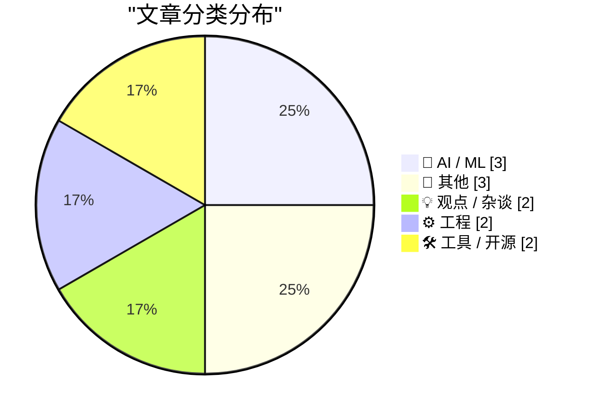
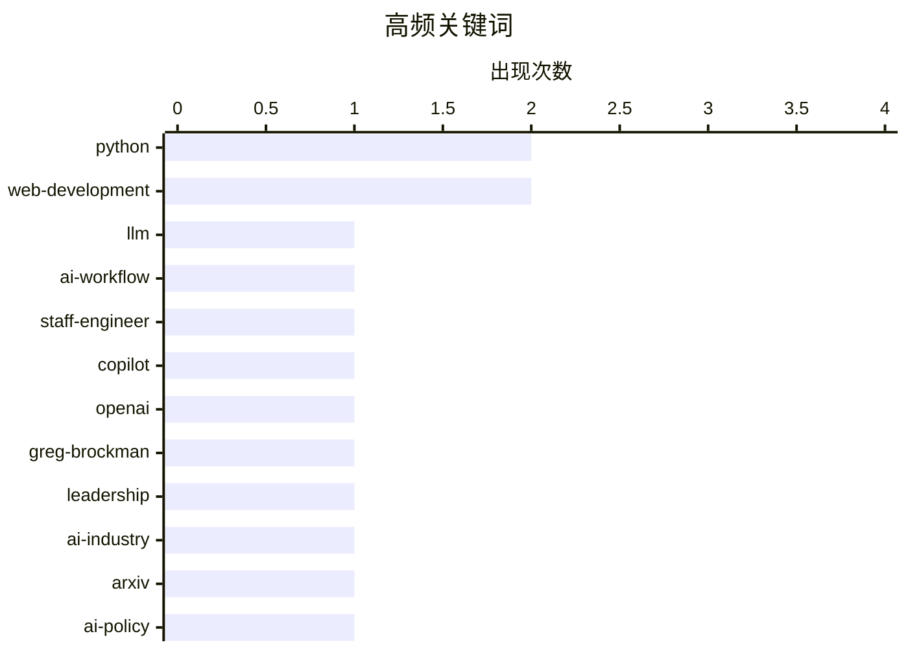

# 📰 AI 博客每日精选 — 2026-05-17

> 来自 Karpathy 推荐的 92 个顶级技术博客，AI 精选 Top 12

## 📝 今日看点

今日技术圈聚焦于AI从概念炒作向工程化落地的深度转型，业界正通过重构产品架构、规范学术使用及重塑研发工作流，明确AI作为底层基础设施的边界与价值。与此同时，科技平台在流量管控与广告合规方面面临更严苛的监管审视，生态治理与商业伦理正成为企业不可回避的底线。在应用层之外，开发者工具链与核心框架的现代化演进持续提速，工程实践正全面迈向精细化与高效化。整体而言，技术演进已告别粗放扩张，步入务实应用、合规治理与工程深耕并重的新周期。

---

## 🏆 今日必读

🥇 **2026年高级软件工程师如何使用大语言模型**

[How I use LLMs as a staff engineer in 2026](https://seangoedecke.com/how-i-use-llms-in-2026/) — seangoedecke.com · 12 分钟前 · 🤖 AI / ML

> 文章探讨了资深工程师在日常研发中落地大语言模型的具体工作流与边界划分。作者将AI主要用于智能代码补全（如GitHub Copilot）、跨领域战术性代码修改（需领域专家复核）、一次性研究脚本编写、新技术栈（如Unity引擎）快速学习以及最终手段的缺陷排查。这种模式将AI定位为效率倍增器而非替代者，强调人工审查与AI生成的明确界限。资深工程师应聚焦于架构把控与复杂问题求解，将重复性、探索性任务交由AI处理，从而实现研发效能的实质性跃升。

💡 **为什么值得读**: 提供了经过实战验证的AI辅助开发分层策略，帮助工程师明确人机协作边界，避免盲目依赖或过度排斥AI。

🏷️ LLM, AI-workflow, staff-engineer, Copilot

🥈 **Greg Brockman正式接管OpenAI产品业务，一家“极其稳定且运营良好”的公司**

[Greg Brockman Officially Takes Control of Products at OpenAI, a Very Stable Well-Run Company](https://www.wired.com/story/openai-reorg-greg-brockman-product/) — daringfireball.net · 22 小时前 · 🤖 AI / ML

> 文章报道了OpenAI为统一产品线而进行的内部组织架构调整。联合创始人兼总裁Greg Brockman将正式接管公司产品战略，同时继续负责AI基础设施工作，此前该职责由其临时代理。此次人事变动标志着OpenAI从技术探索向商业化产品落地的重心转移。公司正通过整合产品矩阵与强化核心管理层控制力，加速推进AI技术的规模化部署与市场变现。

💡 **为什么值得读**: 揭示了AI头部企业从研发导向转向产品商业化落地的关键组织变革信号，对理解行业竞争格局与战略走向具有重要参考价值。

🏷️ OpenAI, Greg-Brockman, leadership, AI-industry

🥉 **ArXiv新规：提交AI生成“垃圾内容”的研究者将被封禁一年**

[ArXiv to Ban Researchers for a Year if They Submit AI Slop](https://www.404media.co/new-arxiv-rules-ai-generated-papers-ban/) — daringfireball.net · 4 小时前 · 🤖 AI / ML

> 文章介绍了学术预印本平台ArXiv针对生成式AI滥用出台的最新审核与处罚政策。平台主席Thomas Dietterich明确，作者需对论文中由AI生成的不当语言、抄袭、偏见、错误或误导性内容承担全部责任。一旦查实提交内容包含确凿的AI生成痕迹，相关研究者将面临为期一年的投稿封禁。此举旨在维护学术出版的严谨性与原创性，遏制AI工具在科研写作中的滥用趋势。

💡 **为什么值得读**: 明确了AI辅助科研的合规红线与学术责任归属，为研究人员规范使用生成式工具提供了权威的制度参考。

🏷️ ArXiv, AI-policy, research-integrity, academic-publishing

---

## 📊 数据概览

| 扫描源 | 抓取文章 | 时间范围 | 精选 |
|:---:|:---:|:---:|:---:|
| 77/92 | 2335 篇 → 12 篇 | 24h | **12 篇** |

### 分类分布



### 高频关键词



<details>
<summary>📈 纯文本关键词图（终端友好）</summary>

```
python          │ ████████████████████ 2
web-development │ ████████████████████ 2
llm             │ ██████████░░░░░░░░░░ 1
ai-workflow     │ ██████████░░░░░░░░░░ 1
staff-engineer  │ ██████████░░░░░░░░░░ 1
copilot         │ ██████████░░░░░░░░░░ 1
openai          │ ██████████░░░░░░░░░░ 1
greg-brockman   │ ██████████░░░░░░░░░░ 1
leadership      │ ██████████░░░░░░░░░░ 1
ai-industry     │ ██████████░░░░░░░░░░ 1
```

</details>

### 🏷️ 话题标签

**python**(2) · **web-development**(2) · **llm**(1) · ai-workflow(1) · staff-engineer(1) · copilot(1) · openai(1) · greg-brockman(1) · leadership(1) · ai-industry(1) · arxiv(1) · ai-policy(1) · research-integrity(1) · academic-publishing(1) · ai(1) · product-strategy(1) · tech-industry(1) · ai-hype(1) · sqlalchemy(1) · orm(1)

---

## 🤖 AI / ML

### 1. 2026年高级软件工程师如何使用大语言模型

[How I use LLMs as a staff engineer in 2026](https://seangoedecke.com/how-i-use-llms-in-2026/) — **seangoedecke.com** · 12 分钟前 · ⭐ 26/30

> 文章探讨了资深工程师在日常研发中落地大语言模型的具体工作流与边界划分。作者将AI主要用于智能代码补全（如GitHub Copilot）、跨领域战术性代码修改（需领域专家复核）、一次性研究脚本编写、新技术栈（如Unity引擎）快速学习以及最终手段的缺陷排查。这种模式将AI定位为效率倍增器而非替代者，强调人工审查与AI生成的明确界限。资深工程师应聚焦于架构把控与复杂问题求解，将重复性、探索性任务交由AI处理，从而实现研发效能的实质性跃升。

🏷️ LLM, AI-workflow, staff-engineer, Copilot

---

### 2. Greg Brockman正式接管OpenAI产品业务，一家“极其稳定且运营良好”的公司

[Greg Brockman Officially Takes Control of Products at OpenAI, a Very Stable Well-Run Company](https://www.wired.com/story/openai-reorg-greg-brockman-product/) — **daringfireball.net** · 22 小时前 · ⭐ 26/30

> 文章报道了OpenAI为统一产品线而进行的内部组织架构调整。联合创始人兼总裁Greg Brockman将正式接管公司产品战略，同时继续负责AI基础设施工作，此前该职责由其临时代理。此次人事变动标志着OpenAI从技术探索向商业化产品落地的重心转移。公司正通过整合产品矩阵与强化核心管理层控制力，加速推进AI技术的规模化部署与市场变现。

🏷️ OpenAI, Greg-Brockman, leadership, AI-industry

---

### 3. ArXiv新规：提交AI生成“垃圾内容”的研究者将被封禁一年

[ArXiv to Ban Researchers for a Year if They Submit AI Slop](https://www.404media.co/new-arxiv-rules-ai-generated-papers-ban/) — **daringfireball.net** · 4 小时前 · ⭐ 24/30

> 文章介绍了学术预印本平台ArXiv针对生成式AI滥用出台的最新审核与处罚政策。平台主席Thomas Dietterich明确，作者需对论文中由AI生成的不当语言、抄袭、偏见、错误或误导性内容承担全部责任。一旦查实提交内容包含确凿的AI生成痕迹，相关研究者将面临为期一年的投稿封禁。此举旨在维护学术出版的严谨性与原创性，遏制AI工具在科研写作中的滥用趋势。

🏷️ ArXiv, AI-policy, research-integrity, academic-publishing

---

## 📝 其他

### 4. Reddit正屏蔽部分用户的移动端网页访问权限

[Reddit Is Blocking Some Users From Accessing Its Website From Mobile Devices](https://arstechnica.com/information-technology/2026/05/why-reddit-blocked-my-daily-visit-to-its-mobile-website/) — **daringfireball.net** · 2 小时前 · ⭐ 22/30

> 文章报道了Reddit近期在移动端网页端实施强制应用跳转策略，部分用户访问网站时会弹出无法关闭或跳过的全屏提示，要求下载官方App。该策略彻底切断了移动端网页的替代访问路径，仅保留单一的应用下载入口。此举反映了平台为提升用户留存、数据采集效率及广告变现能力而采取的激进产品策略。强制生态闭环虽然短期内可能提升App数据指标，但会严重损害开放网络体验并引发用户反感。

🏷️ Reddit, mobile-web, app-forcing, platform-policy

---

### 5. 圣克拉拉县起诉Meta涉嫌纵容诈骗广告

[Santa Clara County Sues Meta Over Alleged Scam Ads](https://sanjosespotlight.com/santa-clara-county-sues-meta-over-alleged-scam-ads/) — **daringfireball.net** · 2 小时前 · ⭐ 22/30

> 文章报道了圣克拉拉县对Meta提起的诉讼，指控其故意削弱内部反欺诈团队权限，并协助虚假公司绕过安全过滤系统。诉讼指出，Meta每年因此从诈骗广告中获取约70亿美元的非法广告收入。原告方要求法院判令Meta停止虚假广告违规行为，并赔偿相关法律费用。该案件凸显了大型社交平台在商业利益与内容安全治理之间的深层矛盾，可能引发更严格的广告合规监管。

🏷️ Meta, ad-fraud, regulation, scam-ads

---

### 6. Reading List 05/16/26

[Reading List 05/16/26](https://www.construction-physics.com/p/reading-list-051626) — **construction-physics.com** · 12 小时前 · ⭐ 15/30

> Tokyo’s cheap housing and expensive land, the House response to the Senate housing bill, an IED near an Alabama dam, Fervo’s IPO, and more.

🏷️ housing, policy, energy, newsletter

---

## 💡 观点 / 杂谈

### 7. ★ AI是技术，而非产品

[★ AI Is Technology, Not a Product](https://daringfireball.net/2026/05/ai_is_technology_not_a_product) — **daringfireball.net** · 3 小时前 · ⭐ 23/30

> 文章核心观点指出人工智能本质上是底层技术而非独立产品，甚至算不上一个独立功能模块。作者强调将AI包装成“产品”或“功能”会扭曲其实际价值与应用逻辑。正确的认知应是将AI视为可嵌入现有工作流的基础设施，通过与其他系统深度集成来释放效能。只有回归技术本质，企业才能避免陷入概念炒作，真正构建出可持续的AI应用架构。

🏷️ AI, product-strategy, tech-industry, AI-hype

---

### 8. Pluralistic：解读特朗普“空中解体”美帝国的突发举措（2026年5月16日）

[Pluralistic: Making sense of Trump's unscheduled sudden midair disassembly of the American empire (16 May 2026)](https://pluralistic.net/2026/05/16/technopoly/) — **pluralistic.net** · 15 小时前 · ⭐ 21/30

> 文章以专栏形式梳理了近期围绕美国政策转向、数字版权争议、网络视频传播与计算资源管控等议题的热点链接。作者指出“强大”并不等同于“持久”，警示盲目依赖技术垄断或行政强权可能引发系统性反噬。内容涵盖法律框架对数字内容的约束、公众舆论与执法机构的博弈，以及底层计算基础设施的潜在风险。核心观点强调在技术高度集中的时代，必须建立去中心化的韧性架构以应对不可预测的政策与技术冲击。

🏷️ tech-policy, copyright, internet-culture, Cory-Doctorow

---

## ⚙️ 工程

### 9. 《SQLAlchemy 2实战》第八章：SQLAlchemy与Web开发

[SQLAlchemy 2 In Practice - Chapter 8: SQLAlchemy and the Web](https://blog.miguelgrinberg.com/post/sqlalchemy-2-in-practice---chapter-8-sqlalchemy-and-the-web) — **miguelgrinberg.com** · 10 小时前 · ⭐ 23/30

> 本章聚焦于SQLAlchemy 2在现代Web应用与API开发中的最佳实践。内容涵盖如何将ORM层无缝集成到传统Web框架或前后端分离架构中，并针对高并发场景下的数据库连接池管理、会话生命周期控制及查询性能优化提供具体方案。作者通过实际代码示例演示了异步支持、懒加载策略调整以及复杂关联查询的构建方法。掌握这些模式能有效避免N+1查询问题，显著提升Web后端的数据访问效率与系统可维护性。

🏷️ SQLAlchemy, Python, ORM, web-development

---

### 10. 引用Julia Evans的观点

[Quoting Julia Evans](https://simonwillison.net/2026/May/16/julia-evans/#atom-everything) — **simonwillison.net** · 7 小时前 · ⭐ 20/30

> 文章引用了开发者Julia Evans关于CSS技术演进的深刻反思。她指出过去十年间通过主动克服“CSS很难”的刻板印象，系统掌握了现代CSS特性，发现诸如“垂直居中不可能”等历史痛点早已得到原生方案解决。这一认知转变彻底改变了她的前端开发工作流，使其从依赖复杂框架转向直接利用浏览器原生能力。拥抱CSS的声明式范式与持续迭代，能显著降低前端架构复杂度并提升渲染性能。

🏷️ CSS, Tailwind, frontend, web-development

---

## 🛠 工具 / 开源

### 11. Warelay -> OpenClaw

[Warelay -> OpenClaw](https://simonwillison.net/2026/May/16/openclaw-names/#atom-everything) — **simonwillison.net** · 3 小时前 · ⭐ 19/30

> 文章记录了开源项目OpenClaw（原Warelay）自11月首次提交以来的多次更名历史。作者利用自研的first_line_history.py工具追踪代码库元数据，梳理了项目在不同开发阶段的命名演变轨迹。这一过程不仅反映了开源项目在定位调整、社区反馈与品牌重塑中的常见挑战，也展示了自动化脚本在项目管理中的实用价值。清晰的版本与命名演进记录有助于维护者保持项目方向一致性，并降低新贡献者的认知门槛。

🏷️ OpenClaw, PyCon, Python, project-naming

---

### 12. The Talk Show: ‘A Sociopathic Father’

[The Talk Show: ‘A Sociopathic Father’](https://daringfireball.net/thetalkshow/2026/05/15/ep-447) — **daringfireball.net** · 22 小时前 · ⭐ 18/30

> Adam Lisagor returns to the show to talk about Hovercraft, his new virtual presentation camera app for Mac, and how he’s developing it with AI coding tools. Also, delicious Japanese spite sandwich coo

🏷️ AI-coding, Mac-app, podcast, Hovercraft

---

*生成于 2026-05-17 00:12 | 扫描 77 源 → 获取 2335 篇 → 精选 12 篇*
*基于 [Hacker News Popularity Contest 2025](https://refactoringenglish.com/tools/hn-popularity/) RSS 源列表，由 [Andrej Karpathy](https://x.com/karpathy) 推荐*
*由「懂点儿AI」制作，欢迎关注同名微信公众号获取更多 AI 实用技巧 💡*
