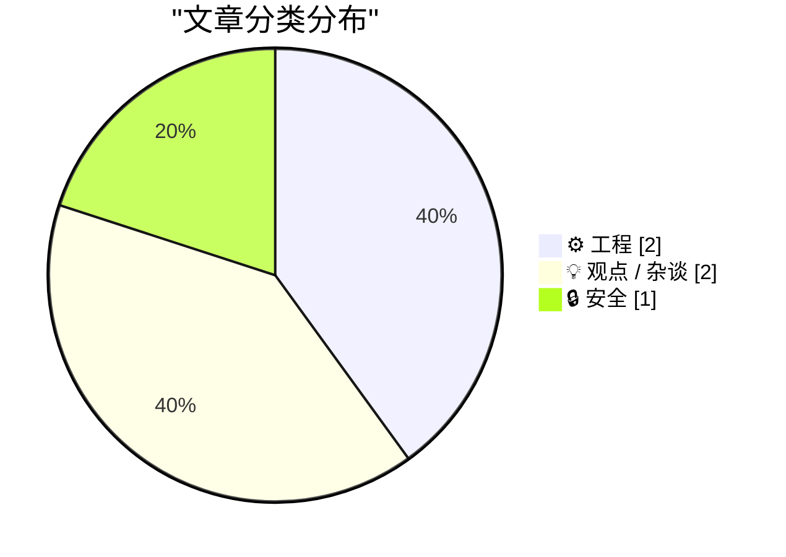
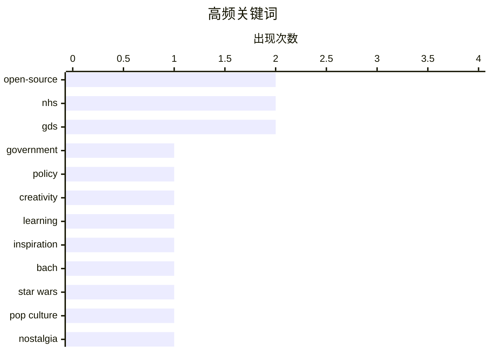

# 📰 AI 博客每日精选 — 2026-05-18

> 来自 Karpathy 推荐的 92 个顶级技术博客，AI 精选 Top 5

## 📝 今日看点

今日技术圈聚焦开源治理与 AI 合规自动化两大核心议题。英国 NHS 因安全顾虑关闭开源仓库引发业界激烈讨论，折射出代码透明化与安全管控之间的现实张力。与此同时，自主 AI 智能体正快速渗透企业风控领域，推动合规管理向全自动演进。面对安全挑战与技术升级的双重驱动，构建兼顾开放协作与风险可控的新型治理框架，已成为行业发展的必然方向。

---

## 🏆 今日必读

🥇 **GDS 就 NHS 退出开源的决定发表看法**

[GDS weighs in on the NHS's decision to retreat from Open Source](https://shkspr.mobi/blog/2026/05/gds-weighs-in-on-the-nhss-decision-to-retreat-from-open-source/) — shkspr.mobi · 12 小时前 · ⚙️ 工程

> 英国国家医疗服务体系（NHS）因安全漏洞报告决定关闭其开源代码库，引发内部与公众争议。英国政府数字服务局（GDS）罕见地公开介入此事，批评该决定缺乏充分考量。NHS 以安全为由切断开源访问，但此举违背了英国政府长期推行的“默认开源”数字服务政策。GDS 指出，关闭仓库不仅无法根本解决漏洞问题，反而会削弱社区协作审计代码的能力，增加长期维护成本。政府机构在应对安全威胁时，应坚持透明协作的开源原则，而非采取封闭倒退的防御策略。

💡 **为什么值得读**: 揭示了政府机构在安全合规与开源协作之间的典型冲突，为公共部门技术治理提供了极具参考价值的政策博弈案例。

🏷️ open-source, NHS, GDS, government

🥈 **GDS 就 NHS 退出开源的决定发表看法**

[GDS weighs in on the NHS's decision to retreat from Open Source](https://simonwillison.net/2026/May/17/gds-weighs-in/#atom-everything) — simonwillison.net · 8 小时前 · ⚙️ 工程

> 技术社区对英国 NHS 因安全漏洞关闭开源仓库的决策展开持续追踪与批评。作者引用 Terence Eden 的深度报道，指出 NHS 的封闭决定属于“考虑不周”的应激反应。安全漏洞本应通过开源社区的协作审计与快速补丁机制解决，但 NHS 选择直接切断代码访问权限。此举直接违背了英国政府数字服务（GDS）倡导的透明开发规范，引发技术界对公共部门技术治理倒退的担忧。公共机构的安全管理不应以牺牲开源协作为代价，技术决策需兼顾安全底线与生态开放。

💡 **为什么值得读**: 以技术社区视角还原了公共部门技术决策的争议全貌，有助于理解开源治理在政府数字化中的实际落地困境。

🏷️ open-source, NHS, GDS, policy

🥉 **如何获得灵感而不抄袭**

[How to be inspired without copying](https://www.joanwestenberg.com/how-to-be-inspired-without-copying/) — joanwestenberg.com · 1 小时前 · 💡 观点 / 杂谈

> 探讨创作者如何在借鉴前人作品时保持原创性，避免陷入抄袭陷阱。文章以巴赫逐音符抄写维瓦尔第协奏曲的历史案例切入，揭示“深度拆解式学习”是激发灵感的有效路径。通过亲手复现大师作品的结构与技法，创作者能够内化其设计逻辑，而非停留在表面模仿。这种“解剖式”借鉴强调理解底层原理与创作意图，将外部输入转化为个人知识体系的一部分。真正的灵感来源于对优秀作品的深度解构与重组，而非简单的复制粘贴，创作者应建立系统化的学习转化机制。

💡 **为什么值得读**: 为内容创作者与开发者提供了一套可操作的“反抄袭借鉴”方法论，帮助在高压创作环境中合法合规地汲取大师经验。

🏷️ creativity, learning, inspiration, Bach

---

## 📊 数据概览

| 扫描源 | 抓取文章 | 时间范围 | 精选 |
|:---:|:---:|:---:|:---:|
| 76/92 | 2305 篇 → 5 篇 | 24h | **5 篇** |

### 分类分布



### 高频关键词



<details>
<summary>📈 纯文本关键词图（终端友好）</summary>

```
open-source │ ████████████████████ 2
nhs         │ ████████████████████ 2
gds         │ ████████████████████ 2
government  │ ██████████░░░░░░░░░░ 1
policy      │ ██████████░░░░░░░░░░ 1
creativity  │ ██████████░░░░░░░░░░ 1
learning    │ ██████████░░░░░░░░░░ 1
inspiration │ ██████████░░░░░░░░░░ 1
bach        │ ██████████░░░░░░░░░░ 1
star wars   │ ██████████░░░░░░░░░░ 1
```

</details>

### 🏷️ 话题标签

**open-source**(2) · **nhs**(2) · **gds**(2) · government(1) · policy(1) · creativity(1) · learning(1) · inspiration(1) · bach(1) · star wars(1) · pop culture(1) · nostalgia(1) · film(1) · compliance(1) · security(1) · ai(1) · automation(1)

---

## ⚙️ 工程

### 1. GDS 就 NHS 退出开源的决定发表看法

[GDS weighs in on the NHS's decision to retreat from Open Source](https://shkspr.mobi/blog/2026/05/gds-weighs-in-on-the-nhss-decision-to-retreat-from-open-source/) — **shkspr.mobi** · 12 小时前 · ⭐ 23/30

> 英国国家医疗服务体系（NHS）因安全漏洞报告决定关闭其开源代码库，引发内部与公众争议。英国政府数字服务局（GDS）罕见地公开介入此事，批评该决定缺乏充分考量。NHS 以安全为由切断开源访问，但此举违背了英国政府长期推行的“默认开源”数字服务政策。GDS 指出，关闭仓库不仅无法根本解决漏洞问题，反而会削弱社区协作审计代码的能力，增加长期维护成本。政府机构在应对安全威胁时，应坚持透明协作的开源原则，而非采取封闭倒退的防御策略。

🏷️ open-source, NHS, GDS, government

---

### 2. GDS 就 NHS 退出开源的决定发表看法

[GDS weighs in on the NHS's decision to retreat from Open Source](https://simonwillison.net/2026/May/17/gds-weighs-in/#atom-everything) — **simonwillison.net** · 8 小时前 · ⭐ 22/30

> 技术社区对英国 NHS 因安全漏洞关闭开源仓库的决策展开持续追踪与批评。作者引用 Terence Eden 的深度报道，指出 NHS 的封闭决定属于“考虑不周”的应激反应。安全漏洞本应通过开源社区的协作审计与快速补丁机制解决，但 NHS 选择直接切断代码访问权限。此举直接违背了英国政府数字服务（GDS）倡导的透明开发规范，引发技术界对公共部门技术治理倒退的担忧。公共机构的安全管理不应以牺牲开源协作为代价，技术决策需兼顾安全底线与生态开放。

🏷️ open-source, NHS, GDS, policy

---

## 💡 观点 / 杂谈

### 3. 如何获得灵感而不抄袭

[How to be inspired without copying](https://www.joanwestenberg.com/how-to-be-inspired-without-copying/) — **joanwestenberg.com** · 1 小时前 · ⭐ 17/30

> 探讨创作者如何在借鉴前人作品时保持原创性，避免陷入抄袭陷阱。文章以巴赫逐音符抄写维瓦尔第协奏曲的历史案例切入，揭示“深度拆解式学习”是激发灵感的有效路径。通过亲手复现大师作品的结构与技法，创作者能够内化其设计逻辑，而非停留在表面模仿。这种“解剖式”借鉴强调理解底层原理与创作意图，将外部输入转化为个人知识体系的一部分。真正的灵感来源于对优秀作品的深度解构与重组，而非简单的复制粘贴，创作者应建立系统化的学习转化机制。

🏷️ creativity, learning, inspiration, Bach

---

### 4. 为帝国辩护

[In the Empire's Defense](https://idiallo.com/blog/the-empire-won?src=feed) — **idiallo.com** · 12 小时前 · ⭐ 12/30

> 作者回顾多年后首次观看《星球大战》的体验，探讨经典科幻电影跨越时代的叙事魅力与文化符号。尽管错过首映，但 15 年后的录像带观影体验依然令人震撼，尤其是达斯·维达登场时展现的压迫感与反派塑造。电影通过清晰的正邪对立、标志性的视觉设计与配乐，构建了极具沉浸感的太空史诗。作者指出，经典作品的生命力不在于技术迭代，而在于其扎实的角色塑造与情感共鸣。优秀的叙事作品能够突破时代与技术限制，以纯粹的故事内核持续打动新一代观众。

🏷️ Star Wars, pop culture, nostalgia, film

---

## 🔒 安全

### 5. Drata

[Drata](https://drata.com/daring) — **daringfireball.net** · 6 小时前 · ⭐ 11/30

> 介绍 Drata 平台如何利用自主 AI 智能体实现企业合规与安全风险的自动化管理。该平台通过部署自主 AI 智能体，自动执行 SOC 2、ISO 27001 等合规框架的持续监控与证据收集。系统能够实时管理内部与第三方供应链风险，并动态生成安全态势证明报告，大幅减少人工审计成本。AI 代理的引入将传统周期性合规检查升级为 7×24 小时的持续验证机制。自动化 AI 智能体正成为企业应对日益复杂合规要求的核心基础设施，显著提升安全运营效率。

🏷️ compliance, security, AI, automation

---

*生成于 2026-05-18 00:17 | 扫描 76 源 → 获取 2305 篇 → 精选 5 篇*
*基于 [Hacker News Popularity Contest 2025](https://refactoringenglish.com/tools/hn-popularity/) RSS 源列表，由 [Andrej Karpathy](https://x.com/karpathy) 推荐*
*由「懂点儿AI」制作，欢迎关注同名微信公众号获取更多 AI 实用技巧 💡*
