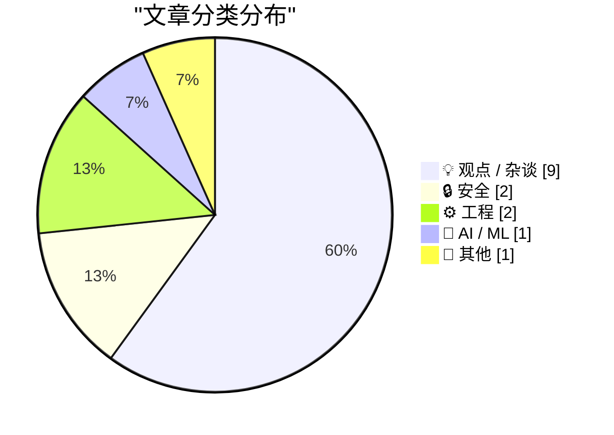
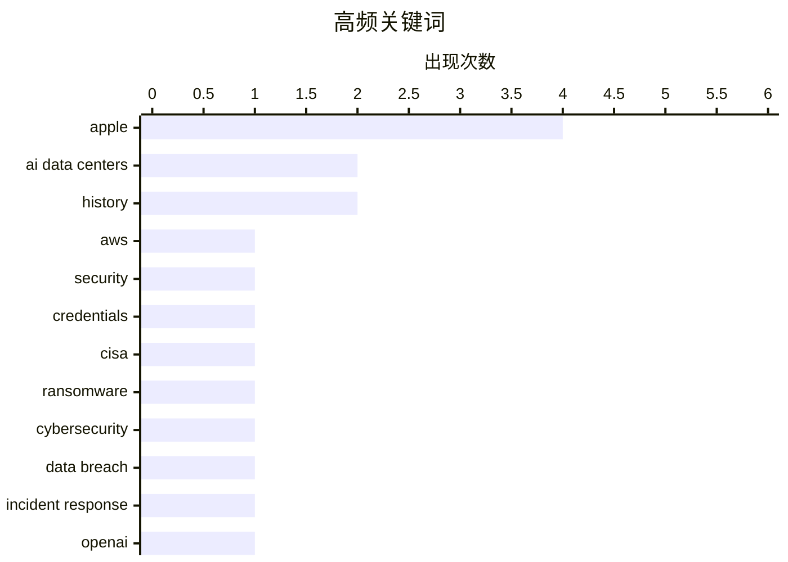

# 📰 AI 博客每日精选 — 2026-05-19

> 来自 Karpathy 推荐的 92 个顶级技术博客，AI 精选 Top 15

## 📝 今日看点

今日技术圈聚焦于AI产业的社会化阵痛与云安全防御范式的全面升级。AI数据中心遭遇跨党派民意抵制，公众信任赤字与商业化营收断层凸显，开发者角色正加速向AI赋能工程师转型，行业交互范式逐步转向自主代理。与此同时，高权限云凭证泄露事件频发，企业安全策略正从被动赎金博弈转向零信任架构与自动化响应，基础设施韧性成为防御核心。技术狂飙之下，社会共识、合规治理与底层安全正成为决定下一代技术走向的关键变量。

---

## 🏆 今日必读

🥇 **CISA管理员在GitHub上泄露了AWS GovCloud密钥**

[CISA Admin Leaked AWS GovCloud Keys on Github](https://krebsonsecurity.com/2026/05/cisa-admin-leaked-aws-govcloud-keys-on-github/) — krebsonsecurity.com · 3 小时前 · 🔒 安全

> 美国网络安全与基础设施安全局（CISA）的一名承包商曾在GitHub公开仓库中暴露了多个高权限AWS GovCloud账户凭证及大量内部系统访问密钥。泄露文件详细记录了CISA内部的软件构建、测试与部署流程，被安全专家视为近年来最严重的政府数据泄露事件之一。该事件暴露了政府承包商在代码托管平台上的权限管理与安全意识存在严重缺失。基础设施安全机构的内部凭证管理漏洞可能直接危及国家级网络安全防御体系，亟需建立零信任架构与自动化密钥轮换机制。

💡 **为什么值得读**: 揭示国家级安全机构自身却因基础配置失误导致核心凭证外泄，为所有涉及敏感基础设施的团队敲响权限管理与代码托管安全的警钟。

🏷️ AWS, security, credentials, CISA

🥈 **每周安全更新 第504期**

[Weekly Update 504](https://www.troyhunt.com/weekly-update-504/) — troyhunt.com · 20 小时前 · 🔒 安全

> 勒索软件攻击中的“是否支付赎金”决策正成为企业安全防御的核心争议点，Grafana近期公开采取“绝不付款”策略即为典型案例。多家企业在遭遇数据泄露威胁时已转向强化离线备份、零信任网络分段与自动化事件响应预案，以替代高风险的赎金谈判。支付赎金不仅无法保证数据不被公开，反而会直接助长黑产链条的恶性循环与勒索软件即服务（RaaS）的扩张。建立不依赖赎金的韧性防御体系与数据恢复演练，才是应对勒索攻击的长期最优解。

💡 **为什么值得读**: 在勒索攻击频发的当下，提供基于真实企业决策的赎金博弈分析与实战防御建议，极具参考价值。

🏷️ Ransomware, Cybersecurity, Data Breach, Incident Response

🥉 **陪审团一致裁定驳回马斯克对山姆·阿尔特曼的诉讼**

[Jury Rejects Elon Musk’s Claim Against Sam Altman in Unanimous Verdict](https://www.nytimes.com/live/2026/05/18/technology/openai-trial-verdict-altman-musk?unlocked_article_code=1.jVA.Cc2V.IwYuu2r4SJfQ) — daringfireball.net · 6 小时前 · 🤖 AI / ML

> 九人陪审团一致裁定埃隆·马斯克对OpenAI及山姆·阿尔特曼的诉讼已超出三年法定诉讼时效，直接驳回其核心索赔主张。陪审团指出，马斯克早在2021年便已知晓诉讼中指控的相关行为，却直至2024年夏季才正式提起法律程序。该裁决直接否定了马斯克对这家估值7300亿美元AI初创公司的商业违约指控，并明确了科技合作破裂的法律追责边界。此案为AI行业早期的知识产权归属与商业承诺纠纷提供了明确的司法判例，警示企业需严格遵循诉讼时效与证据保全规范。

💡 **为什么值得读**: 深度解析AI行业标志性法律纠纷的底层逻辑与判决依据，帮助读者理解科技巨头博弈中的法律风险与合规红线。

🏷️ OpenAI, lawsuit, AI industry, legal

---

## 📊 数据概览

| 扫描源 | 抓取文章 | 时间范围 | 精选 |
|:---:|:---:|:---:|:---:|
| 77/92 | 2336 篇 → 16 篇 | 24h | **15 篇** |

### 分类分布



### 高频关键词



<details>
<summary>📈 纯文本关键词图（终端友好）</summary>

```
apple           │ ████████████████████ 4
ai data centers │ ██████████░░░░░░░░░░ 2
history         │ ██████████░░░░░░░░░░ 2
aws             │ █████░░░░░░░░░░░░░░░ 1
security        │ █████░░░░░░░░░░░░░░░ 1
credentials     │ █████░░░░░░░░░░░░░░░ 1
cisa            │ █████░░░░░░░░░░░░░░░ 1
ransomware      │ █████░░░░░░░░░░░░░░░ 1
cybersecurity   │ █████░░░░░░░░░░░░░░░ 1
data breach     │ █████░░░░░░░░░░░░░░░ 1
```

</details>

### 🏷️ 话题标签

**apple**(4) · **ai data centers**(2) · **history**(2) · aws(1) · security(1) · credentials(1) · cisa(1) · ransomware(1) · cybersecurity(1) · data breach(1) · incident response(1) · openai(1) · lawsuit(1) · ai industry(1) · legal(1) · ai ethics(1) · public trust(1) · nuclear(1) · communication(1) · public opposition(1)

---

## 💡 观点 / 杂谈

### 1. 《AI、“人性”与曼哈顿博士综合征》

[‘AI, “Humanity”, and Dr. Manhattan Syndrome’](https://www.personfamiliar.com/p/ai-humanity-and-dr-manhattan-syndrome) — **daringfireball.net** · 7 小时前 · ⭐ 25/30

> 核能发展史中的“信任赤字”现象为当前AI行业的公众沟通困境提供了精准类比，技术灾难并非产业衰退的唯一推手。长达二十年的“居高临下式”技术沟通彻底耗尽了公众信任储备，导致危机爆发时行业缺乏社会容错空间。AI领域正重蹈覆辙，技术开发者若继续忽视公众对算法透明度、数据隐私与伦理边界的合理关切，将难以建立可持续的社会契约。技术演进必须与公众沟通机制同步建设，否则认知脱节将反噬AI的长期商业化落地。

🏷️ AI ethics, public trust, nuclear, communication

---

### 2. AI数据中心在跨党派民意中遭遇强烈抵制

[AI Data Centers Are Deeply Unpopular, Across the Political Spectrum](https://news.gallup.com/poll/709772/americans-oppose-data-centers-area.aspx) — **daringfireball.net** · 9 小时前 · ⭐ 25/30

> 盖洛普最新民调显示，高达70%的美国民众反对在本地建设AI数据中心，其中48%表示强烈反对，仅7%明确支持。该数据与同期针对核电站建设的反对率（53%）形成鲜明对比，凸显AI算力基建扩张正引发跨党派的广泛社会阻力。能源消耗激增、土地占用与地方电网负荷是引发公众抵触的核心因素，且政治立场并未显著稀释反对倾向。若科技巨头与地方政府忽视民意基础与社区协商机制，AI基础设施的审批落地将面临严重的政策反弹与工期延误。

🏷️ AI data centers, public opposition, Gallup, infrastructure

---

### 3. 现有利益相关者对未来拥有话语权

[Existing Stakeholders Have a Say in the Future](https://daringfireball.net/2026/05/ai_is_technology_not_a_product) — **daringfireball.net** · 7 小时前 · ⭐ 24/30

> “AI是技术而非独立产品”的论点正推动科技企业从功能堆砌转向意图理解，常驻后台的AI代理将彻底重构人机交互范式。行业预测指出，到本世纪末用户将不再通过手动操作调用出行或生活服务，而是交由AI代理自主决策与跨应用调度。这一转变要求产品架构从“界面驱动”升级为“目标驱动”，深度整合大模型推理能力与现有生态接口。现有平台利益相关者的战略定力将决定AI技术能否真正融入主流产品并实现商业闭环，盲目追逐独立AI应用将错失生态融合窗口。

🏷️ Apple, AI products, strategy, John Ternus

---

### 4. 别自称软件工程师了，你是AI赋能工程师

[Don't call yourself a Software Engineer, you are an AI Enabled Engineer.](https://idiallo.com/blog/you-are-an-ai-enabled-engineer-now?src=feed) — **idiallo.com** · 12 小时前 · ⭐ 24/30

> 传统“软件工程师”头衔已无法准确定义AI时代开发者的核心能力，计算机教育体系与就业市场正面临严重脱节。现代编程训练必须从语法记忆转向AI工具链协同、提示词工程与分布式系统架构设计，以匹配企业降本增效的实际需求。面对LinkedIn等职业社交平台的流量泡沫，新人更应通过开源贡献与垂直技术社区建立真实的项目影响力。开发者应主动拥抱“AI赋能工程师”身份，将大模型视为生产力杠杆而非替代威胁，重构个人技术护城河。

🏷️ AI, Software Engineering, Career, LLM

---

### 5. 阿拉斯加永久基金：AI数据中心“全民基本收入”支付的松散先例

[The Alaska Permanent Fund as Loose Precedent for AI Data Center ‘UBI’ Payments](https://en.wikipedia.org/wiki/Alaska_Permanent_Fund) — **daringfireball.net** · 8 小时前 · ⭐ 22/30

> 阿拉斯加永久基金（APF）自1976年设立以来已积累约640亿美元资产，其基于石油与矿产收益的资源共享机制为AI数据中心补偿方案提供了可行先例。APF通过主权财富池向州内居民定期发放现金分红，成功将资源开发的外部性成本转化为社区福利。AI算力基建同样具有高度资本密集与高能耗特征，可借鉴该框架设计“数据红利”税收调节与地方补偿制度。将AI基础设施的社会成本内部化，并通过制度化分红缓解地方抵触情绪，是可持续算力扩张的关键路径。

🏷️ AI data centers, UBI, policy, economics

---

### 6. 请定义一下“繁荣”

[Define ‘Boom’ Please](https://www.nytimes.com/2026/04/21/business/how-apple-became-a-4-trillion-company-under-tim-cook.html?unlocked_article_code=1.jVA.MV8m.0JfUOJOME5WH) — **daringfireball.net** · 7 小时前 · ⭐ 21/30

> 《纽约时报》称苹果“错失AI繁荣”的报道缺乏数据支撑，当前真正因AI直接拉动营收的科技巨头屈指可数。以英伟达（Nvidia）为例，硬件算力供应商与终端应用厂商在AI商业化落地与营收转化上存在巨大的结构性分化。尽管苹果在生成式AI功能集成上相对保守，但其凭借封闭生态壁垒与硬件迭代仍稳居4万亿美元市值梯队。资本市场对AI的炒作已严重脱离实际盈利周期，企业应聚焦长期产品力与生态护城河，而非盲目追逐短期技术风口。

🏷️ Apple, AI strategy, media, Tim Cook

---

### 7. “约翰·苹果籽”

[‘John Appleseed’](https://om.co/2026/04/20/john-appleseed/) — **daringfireball.net** · 6 小时前 · ⭐ 20/30

> 文章聚焦蒂姆·库克接任史蒂夫·乔布斯后的苹果商业表现与战略转型。库克执掌期间，苹果市值从2011年的约3500亿美元飙升至近4万亿美元，增幅超1000%；财年营收从1080亿美元增长至2025财年的超4160亿美元，规模扩大近四倍。苹果在此期间多次登顶全球市值最高企业，并成功构建起高利润的Services（服务）业务生态。作者通过核心财务数据印证了库克时代苹果从硬件驱动向服务与生态协同转型的巨大商业成功。

🏷️ Apple, CEO transition, business, market cap

---

### 8. macOS图标设计：有些东西正在腐烂

[Something’s Rotten in the State of macOS Icon Design](https://blog.jim-nielsen.com/2026/rotten-macos-icon-design/) — **blog.jim-nielsen.com** · 5 小时前 · ⭐ 17/30

> 文章批判性地审视了近年来macOS系统图标设计质量的显著下滑趋势。作者引用网络观察指出，若将苹果官方图标按时间倒序排列，竟呈现出设计水平逐步精进的反向轨迹，揭示了当前设计规范的退化。这种衰退不仅局限于Pages等创意软件图标，而是蔓延至整个macOS系统级视觉语言，反映出设计团队在统一性、细节打磨与审美标准上的失控。作者呼吁苹果设计团队重拾对像素级细节的执着，停止为了追求扁平化或一致性而牺牲图标本身的辨识度与艺术性。

🏷️ macOS, UI Design, Apple, Iconography

---

### 9. Cyberrebate.com：互联网泡沫时代最糟糕的点子？

[Cyberrebate.com: The worst dotcom-era idea?](https://dfarq.homeip.net/cyberrebate-com-the-worst-dotcom-era-idea/?utm_source=rss&#038;utm_medium=rss&#038;utm_campaign=cyberrebate-com-the-worst-dotcom-era-idea) — **dfarq.homeip.net** · 13 小时前 · ⭐ 16/30

> 文章回顾了互联网泡沫时期荒诞的商业模型，并以Cyberrebate.com为典型案例剖析其失败逻辑。该网站采用“免费赠送软件或服务，再通过非常规手段变现”的模式，本质上可视为早期“免费增值（Freemium）”与间谍软件结合的雏形。作者指出，这种依赖用户数据窃取或隐蔽扣费来维持现金流的做法，不仅缺乏可持续的商业价值，更严重透支了早期互联网用户的信任。该案例警示当代创业者，脱离真实价值交付的流量变现模式终将被市场淘汰，合规与用户体验才是产品长存的基石。

🏷️ Dotcom Bubble, Business Models, History, Freemium

---

## 🔒 安全

### 10. CISA管理员在GitHub上泄露了AWS GovCloud密钥

[CISA Admin Leaked AWS GovCloud Keys on Github](https://krebsonsecurity.com/2026/05/cisa-admin-leaked-aws-govcloud-keys-on-github/) — **krebsonsecurity.com** · 3 小时前 · ⭐ 27/30

> 美国网络安全与基础设施安全局（CISA）的一名承包商曾在GitHub公开仓库中暴露了多个高权限AWS GovCloud账户凭证及大量内部系统访问密钥。泄露文件详细记录了CISA内部的软件构建、测试与部署流程，被安全专家视为近年来最严重的政府数据泄露事件之一。该事件暴露了政府承包商在代码托管平台上的权限管理与安全意识存在严重缺失。基础设施安全机构的内部凭证管理漏洞可能直接危及国家级网络安全防御体系，亟需建立零信任架构与自动化密钥轮换机制。

🏷️ AWS, security, credentials, CISA

---

### 11. 每周安全更新 第504期

[Weekly Update 504](https://www.troyhunt.com/weekly-update-504/) — **troyhunt.com** · 20 小时前 · ⭐ 26/30

> 勒索软件攻击中的“是否支付赎金”决策正成为企业安全防御的核心争议点，Grafana近期公开采取“绝不付款”策略即为典型案例。多家企业在遭遇数据泄露威胁时已转向强化离线备份、零信任网络分段与自动化事件响应预案，以替代高风险的赎金谈判。支付赎金不仅无法保证数据不被公开，反而会直接助长黑产链条的恶性循环与勒索软件即服务（RaaS）的扩张。建立不依赖赎金的韧性防御体系与数据恢复演练，才是应对勒索攻击的长期最优解。

🏷️ Ransomware, Cybersecurity, Data Breach, Incident Response

---

## ⚙️ 工程

### 12. FediMeteo、HAProxy与不浪费SNAC线程的艺术

[FediMeteo, HAProxy, and the art of not wasting snac threads](https://it-notes.dragas.net/2026/05/18/fedimeteo-haproxy-and-the-art-of-not-wasting-snac-threads/) — **it-notes.dragas.net** · 14 小时前 · ⭐ 22/30

> 一台微型FreeBSD VPS能够支撑数千用户的全球气象服务请求，核心在于对HAProxy负载均衡与SNAC线程调度的极致优化。项目通过连接复用、线程池隔离与I/O多路复用技术的协同，在低资源环境下彻底避免了线程上下文切换带来的性能损耗。该架构在极低硬件成本下实现了高并发稳定服务，验证了传统网络栈调优在云原生时代的持续工程价值。在盲目追求微服务拆分与容器化之前，充分榨干单机网络栈性能往往是性价比最高的技术选型。

🏷️ HAProxy, Backend, Performance Tuning, Threads

---

### 13. 10Gb/s以太网：为10GBASE-T SFP+模块加装微型散热片

[10Gb/s Ethernet: using mini-heatsinks with a 10GBASE-T SFP+ module](https://www.gilesthomas.com/2026/05/10g-ethernet-sfpplus-mini-heatsinks) — **gilesthomas.com** · 5 小时前 · ⭐ 19/30

> 文章针对10GBASE-T SFP+光模块在10Gb/s交换机中运行时出现的严重过热问题，提出并验证了低成本散热改造方案。作者将常用于树莓派（Raspberry Pi）的VooGenzek品牌微型散热片直接贴附于MikroTik光模块芯片表面，实测对比加装前后的核心温度变化。该方案利用被动散热原理有效压制了模块积热，避免了主动风扇带来的噪音与功耗增加。实践表明，利用现成微型散热片是解决消费级万兆电口模块高温降频问题的有效且经济的硬件优化手段。

🏷️ 10GbE, Networking, Hardware, Thermal Management

---

## 🤖 AI / ML

### 14. 陪审团一致裁定驳回马斯克对山姆·阿尔特曼的诉讼

[Jury Rejects Elon Musk’s Claim Against Sam Altman in Unanimous Verdict](https://www.nytimes.com/live/2026/05/18/technology/openai-trial-verdict-altman-musk?unlocked_article_code=1.jVA.Cc2V.IwYuu2r4SJfQ) — **daringfireball.net** · 6 小时前 · ⭐ 25/30

> 九人陪审团一致裁定埃隆·马斯克对OpenAI及山姆·阿尔特曼的诉讼已超出三年法定诉讼时效，直接驳回其核心索赔主张。陪审团指出，马斯克早在2021年便已知晓诉讼中指控的相关行为，却直至2024年夏季才正式提起法律程序。该裁决直接否定了马斯克对这家估值7300亿美元AI初创公司的商业违约指控，并明确了科技合作破裂的法律追责边界。此案为AI行业早期的知识产权归属与商业承诺纠纷提供了明确的司法判例，警示企业需严格遵循诉讼时效与证据保全规范。

🏷️ OpenAI, lawsuit, AI industry, legal

---

## 📝 其他

### 15. 泰德·特纳在CNN旧址上方的狭小公寓

[Ted Turner’s Small Apartment Above the Former CNN Center](https://www.youtube.com/watch?v=OUIVs58oyPI) — **daringfireball.net** · 7 小时前 · ⭐ 10/30

> 本文通过一段视频记录，展现了媒体大亨泰德·特纳（Ted Turner）位于原CNN中心上方的极简生活空间。这间狭小的公寓与其庞大的传媒帝国形成强烈反差，完美诠释了他“既大胆激进又极度谦逊”的矛盾人格特质。作者将其与华特·迪士尼乐园消防局上方的秘密公寓相类比，揭示出顶级企业家往往在私人领域刻意保持低调与克制的生活哲学。这种物理空间的极简主义，折射出创始人将全部精力倾注于事业而非物质享受的专注力。

🏷️ Ted Turner, CNN, history, real estate

---

*生成于 2026-05-19 00:19 | 扫描 77 源 → 获取 2336 篇 → 精选 15 篇*
*基于 [Hacker News Popularity Contest 2025](https://refactoringenglish.com/tools/hn-popularity/) RSS 源列表，由 [Andrej Karpathy](https://x.com/karpathy) 推荐*
*由「懂点儿AI」制作，欢迎关注同名微信公众号获取更多 AI 实用技巧 💡*
