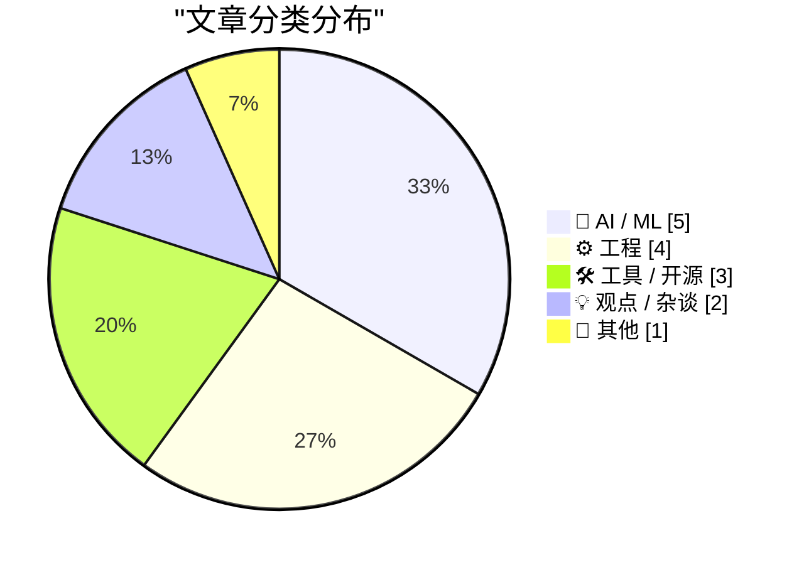
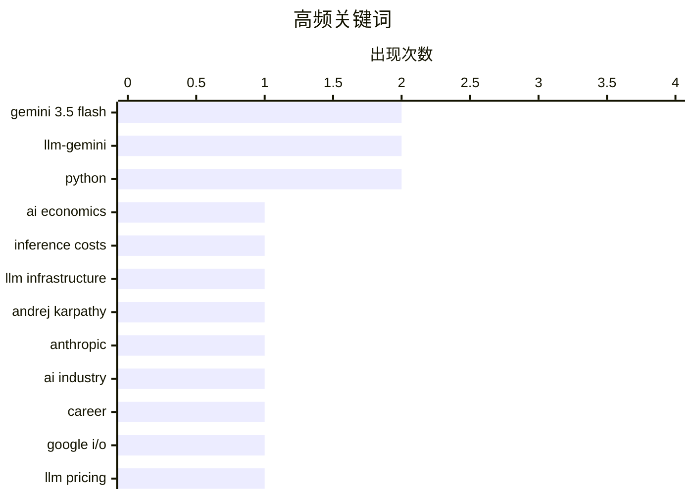

# 📰 AI 博客每日精选 — 2026-05-20

> 来自 Karpathy 推荐的 92 个顶级技术博客，AI 精选 Top 15

## 📝 今日看点

今日技术圈聚焦于大模型快速迭代与算力成本博弈的双重主线。前沿模型密集发布与顶尖人才加速流动正推动行业竞争全面升级，但高昂的推理开销与智能体工具链的效率瓶颈也日益凸显。在性能狂飙的同时，如何通过架构优化与开源生态建设平衡成本与工程可持续性，已成为决定 AI 规模化落地的核心命题。

---

## 🏆 今日必读

🥇 **AI 的成本太高了**

[AI Is Too Expensive](https://www.wheresyoured.at/ai-is-too-expensive/) — wheresyoured.at · 9 小时前 · 🤖 AI / ML

> AI 模型的训练与推理成本正成为制约技术规模化落地的核心瓶颈。高昂的算力开销与 API 调用费用使得中小企业与独立开发者难以承担持续部署，迫使行业重新审视效率优化与开源替代路径。作者指出，当前 AI 商业模式的可持续性依赖于成本结构的根本性重构，而非单纯依赖参数膨胀。降低单位 Token 成本、提升硬件利用率与优化推理架构是破局关键。只有实现成本与性能的动态平衡，AI 才能真正跨越实验室走向大规模商业应用。

💡 **为什么值得读**: 深入剖析 AI 商业化背后的经济账与算力账，为技术选型、成本控制与长期架构规划提供务实的决策参考。

🏷️ AI economics, inference costs, LLM infrastructure

🥈 **Andrej Karpathy 加入 Anthropic**

[Andrej Karpathy Joined Anthropic](https://x.com/karpathy/status/2056753169888334312) — daringfireball.net · 9 小时前 · 🤖 AI / ML

> 知名 AI 研究者 Andrej Karpathy 正式宣布加入 Anthropic，将重返大语言模型前沿研发一线。作为 OpenAI 联合创始人与前特斯拉 AI 负责人，他的加入标志着 Anthropic 在顶级人才争夺战中取得关键进展。Karpathy 强调未来几年将是 LLM 技术演进的关键成型期，同时表示将在适当时机恢复其教育领域的工作。此举不仅将强化 Anthropic 在安全对齐与模型架构方面的研发实力，也可能加速行业技术路线的迭代。顶尖人才的流动往往预示着下一阶段 AI 竞争的核心焦点与突破方向。

💡 **为什么值得读**: 追踪 AI 领域顶级专家的职业动向，洞察大模型研发前沿的人才布局、技术风向与安全对齐策略。

🏷️ Andrej Karpathy, Anthropic, AI industry, career

🥉 **Gemini 3.5 Flash：价格更贵，但谷歌计划将其用于所有产品**

[Gemini 3.5 Flash: more expensive, but Google plan to use it for everything](https://simonwillison.net/2026/May/19/gemini-35-flash/#atom-everything) — simonwillison.net · 2 小时前 · 🤖 AI / ML

> 谷歌在 I/O 大会上正式发布 Gemini 3.5 Flash 模型，跳过预览阶段直接提供通用可用性（GA）。尽管该版本定价高于前代，谷歌仍计划将其全面集成至 Gemini 应用、AI Mode 等核心产品中，覆盖全球数十亿用户。这一策略表明谷歌正以性能与生态整合优先，愿意通过提高成本换取更广泛的场景覆盖与用户体验升级。模型直接 GA 也反映出谷歌对其稳定性与推理效率的充分信心。在 AI 模型军备竞赛中，谷歌选择以“贵但全量部署”的策略巩固其消费级 AI 入口的护城河。

💡 **为什么值得读**: 揭示谷歌在模型成本与生态扩张之间的战略取舍，为理解大厂 AI 产品化路径与商业化节奏提供典型案例。

🏷️ Gemini 3.5 Flash, Google I/O, LLM pricing, AI strategy

---

## 📊 数据概览

| 扫描源 | 抓取文章 | 时间范围 | 精选 |
|:---:|:---:|:---:|:---:|
| 77/92 | 2356 篇 → 18 篇 | 24h | **15 篇** |

### 分类分布



### 高频关键词



<details>
<summary>📈 纯文本关键词图（终端友好）</summary>

```
gemini 3.5 flash   │ ████████████████████ 2
llm-gemini         │ ████████████████████ 2
python             │ ████████████████████ 2
ai economics       │ ██████████░░░░░░░░░░ 1
inference costs    │ ██████████░░░░░░░░░░ 1
llm infrastructure │ ██████████░░░░░░░░░░ 1
andrej karpathy    │ ██████████░░░░░░░░░░ 1
anthropic          │ ██████████░░░░░░░░░░ 1
ai industry        │ ██████████░░░░░░░░░░ 1
career             │ ██████████░░░░░░░░░░ 1
```

</details>

### 🏷️ 话题标签

**gemini 3.5 flash**(2) · **llm-gemini**(2) · **python**(2) · ai economics(1) · inference costs(1) · llm infrastructure(1) · andrej karpathy(1) · anthropic(1) · ai industry(1) · career(1) · google i/o(1) · llm pricing(1) · ai strategy(1) · llm agents(1) · edit tool(1) · crc32(1) · tooling(1) · llm trends(1) · pycon(1) · ai summary(1)

---

## 🤖 AI / ML

### 1. AI 的成本太高了

[AI Is Too Expensive](https://www.wheresyoured.at/ai-is-too-expensive/) — **wheresyoured.at** · 9 小时前 · ⭐ 26/30

> AI 模型的训练与推理成本正成为制约技术规模化落地的核心瓶颈。高昂的算力开销与 API 调用费用使得中小企业与独立开发者难以承担持续部署，迫使行业重新审视效率优化与开源替代路径。作者指出，当前 AI 商业模式的可持续性依赖于成本结构的根本性重构，而非单纯依赖参数膨胀。降低单位 Token 成本、提升硬件利用率与优化推理架构是破局关键。只有实现成本与性能的动态平衡，AI 才能真正跨越实验室走向大规模商业应用。

🏷️ AI economics, inference costs, LLM infrastructure

---

### 2. Andrej Karpathy 加入 Anthropic

[Andrej Karpathy Joined Anthropic](https://x.com/karpathy/status/2056753169888334312) — **daringfireball.net** · 9 小时前 · ⭐ 25/30

> 知名 AI 研究者 Andrej Karpathy 正式宣布加入 Anthropic，将重返大语言模型前沿研发一线。作为 OpenAI 联合创始人与前特斯拉 AI 负责人，他的加入标志着 Anthropic 在顶级人才争夺战中取得关键进展。Karpathy 强调未来几年将是 LLM 技术演进的关键成型期，同时表示将在适当时机恢复其教育领域的工作。此举不仅将强化 Anthropic 在安全对齐与模型架构方面的研发实力，也可能加速行业技术路线的迭代。顶尖人才的流动往往预示着下一阶段 AI 竞争的核心焦点与突破方向。

🏷️ Andrej Karpathy, Anthropic, AI industry, career

---

### 3. Gemini 3.5 Flash：价格更贵，但谷歌计划将其用于所有产品

[Gemini 3.5 Flash: more expensive, but Google plan to use it for everything](https://simonwillison.net/2026/May/19/gemini-35-flash/#atom-everything) — **simonwillison.net** · 2 小时前 · ⭐ 24/30

> 谷歌在 I/O 大会上正式发布 Gemini 3.5 Flash 模型，跳过预览阶段直接提供通用可用性（GA）。尽管该版本定价高于前代，谷歌仍计划将其全面集成至 Gemini 应用、AI Mode 等核心产品中，覆盖全球数十亿用户。这一策略表明谷歌正以性能与生态整合优先，愿意通过提高成本换取更广泛的场景覆盖与用户体验升级。模型直接 GA 也反映出谷歌对其稳定性与推理效率的充分信心。在 AI 模型军备竞赛中，谷歌选择以“贵但全量部署”的策略巩固其消费级 AI 入口的护城河。

🏷️ Gemini 3.5 Flash, Google I/O, LLM pricing, AI strategy

---

### 4. LLM Agent 的 EDIT 工具替代方案

[Alternatives for the EDIT tool of LLM agents](http://antirez.com/news/166) — **antirez.com** · 17 小时前 · ⭐ 24/30

> 当前 LLM Agent 广泛使用的 EDIT 工具存在显著的效率缺陷，强制模型重复输出旧版本内容导致大量 Token 浪费。在本地推理等算力受限场景下，这种设计严重制约了 Agent 的响应速度与实用性。作者提出基于差异比对与 CRC32 校验的替代方案，通过仅传输变更片段大幅降低上下文开销。该方案在实现复杂度与 Token 节省之间取得了有效平衡，为边缘设备与私有化部署提供了更优的工程实践。优化 Agent 工具链的通信协议是提升本地大模型可用性的关键突破口。

🏷️ LLM agents, EDIT tool, CRC32, tooling

---

### 5. 五分钟速览过去六个月的大模型进展

[The last six months in LLMs in five minutes](https://simonwillison.net/2026/May/19/5-minute-llms/#atom-everything) — **simonwillison.net** · 1 天前 · ⭐ 23/30

> 本文基于 PyCon US 2026 的闪电演讲幻灯片，高度浓缩了过去六个月大语言模型领域的关键演进。内容涵盖模型架构优化、推理成本下降、多模态能力融合以及开源生态的爆发式增长。作者通过可视化数据与核心指标对比，清晰呈现了从参数竞赛向工程落地与效率优先的范式转变。技术选型正从“追求最大参数”转向“最佳性价比与工具链成熟度”。快速掌握这一时间窗口的技术脉络，有助于开发者精准把握下一阶段的开发重心。

🏷️ LLM trends, PyCon, AI summary, lightning talk

---

## ⚙️ 工程

### 6. 开源项目走向衰亡的愚蠢方式

[Dumb Ways for an Open Source Project to Die](https://nesbitt.io/2026/05/19/dumb-ways-for-an-open-source-project-to-die.html) — **nesbitt.io** · 15 小时前 · ⭐ 21/30

> 开源项目的失败往往并非源于技术瓶颈，而是由维护者倦怠、依赖链失控与社区治理缺失等人为因素导致。文章系统梳理了导致项目“猝死”的典型陷阱，包括盲目引入重型依赖、忽视版本兼容性、缺乏贡献者激励机制以及安全漏洞的长期积压。许多项目因过度追求功能堆砌而丧失可维护性，最终在关键维护者退出后迅速停滞。建立清晰的贡献规范、定期清理技术债务与构建健康的维护者梯队，是延长开源项目生命周期的核心策略。开源的可持续性取决于工程纪律与社区运营，而非单纯的技术理想主义。

🏷️ open source, dependency management, software maintenance

---

### 7. Wi-Wi：实现纳秒级无线时间同步

[Wi-Wi Is Wireless Time Sync at 1 nanosecond](https://www.jeffgeerling.com/blog/2026/wi-wi-is-wireless-time-sync-less-than-5ns/) — **jeffgeerling.com** · 11 小时前 · ⭐ 19/30

> 日本 NICT 研发的 Wi-Wi STAMP 协议实现了低于 5 纳秒的无线时间同步精度，突破了传统 GPS 与有线 NTP 的部署限制。该技术通过优化无线信号传播延迟补偿与硬件时间戳机制，在复杂电磁环境下仍能保持亚纳秒级稳定性。在广播级音视频制作、工业物联网与高精度定位场景中，该方案可大幅降低同步基础设施的部署成本与布线复杂度。无线纳秒同步的成熟将推动分布式系统时钟对齐进入无缆化时代。对于追求极致低延迟与高可靠性的边缘计算网络而言，这是一项值得关注的底层突破。

🏷️ time synchronization, Wi-Wi, nanosecond, IoT

---

### 8. Square root of x² − 1

[Square root of x² − 1](https://www.johndcook.com/blog/2026/05/19/square-root-of-x-squared-minus-one/) — **johndcook.com** · 22 分钟前 · ⭐ 18/30

> How should we define √(z² − 1)? Well, you could square z, subtract 1, and take the square root. What else would you do?! The question turns out to be more subtle than it looks. When x is a non-negativ

🏷️ complex numbers, numerical computing, mathematics

---

### 9. Closer look at an identity

[Closer look at an identity](https://www.johndcook.com/blog/2026/05/19/closer-look-at-an-identity/) — **johndcook.com** · 1 小时前 · ⭐ 18/30

> The previous post derived the identity and said in a footnote that the identity holds at least for x > 1 and y > 1. That’s true, but let’s see why the footnote is necessary. Let’s have Mathematica plo

🏷️ mathematical identity, numerical analysis, domain constraints

---

## 🛠 工具 / 开源

### 10. llm-gemini 0.32 版本发布

[llm-gemini 0.32](https://simonwillison.net/2026/May/19/llm-gemini-2/#atom-everything) — **simonwillison.net** · 1 小时前 · ⭐ 21/30

> `llm-gemini` 插件正式更新至 0.32 版本，核心新增对 `gemini-3.5-flash` 模型的完整支持。该更新使开发者能够通过统一的 CLI 接口直接调用谷歌最新发布的 Flash 系列模型，无缝衔接现有自动化工作流。版本同步优化了模型路由与参数解析逻辑，确保与上游 API 变更保持兼容。对于依赖 `llm` 生态进行脚本编写或批量推理的用户而言，此次更新提供了开箱即用的最新模型接入能力。保持工具链与前沿模型同步，是维持 AI 开发效率与实验迭代速度的基础保障。

🏷️ llm-gemini, Gemini 3.5 Flash, Python, LLM

---

### 11. llm-gemini 0.32a0 预览版发布

[llm-gemini 0.32a0](https://simonwillison.net/2026/May/19/llm-gemini/#atom-everything) — **simonwillison.net** · 4 小时前 · ⭐ 20/30

> `llm-gemini` 发布 0.32a0 预览版，核心新增对推理 Token 流式输出（streaming reasoning tokens）的支持。该功能要求底层 `llm` 框架版本不低于 0.32a0 alpha，旨在提升长上下文生成与复杂逻辑推理场景下的交互体验。通过实时流式传输中间推理过程，开发者可更早获取模型思考轨迹，便于调试与动态干预。此更新标志着开源工具链正逐步对齐前沿大模型的链式推理（CoT）与透明化输出趋势。掌握流式推理能力，将显著优化本地 Agent 的响应延迟与可控性。

🏷️ llm-gemini, streaming, reasoning tokens, alpha

---

### 12. datasette-llm-accountant 0.1a4

[datasette-llm-accountant 0.1a4](https://simonwillison.net/2026/May/19/datasette-llm-accountant/#atom-everything) — **simonwillison.net** · 4 小时前 · ⭐ 16/30

> <p><strong>Release:</strong> <a href="https://github.com/datasette/datasette-llm-accountant/releases/tag/0.1a4">datasette-llm-accountant 0.1a4</a></p>
        <blockquote>
<ul>
<li>Fixed bug tracking 

🏷️ Datasette, LLM accounting, bug fix, Python

---

## 💡 观点 / 杂谈

### 13. 多元视角：根本不存在所谓的“年龄验证”

[Pluralistic: There's no such thing as "age verification" (19 May 2026)](https://pluralistic.net/2026/05/19/shes-dead-of-course/) — **pluralistic.net** · 17 小时前 · ⭐ 23/30

> 强制性的“年龄验证”机制在技术上无法可靠实现，且必然以牺牲用户隐私与数据主权为代价。政策制定者往往出于“必须做点什么”的政治姿态推行此类方案，却忽视了其在实际部署中的系统性漏洞。作者指出，现有的验证手段要么依赖不可靠的自证，要么要求上传敏感身份证明，极易引发数据滥用与算法歧视。真正的数字安全应建立在端到端加密与最小化数据收集原则之上，而非依赖形式主义的年龄门槛。摒弃伪需求，回归隐私保护与用户体验的本质，才是互联网治理的正道。

🏷️ age verification, privacy, tech policy

---

### 14. Microsoft Antitrust case of 1998

[Microsoft Antitrust case of 1998](https://dfarq.homeip.net/microsoft-antitrust-case-of-1998/?utm_source=rss&#038;utm_medium=rss&#038;utm_campaign=microsoft-antitrust-case-of-1998) — **dfarq.homeip.net** · 14 小时前 · ⭐ 19/30

> On May 18, 1998, the Department of Justice filed an antitrust lawsuit against Microsoft, seeking ultimately to break up the company. The case was controversial at the time and remains controversial no

🏷️ antitrust, Microsoft, tech regulation

---

## 📝 其他

### 15. Approximating Markov’s equation

[Approximating Markov’s equation](https://www.johndcook.com/blog/2026/05/19/zagiers-equation/) — **johndcook.com** · 13 小时前 · ⭐ 17/30

> Markov numbers are integer solutions to x² + y² + z² = 3xyz. The Wikipedia article on Markov numbers mentions that Don Zagier studied Markov numbers by looking the approximating equation x² + y² + z² 

🏷️ Markov numbers, number theory, Diophantine equations

---

*生成于 2026-05-20 01:12 | 扫描 77 源 → 获取 2356 篇 → 精选 15 篇*
*基于 [Hacker News Popularity Contest 2025](https://refactoringenglish.com/tools/hn-popularity/) RSS 源列表，由 [Andrej Karpathy](https://x.com/karpathy) 推荐*
*由「懂点儿AI」制作，欢迎关注同名微信公众号获取更多 AI 实用技巧 💡*
