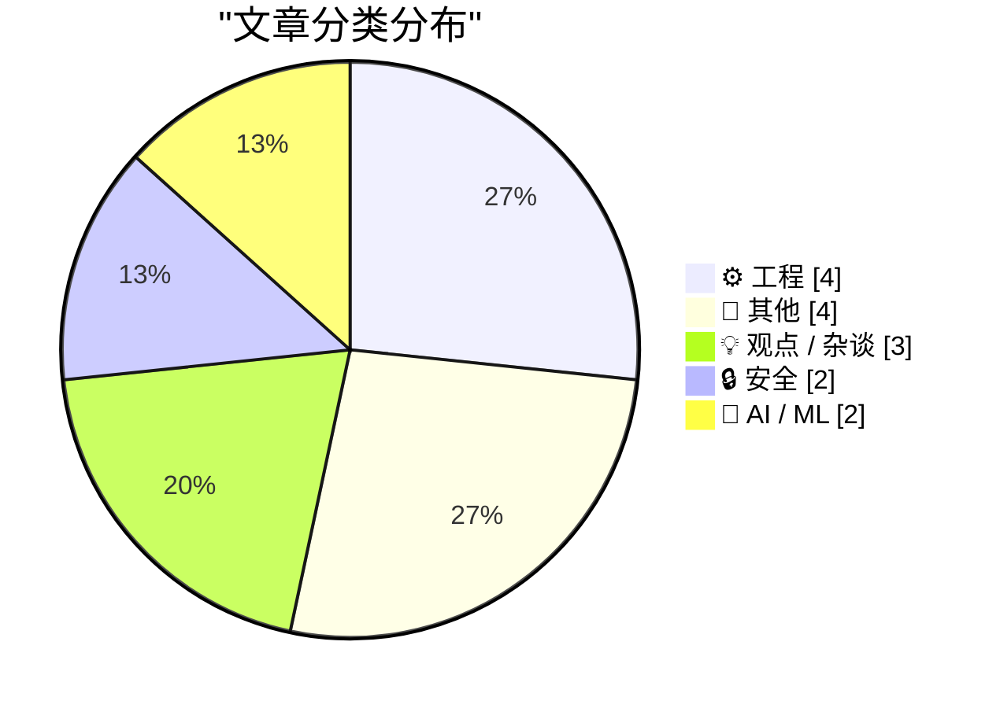
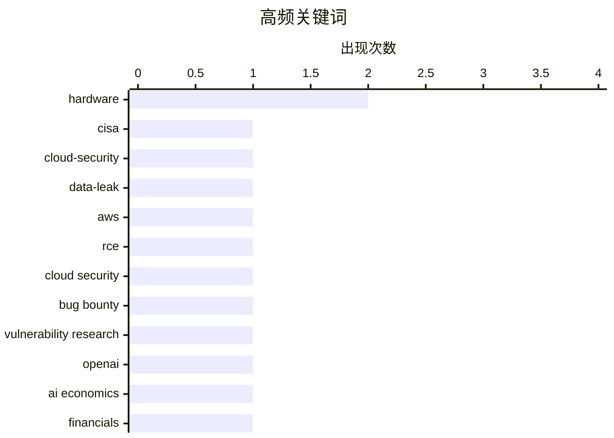

# 📰 AI 博客每日精选 — 2026-05-23

> 来自 Karpathy 推荐的 92 个顶级技术博客，AI 精选 Top 15

## 📝 今日看点

今日技术圈聚焦三大主线：AI 行业正经历资本退潮与监管收紧的双重考验，财务亏损与泡沫隐忧促使市场回归理性；云原生与基础设施安全漏洞频发，从政府机密泄露到云厂商生产环境远程代码执行，凸显权限管理与供应链安全的严峻挑战；同时，AI 算力虹吸效应正深刻重塑硬件供应链，内存短缺倒逼消费电子重新定价，底层工程工具链与架构演进亦在加速迭代。技术演进已从狂热扩张全面转向安全、成本与可持续性的深度博弈。

---

## 🏆 今日必读

🥇 **议员要求问责：CISA 竭力遏制数据泄露事件**

[Lawmakers Demand Answers as CISA Tries to Contain Data Leak](https://krebsonsecurity.com/2026/05/lawmakers-demand-answers-as-cisa-tries-to-contain-data-leak/) — krebsonsecurity.com · 8 小时前 · 🔒 安全

> 美国国会两院议员正就 CISA 承包商在公开 GitHub 仓库故意泄露 AWS GovCloud 密钥及大量机构机密一事要求官方给出解释。CISA 目前仍在努力控制泄露范围并吊销已公开的凭证，但进展受阻。该事件暴露了政府云环境在第三方承包商权限管理与代码仓库安全审计方面的严重漏洞。核心观点在于，联邦机构必须立即重构云凭证生命周期管理机制，并加强对外包团队的安全合规审查。

💡 **为什么值得读**: 揭示了政府云安全管理的典型盲区，为涉及 AWS GovCloud 及第三方外包权限管控的团队提供了极具警示意义的实战案例。

🏷️ CISA, cloud-security, data-leak, AWS

🥈 **StubZero：在 Google Cloud 生产环境实现远程代码执行（RCE）并获赏金 148,337 美元**

[StubZero: $148,337 RCE in Google Cloud Production](https://brutecat.com/articles/google-cloud-rce) — brutecat.com · -12879 分钟前 · 🔒 安全

> 安全研究员通过一条 Discord 消息与两处信息缺失的拼凑，在仅有一小时的时间窗口内，成功将信息泄露漏洞转化为 Google Cloud 生产环境的远程代码执行（RCE）。该攻击路径在三个月后再次复现，验证了漏洞利用链的稳定性与高危性。研究详细拆解了从初始信息收集、权限绕过到最终命令执行的完整技术链条。该案例证明，云厂商生产环境中看似微小的配置疏忽仍可能被串联成致命攻击面。

💡 **为什么值得读**: 完整还原了从信息泄露到 RCE 的实战利用路径，为云安全攻防演练与漏洞赏金猎人提供了高价值的技术参考。

🏷️ RCE, cloud security, bug bounty, vulnerability research

🥉 **OpenAI 2026 年 Q1 非公认会计准则运营利润率为 -122%，ChatGPT 增长陷入停滞**

[News: OpenAI Had A Negative 122% Non-GAAP Operating Margin In Q1 2026, and ChatGPT Growth Has Stalled](https://www.wheresyoured.at/news-openai-had-a-negative-122-operating-margin-in-q1-2026-and-chatgpt-growth-has-stalled/) — wheresyoured.at · 11 小时前 · 🤖 AI / ML

> OpenAI 在 2026 年第一季度实现 $57 亿营收，但非公认会计准则（Non-GAAP）运营利润率低至 -122%，即每收入 1 美元需额外亏损 1.22 美元。与此同时，ChatGPT 的用户增长与活跃度指标已明显放缓，商业化变现速度远不及算力与研发成本的增长曲线。高昂的模型训练与推理成本正在严重侵蚀公司现金流，AI 基础设施的规模经济效应尚未显现。核心观点指出，大模型厂商必须尽快突破成本瓶颈或找到高利润率的垂直应用场景，否则行业将进入残酷的洗牌期。

💡 **为什么值得读**: 用详实的财务数据戳破了 AI 行业的盈利幻觉，帮助读者理性评估大模型商业化的真实成本结构与未来生存法则。

🏷️ OpenAI, AI economics, financials, growth

---

## 📊 数据概览

| 扫描源 | 抓取文章 | 时间范围 | 精选 |
|:---:|:---:|:---:|:---:|
| 77/92 | 2359 篇 → 16 篇 | 24h | **15 篇** |

### 分类分布



### 高频关键词



<details>
<summary>📈 纯文本关键词图（终端友好）</summary>

```
hardware               │ ████████████████████ 2
cisa                   │ ██████████░░░░░░░░░░ 1
cloud-security         │ ██████████░░░░░░░░░░ 1
data-leak              │ ██████████░░░░░░░░░░ 1
aws                    │ ██████████░░░░░░░░░░ 1
rce                    │ ██████████░░░░░░░░░░ 1
cloud security         │ ██████████░░░░░░░░░░ 1
bug bounty             │ ██████████░░░░░░░░░░ 1
vulnerability research │ ██████████░░░░░░░░░░ 1
openai                 │ ██████████░░░░░░░░░░ 1
```

</details>

### 🏷️ 话题标签

**hardware**(2) · **cisa**(1) · **cloud-security**(1) · data-leak(1) · aws(1) · rce(1) · cloud security(1) · bug bounty(1) · vulnerability research(1) · openai(1) · ai economics(1) · financials(1) · growth(1) · memory(1) · ai(1) · supply-chain(1) · raspberry-pi(1) · embedded(1) · microcontroller(1) · com(1)

---

## ⚙️ 工程

### 1. 内存短缺正引发消费电子产品的重新定价

[The memory shortage is causing a repricing of consumer electronics](https://simonwillison.net/2026/May/22/memory-shortage/#atom-everything) — **simonwillison.net** · 3 小时前 · ⭐ 25/30

> 全球仅存的三家大型内存制造商正将有限的晶圆产能优先分配给 AI 与高性能计算领域，导致消费电子市场的内存供应持续收紧。受此影响，智能手机、PC 等依赖存储芯片的设备在未来几年内将面临显著的价格上涨。供应链的结构性倾斜打破了传统消费电子的成本模型，厂商不得不通过缩减配置或提高售价来转嫁成本压力。结论表明，AI 算力需求的爆发正在直接重塑整个半导体供应链的定价逻辑与消费电子产品市场格局。

🏷️ memory, hardware, AI, supply-chain

---

### 2. 树莓派 6 最新消息与微控制器开发动态

[News about Raspberry Pi 6 and Microcontroller Development](https://www.jeffgeerling.com/blog/2026/news-about-raspberry-pi-6-and-microcontroller-development/) — **jeffgeerling.com** · 5 小时前 · ⭐ 25/30

> 树莓派基金会三位核心工程师在 Reddit r/engineering 板块举行 AMA，首次公开了 Raspberry Pi 6 的架构演进方向与微控制器（MCU）开发路线图。官方确认下一代单板计算机将重点强化边缘 AI 推理能力与高速 I/O 接口，同时持续优化低功耗 MCU 生态以拓展物联网应用场景。此次交流明确了树莓派在保持教育市场优势的同时，正加速向工业控制与端侧计算领域渗透。核心观点强调，开源硬件的持续迭代将降低边缘计算的开发门槛，推动更多创新应用落地。

🏷️ Raspberry-Pi, embedded, microcontroller, hardware

---

### 3. 为什么常说 COM STA 线程必须泵送消息，但我看到的示例代码却并未泵送？

[Why do you say that a COM STA thread must pump messages if I see sample code creating STA threads and not pumping messages?](https://devblogs.microsoft.com/oldnewthing/20260522-00/?p=112348) — **devblogs.microsoft.com/oldnewthing** · 11 小时前 · ⭐ 25/30

> 该文章深入探讨了 Windows COM 组件对象模型中单线程单元（STA）的消息泵送机制及其常见误解。作者指出，STA 线程确实需要泵送消息以处理跨线程调用与窗口事件，但若线程始终处于忙碌状态或采用同步阻塞调用，则可能暂时不需要显式泵送。文章通过底层原理剖析了消息队列调度、线程空闲检测与 COM 代理/存根交互的实际运行机制。核心结论是，开发者应根据线程的实际工作负载与同步模型来决定是否实现消息循环，而非盲目套用模板代码。

🏷️ COM, STA, threading, Windows-API

---

### 4. 依赖项修剪：未使用依赖检测工具全景调研

[Dependency Pruning](https://nesbitt.io/2026/05/22/dependency-pruning.html) — **nesbitt.io** · 15 小时前 · ⭐ 23/30

> 本文系统梳理了当前主流编程语言与包管理器中用于检测未使用依赖（Unused Dependencies）的自动化工具链。作者对比了静态分析引擎、构建系统钩子与运行时覆盖率追踪三种技术路线的准确率、误报率及集成成本。调研结果显示，不同检测方案在误报控制与构建性能损耗上存在显著差异，需结合项目规模与 CI/CD 流程进行针对性选型。核心观点强调，定期执行依赖修剪不仅能缩小构建产物体积，还能显著降低供应链攻击面与版本冲突风险。

🏷️ dependency management, static analysis, build tools

---

## 📝 其他

### 5. 苹果拟向最高法院上诉的第九巡回法院“Epic v. Apple”裁决书（PDF）

[The Ninth Circuit Appeal Ruling in ‘Epic v. Apple’ That Apple Is Seeking to Overturn at the Supreme Court (PDF)](https://cdn.ca9.uscourts.gov/datastore/opinions/2025/12/11/25-2935.pdf) — **daringfireball.net** · 7 小时前 · ⭐ 21/30

> 本文提供了第九巡回上诉法院在 Epic Games 诉苹果案中的完整裁决文件，重点解析了苹果向最高法院申请推翻原判的法律依据。裁决书第 50 页详细阐述了苹果援引“Trump v. CASA”判例的核心论点，即针对应用商店佣金比例的禁令应仅适用于 Epic Games，而非强制向全美所有开发者开放。法院在判决中维持了反垄断认定，但限制了禁令的适用范围，试图在保护市场竞争与维持平台生态之间寻找平衡。核心结论表明，科技巨头的平台规则正面临日益严格的反垄断司法审查，未来应用分发渠道的佣金模式可能面临结构性调整。

🏷️ Epic-v-Apple, antitrust, app-store, legal

---

### 6. 美国联邦法院的排版字体史

[★ The Fonts of the U.S. Federal Courts](https://daringfireball.net/2026/05/the_fonts_of_the_us_federal_courts) — **daringfireball.net** · 4 小时前 · ⭐ 15/30

> 文章探讨了美国联邦法院系统长达一个多世纪以来在排版字体选择上保持高度一致性的现象。这种跨越时代的视觉规范不仅体现了司法文书对严肃性与可读性的极致追求，也反映了传统印刷标准在数字化浪潮中的延续。法院对固定字体风格的坚持，实质上是通过视觉稳定性强化法律文本的权威感。核心观点认为，优秀的排版规范能够超越技术迭代，成为机构身份与专业精神的无声载体。

🏷️ typography, legal-tech, design, history

---

### 7. 斯蒂芬·科尔伯特《深夜秀》收官特辑评析

[Stephen Colbert’s ‘The Late Show’ Finale](https://www.nytimes.com/2026/05/22/arts/television/colbert-last-late-show.html?unlocked_article_code=1.kVA.GO3I.gVq9KeUrHEyM) — **daringfireball.net** · 8 小时前 · ⭐ 13/30

> 文章评述了斯蒂芬·科尔伯特《深夜秀》的收官特辑，指出其并未采用传统电视节目的宏大告别套路，而是以一场充满情感与荒诞色彩的“音乐葬礼”作为结尾。节目巧妙利用披头士成员的演出与原创歌曲替代了常规的项目预告或明星访谈，在有限时间内完成了对节目精神的浓缩与致敬。这种反常规的收尾方式既是对突发停播决定的个性化回应，也展现了创作者在限制中保持艺术完整性的能力。结论认为，真正打动人心的告别不在于规模，而在于是否忠于节目一贯的独特气质与创作初心。

🏷️ television, media, culture, entertainment

---

### 8. 《异域镇魂曲》系列（一）：从桌面跑团到电子游戏

[Planescape: Torment, Part 1: From the Tabletop…](https://www.filfre.net/2026/05/planescape-torment-part-1-from-the-tabletop/) — **filfre.net** · 8 小时前 · ⭐ 13/30

> 文章追溯了《龙与地下城》从桌面跑团到电子游戏的演变历程，并聚焦于《异域镇魂曲》及无限引擎系列在叙事设计上的突破。作者指出，该系列打破了传统RPG依赖战斗数值推进的范式，转而将“通过对话逐层解构反派逻辑”作为核心玩法与玩家权力幻想的载体。这种设计将哲学思辨与角色成长深度绑定，使文本选择直接决定剧情走向与世界观认知。结论强调，优秀的叙事驱动型游戏应当将“思想交锋”置于“武力对抗”之上，从而拓展电子媒介的表达边界。

🏷️ RPG history, game design, Planescape Torment

---

## 💡 观点 / 杂谈

### 9. 付费专栏：如果……我们正处在 AI 泡沫中？（下篇）

[Premium: What If...We're In An AI Bubble? (Part 2)](https://www.wheresyoured.at/premium-what-if-were-in-an-ai-bubble-part-2/) — **wheresyoured.at** · 8 小时前 · ⭐ 24/30

> 本文延续上篇对 AI 行业泡沫化的探讨，通过构建多种极端情境推演了资本退潮与技术瓶颈叠加可能引发的连锁反应。作者系统分析了算力投资过剩、大模型同质化竞争以及企业客户付费意愿下降三大核心风险点。文章指出，若缺乏杀手级应用与清晰的盈利路径，当前的高估值将难以维持，行业可能面临大规模并购与初创公司倒闭潮。核心观点认为，理性评估技术成熟度曲线与商业落地节奏，比盲目追逐融资规模更能决定企业的长期生存。

🏷️ AI bubble, market trends, industry analysis

---

### 10. 如何与同事高效沟通

[How to Talk to Your Coworkers](https://idiallo.com/blog/how-to-talk-to-your-coworkers?src=feed) — **idiallo.com** · 6 小时前 · ⭐ 21/30

> 开发者常因同事反复询问已在文档或Jira中明确说明的问题而感到沮丧，甚至质疑对方是否懒惰或愚蠢。文章指出，这种沟通摩擦并非单纯由员工态度引起，而是信息传递方式与接收习惯存在错位。有效的职场沟通需要开发者跳出“写完即结束”的思维，采用更贴合对方认知习惯的表达方式，并建立清晰的反馈闭环。核心观点在于，将重复提问视为优化沟通流程的契机，而非个人效率的损耗，才能从根本上减少无效打扰。

🏷️ soft-skills, engineering-culture, communication, Jira

---

### 11. 零和问题与Apple Sports的数据可视化困境

[Zero Sum Problems and Apple Sports](https://kieranhealy.org/blog/archives/2026/05/21/zero-sum-problems/) — **daringfireball.net** · 8 小时前 · ⭐ 19/30

> 文章剖析了Apple Sports应用中“零和”球队数据统计可视化设计的缺陷，指出其核心问题在于信息架构而非单纯的数据图表呈现。面对15组相互关联但本质独立的数据变量，简单的二维可视化无法有效承载复杂信息，导致用户认知负荷过重。优秀的数据展示必须优先解决信息层级与逻辑分组，而非盲目追求视觉形式。结论强调，处理多变量零和场景时，信息设计应服务于降低理解门槛，而非堆砌数据维度。

🏷️ data-visualization, UX-design, Apple-Sports, info-design

---

## 🔒 安全

### 12. 议员要求问责：CISA 竭力遏制数据泄露事件

[Lawmakers Demand Answers as CISA Tries to Contain Data Leak](https://krebsonsecurity.com/2026/05/lawmakers-demand-answers-as-cisa-tries-to-contain-data-leak/) — **krebsonsecurity.com** · 8 小时前 · ⭐ 28/30

> 美国国会两院议员正就 CISA 承包商在公开 GitHub 仓库故意泄露 AWS GovCloud 密钥及大量机构机密一事要求官方给出解释。CISA 目前仍在努力控制泄露范围并吊销已公开的凭证，但进展受阻。该事件暴露了政府云环境在第三方承包商权限管理与代码仓库安全审计方面的严重漏洞。核心观点在于，联邦机构必须立即重构云凭证生命周期管理机制，并加强对外包团队的安全合规审查。

🏷️ CISA, cloud-security, data-leak, AWS

---

### 13. StubZero：在 Google Cloud 生产环境实现远程代码执行（RCE）并获赏金 148,337 美元

[StubZero: $148,337 RCE in Google Cloud Production](https://brutecat.com/articles/google-cloud-rce) — **brutecat.com** · -12879 分钟前 · ⭐ 28/30

> 安全研究员通过一条 Discord 消息与两处信息缺失的拼凑，在仅有一小时的时间窗口内，成功将信息泄露漏洞转化为 Google Cloud 生产环境的远程代码执行（RCE）。该攻击路径在三个月后再次复现，验证了漏洞利用链的稳定性与高危性。研究详细拆解了从初始信息收集、权限绕过到最终命令执行的完整技术链条。该案例证明，云厂商生产环境中看似微小的配置疏忽仍可能被串联成致命攻击面。

🏷️ RCE, cloud security, bug bounty, vulnerability research

---

## 🤖 AI / ML

### 14. OpenAI 2026 年 Q1 非公认会计准则运营利润率为 -122%，ChatGPT 增长陷入停滞

[News: OpenAI Had A Negative 122% Non-GAAP Operating Margin In Q1 2026, and ChatGPT Growth Has Stalled](https://www.wheresyoured.at/news-openai-had-a-negative-122-operating-margin-in-q1-2026-and-chatgpt-growth-has-stalled/) — **wheresyoured.at** · 11 小时前 · ⭐ 26/30

> OpenAI 在 2026 年第一季度实现 $57 亿营收，但非公认会计准则（Non-GAAP）运营利润率低至 -122%，即每收入 1 美元需额外亏损 1.22 美元。与此同时，ChatGPT 的用户增长与活跃度指标已明显放缓，商业化变现速度远不及算力与研发成本的增长曲线。高昂的模型训练与推理成本正在严重侵蚀公司现金流，AI 基础设施的规模经济效应尚未显现。核心观点指出，大模型厂商必须尽快突破成本瓶颈或找到高利润率的垂直应用场景，否则行业将进入残酷的洗牌期。

🏷️ OpenAI, AI economics, financials, growth

---

### 15. FTC 要求 Cox Media Group 等三家公司支付近 100 万美元和解金，因其虚假宣传“主动监听”AI 营销服务

[FTC to Require Cox Media Group, Two Other Firms to Pay Nearly $1 Million to Settle Charges They Deceived Customers About “Active Listening” AI-Powered Marketing Service](https://simonwillison.net/2026/May/22/ftc-active-listening/#atom-everything) — **simonwillison.net** · 20 小时前 · ⭐ 21/30

> 美国联邦贸易委员会（FTC）裁定 Cox Media Group 等三家营销公司因虚假宣传基于“主动监听”技术的 AI 营销服务，需支付近 100 万美元和解金。调查证实，这些企业早在 2024 年便向广告主兜售该服务，但实际并未部署任何具备实时语音分析或环境音识别能力的底层模型。该处罚标志着监管机构开始对 AI 营销领域的“概念包装”与“功能夸大”展开实质性执法。核心观点指出，企业必须确保 AI 产品宣传与实际技术能力严格对齐，否则将面临严厉的法律与声誉风险。

🏷️ FTC, AI-marketing, privacy, regulation

---

*生成于 2026-05-23 01:21 | 扫描 77 源 → 获取 2359 篇 → 精选 15 篇*
*基于 [Hacker News Popularity Contest 2025](https://refactoringenglish.com/tools/hn-popularity/) RSS 源列表，由 [Andrej Karpathy](https://x.com/karpathy) 推荐*
*由「懂点儿AI」制作，欢迎关注同名微信公众号获取更多 AI 实用技巧 💡*
