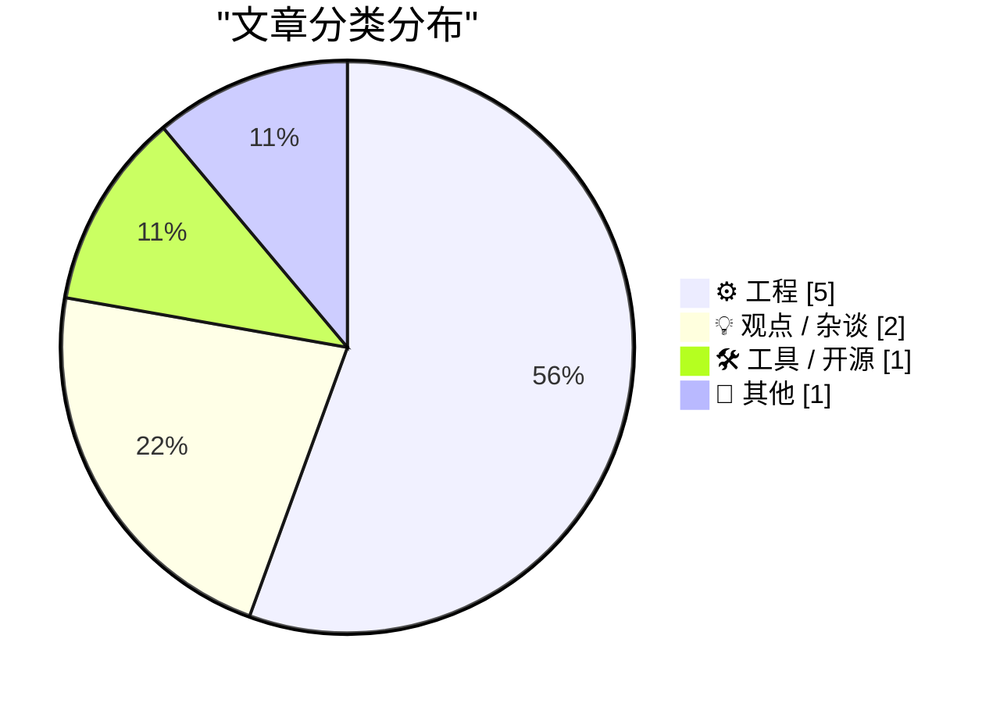
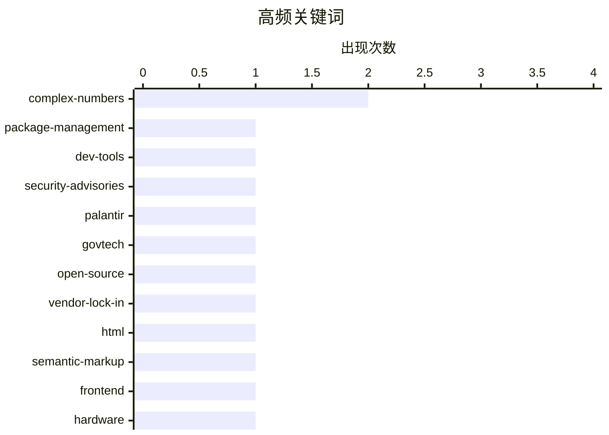

# 📰 AI 博客每日精选 — 2026-05-24

> 来自 Karpathy 推荐的 92 个顶级技术博客，AI 精选 Top 9

## 📝 今日看点

今日技术圈聚焦三大核心议题。软件供应链安全与包管理生态加速演进，自动化审计与签名验证正成为开发基座的新标准。底层数学理论与信号处理方法迎来工程化突破，复变函数拆解与矩阵离散化表达为高性能计算注入新范式。同时，技术治理与数据主权争议持续升温，从政府软件替代到专业准入机制，行业正重新校准技术伦理与技能导向的监管逻辑。整体来看，技术演进正从底层算法创新向安全合规与治理框架延伸，形成硬核算法与制度设计并重的新格局。

---

## 🏆 今日必读

🥇 **包管理领域本周动态：2026年5月23日**

[This Week in Package Management: 23 May 2026](https://nesbitt.io/2026/05/23/this-week-in-package-management.html) — nesbitt.io · 15 小时前 · 🛠 工具 / 开源

> 本期周刊聚焦软件包管理生态的最新发布、安全公告与技术文章。内容涵盖主流包管理工具链的版本更新、依赖解析漏洞修复及供应链安全最佳实践。作者整理了跨平台的工具演进趋势，强调自动化依赖审计与签名验证在防范恶意包注入中的关键作用。建议开发者定期同步生态动态，以优化构建流程并降低供应链攻击风险。

💡 **为什么值得读**: 适合需要快速掌握包管理工具链更新与安全趋势的开发者，避免在碎片化信息中遗漏关键漏洞修复。

🏷️ package-management, dev-tools, security-advisories

🥈 **关于Palantir的起源及其替代方案的几点思考**

[Some notes on how we ended up with Palantir & how to replace it](https://berthub.eu/articles/posts/some-notes-on-palantir/) — berthub.eu · 16 小时前 · 💡 观点 / 杂谈

> 文章探讨了政府广泛采用Palantir软件引发的伦理争议及欧洲本土替代方案的呼声。作者指出，替换Palantir不能仅停留在代码层面，必须深入理解其背后的数据治理架构、政府采购流程与系统集成逻辑。单纯开发符合“欧洲价值观”的软件无法解决数据孤岛与跨部门协同的根本问题。真正的替代路径需要重构公共数据标准与透明化审计机制，而非简单复制功能。

💡 **为什么值得读**: 为技术团队与政策制定者提供了超越“造轮子”思维的系统性替代框架，避免陷入技术决定论的误区。

🏷️ Palantir, govtech, open-source, vendor-lock-in

🥉 **深入理解HTML <dl> 定义列表元素**

[On the <dl>](https://simonwillison.net/2026/May/23/on-the-dl/#atom-everything) — simonwillison.net · 4 小时前 · ⚙️ 工程

> 本文详细解析了HTML <dl>（定义列表）元素的现代用法与无障碍特性。核心发现包括：单个 <dt> 可对应多个 <dd> 实现一对多语义映射，且允许使用 <div> 包裹组合以支持CSS样式化，但严格限制仅能使用 <div>。结合ARIA标签可为列表项提供精确的屏幕阅读器语义标注，显著提升可访问性。掌握这些规范有助于开发者摆脱滥用 <ul>/<ol> 的习惯，构建更符合语义标准的现代网页结构。

💡 **为什么值得读**: 帮助前端开发者纠正对定义列表的常见误用，掌握符合W3C最新规范的语义化与无障碍开发技巧。

🏷️ HTML, semantic-markup, frontend

---

## 📊 数据概览

| 扫描源 | 抓取文章 | 时间范围 | 精选 |
|:---:|:---:|:---:|:---:|
| 77/92 | 2361 篇 → 9 篇 | 24h | **9 篇** |

### 分类分布



### 高频关键词



<details>
<summary>📈 纯文本关键词图（终端友好）</summary>

```
complex-numbers     │ ████████████████████ 2
package-management  │ ██████████░░░░░░░░░░ 1
dev-tools           │ ██████████░░░░░░░░░░ 1
security-advisories │ ██████████░░░░░░░░░░ 1
palantir            │ ██████████░░░░░░░░░░ 1
govtech             │ ██████████░░░░░░░░░░ 1
open-source         │ ██████████░░░░░░░░░░ 1
vendor-lock-in      │ ██████████░░░░░░░░░░ 1
html                │ ██████████░░░░░░░░░░ 1
semantic-markup     │ ██████████░░░░░░░░░░ 1
```

</details>

### 🏷️ 话题标签

**complex-numbers**(2) · **package-management**(1) · **dev-tools**(1) · security-advisories(1) · palantir(1) · govtech(1) · open-source(1) · vendor-lock-in(1) · html(1) · semantic-markup(1) · frontend(1) · hardware(1) · reverse-engineering(1) · retro-computing(1) · hilbert-transform(1) · fourier-series(1) · signal-processing(1) · numerical-computation(1) · math(1) · trigonometry(1)

---

## ⚙️ 工程

### 1. 深入理解HTML <dl> 定义列表元素

[On the <dl>](https://simonwillison.net/2026/May/23/on-the-dl/#atom-everything) — **simonwillison.net** · 4 小时前 · ⭐ 20/30

> 本文详细解析了HTML <dl>（定义列表）元素的现代用法与无障碍特性。核心发现包括：单个 <dt> 可对应多个 <dd> 实现一对多语义映射，且允许使用 <div> 包裹组合以支持CSS样式化，但严格限制仅能使用 <div>。结合ARIA标签可为列表项提供精确的屏幕阅读器语义标注，显著提升可访问性。掌握这些规范有助于开发者摆脱滥用 <ul>/<ol> 的习惯，构建更符合语义标准的现代网页结构。

🏷️ HTML, semantic-markup, frontend

---

### 2. 逆向工程1980年代太空实验室计算机的硬件电路

[Reverse engineering circuitry in a Spacelab computer from 1980](http://www.righto.com/feeds/872292081485114047/comments/default) — **righto.com** · 9 小时前 · ⭐ 19/30

> 本文对1980年代航天飞机搭载的法国Mitra 125 MS微型计算机进行了硬件级逆向分析。该计算机未采用现代微处理器芯片，其16位处理器由多块分立芯片电路板构成。作者通过物理拆解与电路追踪，还原了算术逻辑单元（ALU）的晶体管级布线逻辑与信号传输路径。研究揭示了早期航天计算设备在可靠性设计与模块化架构上的工程取舍，为现代高可靠系统硬件设计提供了历史参照。

🏷️ hardware, reverse-engineering, retro-computing

---

### 3. 将希尔伯特变换表示为无限矩阵

[Hilbert transform as an infinite matrix](https://www.johndcook.com/blog/2026/05/23/hilbert-transform-as-an-infinite-matrix/) — **johndcook.com** · 10 小时前 · ⭐ 19/30

> 本文探讨了如何将希尔伯特变换从传统的积分算子形式转化为无限维矩阵运算。通过傅里叶级数展开，作者推导出变换核在频域中的离散化表示，并证明其与希尔伯特矩阵的等价性。该数学框架为信号处理中的相位偏移与解析信号构造提供了线性代数视角的计算捷径。掌握此方法可简化复杂函数的频域分析流程，提升数值计算的稳定性。

🏷️ Hilbert-transform, Fourier-series, signal-processing

---

### 4. 复变函数实部与虚部的分解实现

[Real and imaginary parts](https://www.johndcook.com/blog/2026/05/23/real-and-imaginary-parts/) — **johndcook.com** · 11 小时前 · ⭐ 19/30

> 本文基于Henry Baker的研究，系统梳理了将复变函数拆解为实部与虚部函数的数学方法。作者详细推导了任意复函数 f(x+iy) 映射为二元实函数 u(x,y) 与 v(x,y) 的通用公式，并给出了具体计算步骤。该方案避免了直接处理复数运算带来的精度损失与库依赖问题，适用于底层数值计算环境。通过分离实虚部，开发者可在仅支持实数运算的硬件或语言中高效实现复变函数逻辑。

🏷️ complex-numbers, numerical-computation, math

---

### 5. 仅用实函数构建复变初等函数

[Building complex functions out of real parts](https://www.johndcook.com/blog/2026/05/22/complex-functions-real-parts/) — **johndcook.com** · 21 小时前 · ⭐ 19/30

> 本文展示了如何仅使用实数域的初等函数来精确计算复数的正弦、余弦及其他基本运算。作者给出了复数三角函数的实部与虚部分解公式，并指出该模式可推广至指数、对数等所有初等函数，尽管部分公式的代数复杂度显著增加。该方法完全剥离了对复数数据类型的依赖，适合在资源受限或无原生复数支持的计算环境中部署。通过纯实数运算重构复变逻辑，可有效降低跨平台移植时的数值误差累积。

🏷️ complex-numbers, trigonometry, numerical-methods

---

## 💡 观点 / 杂谈

### 6. 关于Palantir的起源及其替代方案的几点思考

[Some notes on how we ended up with Palantir & how to replace it](https://berthub.eu/articles/posts/some-notes-on-palantir/) — **berthub.eu** · 16 小时前 · ⭐ 22/30

> 文章探讨了政府广泛采用Palantir软件引发的伦理争议及欧洲本土替代方案的呼声。作者指出，替换Palantir不能仅停留在代码层面，必须深入理解其背后的数据治理架构、政府采购流程与系统集成逻辑。单纯开发符合“欧洲价值观”的软件无法解决数据孤岛与跨部门协同的根本问题。真正的替代路径需要重构公共数据标准与透明化审计机制，而非简单复制功能。

🏷️ Palantir, govtech, open-source, vendor-lock-in

---

### 7. 哪些门槛应以年龄划定，哪些应以技能考核为准？

[Which age-gates should be skill-gates and vice-versa?](https://shkspr.mobi/blog/2026/05/which-age-gates-should-be-skill-gates-and-vice-versa/) — **shkspr.mobi** · 13 小时前 · ⭐ 15/30

> 本文对比了“年龄门槛”与“技能门槛”在公共政策与技术准入中的应用逻辑。作者指出，饮酒、投票等社会行为依赖生理成熟度与公民身份，适合采用年龄一刀切；而业余无线电执照、专业操作认证等则必须通过标准化考试验证实际能力。将年龄门槛替换为技能考核可提升资源分配效率，但需承担更高的评估成本与监管复杂度。政策制定者应在公平性、可执行性与风险控制之间寻找动态平衡点。

🏷️ policy, competence, society

---

## 🛠 工具 / 开源

### 8. 包管理领域本周动态：2026年5月23日

[This Week in Package Management: 23 May 2026](https://nesbitt.io/2026/05/23/this-week-in-package-management.html) — **nesbitt.io** · 15 小时前 · ⭐ 24/30

> 本期周刊聚焦软件包管理生态的最新发布、安全公告与技术文章。内容涵盖主流包管理工具链的版本更新、依赖解析漏洞修复及供应链安全最佳实践。作者整理了跨平台的工具演进趋势，强调自动化依赖审计与签名验证在防范恶意包注入中的关键作用。建议开发者定期同步生态动态，以优化构建流程并降低供应链攻击风险。

🏷️ package-management, dev-tools, security-advisories

---

## 📝 其他

### 9. 阅读清单：2026年5月23日

[Reading List 05/23/26](https://www.construction-physics.com/p/reading-list-052326) — **construction-physics.com** · 13 小时前 · ⭐ 18/30

> 本期清单汇集了跨领域的技术、产业与环境议题，涵盖非法占地清理服务的技术化转型、苹果对缺陷芯片的降级再利用策略、加州工业过程热能的优化利用，以及科罗拉多河流域的水资源危机预警。文章通过多源数据对比，揭示了硬件供应链弹性管理与区域气候适应技术的交叉趋势。作者建议关注这些非传统技术应用场景，以拓宽工程思维边界。保持对跨学科动态的敏感度，有助于在复杂系统中发现创新突破口。

🏷️ reading-list, Apple, industry-news

---

*生成于 2026-05-24 01:19 | 扫描 77 源 → 获取 2361 篇 → 精选 9 篇*
*基于 [Hacker News Popularity Contest 2025](https://refactoringenglish.com/tools/hn-popularity/) RSS 源列表，由 [Andrej Karpathy](https://x.com/karpathy) 推荐*
*由「懂点儿AI」制作，欢迎关注同名微信公众号获取更多 AI 实用技巧 💡*
