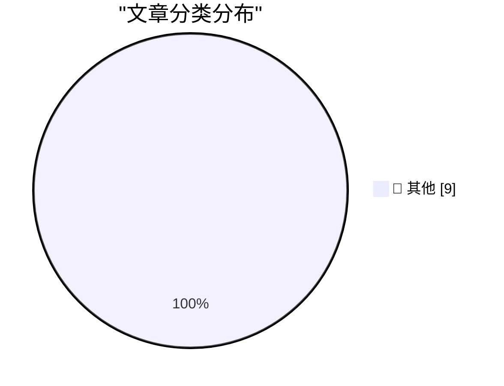

# 📰 AI 博客每日精选 — 2026-05-25

> 来自 Karpathy 推荐的 92 个顶级技术博客，AI 精选 Top 9

## 📝 今日看点

<think>用户给了一个文章列表，要求写一段3-5句话的"今日看点"总结。让我先分析这些文章的内容：

1. datasette 1.0a30 — datasette 1.0a30
2. datasette-agent 0.1a4 — datasette-agent 0.1a4
3. datasette-fixtures 0.1a0 — datasette-fixtures 0.1a0
4. Quoting Armin Ronacher — Quoting Armin Ronacher
5. Mad House — Usborne Creepy Computer Games — Mad House — Usborne Creepy Computer Games
6. Walking the dog with Claude — Walking the dog with Claude
7. Signing is for the bad days — Signing is for the bad days
8. Weekly Update 505 — Weekly Update 505
9. How my minimal, memory-safe Go rsync stears clear of vulnerabilities — How my minimal, memory-safe Go rsync steers clear of vulnerabilities

看起来这是一个技术文章列表，但我需要分析这些标题背后的主题：

1-3: Datasette相关项目更新（数据库工具）
4: Armin Ronacher的引用（他是一个知名的Python/Rust开发者）
6: 关于Claude（AI助手）的使用故事
9: Go语言的内存安全rsync工具

看起来这些文章大多是关于：
- 开发工具更新（Datasette套件）
- AI工具的实践应用（Claude）
- 编程语言相关（Python/Rust的Armin Ronacher，Go的rsync）

- 系统工具和编程语言安全性的探索

我注意到这天的技术文章可能集中在开发工具、安全性和编程语言实践上。Datasette项目更新显示了数据处理工具的持续演进，而关于Claude和rsync的文章反映了开发者对AI应用和系统工具安全性的关注。Armin Ronacher的引用暗示了Python和Rust生态系统的活跃性。</think>

今日技术圈聚焦开发工具与系统安全两大方向。Datasette 系列迎来版本更新，数据探索工具链持续完善。AI 编程助手 Claude 在实际场景中展现应用价值，关于 Prompt 工程与工作流的讨论热度上升。与此同时，Rust 等内存安全语言在基础设施工具中的实践再获关注，安全底线的技术探索正成为开发者社区的长期议题。

---

## 🏆 今日必读

🥇 **datasette 1.0a30**

[datasette 1.0a30](https://simonwillison.net/2026/May/24/datasette/#atom-everything) — simonwillison.net · 11 分钟前 · 📝 其他

> datasette 1.0a30

🥈 **datasette-agent 0.1a4**

[datasette-agent 0.1a4](https://simonwillison.net/2026/May/24/datasette-agent/#atom-everything) — simonwillison.net · 44 分钟前 · 📝 其他

> datasette-agent 0.1a4

🥉 **datasette-fixtures 0.1a0**

[datasette-fixtures 0.1a0](https://simonwillison.net/2026/May/24/datasette-fixtures/#atom-everything) — simonwillison.net · 2 小时前 · 📝 其他

> datasette-fixtures 0.1a0

---

## 📊 数据概览

| 扫描源 | 抓取文章 | 时间范围 | 精选 |
|:---:|:---:|:---:|:---:|
| 73/92 | 2189 篇 → 9 篇 | 24h | **9 篇** |

### 分类分布

---

## 📝 其他

### 1. datasette 1.0a30

[datasette 1.0a30](https://simonwillison.net/2026/May/24/datasette/#atom-everything) — **simonwillison.net** · 11 分钟前 · ⭐ 15/30

> datasette 1.0a30

---

### 2. datasette-agent 0.1a4

[datasette-agent 0.1a4](https://simonwillison.net/2026/May/24/datasette-agent/#atom-everything) — **simonwillison.net** · 44 分钟前 · ⭐ 15/30

> datasette-agent 0.1a4

---

### 3. datasette-fixtures 0.1a0

[datasette-fixtures 0.1a0](https://simonwillison.net/2026/May/24/datasette-fixtures/#atom-everything) — **simonwillison.net** · 2 小时前 · ⭐ 15/30

> datasette-fixtures 0.1a0

---

### 4. Quoting Armin Ronacher

[Quoting Armin Ronacher](https://simonwillison.net/2026/May/24/armin-ronacher/#atom-everything) — **simonwillison.net** · 5 小时前 · ⭐ 15/30

> Quoting Armin Ronacher

---

### 5. Mad House — Usborne Creepy Computer Games

[Mad House — Usborne Creepy Computer Games](https://simonwillison.net/2026/May/24/usborne-mad-house/#atom-everything) — **simonwillison.net** · 6 小时前 · ⭐ 15/30

> Mad House — Usborne Creepy Computer Games

---

### 6. Walking the dog with Claude

[Walking the dog with Claude](http://xania.org/202605/walking-the-dog?utm_source=feed&amp;utm_medium=rss) — **xania.org** · 7 小时前 · ⭐ 15/30

> Walking the dog with Claude

---

### 7. Signing is for the bad days

[Signing is for the bad days](https://nesbitt.io/2026/05/24/signing-is-for-the-bad-days.html) — **nesbitt.io** · 14 小时前 · ⭐ 15/30

> Signing is for the bad days

---

### 8. Weekly Update 505

[Weekly Update 505](https://www.troyhunt.com/weekly-update-505/) — **troyhunt.com** · 22 小时前 · ⭐ 15/30

> Weekly Update 505

---

### 9. How my minimal, memory-safe Go rsync steers clear of vulnerabilities

[How my minimal, memory-safe Go rsync steers clear of vulnerabilities](https://michael.stapelberg.ch/posts/2026-05-24-minimal-memory-safe-go-rsync-vulns/) — **michael.stapelberg.ch** · 9 小时前 · ⭐ 15/30

> How my minimal, memory-safe Go rsync steers clear of vulnerabilities

---

*生成于 2026-05-25 00:03 | 扫描 73 源 → 获取 2189 篇 → 精选 9 篇*
*基于 [Hacker News Popularity Contest 2025](https://refactoringenglish.com/tools/hn-popularity/) RSS 源列表，由 [Andrej Karpathy](https://x.com/karpathy) 推荐*
*由「懂点儿AI」制作，欢迎关注同名微信公众号获取更多 AI 实用技巧 💡*
