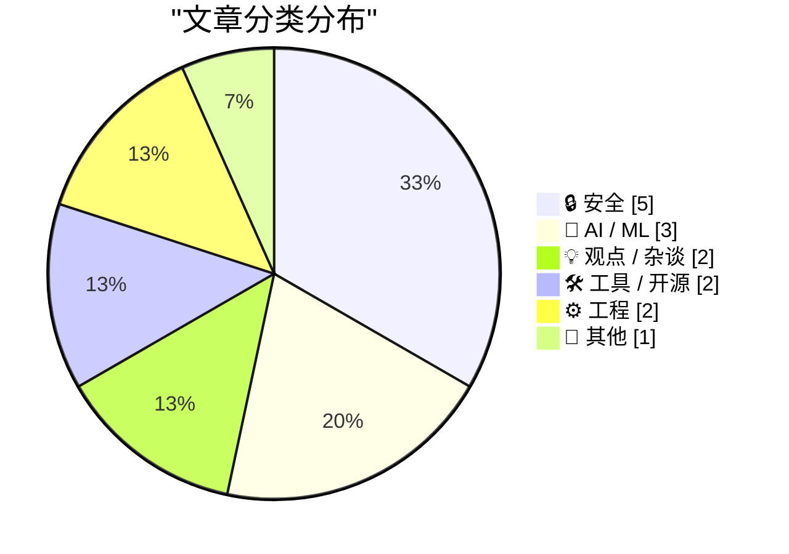
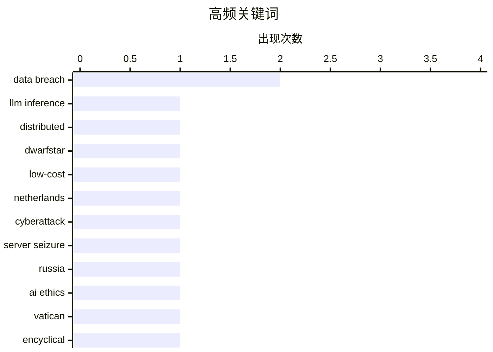

# 📰 AI 博客每日精选 — 2026-05-26

> 来自 Karpathy 推荐的 92 个顶级技术博客，AI 精选 Top 15

## 📝 今日看点

今日技术圈焦点首先落在AI的多重张力上：一面是分布式推理硬件成本高企，迫使业界另寻替代方案，另一面则是教宗通谕引发关于AI伦理的严肃讨论，凸显技术落地与人文守护的博弈。与此同时，全球网络安全攻防再度升级，荷兰查封为俄网络行动提供助力的服务器、特朗普手机网站泄露用户信息、不丹接入HIBP监控数据泄露等事件，串联起地缘、商业与民生交织的安全挑战。此外，广告技术生态的“互害”乱象和平台持续堕落，也再次敲响行业信任危机的警钟。

---

## 🏆 今日必读

🥇 **DwarfStar 中的分布式 LLM 推理**

[Distributing LLM inference in DwarfStar](http://antirez.com/news/167) — antirez.com · 10 小时前 · 🤖 AI / ML

> 高端 NVIDIA 显卡及其配套服务器和电力成本高昂，尤其是运行大规模模型所需的海量显存。苹果硬件或 DGX Spark 等替代方案虽能运行 LLM，但受限于内存带宽，Mac Studio 最高提供 512GB 统一内存，带宽优于 Spark 但依然有限。antirez 在 DwarfStar 项目中探索了分布式推理方案，试图在非顶级硬件上实现足够快的提示处理速度。核心思路是将推理任务拆分到多台设备上协同计算，以绕过单机显存和带宽瓶颈。

💡 **为什么值得读**: Redis 作者 antirez 亲述如何在非顶尖硬件上实现分布式 LLM 推理，是低成本运行大模型的实战探索。

🏷️ LLM inference, distributed, DwarfStar, low-cost

🥈 **荷兰查封 800 台服务器并逮捕 2 人，涉嫌协助网络攻击**

[Netherlands Seizes 800 Servers, Arrests 2 for Aiding Cyberattacks](https://krebsonsecurity.com/2026/05/netherlands-seizes-800-servers-arrests-2-for-aiding-cyberattacks/) — krebsonsecurity.com · 12 小时前 · 🔒 安全

> 荷兰当局逮捕了两家关联互联网托管公司的共同所有人，指控其运营的 IT 基础设施被俄罗斯用于在欧盟境内实施网络攻击、影响力行动和虚假信息活动。这两名嫌疑人正是 KrebsOnSecurity 2025 年一篇报道的主角，当时他们的托管公司接管了 Stark Industries Solutions 的技术基础设施——一家去年被欧盟制裁的互联网服务提供商。此次行动共查封 800 台服务器。

💡 **为什么值得读**: Krebs 持续追踪的制裁规避链条被斩断，揭示出网络犯罪基础设施背后的真实运营者如何被锁定。

🏷️ Netherlands, cyberattack, server seizure, Russia

🥉 **Simon Willison 对教宗利奥十四世人工智能通谕的评注**

[Notes on Pope Leo XIV's encyclical on AI](https://simonwillison.net/2026/May/25/encyclical-on-ai/#atom-everything) — simonwillison.net · 1 小时前 · 🤖 AI / ML

> 梵蒂冈发布了教宗利奥十四世的通谕《Magnifica Humanitas》，聚焦人工智能时代如何守护人的尊严。Simon Willison 认为这是关于 AI 伦理融入现代社会的最清晰文件之一，其文风直接、少有晦涩。教宗选择“利奥”这一名号，意在致敬曾撰写现代社会问题通谕的利奥十三世。通谕深入讨论了 AI 部署中的人性保障问题，避免技术淹没人的价值。

💡 **为什么值得读**: 一位技术圈知名 AI 评论者对梵蒂冈官方 AI 伦理文件的逐段点评，是技术与宗教伦理碰撞的罕见一手解读。

🏷️ AI ethics, Vatican, encyclical, Pope Leo XIV

---

## 📊 数据概览

| 扫描源 | 抓取文章 | 时间范围 | 精选 |
|:---:|:---:|:---:|:---:|
| 77/92 | 2365 篇 → 16 篇 | 24h | **15 篇** |

### 分类分布



### 高频关键词



<details>
<summary>📈 纯文本关键词图（终端友好）</summary>

```
data breach    │ ████████████████████ 2
llm inference  │ ██████████░░░░░░░░░░ 1
distributed    │ ██████████░░░░░░░░░░ 1
dwarfstar      │ ██████████░░░░░░░░░░ 1
low-cost       │ ██████████░░░░░░░░░░ 1
netherlands    │ ██████████░░░░░░░░░░ 1
cyberattack    │ ██████████░░░░░░░░░░ 1
server seizure │ ██████████░░░░░░░░░░ 1
russia         │ ██████████░░░░░░░░░░ 1
ai ethics      │ ██████████░░░░░░░░░░ 1
```

</details>

### 🏷️ 话题标签

**data breach**(2) · **llm inference**(1) · **distributed**(1) · dwarfstar(1) · low-cost(1) · netherlands(1) · cyberattack(1) · server seizure(1) · russia(1) · ai ethics(1) · vatican(1) · encyclical(1) · pope leo xiv(1) · trump mobile(1) · customer data(1) · ad-tech(1) · fraud(1) · online advertising(1) · have i been pwned(1) · bhutan(1)

---

## 🔒 安全

### 1. 荷兰查封 800 台服务器并逮捕 2 人，涉嫌协助网络攻击

[Netherlands Seizes 800 Servers, Arrests 2 for Aiding Cyberattacks](https://krebsonsecurity.com/2026/05/netherlands-seizes-800-servers-arrests-2-for-aiding-cyberattacks/) — **krebsonsecurity.com** · 12 小时前 · ⭐ 27/30

> 荷兰当局逮捕了两家关联互联网托管公司的共同所有人，指控其运营的 IT 基础设施被俄罗斯用于在欧盟境内实施网络攻击、影响力行动和虚假信息活动。这两名嫌疑人正是 KrebsOnSecurity 2025 年一篇报道的主角，当时他们的托管公司接管了 Stark Industries Solutions 的技术基础设施——一家去年被欧盟制裁的互联网服务提供商。此次行动共查封 800 台服务器。

🏷️ Netherlands, cyberattack, server seizure, Russia

---

### 2. 特朗普手机网站暴露预订单完成与放弃数量及关联客户信息

[Trump Mobile Website Exposed the Number of Pre-Orders — Both Completed and Abandoned — and the Associated Customer Information](https://www.theguardian.com/us-news/2026/may/23/trump-mobile-investigating-potential-exposure-of-would-be-customers-personal-information) — **daringfireball.net** · 6 小时前 · ⭐ 24/30

> 特朗普手机官网被发现泄露了预购用户的个人信息，包括全名、地址和电话号码。哥伦比亚大学教授 Jonathan Soma 审查了泄露的代码，指出网站使用了常见的分析工具，但配置不当导致已完成和放弃的预订单数据均可被外部访问。公司声明称正聘请独立网络安全专家调查此事。

🏷️ data breach, Trump Mobile, customer data

---

### 3. 不丹政府加入 Have I Been Pwned 免费政府服务

[Welcoming the Bhutanese Government to Have I Been Pwned](https://www.troyhunt.com/welcoming-the-bhutanese-government-to-have-i-been-pwned/) — **troyhunt.com** · 2 小时前 · ⭐ 20/30

> 不丹成为第 45 个接入 Have I Been Pwned 免费政府服务的国家。不丹计算机应急响应小组 BtCIRT 现可基于 HIBP 数据库监控不丹政府域名的数据泄露风险。作为国家级 CIRT，BtCIRT 负责消费威胁情报并保护政府数字资产。

🏷️ Have I Been Pwned, Bhutan, government, data breach

---

### 4. Python 包中的 GitHub Actions 安全

[GitHub Actions security in Python packages](https://nesbitt.io/2026/05/25/github-actions-security-in-python-packages.html) — **nesbitt.io** · 15 小时前 · ⭐ 18/30

> 文章探讨 Python 包生态中 GitHub Actions 配置的安全隐患，并感谢 Dr. Zizmor 的安全工具。内容涉及 CI/CD 流水线中的权限过度授予、密钥泄露和供应链攻击面等常见问题，提出针对 Python 包维护者的 GitHub Actions 加固建议。

🏷️ GitHub Actions, security, Python, zizmor

---

### 5. 窃贼正通过短信威胁伦敦iPhone失窃案受害者

[Thieves Are Texting Threats to Victims of iPhone Theft in London](https://www.nytimes.com/2026/05/23/world/europe/phone-theft-threats-london.html?unlocked_article_code=1.lFA.OUt7.VJ_FoDpINr0L) — **daringfireball.net** · 6 小时前 · ⭐ 17/30

> 伦敦近年频发的抢夺手机案件中，犯罪分子得手后不仅侵占设备，更通过失主亲友实施短信与视频威胁，声称掌握其邮件和银行信息。纽约时报追踪报道了Alex Pikula在剧院外被骑电动自行车者抢走iPhone后，他母亲随即收到包含私密数据的恐吓视频这一典型案例。文章揭示了智能手机盗窃已升级为伴随数字勒索的有组织产业链，警方对此类案件并不陌生，但受害者面临的心理压力与信息泄露风险远超单纯财物损失。报道强调，设备失窃后引发的后续安全威胁才是真正危险的开始。

🏷️ iPhone, theft, threats, London

---

## 🤖 AI / ML

### 6. DwarfStar 中的分布式 LLM 推理

[Distributing LLM inference in DwarfStar](http://antirez.com/news/167) — **antirez.com** · 10 小时前 · ⭐ 28/30

> 高端 NVIDIA 显卡及其配套服务器和电力成本高昂，尤其是运行大规模模型所需的海量显存。苹果硬件或 DGX Spark 等替代方案虽能运行 LLM，但受限于内存带宽，Mac Studio 最高提供 512GB 统一内存，带宽优于 Spark 但依然有限。antirez 在 DwarfStar 项目中探索了分布式推理方案，试图在非顶级硬件上实现足够快的提示处理速度。核心思路是将推理任务拆分到多台设备上协同计算，以绕过单机显存和带宽瓶颈。

🏷️ LLM inference, distributed, DwarfStar, low-cost

---

### 7. Simon Willison 对教宗利奥十四世人工智能通谕的评注

[Notes on Pope Leo XIV's encyclical on AI](https://simonwillison.net/2026/May/25/encyclical-on-ai/#atom-everything) — **simonwillison.net** · 1 小时前 · ⭐ 26/30

> 梵蒂冈发布了教宗利奥十四世的通谕《Magnifica Humanitas》，聚焦人工智能时代如何守护人的尊严。Simon Willison 认为这是关于 AI 伦理融入现代社会的最清晰文件之一，其文风直接、少有晦涩。教宗选择“利奥”这一名号，意在致敬曾撰写现代社会问题通谕的利奥十三世。通谕深入讨论了 AI 部署中的人性保障问题，避免技术淹没人的价值。

🏷️ AI ethics, Vatican, encyclical, Pope Leo XIV

---

### 8. 求解棋盘游戏 Quoridor

[Solving the board game Quoridor](https://grantslatton.com/solving-quoridor) — **grantslatton.com** · 5 小时前 · ⭐ 20/30

> 通过算法和优化技术对棋盘游戏 Quoridor 进行求解。文章探讨了博弈树搜索、启发式优化等计算策略在完美信息棋类游戏中的应用，试图找到 Quoridor 的最优解或强博弈策略。将数学优化与游戏玩法结合，展示了组合博弈问题从建模到求解的完整过程。

🏷️ Quoridor, game AI, algorithm, optimization

---

## 💡 观点 / 杂谈

### 9. 广告技术窃贼之间没有诚信可言

[Pluralistic: No honor among (ad-tech) thieves (25 May 2026)](https://pluralistic.net/2026/05/25/lying-spies/) — **pluralistic.net** · 17 小时前 · ⭐ 24/30

> Cory Doctorow 揭露广告技术生态中各方互相欺骗的乱象，使用“enshittification”（平台堕落）框架分析了多个案例。文章涵盖 Airbnb 和 Oculus 的服务质量持续恶化、任天堂对粉丝作品的版权打压、以及百威啤酒双截棍等荒诞商品现象。核心观点是广告技术产业的内生激励导致参与者之间没有诚信可言，整个系统在互相欺诈中走向腐化。

🏷️ ad-tech, fraud, online advertising

---

### 10. 授予Jay Haynes的“正确性积分”：八年前预测苹果市值将达到三万亿美元

[Awarding Jay Haynes His Being Right Points for Predicting Apple Hitting $3 Trillion in Market Cap](https://daringfireball.net/linked/2014/01/29/haynes-aapl) — **daringfireball.net** · 5 小时前 · ⭐ 13/30

> 2014年Jay Haynes发表博客，基于合理的年增长率预测苹果将在十年内触及三万亿美元市值，当时苹果市值仅为4500亿，尚无公司突破万亿门槛。这一大胆预测在八年后的2022年即提前兑现，苹果成为全球首家三万亿美元市值公司。尽管原博客已消失，但Haynes重新发布了当年文章，证明其基于基本面的长期判断完全正确。

🏷️ Apple, market cap, prediction

---

## 🛠 工具 / 开源

### 11. WorkOS：代理需要上下文，部署能提供上下文的集成

[WorkOS: ‘Agents Need Context. Ship the Integrations That Give It to Them.’](https://workos.com/docs/pipes?utm_source=daringfireball&amp;utm_medium=newsletter&amp;utm_campaign=q22026) — **daringfireball.net** · 10 小时前 · ⭐ 18/30

> 多阶段 AI 代理在遭遇无法访问的工具时会立即卡住，而每个缺失的集成都意味着额外的 OAuth 流程、令牌生命周期管理和数周的管道搭建。WorkOS Pipes 通过预构建连接器，将代理接入 GitHub、Slack、Salesforce 等用户日常使用的工具，消除集成摩擦。核心论点是代理所需的真正上下文不在数据库中，而在用户每天操作的工具里。

🏷️ AI agents, integrations, WorkOS

---

### 12. [赞助] exe.dev：Agent时代的云端计算平台

[[Sponsor] exe.dev](https://exe.dev/?df) — **daringfireball.net** · 1 小时前 · ⭐ 16/30

> exe.dev 提供预配置的虚拟机池，默认开启SSH、root权限与网页认证，专为AI Agent时代设计。其核心能力在于密文在网络边缘注入，确保大语言模型（LLM）永远无法接触原始密钥。平台支持持久化服务器、内部工具开发、氛围编程（vibe coding）以及一次性开发环境等场景，定位为“它就是一台计算机”的极简云端算力服务。

🏷️ cloud VMs, SSH, agent, dev environment

---

## ⚙️ 工程

### 13. FediMeteo、时区，以及不搞坏已有系统的艺术

[FediMeteo, timezones, and the art of not breaking what already works](https://it-notes.dragas.net/2026/05/25/fedimeteo-timezones-and-the-art-of-not-breaking-what-already-works/) — **it-notes.dragas.net** · 16 小时前 · ⭐ 18/30

> FediMeteo 是一个运行在 FreeBSD VPS 上的联邦宇宙气象服务，已向数千用户提供天气信息。本文聚焦时区处理的挑战，讲述如何在不破坏已有稳定服务的前提下进行功能扩展和代码重构。作者从之前的 HAProxy 优化经验延续了“不搞坏已有系统”的工程哲学，强调渐进式改进而非大爆炸式重写。

🏷️ timezones, FediMeteo, software design, Mastodon

---

### 14. PHP：在脚本结束前提前发送HTTP响应头的简易方法

[PHP - simple way to send HTTP headers before a script ends](https://shkspr.mobi/blog/2026/05/php-simple-way-to-send-http-headers-before-a-script-ends/) — **shkspr.mobi** · 14 小时前 · ⭐ 16/30

> PHP标准流程中，header()重定向后若存在长耗时操作，客户端需等待整个脚本执行完毕才能收到302响应，导致十秒级延迟。传统解决方案较为复杂，而本文展示了一种利用fastcgi_finish_request()函数的简易手段，能立即将HTTP响应刷给客户端，同时让PHP继续在后台完成剩余任务。该方法无需消息队列或额外进程，可有效实现响应与耗时逻辑的解耦。

🏷️ PHP, HTTP headers, flush, background processing

---

## 📝 其他

### 15. Quantum Link：成为AOL之前的AOL

[Quantum Link: AOL before it was AOL](https://dfarq.homeip.net/quantum-link-aol-before-it-was-aol/?utm_source=rss&#038;utm_medium=rss&#038;utm_campaign=quantum-link-aol-before-it-was-aol) — **dfarq.homeip.net** · 14 小时前 · ⭐ 13/30

> Quantum Link（Q-Link）是AOL的前身，1985年5月24日由Control Video重组而来，专为Commodore电脑和调制解调器用户提供早期在线服务。文章回顾了这段80年代被多数人遗忘的起源历史，指出若在那个时代使用过Commodore设备上网，就已是后来风靡全美的AOL的早期用户。

🏷️ Quantum Link, AOL, history, Commodore

---

*生成于 2026-05-26 01:42 | 扫描 77 源 → 获取 2365 篇 → 精选 15 篇*
*基于 [Hacker News Popularity Contest 2025](https://refactoringenglish.com/tools/hn-popularity/) RSS 源列表，由 [Andrej Karpathy](https://x.com/karpathy) 推荐*
*由「懂点儿AI」制作，欢迎关注同名微信公众号获取更多 AI 实用技巧 💡*
