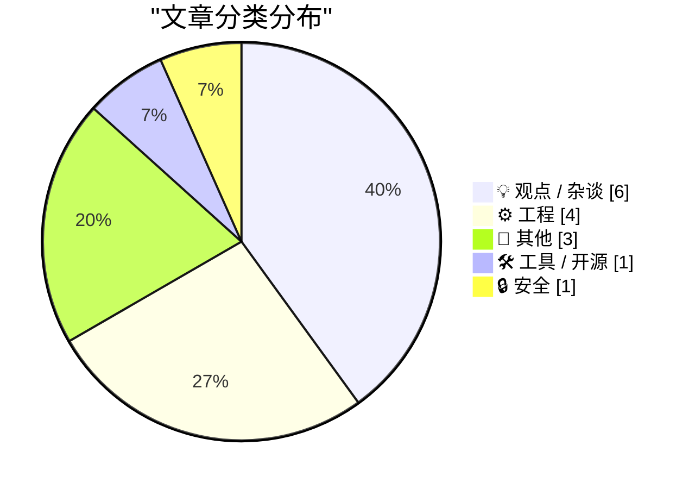
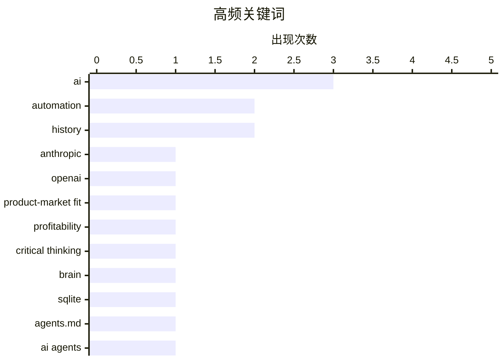

# 📰 AI 博客每日精选 — 2026-05-28

> 来自 Karpathy 推荐的 92 个顶级技术博客，AI 精选 Top 15

## 📝 今日看点

今日技术圈的核心脉搏，在于 AI 的深度渗透正从工具使用转向认知与商业模式的根本性重塑。一边是头部厂商探索出按 Token 消耗而非传统 SaaS 定价的新产品-市场契合点，另一边却引发了对“用 Token 丈量生产力”和用 AI 替代思考的集体警觉。与此同时，开源生态已开始为 AI 代理到来做准备，从代码库级别的指引文件到练习题解答，开发者社区正在主动定义如何与 AI 理性共生，而非被动接管。

---

## 🏆 今日必读

🥇 **我认为 Anthropic 和 OpenAI 已经找到了产品-市场契合点**

[I think Anthropic and OpenAI have found product-market fit](https://simonwillison.net/2026/May/27/product-market-fit/#atom-everything) — simonwillison.net · 7 小时前 · 💡 观点 / 杂谈

> Anthropic 被强烈传闻即将实现首个盈利季度，同时多家公司惊讶于员工使用大语言模型带来的高额账单。OpenAI 和 Anthropic 都发现了产品-市场契合点：其定价模式并未按传统 SaaS 的人头费设计，而是将 API 密钥直接交到开发者手中，让使用量可以无上限增长。Claude Code 等工具在企业内部迅速蔓延，导致 IT 预算超支成为普遍现象。作者的核心观点是，这种按用量计费的开发者工具模式，正成为 AI 公司最成功的商业路径。

💡 **为什么值得读**: 从 Anthropic 盈利传闻和企业 LLM 账单失控的现象切入，揭示了 AI 公司绕过传统采购流程、直接占领开发者市场的商业模式转变。

🏷️ Anthropic, OpenAI, product-market fit, profitability

🥈 **用我他妈的大脑**

[Using My Fucking Brain](https://terriblesoftware.org/2026/05/27/using-my-fucking-brain/) — terriblesoftware.org · 11 小时前 · 💡 观点 / 杂谈

> AI 在扩展大脑能力时非常有用，但当它悄然替代本该思考的那部分时就会变得危险。作者通过一句犀利的格言，划清了 AI 使用的边界：辅助思考而非替代思考。这并非技术层面的讨论，而是对认知惰性的一次警告——把思考外包给 AI 会让我们逐渐丧失独立思考的能力。

💡 **为什么值得读**: 用一句话刺痛了每个 AI 重度用户的心，短小精悍却足以让你停下来审视自己是否已经在不知不觉中把太多思考交给了机器。

🏷️ AI, critical thinking, automation, brain

🥉 **SQLite 的 AGENTS.md 文件**

[sqlite AGENTS.md](https://simonwillison.net/2026/May/27/sqlite-agents/#atom-everything) — simonwillison.net · 21 分钟前 · 🛠 工具 / 开源

> SQLite 代码库在五天前新增了 AGENTS.md 文件，但其目的并非指导自身开发，而是为那些将 AI 代理指向 SQLite 代码库的外部开发者提供指引。文件中明确声明，SQLite 不接受未经事先协商或未附带法律协议的拉取请求，这是对 AI 代理自动生成 PR 趋势的直接回应。该举措反映了开源项目维护者在 AI 辅助编程时代面临的新挑战：如何在不增加维护负担的前提下，接纳 AI 生成的大量代码贡献。

💡 **为什么值得读**: SQLite 作为最流行的嵌入式数据库，其应对 AI 代理入侵代码库的方法为所有开源项目提供了样本——如何用一份 AGENTS.md 文件画下边界线。

🏷️ SQLite, AGENTS.md, AI agents, coding assistants

---

## 📊 数据概览

| 扫描源 | 抓取文章 | 时间范围 | 精选 |
|:---:|:---:|:---:|:---:|
| 77/92 | 2366 篇 → 16 篇 | 24h | **15 篇** |

### 分类分布



### 高频关键词



<details>
<summary>📈 纯文本关键词图（终端友好）</summary>

```
ai                 │ ████████████████████ 3
automation         │ █████████████░░░░░░░ 2
history            │ █████████████░░░░░░░ 2
anthropic          │ ███████░░░░░░░░░░░░░ 1
openai             │ ███████░░░░░░░░░░░░░ 1
product-market fit │ ███████░░░░░░░░░░░░░ 1
profitability      │ ███████░░░░░░░░░░░░░ 1
critical thinking  │ ███████░░░░░░░░░░░░░ 1
brain              │ ███████░░░░░░░░░░░░░ 1
sqlite             │ ███████░░░░░░░░░░░░░ 1
```

</details>

### 🏷️ 话题标签

**ai**(3) · **automation**(2) · **history**(2) · anthropic(1) · openai(1) · product-market fit(1) · profitability(1) · critical thinking(1) · brain(1) · sqlite(1) · agents.md(1) · ai agents(1) · coding assistants(1) · tokens(1) · developer metrics(1) · productivity(1) · iozone(1) · disk benchmark(1) · macos(1) · performance(1)

---

## 💡 观点 / 杂谈

### 1. 我认为 Anthropic 和 OpenAI 已经找到了产品-市场契合点

[I think Anthropic and OpenAI have found product-market fit](https://simonwillison.net/2026/May/27/product-market-fit/#atom-everything) — **simonwillison.net** · 7 小时前 · ⭐ 26/30

> Anthropic 被强烈传闻即将实现首个盈利季度，同时多家公司惊讶于员工使用大语言模型带来的高额账单。OpenAI 和 Anthropic 都发现了产品-市场契合点：其定价模式并未按传统 SaaS 的人头费设计，而是将 API 密钥直接交到开发者手中，让使用量可以无上限增长。Claude Code 等工具在企业内部迅速蔓延，导致 IT 预算超支成为普遍现象。作者的核心观点是，这种按用量计费的开发者工具模式，正成为 AI 公司最成功的商业路径。

🏷️ Anthropic, OpenAI, product-market fit, profitability

---

### 2. 用我他妈的大脑

[Using My Fucking Brain](https://terriblesoftware.org/2026/05/27/using-my-fucking-brain/) — **terriblesoftware.org** · 11 小时前 · ⭐ 25/30

> AI 在扩展大脑能力时非常有用，但当它悄然替代本该思考的那部分时就会变得危险。作者通过一句犀利的格言，划清了 AI 使用的边界：辅助思考而非替代思考。这并非技术层面的讨论，而是对认知惰性的一次警告——把思考外包给 AI 会让我们逐渐丧失独立思考的能力。

🏷️ AI, critical thinking, automation, brain

---

### 3. 你今天烧掉了多少 Token

[How Many Tokens Did You Burn Today](https://idiallo.com/blog/how-many-tokens-did-you-burn-today?src=feed) — **idiallo.com** · 23 小时前 · ⭐ 21/30

> 作者回顾了二十年前一位经理提出的荒谬要求：用饼图统计每位开发者每周编写的代码行数。当时团队对此嗤之以鼻，认为这是无知的管理层对生产力的粗暴量化。如今，类似的场景正在以 Token 消耗量的形式重现——企业开始监控和统计 AI 使用的 Token 数量，并将其与生产力挂钩。作者认为，从代码行数到 Token 计数，衡量标准变了，但用表面指标替代真正价值的愚蠢本质并未改变。

🏷️ tokens, developer metrics, productivity, AI

---

### 4. AI 与一个没有移民的世界

[Pluralistic: AI and a world without migrants (27 May 2026)](https://pluralistic.net/2026/05/27/unnecessariat/) — **pluralistic.net** · 16 小时前 · ⭐ 19/30

> Cory Doctorow 探讨了 AI 技术发展带来的一种唯我论倾向：硅谷精英幻想用 AI 取代所有移民劳动力，从而构建一个无需外来人口的封闭社会。他认为这种技术乌托邦建立在深刻的唯我主义之上，忽视了移民在社会中复杂的文化、经济和政治角色。文章分析了自动化叙事如何被用作排斥移民的借口，并警告这种去人性化的技术愿景最终会反噬社会本身。

🏷️ AI, migration, labor, automation

---

### 5. 比尔·盖茨的"互联网浪潮"微软备忘录

[Bill Gates’ Internet Tidal Wave Microsoft memo](https://dfarq.homeip.net/bill-gates-internet-tidal-wave-microsoft-memo/?utm_source=rss&#038;utm_medium=rss&#038;utm_campaign=bill-gates-internet-tidal-wave-microsoft-memo) — **dfarq.homeip.net** · 13 小时前 · ⭐ 18/30

> 1995 年 5 月 26 日，比尔·盖茨向微软全体员工发出一份题为"互联网浪潮"的内部备忘录，将互联网列为企业五级火警级别的最高优先事项。这份备忘录标志着微软战略从桌面软件向互联网的剧烈转向，直接催生了 Internet Explorer 浏览器和 MSN 服务的全面布局。30 年后的今天回顾这份文件，它被视为科技史上最具远见和影响力的公司战略文件之一，也展示了微软如何凭借一次果断的航向调整赢得浏览器战争。

🏷️ Bill Gates, memo, Internet, history

---

### 6. 引用 Kyle Ferrana 的段子

[Quoting Kyle Ferrana](https://simonwillison.net/2026/May/27/kyle-ferrana/#atom-everything) — **simonwillison.net** · 17 小时前 · ⭐ 14/30

> Kyle Ferrana 发布了一段模拟《星际迷航》的对话：皮卡德命令 Data 升起护盾，Data 用一套漂亮的管理术语回应，强调护盾是策略而非防备，但在遭受重创后 Data 却承认“你让我升护盾，我没升”。该段子讽刺当前的 AI 系统可以给出合理、优雅的回复，却在实际行动上完全缺失，揭示了语言模型“说得好听但不做事”的现状。

🏷️ AI safety, Star Trek, metaphor, shields

---

## ⚙️ 工程

### 7. 我为现代 macOS 上的磁盘基准测试修补了 iozone

[I patched iozone for better disk benchmarks on modern macOS](https://www.jeffgeerling.com/blog/2026/i-patched-iozone-for-better-disk-benchmarks-on-modern-macos/) — **jeffgeerling.com** · 22 小时前 · ⭐ 20/30

> Jeff Geerling 十年来一直使用跨平台工具 iozone 进行磁盘基准测试，并认为其比 fio 更能反映真实的硬盘和 SSD 性能。他为 iozone 打了补丁，增加了异步 I/O 支持，并修复了在现代 macOS 上的兼容性问题。此外还添加了对 Apple Silicon 原生架构的支持，提升了在现代 Mac 设备上的测试准确性和稳定性。补丁已提交给上游项目，目的是确保这款老工具在 Apple 新平台上继续可用。

🏷️ iozone, disk benchmark, macOS, performance

---

### 8. SQLAlchemy 2 实践——习题解答

[SQLAlchemy 2 In Practice - Solutions to the Exercises](https://blog.miguelgrinberg.com/post/sqlalchemy-2-in-practice---solutions-to-the-exercises) — **miguelgrinberg.com** · 4 小时前 · ⭐ 20/30

> Miguel Grinberg 为其《SQLAlchemy 2 in Practice》系列书籍发布了所有课后练习的官方解答。该书籍系统讲解了 SQLAlchemy 2.0 的 ORM 和 Core 组件，覆盖从基础模型定义到复杂查询、异步支持、关系映射等主题。习题解答提供了完整可运行的代码示例，帮助读者验证学习成果并理解最佳实践。作者鼓励读者通过购买完整书籍来支持其内容创作。

🏷️ SQLAlchemy, Python, ORM, exercises

---

### 9. 在多个协程间共享单个 Windows Runtime IAsyncOperation 的结果（第 1 部分）

[Sharing the result of a single Windows Runtime IAsyncOperation among multiple coroutines, part 1](https://devblogs.microsoft.com/oldnewthing/20260527-00/?p=112361) — **devblogs.microsoft.com/oldnewthing** · 10 小时前 · ⭐ 17/30

> 多个协程如何安全复用同一个 Windows Runtime 异步操作（IAsyncOperation）的结果，而不是重复触发异步调用。第一部分介绍了缓存异步结果的基本模式，并重点讨论缓存有效性的判断条件，避免使用已过期的数据。方案涉及 C++/WinRT 的协程、winrt::single_threaded_map 等基础设施。核心观点是：必须在正确理解异步操作生命周期的基础上设计缓存，才能既减少开销又不引入竞态或陈旧数据。

🏷️ Windows Runtime, IAsyncOperation, coroutines, caching

---

### 10. Meta Logo 与 Besace 曲线拟合

[The Meta logo and fitting Besace curves](https://www.johndcook.com/blog/2026/05/27/the-meta-logo-and-fitting-besace-curves/) — **johndcook.com** · 8 小时前 · ⭐ 16/30

> Meta 公司的标志形状恰好是一种 Besace 曲线，该曲线既有隐式方程也有参数方程（参数 t 范围 0 到 2π）。文章讨论如何从给定的 Besace 曲线（如 Meta Logo）反求出参数 a 和 b。作者通过改写方程，展示了将曲线拟合转化为简单的数值估算过程。结论是只需初等代数与少量试算即可得到合理拟合结果。

🏷️ Besace curve, Meta logo, curve fitting, mathematics

---

## 📝 其他

### 11. 设备测评：Chuwi Minibook X N150 + Linux ★★★★☆

[Gadget Review: Chuwi Minibook X N150 + Linux ★★★★☆](https://shkspr.mobi/blog/2026/05/gadget-review-chuwi-minibook-x-n150-linux/) — **shkspr.mobi** · 12 小时前 · ⭐ 17/30

> 作者因需要一款小到可放入短裤口袋的旅行笔记本，选择了售价约 300 英镑的 Chuwi Minibook N150。该设备采用 USB-C 充电、配备 10.51 英寸屏幕，运行 Linux 系统，在便携性和实用性之间取得了平衡。评测指出该设备在轻办公和上网场景下表现尚可，适合需要比手机更大屏幕但不愿承担高价旗舰设备的用户。总体评分为四星，主要扣分项集中在触控板和电池续航上。

🏷️ Chuwi Minibook, Linux, laptop, review

---

### 12. 2026 年的 CHAOSS 指标

[CHAOSS Metrics in 2026](https://nesbitt.io/2026/05/27/chaoss-metrics-in-2026.html) — **nesbitt.io** · 14 小时前 · ⭐ 16/30

> CHAOSS 开源社区健康指标在 2026 年版本中根据“人类速度的贡献”进行了重新校准。这一调整的背景是 AI 工具大量生成代码提交等贡献，导致原有指标无法真实反映人类参与度和社区健康。新校准旨在过滤 AI 贡献的噪音，重新让指标服务于衡量人类驱动的开源项目活力。作者的核心观点是：指标必须进化才能面对 AI 时代的冲击。

🏷️ CHAOSS, metrics, open source, contribution

---

### 13. AMD K6-2 于 1998 年 5 月 28 日发布

[AMD K6-2 released May 28, 1998](https://dfarq.homeip.net/amd-k6-2-released-may-26-1998/?utm_source=rss&#038;utm_medium=rss&#038;utm_campaign=amd-k6-2-released-may-26-1998) — **dfarq.homeip.net** · 13 小时前 · ⭐ 10/30

> AMD 在 1998 年 5 月 28 日推出 K6-2 微处理器，比前代 K6 晚约一年。K6-2 在 K6 基础上提升了性能，新增 3DNow! 指令集，同时保持对 Socket 7 平台的支持，专门针对英特尔 Pentium II 进行竞争。凭借更高的性价比与平台兼容性，K6-2 在主流市场取得了显著成功，巩固了 AMD 在当时的竞争力。

🏷️ AMD, K6-2, history, microprocessor

---

## 🛠 工具 / 开源

### 14. SQLite 的 AGENTS.md 文件

[sqlite AGENTS.md](https://simonwillison.net/2026/May/27/sqlite-agents/#atom-everything) — **simonwillison.net** · 21 分钟前 · ⭐ 24/30

> SQLite 代码库在五天前新增了 AGENTS.md 文件，但其目的并非指导自身开发，而是为那些将 AI 代理指向 SQLite 代码库的外部开发者提供指引。文件中明确声明，SQLite 不接受未经事先协商或未附带法律协议的拉取请求，这是对 AI 代理自动生成 PR 趋势的直接回应。该举措反映了开源项目维护者在 AI 辅助编程时代面临的新挑战：如何在不增加维护负担的前提下，接纳 AI 生成的大量代码贡献。

🏷️ SQLite, AGENTS.md, AI agents, coding assistants

---

## 🔒 安全

### 15. Solvinity 决定的详细解读及其可能后果

[Het Solvinity besluit in detail, en de mogelijke gevolgen](https://berthub.eu/articles/posts/het-solvinity-besluit-gevolgen/) — **berthub.eu** · 16 小时前 · ⭐ 20/30

> 荷兰经济事务和气候政策国务秘书正式致函，禁止 Kyndryl 收购 Solvinity。这一决定背后有超过 20 万人签署请愿书表示关切，新成立的基金会 The Firewall 也在法律层面提出了意见。作者曾在议会就此问题发表证词。文章详细分析了禁令的法律依据、对荷兰数字主权的影响，以及可能引发的后续连锁反应，包括其他外资收购案的审查标准可能因此改变。

🏷️ Solvinity, acquisition, security, sovereignty

---

*生成于 2026-05-28 00:05 | 扫描 77 源 → 获取 2366 篇 → 精选 15 篇*
*基于 [Hacker News Popularity Contest 2025](https://refactoringenglish.com/tools/hn-popularity/) RSS 源列表，由 [Andrej Karpathy](https://x.com/karpathy) 推荐*
*由「懂点儿AI」制作，欢迎关注同名微信公众号获取更多 AI 实用技巧 💡*
