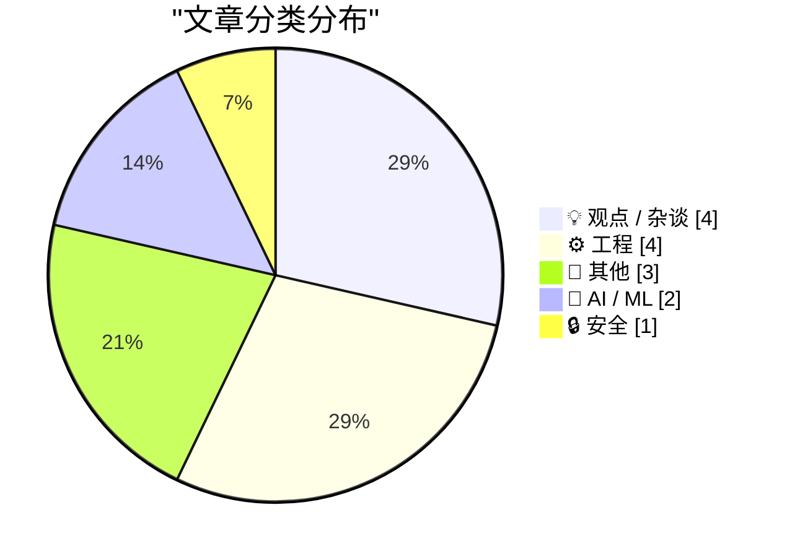
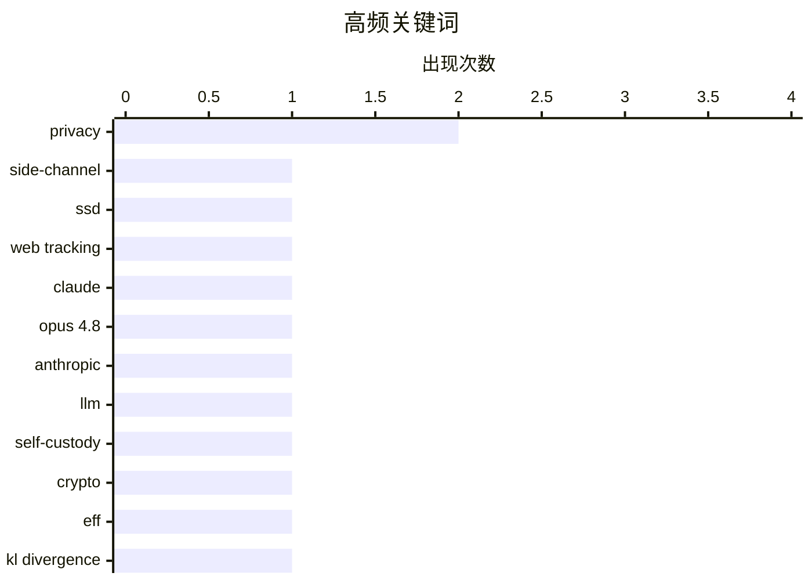

# 📰 AI 博客每日精选 — 2026-05-29

> 来自 Karpathy 推荐的 92 个顶级技术博客，AI 精选 Top 14

## 📝 今日看点

今日技术圈凸显三大动向：隐形追踪手段正突破浏览器防线，利用SSD侧信道推断用户访问行为，同时针对AI编程代理的抗议件也开创了全新的对抗范式。大模型竞争转向更为务实的阶段，Claude Opus 4.8坦诚仅带来小幅改进并押注降本，开发者社区则形成“了解胜过掌握”的认知外包共识。与此同时，权力的天平在两端摇摆——加密货币自我托管将全部责任压在个人肩上，而互联网平台却主动限制选择，用“Costco式”的简化决策重建用户忠诚，折射出技术自主权的深层博弈。

---

## 🏆 今日必读

🥇 **研究人员发布通过分析SSD活动监视网页访客的方法**

[Researchers Publish Method to Surveil Web Page Visitors by Analyzing Their SSD Activity](https://arstechnica.com/security/2026/05/websites-have-a-new-way-to-spy-on-visitors-analyzing-their-ssd-activity/) — daringfireball.net · 9 小时前 · 🔒 安全

> 一种新型网站追踪技术利用侧信道攻击，通过测量SSD的物理表现（如电磁辐射、数据缓存或任务完成时间）来推断用户访问了哪个网页。这种攻击不依赖JavaScript或Cookie，而是基于存储设备在处理网页资源时产生的细微性能差异。攻击者可以借此解密加密流量并获取其他机密数据，因为现代浏览器已从简单文档查看器演变为运行复杂应用的平台。

💡 **为什么值得读**: 揭示了一种完全绕过传统浏览器防护措施的新型用户追踪攻击向量，对Web隐私和安全从业者有直接的警示价值。

🏷️ side-channel, SSD, web tracking, privacy

🥈 **Claude Opus 4.8：一个小而切实的改进**

[Claude Opus 4.8: "a modest but tangible improvement"](https://simonwillison.net/2026/May/28/claude-opus-4-8/#atom-everything) — simonwillison.net · 9 分钟前 · 🤖 AI / ML

> Anthropic发布了最新大语言模型Claude Opus 4.8，其发布说明罕见地坦诚：该模型相比前代只是'一个小而切实的改进'。公司同时承认仍在研发能以更低成本提供类似Opus能力的模型。Simon Willison赞赏AI实验室这种诚实、不过度营销的态度。

💡 **为什么值得读**: 罕见的AI公司自我克制式发布公告，为充斥炒作的大模型领域提供了一个诚实沟通产品能力边界的正面案例。

🏷️ Claude, Opus 4.8, Anthropic, LLM

🥉 **紧要关头：不掌私钥，不控钱包，全由你自己负责**

[Pluralistic: Hold on for dear life (28 May 2026)](https://pluralistic.net/2026/05/28/we-live-in-a-society/) — pluralistic.net · 12 小时前 · 💡 观点 / 杂谈

> 文章围绕加密货币自我托管（self-custody）的核心矛盾展开：'不掌握私钥，就不掌握钱包'的理念将全部责任转嫁给用户。这种'成为自己的银行'的承诺在实际执行中充满风险，一旦出错没有客户支持团队可以求助。作者认为这种系统设计本质上是一种以自由为名、让个人独自承担系统性风险的社会实验。

💡 **为什么值得读**: 从社会契约角度解构加密货币自我托管的阴暗面，超越技术讨论直指其隐含的极端个人主义哲学陷阱。

🏷️ self-custody, crypto, EFF, privacy

---

## 📊 数据概览

| 扫描源 | 抓取文章 | 时间范围 | 精选 |
|:---:|:---:|:---:|:---:|
| 77/92 | 2367 篇 → 14 篇 | 24h | **14 篇** |

### 分类分布



### 高频关键词



<details>
<summary>📈 纯文本关键词图（终端友好）</summary>

```
privacy      │ ████████████████████ 2
side-channel │ ██████████░░░░░░░░░░ 1
ssd          │ ██████████░░░░░░░░░░ 1
web tracking │ ██████████░░░░░░░░░░ 1
claude       │ ██████████░░░░░░░░░░ 1
opus 4.8     │ ██████████░░░░░░░░░░ 1
anthropic    │ ██████████░░░░░░░░░░ 1
llm          │ ██████████░░░░░░░░░░ 1
self-custody │ ██████████░░░░░░░░░░ 1
crypto       │ ██████████░░░░░░░░░░ 1
```

</details>

### 🏷️ 话题标签

**privacy**(2) · **side-channel**(1) · **ssd**(1) · web tracking(1) · claude(1) · opus 4.8(1) · anthropic(1) · llm(1) · self-custody(1) · crypto(1) · eff(1) · kl divergence(1) · metric(1) · information theory(1) · statistics(1) · math(1) · programming(1) · knowledge(1) · protestware(1) · coding agents(1)

---

## 💡 观点 / 杂谈

### 1. 紧要关头：不掌私钥，不控钱包，全由你自己负责

[Pluralistic: Hold on for dear life (28 May 2026)](https://pluralistic.net/2026/05/28/we-live-in-a-society/) — **pluralistic.net** · 12 小时前 · ⭐ 24/30

> 文章围绕加密货币自我托管（self-custody）的核心矛盾展开：'不掌握私钥，就不掌握钱包'的理念将全部责任转嫁给用户。这种'成为自己的银行'的承诺在实际执行中充满风险，一旦出错没有客户支持团队可以求助。作者认为这种系统设计本质上是一种以自由为名、让个人独自承担系统性风险的社会实验。

🏷️ self-custody, crypto, EFF, privacy

---

### 2. 了解事物比掌握事物更便宜

[Knowing about things is cheaper than knowing things](https://buttondown.com/hillelwayne/archive/knowing-about-things-is-cheaper-than-knowing/) — **buttondown.com/hillelwayne** · 8 小时前 · ⭐ 22/30

> 核心观点区分了'了解某事物'（知道其存在、名称和大致用途）与'掌握某事物'（能熟练运用）在认知成本上的巨大差异。对于程序员而言，知道'存在一个能解决当前问题的算法或库'比真正掌握其原理要容易得多。这种'关于知识的知识'是一种极高性价比的认知策略，能引导你在需要时进行精准的深度学习。

🏷️ math, programming, knowledge

---

### 3. 针对编程代理的抗议件

[Protestware for coding agents](https://nesbitt.io/2026/05/28/protestware-for-coding-agents.html) — **nesbitt.io** · 9 小时前 · ⭐ 21/30

> 抗议件（protestware）不再针对人类开发者，而是针对AI编程代理。当代码被AI代理读取或执行时，会触发隐藏在注释或配置文件中的预设信息，向AI模型传递政治声明或个人诉求。这种方式利用了AI缺乏人类常识、会盲目消化所有文本素材的特点，构成一种新型的数字抗议形式。

🏷️ protestware, coding agents, AI, open source

---

### 4. 互联网的Costco理论

[The Costco theory of the internet](https://www.joanwestenberg.com/the-costco-theory-of-the-internet/) — **joanwestenberg.com** · 22 小时前 · ⭐ 19/30

> 基于Sol Price在FedMart推行的'智能损失销售'理论——只售大罐WD-40、拒绝提供小罐选择，文章将其映射到现代互联网生态。核心观点是：最成功的互联网平台通过限制选择、简化决策，故意造成部分用户的'智能损失'，以换取整体效率的提升和对广大用户的极致便利。

🏷️ Costco, internet, business model, FedMart

---

## ⚙️ 工程

### 5. 在多个协程间共享单个Windows Runtime IAsyncOperation结果（第二部分）

[Sharing the result of a single Windows Runtime IAsyncOperation among multiple coroutines, part 2](https://devblogs.microsoft.com/oldnewthing/20260528-00/?p=112365) — **devblogs.microsoft.com/oldnewthing** · 10 小时前 · ⭐ 20/30

> Raymond Chen探讨了多个协程如何安全共享同一个Windows Runtime异步操作（IAsyncOperation）的结果。上一部分尝试中的方案存在竞态条件，本部分给出改进方案：让每个协程轮流尝试获取结果，利用协程的可恢复特性避免阻塞，确保只有第一个完成的协程负责处理缓存逻辑。

🏷️ WinRT, coroutines, IAsyncOperation, C++

---

### 6. 在3D打印机热床上收听FM广播

[Tuning in FM Radio on a 3D Printer Heatbed](https://www.jeffgeerling.com/blog/2026/tuning-in-fm-radio-on-a-3d-printer-heatbed/) — **jeffgeerling.com** · 10 小时前 · ⭐ 19/30

> 博主Jeff Geerling受朋友启发，尝试将Prusa Core One 3D打印机的PCB热床用作FM收音机天线。实验发现热床上的走线确实能捕获射频信号，配合SDR设备成功调谐到一个当地FM电台，但信号质量很差。这验证了热床无意中具备天线特性，但不具备实用收听价值，也暗示热床可能接收或辐射电磁干扰。

🏷️ 3D printer, FM radio, heatbed, antenna

---

### 7. Notes on Fourier series

[Notes on Fourier series](https://eli.thegreenplace.net/2026/notes-on-fourier-series/) — **eli.thegreenplace.net** · 21 小时前 · ⭐ 19/30

> <link rel="stylesheet" href="https://eli.thegreenplace.net/demos/fourier/fourier-plot.css"><p>The trigonometric Fourier series is a beautiful mathematical theory that
shows how to decompose a periodic

🏷️ Fourier series, mathematics, signal processing

---

### 8. Package managers that package package managers

[Package managers that package package managers](https://nesbitt.io/2026/05/28/package-managers-that-package-package-managers.html) — **nesbitt.io** · 14 小时前 · ⭐ 18/30

> brew install pip install poetry add pdm add uv tool install conda

🏷️ package managers, dependency, brew, pip

---

## 📝 其他

### 9. 苹果使用iPhone 17 Pro拍摄的洛杉矶对休斯顿MLS比赛画面

[Footage From the LA-Houston MLS Match That Apple Shot Using iPhone 17 Pro Cameras](https://tv.apple.com/us/sporting-event/mls-wrap-up/umc.cse.3a198p24hrehwhonbhgx2zvhv) — **daringfireball.net** · 7 小时前 · ⭐ 20/30

> 苹果在洛杉矶银河对阵休斯顿迪纳摩的MLS比赛中，完全使用iPhone 17 Pro配合专业镜头转接环完成赛事拍摄。实际比赛画面质量不错，但明显不如常规广播级摄像机，动态范围和景深控制仍有差距。这展示了手机计算摄影在苛刻专业场景下的潜力与当前边界。

🏷️ iPhone 17 Pro, MLS, camera, Apple

---

### 10. Where Are the Economies of Scale in Homebuilding?

[Where Are the Economies of Scale in Homebuilding?](https://www.construction-physics.com/p/where-are-the-economies-of-scale) — **construction-physics.com** · 12 小时前 · ⭐ 13/30

> Over the last few months we’ve examined the extent of the construction industry’s productivity problem.

🏷️ construction, productivity, economies-of-scale

---

### 11. Every Enemy Wears Your Face

[Every Enemy Wears Your Face](https://simone.org/projection/) — **simone.org** · 11 小时前 · ⭐ 10/30

> The enemy in your head is usually wearing your face. On projection, the villains we invent, and the chair we can't see ourselves sitting in.

🏷️ psychology, projection, self-awareness

---

## 🤖 AI / ML

### 12. Claude Opus 4.8：一个小而切实的改进

[Claude Opus 4.8: "a modest but tangible improvement"](https://simonwillison.net/2026/May/28/claude-opus-4-8/#atom-everything) — **simonwillison.net** · 9 分钟前 · ⭐ 25/30

> Anthropic发布了最新大语言模型Claude Opus 4.8，其发布说明罕见地坦诚：该模型相比前代只是'一个小而切实的改进'。公司同时承认仍在研发能以更低成本提供类似Opus能力的模型。Simon Willison赞赏AI实验室这种诚实、不过度营销的态度。

🏷️ Claude, Opus 4.8, Anthropic, LLM

---

### 13. 将K-L散度转化为真正的度量

[Turning K-L divergence into a metric](https://www.johndcook.com/blog/2026/05/27/jensen-shannon/) — **johndcook.com** · 22 小时前 · ⭐ 22/30

> Kullback-Leibler散度能测量两个随机变量分布的差异，但它不具备对称性，不是真正的距离度量。Jeffreys散度通过取KL(P||Q)与KL(Q||P)之和解决了对称性问题，但仍不满足三角不等式。Jensen-Shannon散度作为Jeffreys散度的平滑版本，最终将KL散度转化为一个真正的度量，满足所有距离公理。

🏷️ KL divergence, metric, information theory, statistics

---

## 🔒 安全

### 14. 研究人员发布通过分析SSD活动监视网页访客的方法

[Researchers Publish Method to Surveil Web Page Visitors by Analyzing Their SSD Activity](https://arstechnica.com/security/2026/05/websites-have-a-new-way-to-spy-on-visitors-analyzing-their-ssd-activity/) — **daringfireball.net** · 9 小时前 · ⭐ 26/30

> 一种新型网站追踪技术利用侧信道攻击，通过测量SSD的物理表现（如电磁辐射、数据缓存或任务完成时间）来推断用户访问了哪个网页。这种攻击不依赖JavaScript或Cookie，而是基于存储设备在处理网页资源时产生的细微性能差异。攻击者可以借此解密加密流量并获取其他机密数据，因为现代浏览器已从简单文档查看器演变为运行复杂应用的平台。

🏷️ side-channel, SSD, web tracking, privacy

---

*生成于 2026-05-29 00:09 | 扫描 77 源 → 获取 2367 篇 → 精选 14 篇*
*基于 [Hacker News Popularity Contest 2025](https://refactoringenglish.com/tools/hn-popularity/) RSS 源列表，由 [Andrej Karpathy](https://x.com/karpathy) 推荐*
*由「懂点儿AI」制作，欢迎关注同名微信公众号获取更多 AI 实用技巧 💡*
