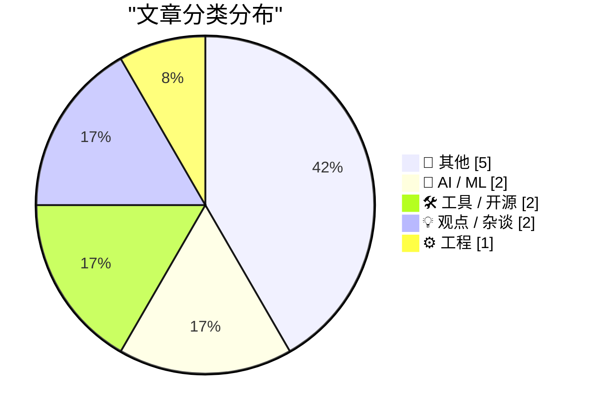
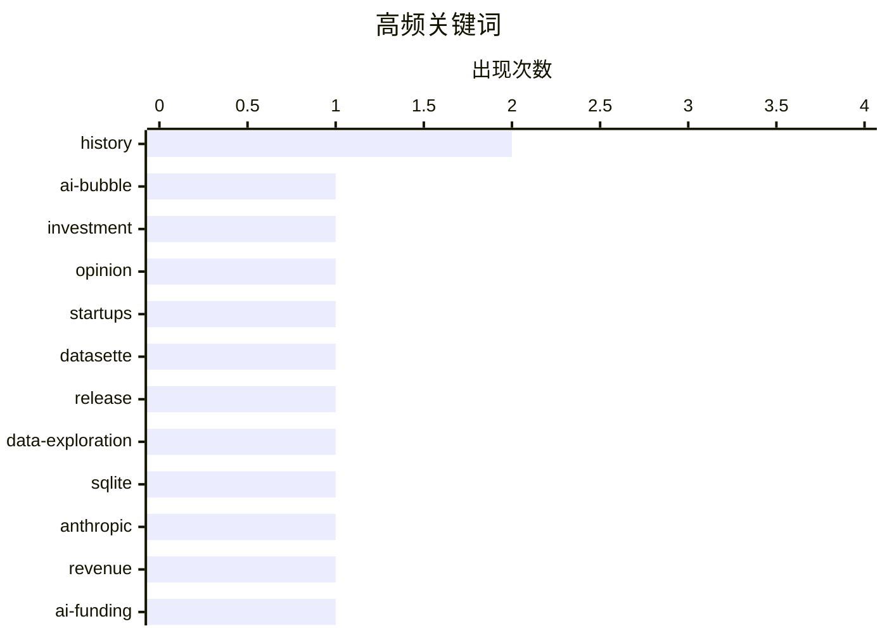

# 📰 AI 博客每日精选 — 2026-05-30

> 来自 Karpathy 推荐的 92 个顶级技术博客，AI 精选 Top 12

## 📝 今日看点

今日技术圈聚焦于 AI 狂热与质疑的拉锯战：一边是 Anthropic 年化收入飙升至 470 亿美元，另一边关于“我们是否身处 AI 泡沫”的深度讨论仍在继续。开发者工具侧稳中求变，Datasette 发布 1.0a31，Composer 依赖策略引发关注，而在线算法文章则回归工程基础。此外，从 CRT 无像素原理到 DR DOS 历史，技术怀旧与底层思考同样构成今日的独特风景。

---

## 🏆 今日必读

🥇 **Premium: What If...We're In An AI Bubble? (Part 3)**

[Premium: What If...We're In An AI Bubble? (Part 3)](https://www.wheresyoured.at/premium-what-if-were-in-an-ai-bubble-part-3/) — wheresyoured.at · 8 小时前 · 🤖 AI / ML

> Premium: What If...We're In An AI Bubble? (Part 3)

🏷️ AI-bubble, investment, opinion, startups

🥈 **datasette 1.0a31**

[datasette 1.0a31](https://simonwillison.net/2026/May/29/datasette/#atom-everything) — simonwillison.net · 21 小时前 · 🛠 工具 / 开源

> datasette 1.0a31

🏷️ datasette, release, data-exploration, sqlite

🥉 **Anthropic's run-rate revenue hits $47 billion**

[Anthropic's run-rate revenue hits $47 billion](https://simonwillison.net/2026/May/29/anthropic/#atom-everything) — simonwillison.net · 23 小时前 · 🤖 AI / ML

> Anthropic's run-rate revenue hits $47 billion

🏷️ Anthropic, revenue, AI-funding, LLM

---

## 📊 数据概览

| 扫描源 | 抓取文章 | 时间范围 | 精选 |
|:---:|:---:|:---:|:---:|
| 76/92 | 2338 篇 → 12 篇 | 24h | **12 篇** |

### 分类分布



### 高频关键词



<details>
<summary>📈 纯文本关键词图（终端友好）</summary>

```
history          │ ████████████████████ 2
ai-bubble        │ ██████████░░░░░░░░░░ 1
investment       │ ██████████░░░░░░░░░░ 1
opinion          │ ██████████░░░░░░░░░░ 1
startups         │ ██████████░░░░░░░░░░ 1
datasette        │ ██████████░░░░░░░░░░ 1
release          │ ██████████░░░░░░░░░░ 1
data-exploration │ ██████████░░░░░░░░░░ 1
sqlite           │ ██████████░░░░░░░░░░ 1
anthropic        │ ██████████░░░░░░░░░░ 1
```

</details>

### 🏷️ 话题标签

**history**(2) · **ai-bubble**(1) · **investment**(1) · opinion(1) · startups(1) · datasette(1) · release(1) · data-exploration(1) · sqlite(1) · anthropic(1) · revenue(1) · ai-funding(1) · llm(1) · online-algorithm(1) · streaming(1) · variance(1) · one-pass(1) · composer(1) · dependency-management(1) · php(1)

---

## 📝 其他

### 1. Why people say CRTs don’t have pixels

[Why people say CRTs don’t have pixels](https://dfarq.homeip.net/why-people-say-crts-dont-have-pixels/?utm_source=rss&#038;utm_medium=rss&#038;utm_campaign=why-people-say-crts-dont-have-pixels) — **dfarq.homeip.net** · 14 小时前 · ⭐ 16/30

> Why people say CRTs don’t have pixels

🏷️ CRT, pixels, display, retro

---

### 2. DR DOS: Revenge of CP/M

[DR DOS: Revenge of CP/M](https://dfarq.homeip.net/dr-dos-revenge-of-cp-m/?utm_source=rss&#038;utm_medium=rss&#038;utm_campaign=dr-dos-revenge-of-cp-m) — **dfarq.homeip.net** · 14 小时前 · ⭐ 16/30

> DR DOS: Revenge of CP/M

🏷️ DR-DOS, CP/M, MS-DOS, history

---

### 3. The UK Government's Low Value Purchase System is a Waste of Time

[The UK Government's Low Value Purchase System is a Waste of Time](https://shkspr.mobi/blog/2026/05/the-uk-governments-low-value-purchase-system-is-a-waste-of-time/) — **shkspr.mobi** · 13 小时前 · ⭐ 13/30

> The UK Government's Low Value Purchase System is a Waste of Time

🏷️ government-procurement, small-business, bureaucracy, UK

---

### 4. 模拟古物爱好者本周更新：青年吟游诗人画像

[This Week on The Analog Antiquarian](https://www.filfre.net/2026/05/this-week-on-the-analog-antiquarian/) — **filfre.net** · 8 小时前 · ⭐ 12/30

> 本期《模拟古物爱好者》聚焦于“吟游诗人”的早期生平，讲述一位在文字冒险游戏黄金时代崭露头角的年轻创作者的故事。文章追溯了他从童年初次接触计算机到创作首部互动小说的历程，并穿插大量未曾公开的私人笔记与早期设计文档。通过还原20世纪80年代家用电脑简陋的开发环境，揭示诗意文字与简陋图形之间碰撞出的独特美学。作者认为，这段被遗忘的个人史是理解早期游戏文学野心的关键切片。

🏷️ literature, Shakespeare, history

---

### 5. 有一群人，显然已经疯了

[One Group, Clearly, Is Deranged](https://paulkrugman.substack.com/p/whos-deranged-exactly) — **daringfireball.net** · 8 小时前 · ⭐ 11/30

> 保罗·克鲁格曼引用YouGov的细分调查数据，揭示美国人对经济状况的认知已高度党派化。数据显示，非MAGA共和党人中65%认为经济在恶化，仅11%认为在改善，而MAGA共和党人的看法则完全相反。在数据可视化图表中，除MAGA支持者外，绝大多数美国人聚集在“经济变差”一侧，形成两个感知世界。作者指出，这种与客观经济指标脱节的分裂，表明一方已陷入系统的认知扭曲。

🏷️ politics, economy, surveys, partisanship

---

## 🤖 AI / ML

### 6. Premium: What If...We're In An AI Bubble? (Part 3)

[Premium: What If...We're In An AI Bubble? (Part 3)](https://www.wheresyoured.at/premium-what-if-were-in-an-ai-bubble-part-3/) — **wheresyoured.at** · 8 小时前 · ⭐ 25/30

> Premium: What If...We're In An AI Bubble? (Part 3)

🏷️ AI-bubble, investment, opinion, startups

---

### 7. Anthropic's run-rate revenue hits $47 billion

[Anthropic's run-rate revenue hits $47 billion](https://simonwillison.net/2026/May/29/anthropic/#atom-everything) — **simonwillison.net** · 23 小时前 · ⭐ 22/30

> Anthropic's run-rate revenue hits $47 billion

🏷️ Anthropic, revenue, AI-funding, LLM

---

## 🛠 工具 / 开源

### 8. datasette 1.0a31

[datasette 1.0a31](https://simonwillison.net/2026/May/29/datasette/#atom-everything) — **simonwillison.net** · 21 小时前 · ⭐ 22/30

> datasette 1.0a31

🏷️ datasette, release, data-exploration, sqlite

---

### 9. Composer’s dependency policies

[Composer’s dependency policies](https://nesbitt.io/2026/05/29/composer-dependency-policies.html) — **nesbitt.io** · 15 小时前 · ⭐ 18/30

> Composer’s dependency policies

🏷️ composer, dependency-management, PHP, filtering

---

## 💡 观点 / 杂谈

### 10. It's hard to justify buying a Framework 12

[It's hard to justify buying a Framework 12](https://www.jeffgeerling.com/blog/2026/its-hard-to-justify-framework-12/) — **jeffgeerling.com** · 11 小时前 · ⭐ 17/30

> It's hard to justify buying a Framework 12

🏷️ Framework, laptop, value, hardware

---

### 11. ★ What Is a Dickover?

[★ What Is a Dickover?](https://daringfireball.net/2026/05/what_is_a_dickover) — **daringfireball.net** · 4 小时前 · ⭐ 17/30

> ★ What Is a Dickover?

🏷️ UX, dark-patterns, popups, web-design

---

## ⚙️ 工程

### 12. Online (one-pass) algorithms

[Online (one-pass) algorithms](https://www.johndcook.com/blog/2026/05/29/online-one-pass-algorithms/) — **johndcook.com** · 12 小时前 · ⭐ 19/30

> Online (one-pass) algorithms

🏷️ online-algorithm, streaming, variance, one-pass

---

*生成于 2026-05-30 01:07 | 扫描 76 源 → 获取 2338 篇 → 精选 12 篇*
*基于 [Hacker News Popularity Contest 2025](https://refactoringenglish.com/tools/hn-popularity/) RSS 源列表，由 [Andrej Karpathy](https://x.com/karpathy) 推荐*
*由「懂点儿AI」制作，欢迎关注同名微信公众号获取更多 AI 实用技巧 💡*
