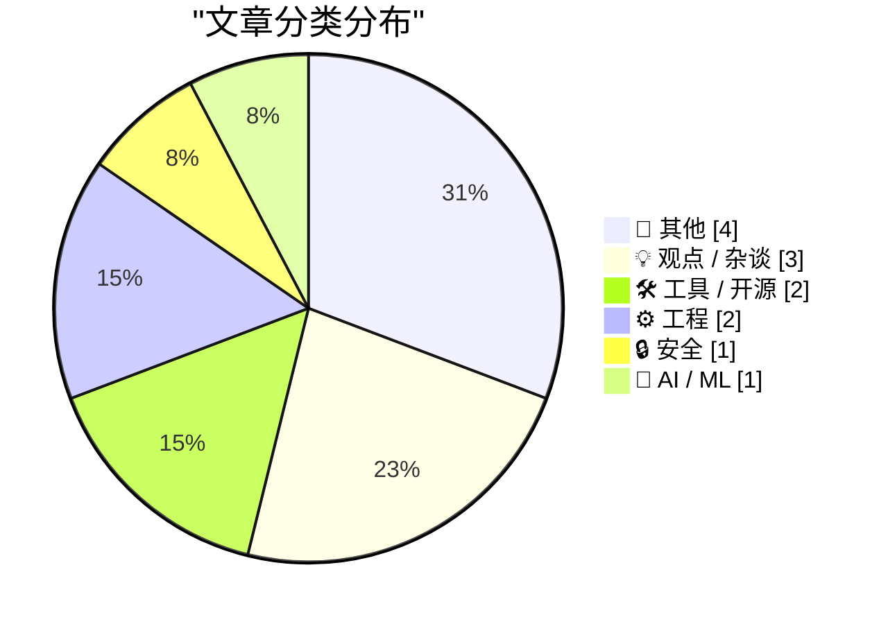
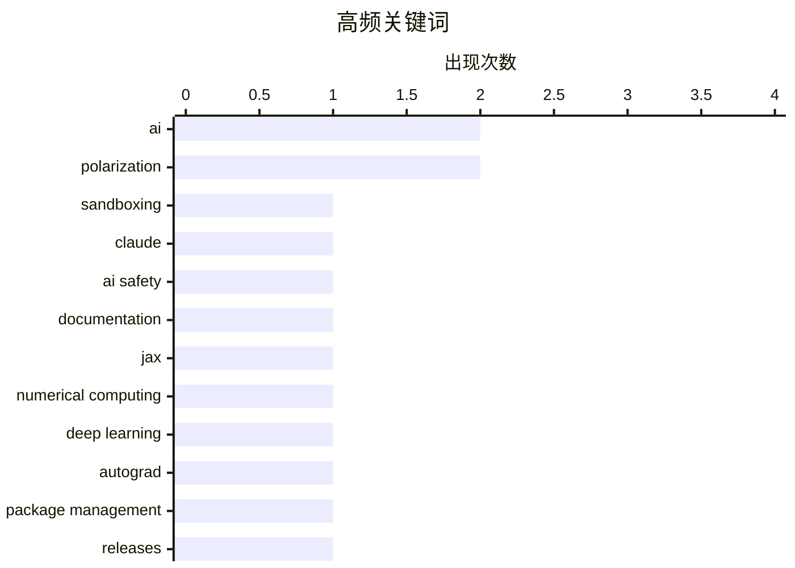

# 📰 AI 博客每日精选 — 2026-05-31

> 来自 Karpathy 推荐的 92 个顶级技术博客，AI 精选 Top 13

## 📝 今日看点

今日技术圈聚焦 AI 安全与深度学习框架的双重演进：Anthropic 揭示了跨产品约束 Claude 的安全机制，同时 JAX 框架的探索再度升温。WebAssembly 边界持续外扩，通过 Pyodide 与 Service Worker 在浏览器端运行 Python ASGI 应用，让客户端算力释放出新的可能。底层工程与人文反思同样形成张力，8087 芯片微码的逆向解读和对多项式恒等式的概率检验展现经典功力，而 Meta 推动社交订阅的变现步伐与“退休离线”的个人宣言，共同折射出技术狂飙下的集体疲惫。

---

## 🏆 今日必读

🥇 **How we contain Claude across products**

[How we contain Claude across products](https://simonwillison.net/2026/May/30/how-we-contain-claude/#atom-everything) — simonwillison.net · 3 小时前 · 🔒 安全

> How we contain Claude across products

🏷️ sandboxing, Claude, AI safety, documentation

🥈 **On first looking into JAX**

[On first looking into JAX](https://www.gilesthomas.com/2026/05/on-first-looking-into-jax) — gilesthomas.com · 6 小时前 · 🤖 AI / ML

> On first looking into JAX

🏷️ JAX, numerical computing, deep learning, autograd

🥉 **This Week in Package Management: 30 May 2026**

[This Week in Package Management: 30 May 2026](https://nesbitt.io/2026/05/30/this-week-in-package-management.html) — nesbitt.io · 14 小时前 · 🛠 工具 / 开源

> This Week in Package Management: 30 May 2026

🏷️ package management, releases, advisories, dependency

---

## 📊 数据概览

| 扫描源 | 抓取文章 | 时间范围 | 精选 |
|:---:|:---:|:---:|:---:|
| 76/92 | 2338 篇 → 13 篇 | 24h | **13 篇** |

### 分类分布



### 高频关键词



<details>
<summary>📈 纯文本关键词图（终端友好）</summary>

```
ai                  │ ████████████████████ 2
polarization        │ ████████████████████ 2
sandboxing          │ ██████████░░░░░░░░░░ 1
claude              │ ██████████░░░░░░░░░░ 1
ai safety           │ ██████████░░░░░░░░░░ 1
documentation       │ ██████████░░░░░░░░░░ 1
jax                 │ ██████████░░░░░░░░░░ 1
numerical computing │ ██████████░░░░░░░░░░ 1
deep learning       │ ██████████░░░░░░░░░░ 1
autograd            │ ██████████░░░░░░░░░░ 1
```

</details>

### 🏷️ 话题标签

**ai**(2) · **polarization**(2) · **sandboxing**(1) · claude(1) · ai safety(1) · documentation(1) · jax(1) · numerical computing(1) · deep learning(1) · autograd(1) · package management(1) · releases(1) · advisories(1) · dependency(1) · pyodide(1) · asgi(1) · service worker(1) · browser(1) · 8087(1) · floating-point(1)

---

## 📝 其他

### 1. Meta Is Launching Instagram, Facebook, and WhatsApp Subscriptions for ‘Fun Features’

[Meta Is Launching Instagram, Facebook, and WhatsApp Subscriptions for ‘Fun Features’](https://techcrunch.com/2026/05/27/meta-officially-launches-instagram-facebook-and-whatsapp-subscriptions-with-more-to-come-including-ai-plans/) — **daringfireball.net** · 9 小时前 · ⭐ 17/30

> Meta Is Launching Instagram, Facebook, and WhatsApp Subscriptions for ‘Fun Features’

🏷️ Meta, subscriptions, Instagram, Facebook

---

### 2. Reading List 05/30/26

[Reading List 05/30/26](https://www.construction-physics.com/p/reading-list-053026) — **construction-physics.com** · 12 小时前 · ⭐ 17/30

> Reading List 05/30/26

🏷️ nuclear startups, robot training data, Blue Origin, chemical leak

---

### 3. Pluralistic: Carneyism without Carney (30 May 2026)

[Pluralistic: Carneyism without Carney (30 May 2026)](https://pluralistic.net/2026/05/30/rupture/) — **pluralistic.net** · 15 小时前 · ⭐ 16/30

> Pluralistic: Carneyism without Carney (30 May 2026)

🏷️ politics, economics, policy

---

### 4. Yours Truly on TBPN Yesterday

[Yours Truly on TBPN Yesterday](https://www.youtube.com/live/sQVwLUxFdMY?t=1997) — **daringfireball.net** · 12 小时前 · ⭐ 6/30

> Yours Truly on TBPN Yesterday

🏷️ podcast, interview

---

## 💡 观点 / 杂谈

### 5. I Am Retiring from Tech to Live Offline

[I Am Retiring from Tech to Live Offline](https://simonwillison.net/2026/May/30/retiring-from-tech-to-live-offline/#atom-everything) — **simonwillison.net** · 5 小时前 · ⭐ 10/30

> I Am Retiring from Tech to Live Offline

🏷️ career change, digital detox, tech industry

---

### 6. Quoting Daniel Jalkut

[Quoting Daniel Jalkut](https://simonwillison.net/2026/May/30/daniel-jalkut/#atom-everything) — **simonwillison.net** · 7 小时前 · ⭐ 10/30

> Quoting Daniel Jalkut

🏷️ AI, polarization, opinion

---

### 7. Daniel Jalkut on AI

[Daniel Jalkut on AI](https://mastodon.social/@danielpunkass/116639318125898071) — **daringfireball.net** · 9 小时前 · ⭐ 10/30

> Daniel Jalkut on AI

🏷️ AI, polarization, social media

---

## 🛠 工具 / 开源

### 8. This Week in Package Management: 30 May 2026

[This Week in Package Management: 30 May 2026](https://nesbitt.io/2026/05/30/this-week-in-package-management.html) — **nesbitt.io** · 14 小时前 · ⭐ 21/30

> This Week in Package Management: 30 May 2026

🏷️ package management, releases, advisories, dependency

---

### 9. Running Python ASGI apps in the browser via Pyodide + a service worker

[Running Python ASGI apps in the browser via Pyodide + a service worker](https://simonwillison.net/2026/May/30/pyodide-asgi-browser/#atom-everything) — **simonwillison.net** · 3 小时前 · ⭐ 20/30

> Running Python ASGI apps in the browser via Pyodide + a service worker

🏷️ Pyodide, ASGI, service worker, browser

---

## ⚙️ 工程

### 10. Microcode inside the Intel 8087 floating-point chip: register exchange

[Microcode inside the Intel 8087 floating-point chip: register exchange](http://www.righto.com/feeds/5917097192784199241/comments/default) — **righto.com** · 7 小时前 · ⭐ 20/30

> Microcode inside the Intel 8087 floating-point chip: register exchange

🏷️ 8087, floating-point, microcode, x86

---

### 11. Spot checking polynomial identities

[Spot checking polynomial identities](https://www.johndcook.com/blog/2026/05/30/schwartz-zippel/) — **johndcook.com** · 3 小时前 · ⭐ 18/30

> Spot checking polynomial identities

🏷️ polynomial identity, randomized test, algorithm, finite field

---

## 🔒 安全

### 12. How we contain Claude across products

[How we contain Claude across products](https://simonwillison.net/2026/May/30/how-we-contain-claude/#atom-everything) — **simonwillison.net** · 3 小时前 · ⭐ 26/30

> How we contain Claude across products

🏷️ sandboxing, Claude, AI safety, documentation

---

## 🤖 AI / ML

### 13. On first looking into JAX

[On first looking into JAX](https://www.gilesthomas.com/2026/05/on-first-looking-into-jax) — **gilesthomas.com** · 6 小时前 · ⭐ 21/30

> On first looking into JAX

🏷️ JAX, numerical computing, deep learning, autograd

---

*生成于 2026-05-31 00:47 | 扫描 76 源 → 获取 2338 篇 → 精选 13 篇*
*基于 [Hacker News Popularity Contest 2025](https://refactoringenglish.com/tools/hn-popularity/) RSS 源列表，由 [Andrej Karpathy](https://x.com/karpathy) 推荐*
*由「懂点儿AI」制作，欢迎关注同名微信公众号获取更多 AI 实用技巧 💡*
