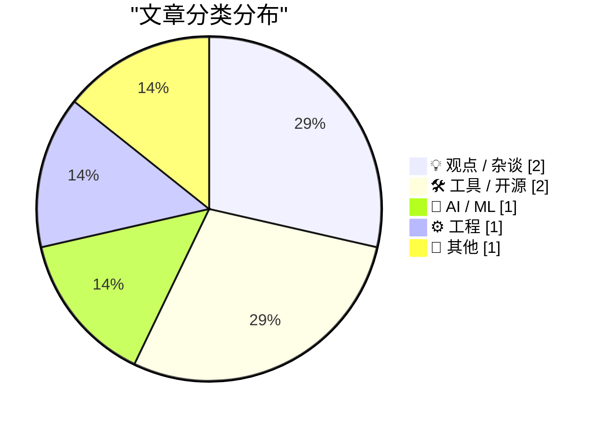
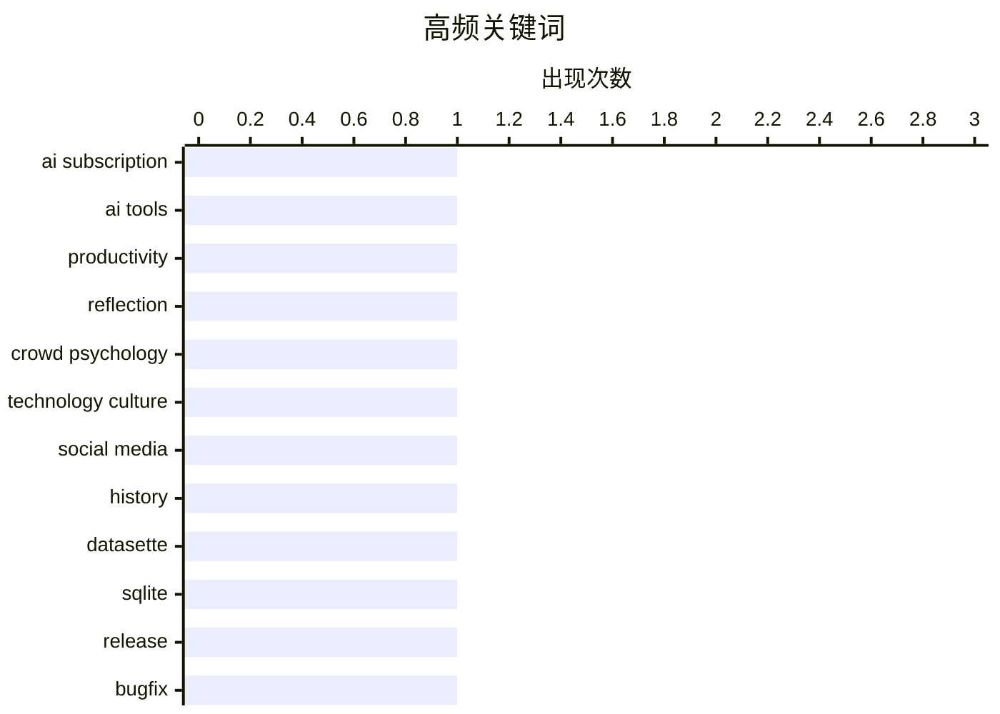

# 📰 AI 博客每日精选 — 2026-06-01

> 来自 Karpathy 推荐的 92 个顶级技术博客，AI 精选 Top 7

## 📝 今日看点

今日技术圈最显著的主题是 AI 过度渗透引发的广泛疲惫与反思。开发者发现 AI 辅助编程让“快速脚本”轻易膨胀成负担，普通用户则因谷歌强制推送 AI 摘要而大量转向纯净搜索结果，甚至考虑彻底抛弃传统搜索引擎。与此同时，Anthropic 年化收入算法的拆解，也让人质疑 AI 商业化背后的包装逻辑。在这股喧嚣之外，回归基础工具的务实更新和用数学技巧简化问题的尝试，提供了一种难得的冷静。

---

## 🏆 今日必读

🥇 **答案或许是取消我的AI订阅**

[The solution might be cancelling my AI subscription](https://simonwillison.net/2026/May/31/the-solution-might-be-cancelling-my-ai-subscription/#atom-everything) — simonwillison.net · 7 小时前 · 💡 观点 / 杂谈

> David Wilson 用 AI 工具构建了 16 个以上项目后，发现这些项目几乎都始于“为 X 写个快速脚本”，但一小时后结果既不是快速脚本，也不是通常的临时方案，而是过度膨胀的产物。AI 辅助编程让开发者轻易地超出原始需求，产出远大于意图的代码库。文章以此反思 AI 工具带来的生产力幻觉，并戏称解决方案可能是直接取消 AI 订阅。

💡 **为什么值得读**: 真实记录 AI 辅助开发中“需求蔓延”的典型经历，对任何用 AI 写代码的人都是清醒的警示。

🏷️ AI subscription, AI tools, productivity, reflection

🥈 **勿被洗脑**

[Be thou not pilled](https://www.joanwestenberg.com/be-thou-not-pilled/) — joanwestenberg.com · 46 分钟前 · 💡 观点 / 杂谈

> 回溯苏格兰记者 Charles Mackay 1841 年著作《非同寻常的大众妄想与群体疯狂》，书中记载了郁金香投机、炼金术、南海泡沫、猎巫等群体失去理智的历史案例，揭示人们如何因过度执着某个理念而陷入集体疯狂。文章借古讽今，提醒读者在科技和投资热潮中保持清醒，不要成为“被同一种观念药丸”的人。

💡 **为什么值得读**: 用金融史经典提醒当下被 AI 叙事笼罩的人群，是抵抗狂热、独立思考的一篇冷静杂文。

🏷️ crowd psychology, technology culture, social media, history

🥉 **datasette 1.0a32**

[datasette 1.0a32](https://simonwillison.net/2026/May/31/datasette/#atom-everything) — simonwillison.net · 44 分钟前 · 🛠 工具 / 开源

> Datasette 1.0a32 是一个小修复版本。该版本修复了通过新 /db/-/execute-write 端点执行 INSERT ... RETURNING 查询时的错误，一并解决了与 base_url 设置相关的一系列问题，这些 base_url 问题在作者将 Datasette 部署到多层级路径时暴露出来。

💡 **为什么值得读**: 对于依赖 Datasette 写入 API 和自定义部署的用户，此版本修复了关键端点和 base_url 处理错误，建议升级。

🏷️ datasette, SQLite, release, bugfix

---

## 📊 数据概览

| 扫描源 | 抓取文章 | 时间范围 | 精选 |
|:---:|:---:|:---:|:---:|
| 77/92 | 2369 篇 → 7 篇 | 24h | **7 篇** |

### 分类分布



### 高频关键词



<details>
<summary>📈 纯文本关键词图（终端友好）</summary>

```
ai subscription    │ ████████████████████ 1
ai tools           │ ████████████████████ 1
productivity       │ ████████████████████ 1
reflection         │ ████████████████████ 1
crowd psychology   │ ████████████████████ 1
technology culture │ ████████████████████ 1
social media       │ ████████████████████ 1
history            │ ████████████████████ 1
datasette          │ ████████████████████ 1
sqlite             │ ████████████████████ 1
```

</details>

### 🏷️ 话题标签

**ai subscription**(1) · **ai tools**(1) · **productivity**(1) · reflection(1) · crowd psychology(1) · technology culture(1) · social media(1) · history(1) · datasette(1) · sqlite(1) · release(1) · bugfix(1) · anthropic(1) · revenue(1) · ai business(1) · run-rate(1) · google search(1) · udm(1) · ad-free(1) · search tips(1)

---

## 💡 观点 / 杂谈

### 1. 答案或许是取消我的AI订阅

[The solution might be cancelling my AI subscription](https://simonwillison.net/2026/May/31/the-solution-might-be-cancelling-my-ai-subscription/#atom-everything) — **simonwillison.net** · 7 小时前 · ⭐ 24/30

> David Wilson 用 AI 工具构建了 16 个以上项目后，发现这些项目几乎都始于“为 X 写个快速脚本”，但一小时后结果既不是快速脚本，也不是通常的临时方案，而是过度膨胀的产物。AI 辅助编程让开发者轻易地超出原始需求，产出远大于意图的代码库。文章以此反思 AI 工具带来的生产力幻觉，并戏称解决方案可能是直接取消 AI 订阅。

🏷️ AI subscription, AI tools, productivity, reflection

---

### 2. 勿被洗脑

[Be thou not pilled](https://www.joanwestenberg.com/be-thou-not-pilled/) — **joanwestenberg.com** · 46 分钟前 · ⭐ 22/30

> 回溯苏格兰记者 Charles Mackay 1841 年著作《非同寻常的大众妄想与群体疯狂》，书中记载了郁金香投机、炼金术、南海泡沫、猎巫等群体失去理智的历史案例，揭示人们如何因过度执着某个理念而陷入集体疯狂。文章借古讽今，提醒读者在科技和投资热潮中保持清醒，不要成为“被同一种观念药丸”的人。

🏷️ crowd psychology, technology culture, social media, history

---

## 🛠 工具 / 开源

### 3. datasette 1.0a32

[datasette 1.0a32](https://simonwillison.net/2026/May/31/datasette/#atom-everything) — **simonwillison.net** · 44 分钟前 · ⭐ 19/30

> Datasette 1.0a32 是一个小修复版本。该版本修复了通过新 /db/-/execute-write 端点执行 INSERT ... RETURNING 查询时的错误，一并解决了与 base_url 设置相关的一系列问题，这些 base_url 问题在作者将 Datasette 部署到多层级路径时暴露出来。

🏷️ datasette, SQLite, release, bugfix

---

### 4. 一个又一个&udm=14

[One &udm After Another](https://feed.tedium.co/link/15204/17351430/google-ai-udm14-reflection) — **tedium.co** · 23 小时前 · ⭐ 18/30

> 谷歌搜索的 AI 增强功能再次激发用户愤怒，新一批人刚刚学会了使用 &udm=14 参数来获得无 AI 摘要的纯搜索结果页面。文章指出，这种反复出现的抵触情绪和行为，暗示用户或许应该认真考虑彻底放弃谷歌搜索，而不是一次次通过参数补丁来绕过其产品决策。

🏷️ Google search, udm, ad-free, search tips

---

## 🤖 AI / ML

### 5. 引述路透Breakingviews对Anthropic年化收入算法的解析

[Quoting Karen Kwok for Reuters Breakingviews](https://simonwillison.net/2026/May/31/anthropic-run-rate/#atom-everything) — **simonwillison.net** · 22 小时前 · ⭐ 19/30

> Karen Kwok 在 Reuters Breakingviews 中拆解 Anthropic 的“run-rate revenue”定义：取过去 28 天按消费量计费的销售额乘以 13，再加上月度订阅收入乘以 12，两数相加得出年化收入。这种算法将短期消费数据简单线性外推，可能人为夸大收入预期，被评论指为“收入幻觉”。

🏷️ Anthropic, revenue, AI business, run-rate

---

## ⚙️ 工程

### 6. 又一个高斯近似

[Another Gaussian approximation](https://www.johndcook.com/blog/2026/05/31/another-gaussian-approximation/) — **johndcook.com** · 7 小时前 · ⭐ 17/30

> 三角函数 (1+cos(x))/2 可作为高斯密度 exp(−x²) 的粗糙近似，进而通过幂次大幅改善精度：取其 4 次方得到较好的下界，而取 3.5597 次方则能给出较好的上界。文章介绍这种利用余弦函数构建高斯函数近似的方法及边界。

🏷️ Gaussian approximation, cosine function, mathematics, probability density

---

## 📝 其他

### 7. 英国2015年护照上的人物都是谁？

[Who are the actors in the UK's 2015 passport?](https://shkspr.mobi/blog/2026/05/who-are-the-actors-in-the-uks-2015-passport/) — **shkspr.mobi** · 12 小时前 · ⭐ 16/30

> 2015 年英国新护照设计因只展示两位女性而七位男性被批评为性别歧视而引发争议。作者被 Reddit 上的讨论激发好奇心，深入挖掘护照水印中演出场景的所有演员身份，还原了这起政务设计风波中具体代表的艺术家与表演者。

🏷️ passport, gender bias, data analysis, UK

---

*生成于 2026-06-01 00:07 | 扫描 77 源 → 获取 2369 篇 → 精选 7 篇*
*基于 [Hacker News Popularity Contest 2025](https://refactoringenglish.com/tools/hn-popularity/) RSS 源列表，由 [Andrej Karpathy](https://x.com/karpathy) 推荐*
*由「懂点儿AI」制作，欢迎关注同名微信公众号获取更多 AI 实用技巧 💡*
