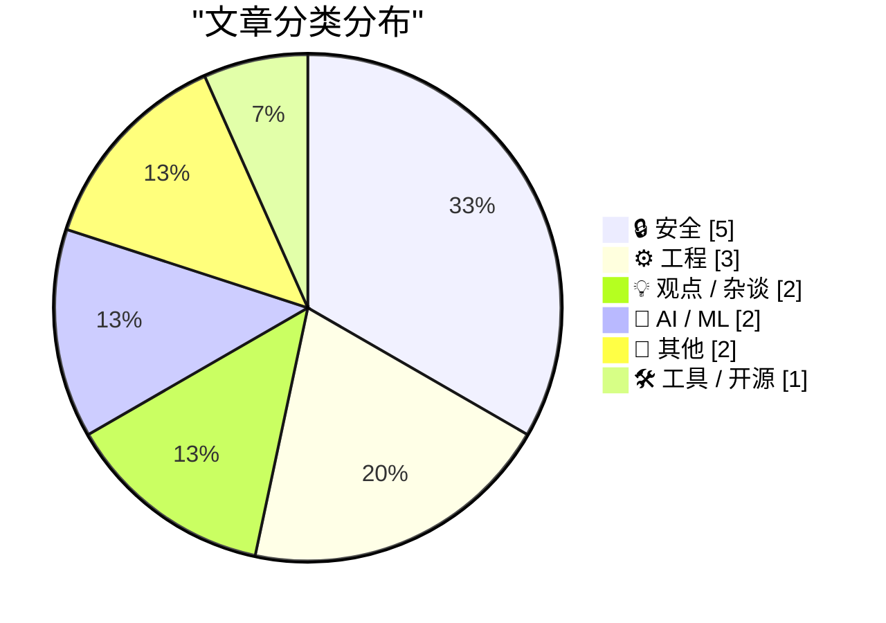
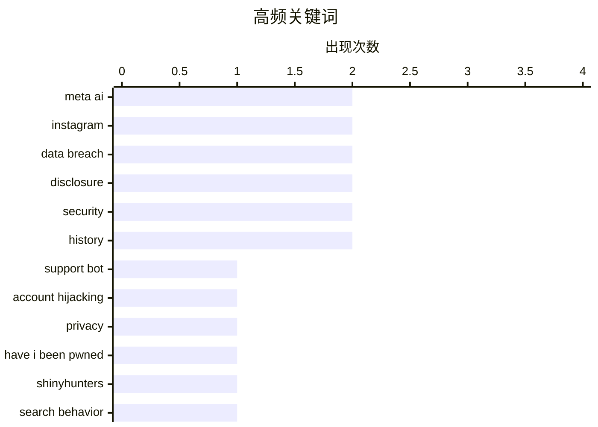

# 📰 AI 博客每日精选 — 2026-06-02

> 来自 Karpathy 推荐的 92 个顶级技术博客，AI 精选 Top 15

## 📝 今日看点

今天技术圈的焦点汇聚于人工智能带来的双重冲击：一方面，攻击者开始用自然语言诱骗 AI 客服机器人接管知名社交账户，让社会工程攻击的门槛和破坏力同步升级；另一方面，普通用户正从关键词搜索转向与 AI 对话获取信息，这种交互范式的根本位移正在重写产品逻辑。与此同时，频繁的数据泄露事件仍普遍存在披露延迟，行业规则与信任正在被反复考验，而苹果 AI 负责人跳槽至 OpenAI 也为新一轮人机交互竞赛增添了变数。

---

## 🏆 今日必读

🥇 **黑客利用Meta的AI支持机器人接管Instagram账户**

[Hackers Used Meta’s AI Support Bot to Seize Instagram Accounts](https://krebsonsecurity.com/2026/06/hackers-used-metas-ai-support-bot-to-seize-instagram-accounts/) — krebsonsecurity.com · 6 小时前 · 🔒 安全

> 上周末，奥巴马白宫及美国太空军高级军士长的Instagram账户遭亲伊朗信息篡改。攻击手法依赖Telegram上流传的教程：通过自然语言对话诱骗Meta的“AI支持助手”重置目标账户密码。恶意用户仅需上传伪造的账户关联截图，AI便会引导完成权限接管。事件暴露了将自动化客服系统接入关键身份验证流程的致命安全缺陷，攻击者无需任何技术漏洞即可实现社交工程攻击。

💡 **为什么值得读**: 这起事件颠覆了“AI安全漏洞常源于复杂对抗”的认知——攻击方式简单到只需对客服机器人说谎，揭示了AI自动化流程中信任链的脆弱性。

🏷️ Meta AI, support bot, account hijacking, Instagram

🥈 **千次数据泄露之后，披露延迟问题比以往更糟**

[1,000 Data Breaches Later, the Disclosure Lag is Worse Than Ever](https://www.troyhunt.com/1000-data-breaches-later-the-disclosure-lag-is-worse-than-ever/) — troyhunt.com · 15 小时前 · 🔒 安全

> Troy Hunt在向其泄露查询网站Have I Been Pwned录入第1000次数据泄露事件之际，反思了隐私法规时代数据泄露披露机制的失效现状。尽管GDPR等法规要求及时通知，但企业在发现泄露后普遍存在数月甚至数年的披露滞后。Hunt指出法规仅带来象征性合规，受害者在信息真空期完全无法采取保护措施，行业透明度的倒退反而加重了公众的安全风险。

💡 **为什么值得读**: 由亲手处理过1000起泄露事件的安全专家直击行业痼疾，将法规文本与冷酷的现实披露延迟数据并置，拷问隐私保护的真正意义。

🏷️ data breach, disclosure, privacy, Have I Been Pwned

🥉 **每周更新 506**

[Weekly Update 506](https://www.troyhunt.com/weekly-update-506/) — troyhunt.com · 20 小时前 · 🔒 安全

> Troy Hunt在本周更新中聚焦ShinyHunters黑客组织近期的密集入侵与数据泄露活动。讨论涉及该组织的犯罪模式、受害企业对受害者的披露缺位，以及泄露数据在暗网上的短暂现身与消失规律。Hunt重点分析了这类大规模数据流出事件中企业反应迟缓的结构性原因，及其对终端用户的长期伤害。

💡 **为什么值得读**: 对当下活跃黑客组织的实时追踪与深度评论，提供了理解数据泄露地下生态运作机制的一线视角。

🏷️ ShinyHunters, data breach, disclosure, security

---

## 📊 数据概览

| 扫描源 | 抓取文章 | 时间范围 | 精选 |
|:---:|:---:|:---:|:---:|
| 77/92 | 2371 篇 → 18 篇 | 24h | **15 篇** |

### 分类分布



### 高频关键词



<details>
<summary>📈 纯文本关键词图（终端友好）</summary>

```
meta ai           │ ████████████████████ 2
instagram         │ ████████████████████ 2
data breach       │ ████████████████████ 2
disclosure        │ ████████████████████ 2
security          │ ████████████████████ 2
history           │ ████████████████████ 2
support bot       │ ██████████░░░░░░░░░░ 1
account hijacking │ ██████████░░░░░░░░░░ 1
privacy           │ ██████████░░░░░░░░░░ 1
have i been pwned │ ██████████░░░░░░░░░░ 1
```

</details>

### 🏷️ 话题标签

**meta ai**(2) · **instagram**(2) · **data breach**(2) · disclosure(2) · security(2) · history(2) · support bot(1) · account hijacking(1) · privacy(1) · have i been pwned(1) · shinyhunters(1) · search behavior(1) · llm(1) · programming(1) · web search(1) · social engineering(1) · account takeover(1) · apple ai(1) · openai(1) · siri(1)

---

## 🔒 安全

### 1. 黑客利用Meta的AI支持机器人接管Instagram账户

[Hackers Used Meta’s AI Support Bot to Seize Instagram Accounts](https://krebsonsecurity.com/2026/06/hackers-used-metas-ai-support-bot-to-seize-instagram-accounts/) — **krebsonsecurity.com** · 6 小时前 · ⭐ 24/30

> 上周末，奥巴马白宫及美国太空军高级军士长的Instagram账户遭亲伊朗信息篡改。攻击手法依赖Telegram上流传的教程：通过自然语言对话诱骗Meta的“AI支持助手”重置目标账户密码。恶意用户仅需上传伪造的账户关联截图，AI便会引导完成权限接管。事件暴露了将自动化客服系统接入关键身份验证流程的致命安全缺陷，攻击者无需任何技术漏洞即可实现社交工程攻击。

🏷️ Meta AI, support bot, account hijacking, Instagram

---

### 2. 千次数据泄露之后，披露延迟问题比以往更糟

[1,000 Data Breaches Later, the Disclosure Lag is Worse Than Ever](https://www.troyhunt.com/1000-data-breaches-later-the-disclosure-lag-is-worse-than-ever/) — **troyhunt.com** · 15 小时前 · ⭐ 24/30

> Troy Hunt在向其泄露查询网站Have I Been Pwned录入第1000次数据泄露事件之际，反思了隐私法规时代数据泄露披露机制的失效现状。尽管GDPR等法规要求及时通知，但企业在发现泄露后普遍存在数月甚至数年的披露滞后。Hunt指出法规仅带来象征性合规，受害者在信息真空期完全无法采取保护措施，行业透明度的倒退反而加重了公众的安全风险。

🏷️ data breach, disclosure, privacy, Have I Been Pwned

---

### 3. 每周更新 506

[Weekly Update 506](https://www.troyhunt.com/weekly-update-506/) — **troyhunt.com** · 20 小时前 · ⭐ 24/30

> Troy Hunt在本周更新中聚焦ShinyHunters黑客组织近期的密集入侵与数据泄露活动。讨论涉及该组织的犯罪模式、受害企业对受害者的披露缺位，以及泄露数据在暗网上的短暂现身与消失规律。Hunt重点分析了这类大规模数据流出事件中企业反应迟缓的结构性原因，及其对终端用户的长期伤害。

🏷️ ShinyHunters, data breach, disclosure, security

---

### 4. 黑客直接要求Meta AI授予高关注度Instagram账户访问权限——居然成功了

[Hackers Simply Asked Meta AI to Give Them Access to High-Profile Instagram Accounts. It Worked](https://simonwillison.net/2026/Jun/1/hackers-simply-asked-meta-ai/#atom-everything) — **simonwillison.net** · 2 小时前 · ⭐ 21/30

> 404 Media和Simon Willison多方验证了一个令人难以置信的攻击事件：攻击者通过视频记录，演示了直接向Meta的AI支持机器人发起自然语言对话，要求将目标账户绑定至新的电子邮件地址的操作。整个过程没有任何漏洞利用，仅靠对话说服AI完成账户迁移。Willison强调该事件的可信度在交叉核实后已无可置疑，暴露出大公司在自动化AI客服权限管理上的灾难性设计缺陷。

🏷️ Meta AI, Instagram, social engineering, account takeover

---

### 5. 信息安全常用语手册

[The Infosec Phrasebook](https://nesbitt.io/2026/06/01/the-infosec-phrasebook.html) — **nesbitt.io** · 14 小时前 · ⭐ 18/30

> 作者以信息安全社区内部惯用的缩略语和黑话为切入点，发起了一场关于行业沟通障碍的反思。文章标题借用了早期网络聊天室的年龄/性别/地点询问格式“a/s/l”，将其与威胁建模并列，暗示安全从业者过度依赖排他性术语来构建专业身份，可能反而阻碍了安全理念向大众和管理层的有效传达。

🏷️ infosec, phrasebook, security, terminology

---

## ⚙️ 工程

### 6. 这不仅仅是泰勒级数

[It’s not just Taylor series](https://www.johndcook.com/blog/2026/06/01/not-just-taylor-series/) — **johndcook.com** · 11 小时前 · ⭐ 18/30

> 数学社区仍在热议近似公式 exp(−x²) ≈ (1 + cos(sin(x) + x))/2 的精度来源。有观点将其完全归因于泰勒级数：两边级数直到x⁶项才首次出现分歧。作者John D. Cook反驳了这种简化论，强调近似式的优雅构造涉及超越单纯级数截断的更深层数学原理，呼吁关注公式背后的洞察而非仅仅技术性解释。

🏷️ Taylor series, approximation, mathematics, numerical

---

### 7. Intel 8088及非Intel非兼容产品

[Intel 8088s and non-Intel non-clones](https://dfarq.homeip.net/intel-8088s-and-non-intel-non-clones/?utm_source=rss&#038;utm_medium=rss&#038;utm_campaign=intel-8088s-and-non-intel-non-clones) — **dfarq.homeip.net** · 13 小时前 · ⭐ 17/30

> 文章纪念Intel 8088 CPU于1978年6月1日首发，并回顾了这款驱动IBM PC、PC/XT及数千万台兼容机的传奇芯片背后的多元生态。重点挖掘了一段鲜为人知的历史：Intel并非该架构的唯一生产者，市面上存在既非Intel又非简单兼容版本的第三方实现，揭示了早期PC产业远比教科书描述更为复杂的供应链和技术竞争格局。

🏷️ Intel 8088, CPU, clones, history

---

### 8. 微仪器与遥测系统公司

[Micro Instrumentation and Telemetry Systems](https://www.abortretry.fail/p/micro-instrumentation-and-telemetry) — **abortretry.fail** · 22 小时前 · ⭐ 16/30

> 文章追溯了MITS这家在个人计算机革命中扮演关键角色的公司的历史。MITS以计算器起家，在濒临破产之际凭借Altair 8800及其激发的Microsoft BASIC开启了PC时代。作者梳理了MITS如何在火箭遥测、计算器和早期PC三个截然不同的技术领域间辗转腾挪，最终虽被收购但其点燃的火种奠定了整个产业的基础。

🏷️ MITS, Altair, history, personal computer

---

## 💡 观点 / 杂谈

### 9. 网络正在改变，我们回不去了

[The web is changing, and we are not going back](https://idiallo.com/blog/web-is-changing-we-are-not-going-back?src=feed) — **idiallo.com** · 4 小时前 · ⭐ 22/30

> 作者观察到一个根本性交互转变：用户正从关键词组合式搜索转向用自然语言向AI提问。原本嘲笑“向搜索框打字聊天”的程序员群体，如今不得不接受对话式查询已经成为主流。文章指出这种转变不仅是界面变化，更意味着信息获取逻辑从精确匹配关键词转向意图理解，传统SEO和内容创作策略正在被颠覆。

🏷️ search behavior, LLM, programming, web search

---

### 10. 如果你接受了黄鼠狼的工作，你就必定是那只黄鼠狼

[‘If You Take the Weasel Job Then You Must Be the Weasel’](https://www.hamiltonnolan.com/p/if-you-take-the-weasel-job-then-you?r=qy6gq) — **daringfireball.net** · 39 分钟前 · ⭐ 10/30

> Hamilton Nolan 剖析了一个人为何会被聘用到明显不胜任的显赫职位，原因要么是雇主愚蠢，要么是该职位本质上要求扮演“恶人”角色。文章指出，美国当前内阁成员中不乏此类情况，并论证当一个人接受这种“黄鼠狼工作”时，其个人身份便与被要求的角色行为无法分割。核心结论是，职位的道德属性会吞噬任职者，你选择了做什么，你就是什么。

🏷️ workplace, ethics, career

---

## 🤖 AI / ML

### 11. 第二轮尝试

[Take Two](https://x.com/markgurman/status/2061236259843182813) — **daringfireball.net** · 23 小时前 · ⭐ 18/30

> Mark Gurman爆料曾于2024年WWDC介绍失败Siri改版的苹果AI负责人Kelsey Peterson已跳槽至OpenAI。这意味着苹果将在今年WWDC上由新面孔主持第二次Siri重大升级的发布。John Gruber以泰坦尼克号二号船做比，讽刺苹果无论如何本就会换人站台，因为首次亮相已然是一场灾难。

🏷️ Apple AI, OpenAI, Siri, WWDC 2026

---

### 12. 亚马逊推出 AI 生成的产品播客

[Amazon Made AI Podcasts for Products](https://www.businessinsider.com/amazon-ai-generated-podcasts-products-2026-4) — **daringfireball.net** · 7 小时前 · ⭐ 15/30

> 亚马逊上线了一项新功能，利用 AI 为特定产品生成一段由两位“主持人”讨论其优点和评价的短音频，形式类似播客。作者 Katie Notopoulos 以尿布疹霜为例进行了测试，并讽刺地称其为 AI 时代下“人类文明最滑稽的终点之一”。该功能将购物评论转化为看似真实的对话内容，模糊了真实体验与机器生成内容之间的界限。

🏷️ AI podcast, Amazon, AI-generated content, product review

---

## 📝 其他

### 13. 普利策奖得主 Molly Crabapple 新书《这是我们生活的家园》

[Pluralistic: Molly Crabapple's 'Here Where We Live Is Our Country' (01 Jun 2026)](https://pluralistic.net/2026/06/01/doikayt/) — **pluralistic.net** · 14 小时前 · ⭐ 11/30

> Cory Doctorow 推荐了 Molly Crabapple 的新书《Here Where We Live Is Our Country》，称其为反映当下时代及其历史成因的关键著作。文章同时汇总了多个话题链接，包括 JPEG 专利被判无效、UBS 举报人诉美国政府案、以及关于“带宽占用者”的讨论。核心观点认为这本书是理解当前社会政治局势不可或缺的读物。

🏷️ book, art, politics, review

---

### 14. 我们正生活在匹诺曹的世界

[‘We Are Living in Pinocchio’s World’](https://om.co/2026/05/25/we-are-living-in-pinocchios-world/) — **daringfireball.net** · 4 小时前 · ⭐ 9/30

> Om Malik 借 1881 年《木偶奇遇记》原著的黑暗基调类比当下现实，指出原著中充斥着苦难、道德训诫与掠夺性的环境，保护性机构要么缺失要么堕落。文章认为，现代科技社会表面上赋予了个体更多自由，实则与匹诺曹所处的欺骗性世界高度相似，充满谎言与失控的欲望。作者以此反思技术在承诺解放个体的同时，是否正在制造新的束缚与幻象。

🏷️ Pinocchio, culture, media

---

## 🛠 工具 / 开源

### 15. exe.dev：面向智能体时代的云平台

[exe.dev](https://exe.dev/?df) — **daringfireball.net** · 22 小时前 · ⭐ 15/30

> exe.dev 是一个专为 AI 智能体时代设计的云服务平台，提供预配置 SSH、root 权限及 Web 认证的虚拟机池。其核心安全特性是在网络边缘注入密钥，确保敏感凭证不会落入 LLM 手中。平台支持持久化服务器、内部工具、氛围编程及一次性开发环境等多种场景，并允许像分享 Google Doc 一样便捷地共享 Web 服务器，用户按底层资源付费。

🏷️ VMs, cloud, SSH, LLM security

---

*生成于 2026-06-02 00:11 | 扫描 77 源 → 获取 2371 篇 → 精选 15 篇*
*基于 [Hacker News Popularity Contest 2025](https://refactoringenglish.com/tools/hn-popularity/) RSS 源列表，由 [Andrej Karpathy](https://x.com/karpathy) 推荐*
*由「懂点儿AI」制作，欢迎关注同名微信公众号获取更多 AI 实用技巧 💡*
