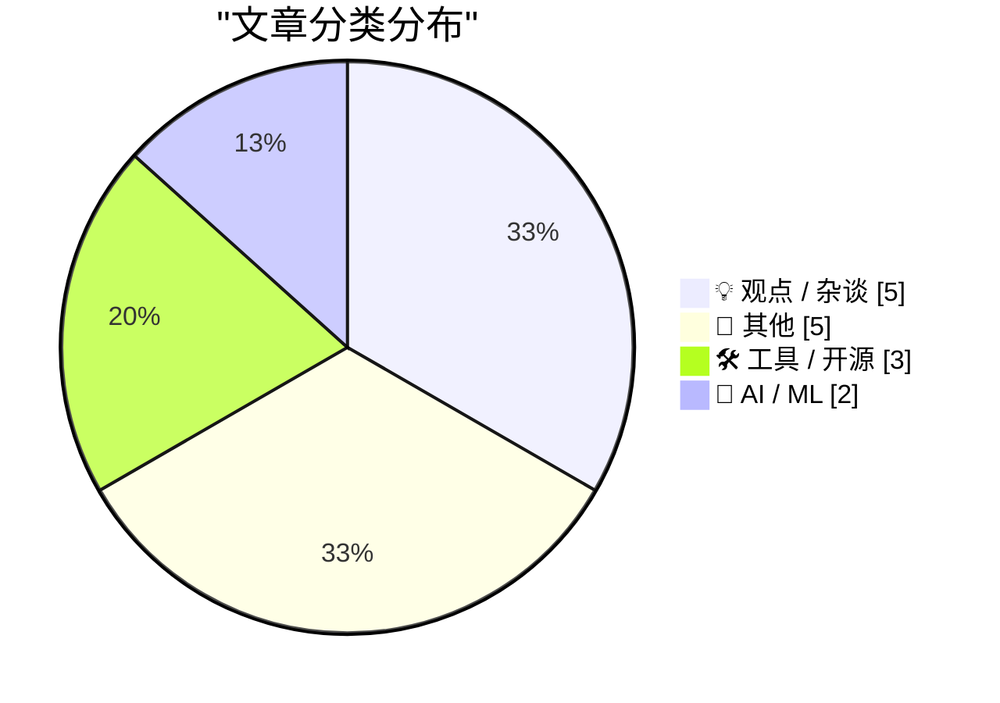
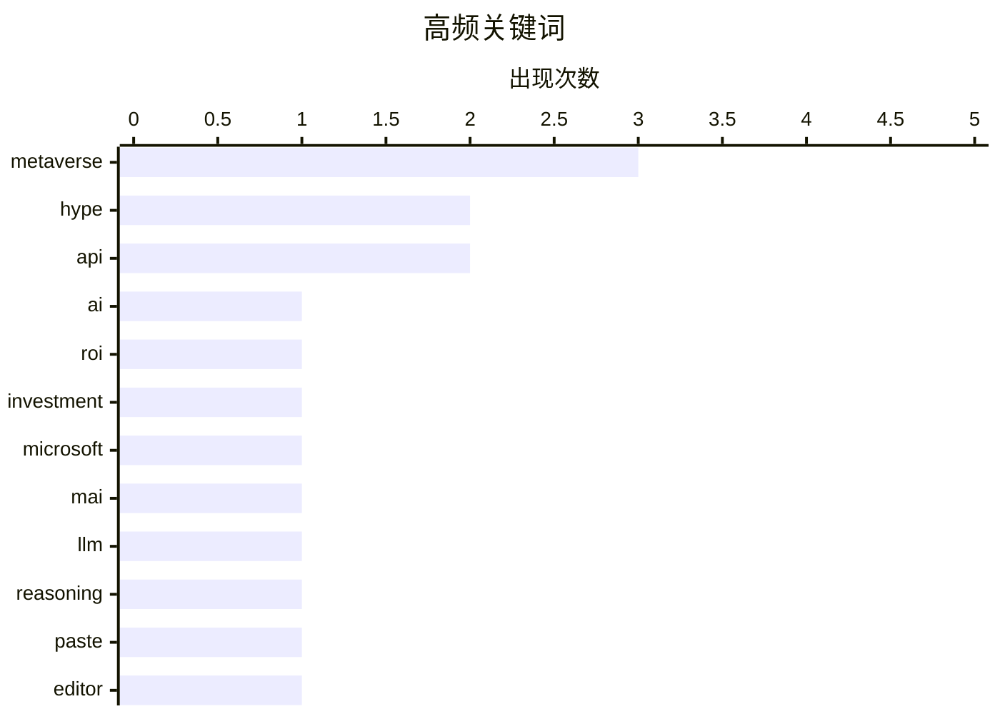

# 📰 AI 博客每日精选 — 2026-06-03

> 来自 Karpathy 推荐的 92 个顶级技术博客，AI 精选 Top 15

## 📝 今日看点

今天的技术圈在狂热与反思中拉扯：生成式AI投入巨大却难觅回报，微软却依旧高调发布新一代推理与代码模型，折射出行业冰火两重天的现实。与此同时，曾被捧上神坛的元宇宙叙事正遭到集中清算，苹果等巨头刻意避开空洞口号，转而在空间计算和智能眼镜上走务实路线。开发者一侧，利用AI和开放API重塑日常工具（如粘贴文件编辑器、位置同步）的创新依然活跃，视频基础设施也在向自动化工作流演进。

---

## 🏆 今日必读

🥇 **AI没有投资回报**

[AI Doesn't Have ROI](https://www.wheresyoured.at/ai-doesnt-have-roi/) — wheresyoured.at · 10 小时前 · 🤖 AI / ML

> 当前生成式AI行业投入巨大，但企业普遍未获得可量化的投资回报，巨额算力与人才支出与模糊的商业收益之间形成尖锐矛盾。文章直指AI狂热已演变为缺乏真实ROI支撑的资本游戏，大量项目难以证明其经济合理性。作者警告，若无实质性盈利路径，这一浪潮恐将迅速退潮。

💡 **为什么值得读**: 一针见血地质疑AI泡沫的核心——是否有真金白银的回报，为盲目跟风的技术决策者提供必要的冷静视角。

🏷️ AI, ROI, investment, hype

🥈 **微软发布全新MAI模型**

[Microsoft's new MAI models](https://simonwillison.net/2026/Jun/2/microsofts-new-models/#atom-everything) — simonwillison.net · 1 小时前 · 🤖 AI / ML

> 微软推出两款新文本大模型：推理模型MAI-Thinking-1（参数35B，仅向特定早期合作伙伴开放）和代码模型MAI-Code-1-Flash（参数5B，专为GitHub Copilot与VS Code优化）。这两款模型属于微软“爬山机器”策略的一部分，旨在通过小体量、高针对性的模型提升开发工具与推理场景的效率。

💡 **为什么值得读**: 了解微软在小模型与推理模型上的最新布局，尤其是与GitHub Copilot生态深度整合的轻量级代码模型。

🏷️ Microsoft, MAI, LLM, reasoning

🥉 **粘贴文件编辑器**

[Pasted File Editor](https://simonwillison.net/2026/Jun/2/pasted-file-editor/#atom-everything) — simonwillison.net · 19 小时前 · 🛠 工具 / 开源

> Simon Willison 开发了一个名为Pasted File Editor的工具，复现了Claude.ai 将用户粘贴的大量文本自动识别并转为文件附件的交互机制。他利用Codex Desktop辅助编程，快速生成原型，让用户在任何网页环境体验将粘贴内容即时“文件化”的便利。

💡 **为什么值得读**: 一个小巧但极具使用灵感的前端工具展示，体现了AI辅助编程如何快速实现产品交互细节。

🏷️ paste, editor, Claude, tool

---

## 📊 数据概览

| 扫描源 | 抓取文章 | 时间范围 | 精选 |
|:---:|:---:|:---:|:---:|
| 76/92 | 2341 篇 → 16 篇 | 24h | **15 篇** |

### 分类分布



### 高频关键词



<details>
<summary>📈 纯文本关键词图（终端友好）</summary>

```
metaverse  │ ████████████████████ 3
hype       │ █████████████░░░░░░░ 2
api        │ █████████████░░░░░░░ 2
ai         │ ███████░░░░░░░░░░░░░ 1
roi        │ ███████░░░░░░░░░░░░░ 1
investment │ ███████░░░░░░░░░░░░░ 1
microsoft  │ ███████░░░░░░░░░░░░░ 1
mai        │ ███████░░░░░░░░░░░░░ 1
llm        │ ███████░░░░░░░░░░░░░ 1
reasoning  │ ███████░░░░░░░░░░░░░ 1
```

</details>

### 🏷️ 话题标签

**metaverse**(3) · **hype**(2) · **api**(2) · ai(1) · roi(1) · investment(1) · microsoft(1) · mai(1) · llm(1) · reasoning(1) · paste(1) · editor(1) · claude(1) · tool(1) · storytelling(1) · narrative(1) · excitement(1) · culture(1) · apple(1) · vision pro(1)

---

## 💡 观点 / 杂谈

### 1. 讲故事那乏味的力量

[Pluralistic: The tedious power of storytelling (02 Jun 2026) must-we-pretend](https://pluralistic.net/2026/06/02/must-we-pretend/) — **pluralistic.net** · 14 小时前 · ⭐ 20/30

> Cory Doctorow 以“兴奋之于艺术，如同可证伪性之于科学”为类比，揭示叙事已沦为硅谷推销宏大承诺却逃避现实检验的工具。文章批判技术界强制参与者“必须假装”相信未经证实的愿景，使原本启发人心的故事变得令人厌倦，并以此掩盖产品与政策的实质缺陷。

🏷️ storytelling, narrative, excitement, culture

---

### 2. 苹果，反“元宇宙”的VR公司

[Apple, the Anti-‘Metaverse’ VR Company](https://daringfireball.net/2025/12/meta_says_fuck_that_metaverse_shit) — **daringfireball.net** · 3 小时前 · ⭐ 19/30

> 在Meta等公司大肆炒作“元宇宙”时，苹果虽推出Vision Pro，却从未使用过该流行词，始终将Vision平台定位为长线计算的延续，而非幻想式的虚拟宇宙。早在2022年Vision Pro发布前，苹果高管便公开与元宇宙概念保持距离，使其成为VR领域唯一明确不拥抱该叙事的巨头。

🏷️ Apple, Vision Pro, metaverse, VR

---

### 3. 元宇宙狂热梦

[‘The Metaverse Fever Dream’](https://pxlnv.com/blog/metaverse-fever-dream/) — **daringfireball.net** · 23 小时前 · ⭐ 19/30

> Nick Heer 用大量证据细致复盘了元宇宙从2020年Matthew Ball预测万亿价值到成为空洞口号的全过程。文章指出，这一概念恰好在COVID-19封锁期间发酵，利用公众的社交孤立和数字渴望被迅速吹大，最终随着现实回归而崩塌，留下一地概念残骸。

🏷️ metaverse, hype, technology, bubble

---

### 4. 元宇宙是隔离的万金油

[The Metaverse Was Snake Oil for Isolation](https://daringfireball.net/linked/2026/06/01/the-metaverse-fever-dream) — **daringfireball.net** · 3 小时前 · ⭐ 16/30

> 文章承接Nick Heer的分析，强调元宇宙叙事在2020–2021年间的暴热与COVID-19封锁造成的集体隔离完全同步。它实质上是一种利用孤独和社交饥渴兜售的数字乌托邦，当生活恢复正常，这种为了隔离提供的蛇油便迅速失去魔力。

🏷️ metaverse, isolation, pandemic, snake oil

---

### 5. 致计算机精确的学究气

[An Ode to the Exacting Pedantry of Computers](https://blog.jim-nielsen.com/2026/pedantry-of-computing/) — **blog.jim-nielsen.com** · 5 小时前 · ⭐ 16/30

> 计算机对数据类型——整数、浮点数、双精度数——的严格区分，是编程初学者面临的第一道认知门槛。作者回忆初学C++时，对“数字就是数字，为何要预先声明类型”感到极度困惑，甚至因此退课。然而随着编程经验增长，这种看似刻板的精确性逐渐展现其价值：它是计算机可靠性和确定性的基石。计算机不关心数字的“感觉”，只在乎精确定义的类型与边界，这种学究气恰恰是其最可贵的品质。

🏷️ programming, types, precision, pedantry

---

## 📝 其他

### 6. Meta被曝年内将密集发布多款智能眼镜

[Meta Reportedly Has a Slew of New Smart Glasses Planned for This Year](https://gizmodo.com/meta-has-a-ridiculous-amount-of-smart-glasses-planned-for-this-year-2000765741) — **daringfireball.net** · 2 小时前 · ⭐ 18/30

> 据The Information报道，Meta计划在年内推出多款智能眼镜，包括秋季的常规新品、12月代号“Mojito VIP”的特别款，以及正在测试的两款原型机“Artemis”和“SSG”（超感知眼镜）。这一产品矩阵表明Meta正在以快节奏、多SKU的策略抢占下一代个人计算入口。

🏷️ Meta, smart glasses, AR, hardware

---

### 7. Scott Pelley指控CBS新闻主管“谋杀”《60分钟》

[Scott Pelley Accuses CBS News Boss of ‘Murdering’ ‘60 Minutes’](https://www.nytimes.com/2026/06/01/business/media/cbs-60-minutes-scott-pelley-nick-bilton.html?unlocked_article_code=1.nFA.TDGJ.HbBmlXuQWmcQ&amp;smid=url-share) — **daringfireball.net** · 4 小时前 · ⭐ 10/30

> CBS新闻陷入新一轮内部动荡，《60分钟》资深记者Scott Pelley在员工会议上公开炮轰新任执行制片人Nick Bilton。Pelley情绪激动地指控该网络总编辑Bari Weiss正在“谋杀”这档历史悠久的周日新闻节目。这场非同寻常的公开冲突暴露出CBS管理层与核心采编团队之间的深刻裂痕。报道由《纽约时报》记者Michael M. Grynbaum和Benjamin Mullin披露。

🏷️ CBS, 60 Minutes, media, scandal

---

### 8. 赚钱的三种方式

[Three Ways to Get Paid](https://jasonzweig.com/three-ways-to-get-paid/) — **daringfireball.net** · 7 小时前 · ⭐ 10/30

> 已故投资作家Jason Zweig的父亲留下了一段关于谋生之道的三法则智慧。第一种方式：对想被欺骗的人撒谎，能让你致富。第二种方式：向渴望真相的人说实话，能让你谋得生计。第三种方式：向想被欺骗的人说实话，只会让你破产。Zweig在2018年首次分享这段家传智慧，至今仍被读者反复提及。其核心洞见在于揭示了诚实与市场之间残酷而现实的博弈关系。

🏷️ money, career, advice

---

### 9. Cyrix 486DLC CPU：1992年6月问世

[Cyrix 486DLC CPU: Introduced June 1992](https://dfarq.homeip.net/cyrix-486dlc-cpu-introduced-june-1992/?utm_source=rss&#038;utm_medium=rss&#038;utm_campaign=cyrix-486dlc-cpu-introduced-june-1992) — **dfarq.homeip.net** · 13 小时前 · ⭐ 10/30

> 1992年6月第一周，Cyrix公司正式推出486DLC CPU处理器。由于Cyrix自身没有晶圆制造厂，该公司与德州仪器（Texas Instruments）达成制造协议，于同年5月开始量产该芯片，德州仪器也因此获得该芯片的部分权益。486DLC是Cyrix在x86兼容处理器市场与英特尔竞争的重要产品，标志着无厂半导体设计公司（fabless）模式在90年代初期的早期实践。

🏷️ Cyrix, CPU, 486DLC, history

---

### 10. 首次购买者折扣的欺骗性把戏

[The First-Time-Buyer-Discount Dickover Scheme](https://x.com/usgraphics/status/2060559523585355986) — **daringfireball.net** · 8 小时前 · ⭐ 8/30

> “首次购买者专享折扣”是一种看似诱人实则充满欺骗的营销手段。商家以“注册即享10%折扣，仅限新账户”为诱饵吸引新用户，同时却惩罚了忠诚的回头客，让他们感到被冷落。而首次购买者看似获得了选择权，实际上不交出邮箱地址就无法享受优惠——这种选择本质上是一种幻觉。该策略同时激怒了两类客户：老客户因被排斥而愤怒，新客户因被强制索取信息而不安。

🏷️ discount, marketing, customer

---

## 🛠 工具 / 开源

### 11. 粘贴文件编辑器

[Pasted File Editor](https://simonwillison.net/2026/Jun/2/pasted-file-editor/#atom-everything) — **simonwillison.net** · 19 小时前 · ⭐ 20/30

> Simon Willison 开发了一个名为Pasted File Editor的工具，复现了Claude.ai 将用户粘贴的大量文本自动识别并转为文件附件的交互机制。他利用Codex Desktop辅助编程，快速生成原型，让用户在任何网页环境体验将粘贴内容即时“文件化”的便利。

🏷️ paste, editor, Claude, tool

---

### 12. 用FourSquare API将位置签到同步到其他社交平台

[Using FourSquare's API to post location checkins to social media](https://shkspr.mobi/blog/2026/06/using-foursquares-api-to-post-location-checkins-to-social-media/) — **shkspr.mobi** · 12 小时前 · ⭐ 18/30

> 作者因Swarm不提供跨平台分享功能，便通过调用FourSquare的API实现了自动将签到信息发布到其它社交网络，让无法使用Swarm的好友也能获知其位置动态。该方案保留了2016年式开放签到体验，打破围墙花园的数据隔离。

🏷️ Foursquare, API, checkin, social media

---

### 13. [赞助] Mux：开发者的视频平台

[[Sponsor] Mux — Video for Developers](https://www.mux.com/?utm_campaign=fireball&amp;utm_source=DF) — **daringfireball.net** · 22 小时前 · ⭐ 16/30

> Mux提供面向开发者的视频基础设施，其AI工作流“Mux Robots”可自动完成视频摘要、字幕翻译和内容审核等任务，只需一次配置即可在新上传时自动运行。该平台已被Patreon、Substack和Synthesia等知名产品采用。

🏷️ Mux, video, API, AI workflows

---

## 🤖 AI / ML

### 14. AI没有投资回报

[AI Doesn't Have ROI](https://www.wheresyoured.at/ai-doesnt-have-roi/) — **wheresyoured.at** · 10 小时前 · ⭐ 29/30

> 当前生成式AI行业投入巨大，但企业普遍未获得可量化的投资回报，巨额算力与人才支出与模糊的商业收益之间形成尖锐矛盾。文章直指AI狂热已演变为缺乏真实ROI支撑的资本游戏，大量项目难以证明其经济合理性。作者警告，若无实质性盈利路径，这一浪潮恐将迅速退潮。

🏷️ AI, ROI, investment, hype

---

### 15. 微软发布全新MAI模型

[Microsoft's new MAI models](https://simonwillison.net/2026/Jun/2/microsofts-new-models/#atom-everything) — **simonwillison.net** · 1 小时前 · ⭐ 24/30

> 微软推出两款新文本大模型：推理模型MAI-Thinking-1（参数35B，仅向特定早期合作伙伴开放）和代码模型MAI-Code-1-Flash（参数5B，专为GitHub Copilot与VS Code优化）。这两款模型属于微软“爬山机器”策略的一部分，旨在通过小体量、高针对性的模型提升开发工具与推理场景的效率。

🏷️ Microsoft, MAI, LLM, reasoning

---

*生成于 2026-06-03 00:07 | 扫描 76 源 → 获取 2341 篇 → 精选 15 篇*
*基于 [Hacker News Popularity Contest 2025](https://refactoringenglish.com/tools/hn-popularity/) RSS 源列表，由 [Andrej Karpathy](https://x.com/karpathy) 推荐*
*由「懂点儿AI」制作，欢迎关注同名微信公众号获取更多 AI 实用技巧 💡*
