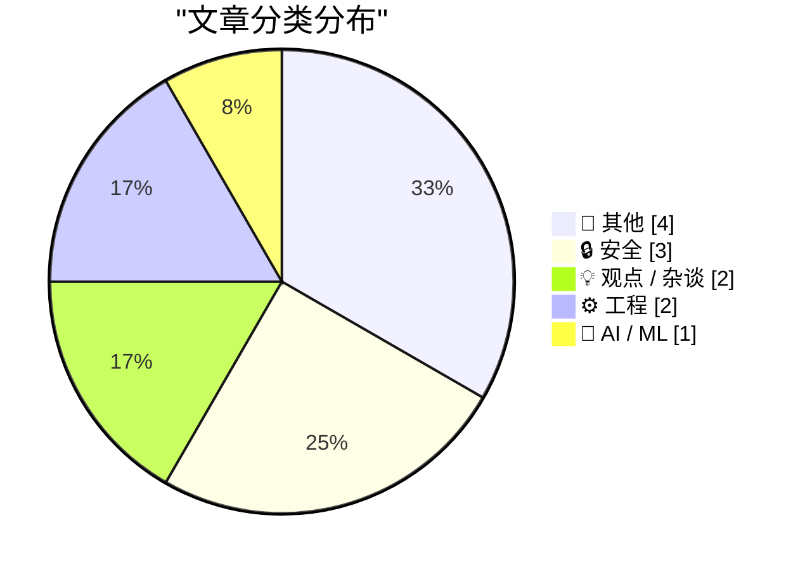
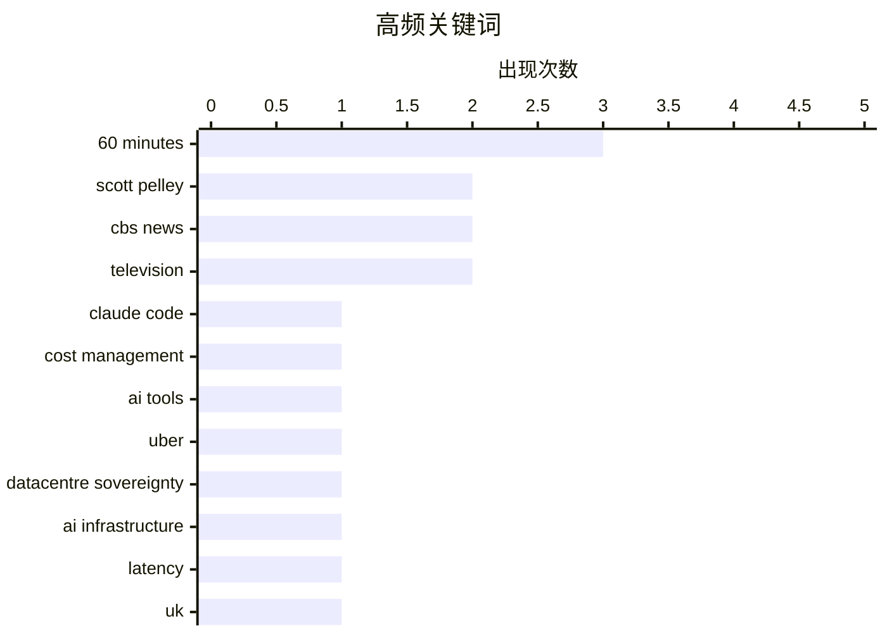

# 📰 AI 博客每日精选 — 2026-06-04

> 来自 Karpathy 推荐的 92 个顶级技术博客，AI 精选 Top 12

## 📝 今日看点

今日技术圈聚焦两大隐忧：AI 工具的爆炸式增长正反噬企业预算与内容信任——Uber 紧急封顶用量，读者则因 AI 生成的 newsletter 失去二十年的忠诚。与此同时，可穿戴设备的隐私防线再次被击穿，Meta 智能眼镜的地下改装市场公然贩卖“隐身模式”，将偷拍风险摆在眼前。在基建狂热与代码精度之外，成本失控与信任崩塌成了更迫切的课题。

---

## 🏆 今日必读

🥇 **Uber 限制 Claude Code 等 AI 工具用量以控制成本**

[Uber Caps Usage of AI Tools Like Claude Code to Manage Costs](https://simonwillison.net/2026/Jun/3/uber-caps-usage/#atom-everything) — simonwillison.net · 13 小时前 · 🤖 AI / ML

> Uber 在 2026 年前四个月就花光了全年 AI 预算，反映出 2025 年制定预算时未能预见 AI 工具使用的爆炸性增长。为此公司开始对 Claude Code 等编码助手实施用量封顶，以遏制开支失控。这一案例说明，产品级 AI 应用的需求曲线远超传统预算模型，企业需要更灵活的财务规划机制。

💡 **为什么值得读**: 揭示大企业实际落地 AI 工具时面临的成本控制难题和预算滞后挑战，对技术管理者有直接参考价值。

🏷️ Claude Code, cost management, AI tools, Uber

🥈 **数据中心主权真的那么重要吗？**

[Is datacentre sovereignty really that important?](https://martinalderson.com/posts/is-datacentre-sovereignty-really-that-important/?utm_source=rss&amp;utm_medium=rss&amp;utm_campaign=feed) — martinalderson.com · 1 小时前 · 💡 观点 / 杂谈

> 英国正痴迷于在本土建设 AI 数据中心，但延迟、税收、控制力等主权主张大多站不住脚。对多数应用而言，跨国云基础设施的延迟差异微乎其微，本地化不会带来实质性能提升。税收收益也远不及土地和能源资源的竞争性错配代价，控制权本身在互联世界里更多是一种心理安慰。作者最终认为，数据中心主权被严重高估，资源应投向更有价值的领域。

💡 **为什么值得读**: 以英国为例，犀利批驳数据中心本地化的流行说辞，为技术基建的区域性决策提供清醒冷静的视角。

🏷️ datacentre sovereignty, AI infrastructure, latency, UK

🥉 **自从你的 newsletter 变成 AI 生成，我就退订了**

[Now that your newsletter is AI-generated, I've Unsubscribed](https://idiallo.com/blog/unsubscribed-from-ai-generated-newsletters?src=feed) — idiallo.com · 4 小时前 · 💡 观点 / 杂谈

> 作者订阅一些 newsletter 长达 20 年，某天作者们未作声明就切换为 AI 生成内容，配以蓝色高科技风格缩略图。短短几周后，作者便点击退订。根本原因在于，作者与读者之间建立的信任是基于个人声音与独特见解，AI 代笔抽离了人的要素，使订阅失去价值。结论是，如果创作者认为改进的最佳方式是把自己从等式中移除，那读者也会移除自己。

💡 **为什么值得读**: 从忠实读者的亲身退订经历切入，尖锐点出 AI 内容生成对信任与创作者价值的侵蚀，值得所有内容创作者深思。

🏷️ AI-generated, newsletter, authenticity, unsubscribe

---

## 📊 数据概览

| 扫描源 | 抓取文章 | 时间范围 | 精选 |
|:---:|:---:|:---:|:---:|
| 77/92 | 2372 篇 → 12 篇 | 24h | **12 篇** |

### 分类分布



### 高频关键词



<details>
<summary>📈 纯文本关键词图（终端友好）</summary>

```
60 minutes             │ ████████████████████ 3
scott pelley           │ █████████████░░░░░░░ 2
cbs news               │ █████████████░░░░░░░ 2
television             │ █████████████░░░░░░░ 2
claude code            │ ███████░░░░░░░░░░░░░ 1
cost management        │ ███████░░░░░░░░░░░░░ 1
ai tools               │ ███████░░░░░░░░░░░░░ 1
uber                   │ ███████░░░░░░░░░░░░░ 1
datacentre sovereignty │ ███████░░░░░░░░░░░░░ 1
ai infrastructure      │ ███████░░░░░░░░░░░░░ 1
```

</details>

### 🏷️ 话题标签

**60 minutes**(3) · **scott pelley**(2) · **cbs news**(2) · television(2) · claude code(1) · cost management(1) · ai tools(1) · uber(1) · datacentre sovereignty(1) · ai infrastructure(1) · latency(1) · uk(1) · ai-generated(1) · newsletter(1) · authenticity(1) · unsubscribe(1) · meta glasses(1) · privacy(1) · recording indicator(1) · stealth mode(1)

---

## 📝 其他

### 1. Scott Pelley 告别《60分钟》：新管理层的无能与不专业肆虐

[Scott Pelley on Leaving ‘60 Minutes’: ‘Incompetence and Unprofessionalism in the New Management Have Wreaked Havoc’](https://www.instagram.com/p/DZHlWAoG3_3/?img_index=1) — **daringfireball.net** · 2 小时前 · ⭐ 16/30

> 传奇新闻节目《60分钟》的资深记者 Scott Pelley 在 Instagram 上发表声明，宣布离开服务 58 季的节目。他直斥新管理层无能和缺乏专业精神，已对节目造成严重破坏。声明回顾了《60分钟》的创新历史与数字平台拓展，暗指管理层变动导致节目背离传统价值。该声明全文作为内部人对知名新闻品牌衰落的痛切证言，引发广泛关注。

🏷️ Scott Pelley, 60 Minutes, CBS News, media

---

### 2. 《60分钟》大清洗

[The ‘60 Minutes’ Purge](https://www.paramountpressexpress.com/cbs-news-and-stations/shows/60-minutes/talent/) — **daringfireball.net** · 4 小时前 · ⭐ 16/30

> Paramount 官方站点仍列出 2025-2026 播出季的 8 位《60分钟》记者，其中 Anderson Cooper 主动离开已有 20 年，Scott Pelley 今日被解雇，此前 Sharyn Alfonsi 和 Cecilia Vega 也已被解雇。这场大清洗标志着该节目核心记者阵容的系统性更迭，与其标志性的稳定形象形成强烈反差。外界猜测管理层正以成本或方向为由重塑节目人员结构。

🏷️ 60 Minutes, CBS, purging, television

---

### 3. CBS 解雇《60分钟》Scott Pelley：解雇信尽显管理层可悲

[CBS News Fires Scott Pelley of ‘60 Minutes’](https://www.nytimes.com/2026/06/02/business/media/scott-pelley-cbs-bari-weiss.html) — **daringfireball.net** · 5 小时前 · ⭐ 16/30

> 《纽约时报》获取的解雇信显示，CBS 以“因故终止”为由立即解雇 Scott Pelley。解雇信中并未否认 Pelley 在周一员工会议上的发言，反倒证实了他的批评，使得解雇行为本身坐实了 Pelley 对管理层无能的指责。Pelley 在电话采访中强调，解雇信的通篇措辞苍白无力，只会进一步曝光 Nick Bilton 所代表的管理层之可悲。该解职成为传统新闻机构内部冲突的又一公开标志。

🏷️ Scott Pelley, fired, CBS News, 60 Minutes

---

### 4. GE Widescreen 1000: Big time TV for big budgets

[GE Widescreen 1000: Big time TV for big budgets](https://dfarq.homeip.net/ge-widescreen-1000/?utm_source=rss&#038;utm_medium=rss&#038;utm_campaign=ge-widescreen-1000) — **dfarq.homeip.net** · 14 小时前 · ⭐ 11/30

> The GE Widescreen 1000 was a big time TV for big time budgets in an era of excess, with the tagline “This is GE Performance Television.” Introduced in June 1978, it cost about 3/4 as much as a family 

🏷️ GE Widescreen 1000, retro tech, television, 1978

---

## 🔒 安全

### 5. Meta 眼镜关闭录制指示灯的地下改装市场

[The Underworld Market to Remove the Recording Indicator Light on Meta Glasses](https://www.youtube.com/watch?v=EaJSPeJmqis) — **daringfireball.net** · 6 小时前 · ⭐ 21/30

> Joanna Stern 的调查报道揭露，Facebook Marketplace 上正涌现大量提供 Ray-Ban Meta 眼镜“隐身模式”改装的服务，她以 100 美元完成改装并深入暗访。该市场意在将智能眼镜变为隐蔽摄像头，已形成灰色产业链。视频探讨了改装参与者的身份、行为的法律边界以及各方尝试阻止这一切的努力。极具讽刺意味的是，寻找改装的买家正是在透明化市场交易中暴露了自己。

🏷️ Meta glasses, privacy, recording indicator, stealth mode

---

### 6. 欢迎菲律宾政府加入 Have I Been Pwned

[Welcoming the Philippine Government to Have I Been Pwned](https://www.troyhunt.com/welcoming-the-philippine-government-to-have-i-been-pwned/) — **troyhunt.com** · 22 小时前 · ⭐ 17/30

> 知名数据泄露查询服务 Have I Been Pwned 迎来第 46 个免费加入的政府机构——菲律宾。通过国家 CERT 和信息通信技术部，菲律宾政府现可监控其官方政府域名的数据泄露情况。该服务帮助各国政府及早发现凭证泄露和账户安全风险，提升国家网络防护水位。

🏷️ data breach, Have I Been Pwned, government, Philippines

---

### 7. Skills Registry Threat Models

[Skills Registry Threat Models](https://nesbitt.io/2026/06/03/skills-registry-threat-models.html) — **nesbitt.io** · 10 小时前 · ⭐ 15/30

> How long until we see a CVE filed against a markdown file?

🏷️ CVE, threat modeling, markdown, skills registry

---

## 💡 观点 / 杂谈

### 8. 数据中心主权真的那么重要吗？

[Is datacentre sovereignty really that important?](https://martinalderson.com/posts/is-datacentre-sovereignty-really-that-important/?utm_source=rss&amp;utm_medium=rss&amp;utm_campaign=feed) — **martinalderson.com** · 1 小时前 · ⭐ 23/30

> 英国正痴迷于在本土建设 AI 数据中心，但延迟、税收、控制力等主权主张大多站不住脚。对多数应用而言，跨国云基础设施的延迟差异微乎其微，本地化不会带来实质性能提升。税收收益也远不及土地和能源资源的竞争性错配代价，控制权本身在互联世界里更多是一种心理安慰。作者最终认为，数据中心主权被严重高估，资源应投向更有价值的领域。

🏷️ datacentre sovereignty, AI infrastructure, latency, UK

---

### 9. 自从你的 newsletter 变成 AI 生成，我就退订了

[Now that your newsletter is AI-generated, I've Unsubscribed](https://idiallo.com/blog/unsubscribed-from-ai-generated-newsletters?src=feed) — **idiallo.com** · 4 小时前 · ⭐ 22/30

> 作者订阅一些 newsletter 长达 20 年，某天作者们未作声明就切换为 AI 生成内容，配以蓝色高科技风格缩略图。短短几周后，作者便点击退订。根本原因在于，作者与读者之间建立的信任是基于个人声音与独特见解，AI 代笔抽离了人的要素，使订阅失去价值。结论是，如果创作者认为改进的最佳方式是把自己从等式中移除，那读者也会移除自己。

🏷️ AI-generated, newsletter, authenticity, unsubscribe

---

## ⚙️ 工程

### 10. 伦敦数据商店重新上线

[London Data Store Relaunch](https://shkspr.mobi/blog/2026/06/london-data-store-relaunch/) — **shkspr.mobi** · 14 小时前 · ⭐ 21/30

> data.london.gov.uk 自 16 年前作为首批大城市开放数据平台开创先河以来，已不仅是一个存储库，更是开放数据改善伦敦人生活的实证庆典。此次前后端全面翻新，既包含多项后端升级，也重新设计前端界面。焕新后的数据商店延续以开放数据提升城市治理透明度和公共服务的使命。

🏷️ open data, London, datastore, government data

---

### 11. 天真地求和交错级数

[Naively summing an alternating series](https://www.johndcook.com/blog/2026/06/03/naive-sum/) — **johndcook.com** · 10 小时前 · ⭐ 21/30

> 以指数函数的幂级数求和为例，如果简单设置容差 10⁻¹² 并在下一项小于容差时停止，会遇到惊人的精度陷阱。对交错级数而言，正负项相消可能导致剩余项的总和远大于停止时的单项阈值，从而使累积误差超标。该文警示数值计算不能仅凭直觉设终止条件，必须考虑级数特性。

🏷️ numerical analysis, floating point, series summation, precision

---

## 🤖 AI / ML

### 12. Uber 限制 Claude Code 等 AI 工具用量以控制成本

[Uber Caps Usage of AI Tools Like Claude Code to Manage Costs](https://simonwillison.net/2026/Jun/3/uber-caps-usage/#atom-everything) — **simonwillison.net** · 13 小时前 · ⭐ 24/30

> Uber 在 2026 年前四个月就花光了全年 AI 预算，反映出 2025 年制定预算时未能预见 AI 工具使用的爆炸性增长。为此公司开始对 Claude Code 等编码助手实施用量封顶，以遏制开支失控。这一案例说明，产品级 AI 应用的需求曲线远超传统预算模型，企业需要更灵活的财务规划机制。

🏷️ Claude Code, cost management, AI tools, Uber

---

*生成于 2026-06-04 01:40 | 扫描 77 源 → 获取 2372 篇 → 精选 12 篇*
*基于 [Hacker News Popularity Contest 2025](https://refactoringenglish.com/tools/hn-popularity/) RSS 源列表，由 [Andrej Karpathy](https://x.com/karpathy) 推荐*
*由「懂点儿AI」制作，欢迎关注同名微信公众号获取更多 AI 实用技巧 💡*
