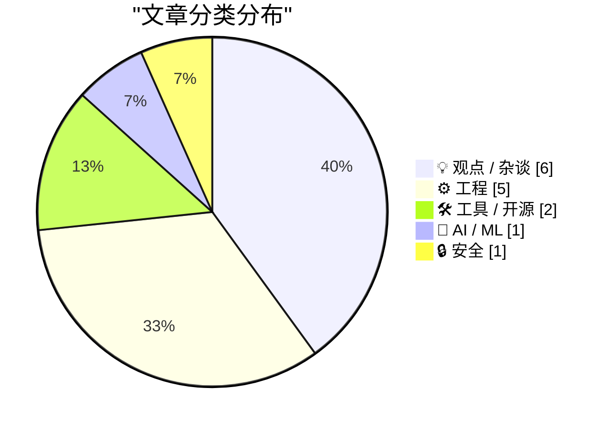
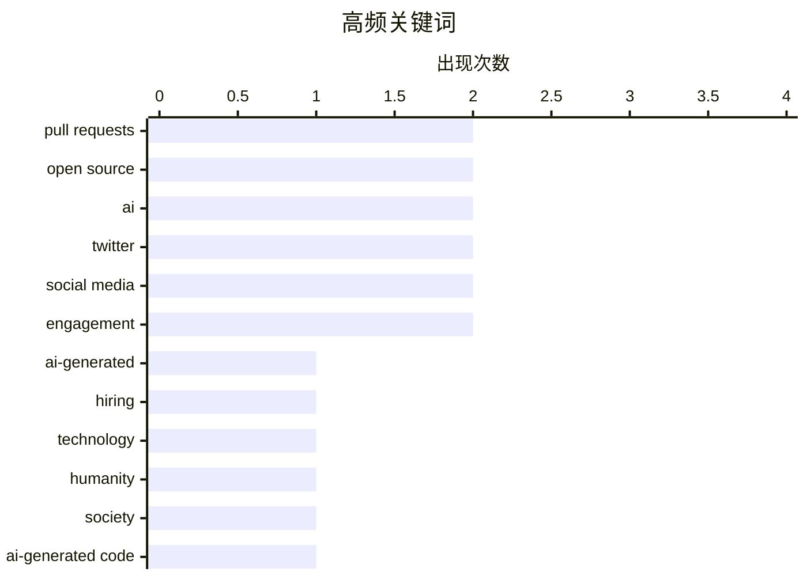

# 📰 AI 博客每日精选 — 2026-06-06

> 来自 Karpathy 推荐的 92 个顶级技术博客，AI 精选 Top 15

## 📝 今日看点

今日技术圈聚焦于AI狂潮引发的连锁反噬：开源社区因AI生成的低质量PR泛滥而关闭公共贡献通道，揭示出用贡献量衡量能力的评价体系已严重失真。与此同时，对AI泡沫的批判声浪愈发尖锐，巨额投资与真实产出间的鸿沟暴露了风险叙事下的非理性繁荣。更深层地，行业开始反思过度依赖AI决策会导致人类决断力退化，技术应成为映照人性而非替代人性的镜子，供应链安全与基础设施的可靠性亦在此时被重新摆上台面。

---

## 🏆 今日必读

🥇 **为什么这么多PR？**

[Why all the PRs?](https://idiallo.com/blog/why-all-the-prs) — idiallo.com · 1 小时前 · ⚙️ 工程

> AI生成的拉取请求（PR）泛滥，根源在于行业将公开代码贡献作为简历筛选的信号。过去，开发者通过个人网站展示技能，如今招聘体系鼓励用PR数量证明能力，促使大量人员使用AI批量提交低质量PR。这种扭曲的信号机制稀释了开源贡献的真实价值，使审阅者不堪重负。作者指出，必须重新思考如何评估开发者，不再盲目崇拜PR计数。

💡 **为什么值得读**: 一针见血地揭示了AI垃圾PR背后的求职文化困境，对任何参与开源或技术招聘的人都有警醒意义。

🏷️ pull requests, AI-generated, hiring, open source

🥈 **精炼人性**

[Pluralistic: Refining humanity (05 Jun 2026)](https://pluralistic.net/2026/06/05/defining-humanity/) — pluralistic.net · 3 小时前 · 💡 观点 / 杂谈

> 技术发展不断迫使我们重新定义何以为人，AI在更多任务上的超越性表现恰恰照亮了人类独有的特质。作者指出，同理心、创造力、不可预测性等品质无法也不应被自动化替代，技术是一面镜子，反映出我们不能被简化为可优化指标的部分。在AI时代，校准对人性的理解比以往更加紧迫。

💡 **为什么值得读**: 从哲学视角审视技术与人性的边界，为AI狂热提供了一剂清醒的人文反思。

🏷️ technology, humanity, AI, society

🥉 **引述Andreas Kling**

[Quoting Andreas Kling](https://simonwillison.net/2026/Jun/5/andreas-kling/#atom-everything) — simonwillison.net · 13 小时前 · ⚙️ 工程

> Ladybird浏览器项目宣布停止接受公开拉取请求，以应对AI生成的低质量贡献。曾经，大量代码意味着大量努力，这种假设已不再成立。代码由人编写还是AI生成已非关键，真正重要的是进入浏览器后由谁负责。随着Ladybird向真实用户浏览器演进，维护者必须为每行代码担责，因此转向更严格的内部开发流程。

💡 **为什么值得读**: 展示了一个开源项目在AI冲击下为保质量所做的艰难决策，直击责任归属的核心问题。

🏷️ open source, pull requests, AI-generated code, Ladybird

---

## 📊 数据概览

| 扫描源 | 抓取文章 | 时间范围 | 精选 |
|:---:|:---:|:---:|:---:|
| 69/92 | 2253 篇 → 19 篇 | 24h | **15 篇** |

### 分类分布



### 高频关键词



<details>
<summary>📈 纯文本关键词图（终端友好）</summary>

```
pull requests │ ████████████████████ 2
open source   │ ████████████████████ 2
ai            │ ████████████████████ 2
twitter       │ ████████████████████ 2
social media  │ ████████████████████ 2
engagement    │ ████████████████████ 2
ai-generated  │ ██████████░░░░░░░░░░ 1
hiring        │ ██████████░░░░░░░░░░ 1
technology    │ ██████████░░░░░░░░░░ 1
humanity      │ ██████████░░░░░░░░░░ 1
```

</details>

### 🏷️ 话题标签

**pull requests**(2) · **open source**(2) · **ai**(2) · twitter(2) · social media(2) · engagement(2) · ai-generated(1) · hiring(1) · technology(1) · humanity(1) · society(1) · ai-generated code(1) · ladybird(1) · ai bubble(1) · critique(1) · hype(1) · ip kvm(1) · homelab(1) · pikvm(1) · remote management(1)

---

## 💡 观点 / 杂谈

### 1. 精炼人性

[Pluralistic: Refining humanity (05 Jun 2026)](https://pluralistic.net/2026/06/05/defining-humanity/) — **pluralistic.net** · 3 小时前 · ⭐ 25/30

> 技术发展不断迫使我们重新定义何以为人，AI在更多任务上的超越性表现恰恰照亮了人类独有的特质。作者指出，同理心、创造力、不可预测性等品质无法也不应被自动化替代，技术是一面镜子，反映出我们不能被简化为可优化指标的部分。在AI时代，校准对人性的理解比以往更加紧迫。

🏷️ technology, humanity, AI, society

---

### 2. Premium: AI泡沫愤世指南 3.0

[Premium: The Hater's Guide To The AI Bubble 3.0](https://www.wheresyoured.at/premium-the-haters-guide-to-the-ai-bubble-3-0/) — **wheresyoured.at** · 8 小时前 · ⭐ 23/30

> 该系列第三篇延续对AI泡沫的尖锐批判，揭露巨额投资与实际产出之间的鸿沟、科技巨头的夸大承诺以及AI应用的真实局限。作者用讽刺笔法剖析行业中的非理性繁荣，指出风险资本驱动的叙事远超前方的技术落地。核心观点提醒人们，泡沫终会破裂，真相可能远比宣传更令人失望。

🏷️ AI bubble, critique, hype

---

### 3. AI决策瘫痪是一个递归陷阱，别陷进去

[AI-indecision is a recursive trap. Don't get stuck.](https://www.joanwestenberg.com/ai-indecision-is-a-recursive-trap-dont-get-stuck/) — **joanwestenberg.com** · 20 小时前 · ⭐ 20/30

> AI 工具承诺优化每个决策，反而将简单选择推向无尽递归，如同布里丹之驴在两个完全理性的选项间饿死。不断要求 AI 生成更多选项、反复比较，只会削弱人类决断力，让本应快速完成的选择沦为无限循环。作者强调，必须保留做出不完美决定的勇气，主动关闭 AI 建议，才能防止心智被算法诱入瘫痪。

🏷️ AI, decision-making, philosophy

---

### 4. Elon Musk’s X Is a Freak Show

[Elon Musk’s X Is a Freak Show](https://www.natesilver.net/p/social-media-has-become-a-freak-show) — **daringfireball.net** · 4 小时前 · ⭐ 17/30

> Nate Silver, back in April, under the headline “Social Media Is Turning Into a Freak Show”, where by “social media” he mostly discusses Twitter/X:


  But what does that remaining traffic consist of? 

🏷️ Twitter, social media, Nate Silver, engagement

---

### 5. Checking in on Perplexity

[Checking in on Perplexity](https://daringfireball.net/linked/2025/08/05/regarding-those-rumors-of-apple-pursuing-an-acquisition-of-perplexity) — **daringfireball.net** · 9 小时前 · ⭐ 17/30

> Yours truly, last August:


  I can’t see why Apple would want to get involved with a company
like this though. Gurman’s report makes it sound like his sources
are inside Apple, but man, this “Apple +

🏷️ Perplexity, Apple, AI search

---

### 6. Nieman Journalism Lab: Twitter/X Punishes Accounts That Post Links

[Nieman Journalism Lab: Twitter/X Punishes Accounts That Post Links](https://www.niemanlab.org/2026/04/do-links-hurt-news-publishers-on-twitter-our-analysis-suggests-yes/) — **daringfireball.net** · 3 小时前 · ⭐ 16/30

> Laura Hazard Owen, writing for Nieman Journalism Lab back in April:


  I used Claude to help me scrape the 200 most recent tweets from 18
large publishers’ X accounts and track the engagement (likes 

🏷️ Twitter, social media, links, engagement

---

## ⚙️ 工程

### 7. 为什么这么多PR？

[Why all the PRs?](https://idiallo.com/blog/why-all-the-prs) — **idiallo.com** · 1 小时前 · ⭐ 25/30

> AI生成的拉取请求（PR）泛滥，根源在于行业将公开代码贡献作为简历筛选的信号。过去，开发者通过个人网站展示技能，如今招聘体系鼓励用PR数量证明能力，促使大量人员使用AI批量提交低质量PR。这种扭曲的信号机制稀释了开源贡献的真实价值，使审阅者不堪重负。作者指出，必须重新思考如何评估开发者，不再盲目崇拜PR计数。

🏷️ pull requests, AI-generated, hiring, open source

---

### 8. 引述Andreas Kling

[Quoting Andreas Kling](https://simonwillison.net/2026/Jun/5/andreas-kling/#atom-everything) — **simonwillison.net** · 13 小时前 · ⭐ 23/30

> Ladybird浏览器项目宣布停止接受公开拉取请求，以应对AI生成的低质量贡献。曾经，大量代码意味着大量努力，这种假设已不再成立。代码由人编写还是AI生成已非关键，真正重要的是进入浏览器后由谁负责。随着Ladybird向真实用户浏览器演进，维护者必须为每行代码担责，因此转向更严格的内部开发流程。

🏷️ open source, pull requests, AI-generated code, Ladybird

---

### 9. Mastodon反向代理激进缓存：缓存策略与内容协商陷阱

[Aggressive caching for a Mastodon reverse proxy: what to cache, what to never cache, and why content negotiation will eventually betray you](https://it-notes.dragas.net/2026/06/05/aggressive_caching_for_a_mastodon_reverse_proxy/) — **it-notes.dragas.net** · 15 小时前 · ⭐ 21/30

> 为联邦宇宙实例设置激进缓存可大幅减轻源站负载，但必须精细区分可缓存与绝不可缓存的内容，尤其是用户特定数据。作者发现 ActivityPub 的内容协商机制（如 Accept 头）会让反向代理的缓存键复杂化，稍有不慎便导致缓存污染或错误响应。文章提供了基于 Content-Type 和 Vary 头的具体规则，并指出对这种协议特质的误判最终会背叛你的缓存预期。

🏷️ caching, Mastodon, reverse-proxy, content-negotiation

---

### 10. The back cover of C++: The Programming Language also raises questions not answered by the front cover

[The back cover of C++: The Programming Language also raises questions not answered by the front cover](https://devblogs.microsoft.com/oldnewthing/20260605-01/?p=112391) — **devblogs.microsoft.com/oldnewthing** · 10 小时前 · ⭐ 16/30

> Not doing the reading.
The post The back cover of <I>C++: The Programming Language</I> also raises questions not answered by the front cover appeared first on The Old New Thing.

🏷️ C++, programming, book, history

---

### 11. Rotation revisited: Avoiding having to calculate the gcd when doing cycle decomposition

[Rotation revisited: Avoiding having to calculate the gcd when doing cycle decomposition](https://devblogs.microsoft.com/oldnewthing/20260605-00/?p=112389) — **devblogs.microsoft.com/oldnewthing** · 10 小时前 · ⭐ 16/30

> Math is hard. Let's go counting!
The post Rotation revisited: Avoiding having to calculate the gcd when doing cycle decomposition appeared first on The Old New Thing.

🏷️ algorithm, rotation, gcd, cycle-decomposition

---

## 🛠 工具 / 开源

### 12. 我测试了家庭实验室中的每一款IP KVM

[I tested every IP KVM in my Homelab](https://www.jeffgeerling.com/blog/2026/i-tested-every-ip-kvm/) — **jeffgeerling.com** · 10 小时前 · ⭐ 22/30

> Jeff Geerling 从PiKVM出发，实测了市面上几乎所有的IP KVM设备，详细对比了它们的构建质量、功能与适用场景。IP KVM相比远程桌面或VNC的核心优势在于带外访问能力，可在操作系统死机时远程控制电源、进入BIOS。文章给出了针对不同需求的选型建议：轻度使用PiKVM足够，企业环境则有更多选项。

🏷️ IP KVM, homelab, PiKVM, remote management

---

### 13. 为你的Go应用注入Tigris超能力

[Giving your Go apps Tigris superpowers](https://www.tigrisdata.com/blog/storage-sdk-go/) — **xeiaso.net** · -4290 分钟前 · ⭐ 22/30

> Tigris 兼容 S3 协议，但其独有的桶分叉、快照、对象重命名等高级功能在标准 AWS SDK 中需要繁琐的变通才可实现。为此发布的官方 Go SDK 提供了两个层次：storage 包作为标准 S3 客户端的直接替代，原生支持 Tigris 特有能力；simplestorage 包则提供更高级的抽象，简化常见任务。Go 开发者现在能轻松解锁 Tigris 的差异化特性，告别对 AWS SDK 的 Hack。

🏷️ Go, Tigris, SDK, S3

---

## 🤖 AI / ML

### 14. JAX后端与设备

[JAX backends and devices](https://www.gilesthomas.com/2026/06/jax-backends-and-devices) — **gilesthomas.com** · 5 小时前 · ⭐ 19/30

> 在将 PyTorch LLM 代码移植到 JAX 的过程中，作者通过加载 19GiB 的 FineWeb 数据集，深入讲解了 JAX 的 backend 与 device 抽象。文章说明如何利用全局设备数组在多加速器上分片数据，以及 backend 如何负责实际的计算执行。同时给出了设备选择、数据放置和内存管理的实用代码示例，强调理解这些概念是发挥硬件全部潜力的前提。

🏷️ JAX, LLM, PyTorch, GPU

---

## 🔒 安全

### 15. 安装脚本允许列表：跨包管理器的安全机制调查

[Install-script allowlists](https://nesbitt.io/2026/06/05/install-script-allowlists.html) — **nesbitt.io** · 12 小时前 · ⭐ 19/30

> 文章调查了 npm、pip、cargo 等主流包管理器如何处理安装脚本带来的供应链风险。许多生态默认允许包安装后执行任意脚本，仅有部分工具引入细颗粒度的允许列表机制，让用户明确指定可信的包。对比揭示了各生态系统在默认安全策略上的显著差距，而安装脚本允许列表正成为关键的防御层，但广泛采用仍需时日。

🏷️ allowlist, package-manager, security, install-script

---

*生成于 2026-06-06 00:30 | 扫描 69 源 → 获取 2253 篇 → 精选 15 篇*
*基于 [Hacker News Popularity Contest 2025](https://refactoringenglish.com/tools/hn-popularity/) RSS 源列表，由 [Andrej Karpathy](https://x.com/karpathy) 推荐*
*由「懂点儿AI」制作，欢迎关注同名微信公众号获取更多 AI 实用技巧 💡*
