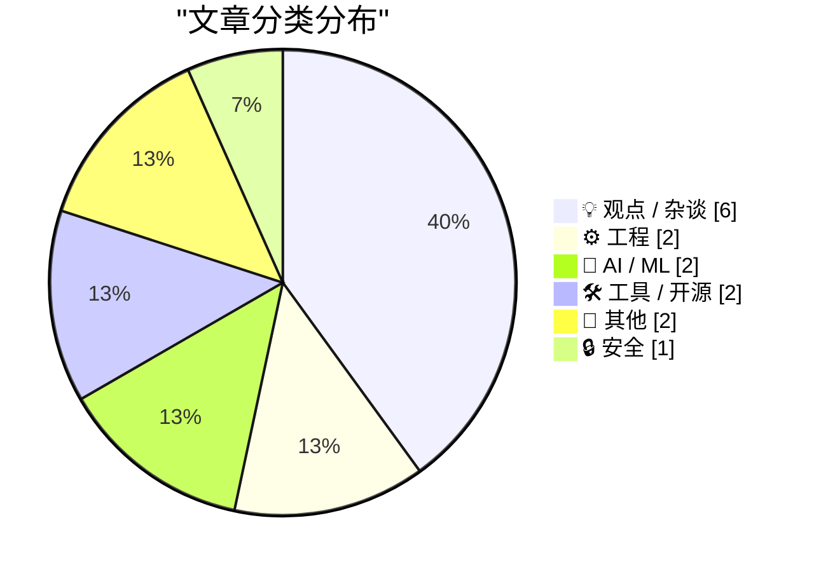
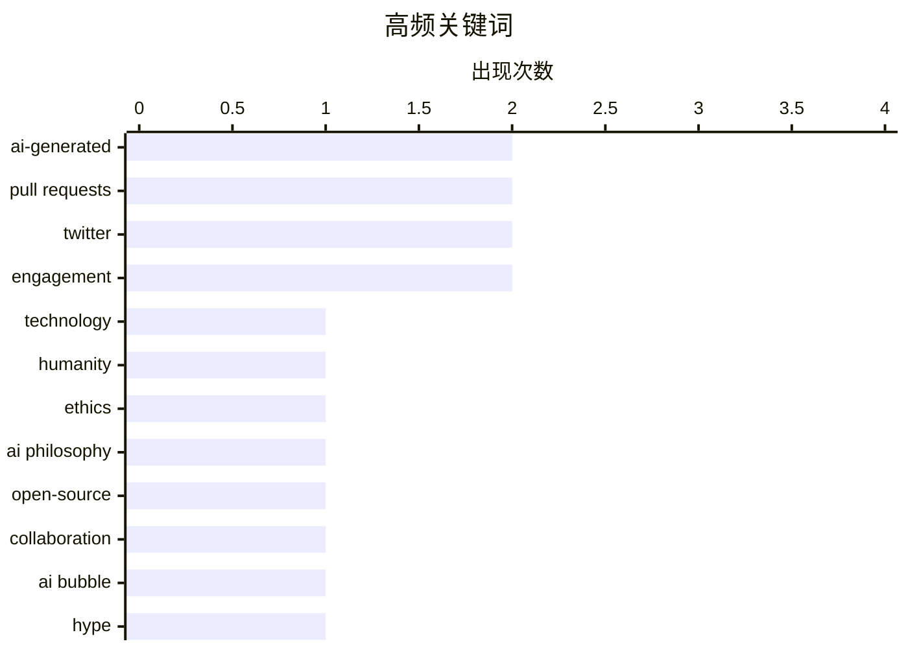

# 📰 AI 博客每日精选 — 2026-06-06

> 来自 Karpathy 推荐的 92 个顶级技术博客，AI 精选 Top 15

## 📝 今日看点

今日技术圈聚焦于AI对开源协作根基的冲击与行业泡沫的深层反思。多篇观察指出，AI生成代码的泛滥正扭曲贡献动机，迫使项目如Ladybird关闭公开PR以应对信任危机，而“简历驱动开发”的信号机制加剧了这一乱象。与此同时，对AI商业叙事的尖锐批判和对AI辅助决策导致人类陷入优柔寡断的哲学分析，共同揭示了技术狂奔下的人性困境。在喧嚣之外，从安装脚本安全管控到IP KVM的精细实测，则显示出业界对基础设施可控性的务实回归。

---

## 🏆 今日必读

🥇 **重塑人性**

[Pluralistic: Refining humanity (05 Jun 2026)](https://pluralistic.net/2026/06/05/defining-humanity/) — pluralistic.net · 3 小时前 · 💡 观点 / 杂谈

> 技术不仅定义了我们能做什么，更在不断揭示我们不是什么。当我们制造的工具能够完成曾经专属于人类的任务时，人性的边界反而被反向勾勒出来。核心论点在于，每一轮技术革新都是一次对人性的精炼——它剥离掉那些可自动化、可外包的能力，迫使我们追问什么是不可被技术同化的本质。作者通过多个历史与当代案例说明，技术焦虑的本质不是机器变得像人，而是人曾经被异化为机器的历史创伤。最终结论是，真正的威胁从来不是智能的机器，而是将人当作机器使用的体系。

💡 **为什么值得读**: 这篇文章提供了一个审视AI焦虑的逆向视角——不是看技术获得了什么，而是看技术让我们看清了自己失去了什么，对当下技术恐慌有哲学层面的解毒作用。

🏷️ technology, humanity, ethics, AI philosophy

🥈 **Andreas Kling谈Ladybird浏览器的开发模式变革**

[Quoting Andreas Kling](https://simonwillison.net/2026/Jun/5/andreas-kling/#atom-everything) — simonwillison.net · 13 小时前 · ⚙️ 工程

> Ladybird浏览器项目宣布将不再接受公开的Pull Request，这一决策源于一个核心判断的失效：过去，一份大型补丁意味着大量手工努力，而这种努力是善意贡献的可靠代理。在AI生成代码泛滥的当下，这个假设已不再成立，代码是否手工编写已无关紧要。真正重要的是，一旦代码进入浏览器，谁将为其负责——Ladybird正在成为面向真实用户的浏览器，引入变更的人必须具备可追溯的责任归属。

💡 **为什么值得读**: 一个深受开源社区信赖的严肃浏览器项目，对AI生成代码的入侵给出了非常果断且逻辑清晰的应对方案，对同样面临贡献质量挑战的项目维护者很有参考价值。

🏷️ open-source, AI-generated, pull requests, collaboration

🥉 **AI泡沫厌恶者指南3.0**

[Premium: The Hater's Guide To The AI Bubble 3.0](https://www.wheresyoured.at/premium-the-haters-guide-to-the-ai-bubble-3-0/) — wheresyoured.at · 8 小时前 · 💡 观点 / 杂谈

> 这是对AI泡沫系列批判的第三卷续作。核心主题延续了对AI行业过度炒作、资本虚火与现实交付能力之间鸿沟的尖锐讽刺与分析。文章系统地拆解了当前AI叙事中的多个神话，指出大量资金被投入到没有可持续商业模式的应用中。作者的核心观点是，泡沫不在于技术本身毫无价值，而在于估值和期望远远跑赢了对技术局限性的清醒认知。

💡 **为什么值得读**: 如果你需要在铺天盖地的AI乐观叙事中寻找克制、犀利且证据充分的逆向观点，这篇辛辣的讽刺文章是最好的清醒剂。

🏷️ AI bubble, hype, criticism, tech industry

---

## 📊 数据概览

| 扫描源 | 抓取文章 | 时间范围 | 精选 |
|:---:|:---:|:---:|:---:|
| 76/92 | 2342 篇 → 19 篇 | 24h | **15 篇** |

### 分类分布



### 高频关键词



<details>
<summary>📈 纯文本关键词图（终端友好）</summary>

```
ai-generated  │ ████████████████████ 2
pull requests │ ████████████████████ 2
twitter       │ ████████████████████ 2
engagement    │ ████████████████████ 2
technology    │ ██████████░░░░░░░░░░ 1
humanity      │ ██████████░░░░░░░░░░ 1
ethics        │ ██████████░░░░░░░░░░ 1
ai philosophy │ ██████████░░░░░░░░░░ 1
open-source   │ ██████████░░░░░░░░░░ 1
collaboration │ ██████████░░░░░░░░░░ 1
```

</details>

### 🏷️ 话题标签

**ai-generated**(2) · **pull requests**(2) · **twitter**(2) · engagement(2) · technology(1) · humanity(1) · ethics(1) · ai philosophy(1) · open-source(1) · collaboration(1) · ai bubble(1) · hype(1) · criticism(1) · tech industry(1) · job market(1) · open source(1) · jax(1) · backends(1) · devices(1) · llm(1)

---

## 💡 观点 / 杂谈

### 1. 重塑人性

[Pluralistic: Refining humanity (05 Jun 2026)](https://pluralistic.net/2026/06/05/defining-humanity/) — **pluralistic.net** · 3 小时前 · ⭐ 27/30

> 技术不仅定义了我们能做什么，更在不断揭示我们不是什么。当我们制造的工具能够完成曾经专属于人类的任务时，人性的边界反而被反向勾勒出来。核心论点在于，每一轮技术革新都是一次对人性的精炼——它剥离掉那些可自动化、可外包的能力，迫使我们追问什么是不可被技术同化的本质。作者通过多个历史与当代案例说明，技术焦虑的本质不是机器变得像人，而是人曾经被异化为机器的历史创伤。最终结论是，真正的威胁从来不是智能的机器，而是将人当作机器使用的体系。

🏷️ technology, humanity, ethics, AI philosophy

---

### 2. AI泡沫厌恶者指南3.0

[Premium: The Hater's Guide To The AI Bubble 3.0](https://www.wheresyoured.at/premium-the-haters-guide-to-the-ai-bubble-3-0/) — **wheresyoured.at** · 8 小时前 · ⭐ 25/30

> 这是对AI泡沫系列批判的第三卷续作。核心主题延续了对AI行业过度炒作、资本虚火与现实交付能力之间鸿沟的尖锐讽刺与分析。文章系统地拆解了当前AI叙事中的多个神话，指出大量资金被投入到没有可持续商业模式的应用中。作者的核心观点是，泡沫不在于技术本身毫无价值，而在于估值和期望远远跑赢了对技术局限性的清醒认知。

🏷️ AI bubble, hype, criticism, tech industry

---

### 3. 我们为什么收到这么多AI生成的PR？

[Why all the PRs?](https://idiallo.com/blog/why-all-the-prs) — **idiallo.com** · 1 小时前 · ⭐ 23/30

> 大量AI生成的Pull Request涌向开源项目，根源在于一种被扭曲的职业信号机制。业界长期传递的信息是：要在求职中被认真对待，你必须公开展示自己的工作，导致简历驱动的开发行为盛行。过去这种信号要求真正的技能磨练——如搭建并长期维护个人网站，从而真正提升编程能力。而现在，AI工具让这种信号变得廉价且空洞，人们可以批量生成PR来伪造这个信号，却绕过了能力成长的过程。

🏷️ AI-generated, pull requests, job market, open source

---

### 4. AI导致的优柔寡断是一个递归陷阱，别陷进去

[AI-indecision is a recursive trap. Don't get stuck.](https://www.joanwestenberg.com/ai-indecision-is-a-recursive-trap-dont-get-stuck/) — **joanwestenberg.com** · 20 小时前 · ⭐ 22/30

> 以14世纪哲学家布里丹的意志理论为引子，探讨当代人在AI辅助决策时陷入的瘫痪状态。核心问题是，当AI提供无限优化选项时，理性个体反而陷入永远无法确定“更大善”的困境。作者指出，AI决策辅助制造了一种递归陷阱：你让它优化选择，它给出选项，你又让它优化这些选项，如此无限循环。结论是，挣脱这一陷阱需要重新承认人类意志的判断优先于理智的无限计算。

🏷️ AI, indecision, decision-making, philosophy

---

### 5. Nieman Journalism Lab: Twitter/X Punishes Accounts That Post Links

[Nieman Journalism Lab: Twitter/X Punishes Accounts That Post Links](https://www.niemanlab.org/2026/04/do-links-hurt-news-publishers-on-twitter-our-analysis-suggests-yes/) — **daringfireball.net** · 3 小时前 · ⭐ 19/30

> Laura Hazard Owen, writing for Nieman Journalism Lab back in April:


  I used Claude to help me scrape the 200 most recent tweets from 18
large publishers’ X accounts and track the engagement (likes 

🏷️ Twitter, links, engagement, algorithm

---

### 6. Elon Musk’s X Is a Freak Show

[Elon Musk’s X Is a Freak Show](https://www.natesilver.net/p/social-media-has-become-a-freak-show) — **daringfireball.net** · 4 小时前 · ⭐ 16/30

> Nate Silver, back in April, under the headline “Social Media Is Turning Into a Freak Show”, where by “social media” he mostly discusses Twitter/X:


  But what does that remaining traffic consist of? 

🏷️ social media, Twitter, engagement, media criticism

---

## ⚙️ 工程

### 7. Andreas Kling谈Ladybird浏览器的开发模式变革

[Quoting Andreas Kling](https://simonwillison.net/2026/Jun/5/andreas-kling/#atom-everything) — **simonwillison.net** · 13 小时前 · ⭐ 25/30

> Ladybird浏览器项目宣布将不再接受公开的Pull Request，这一决策源于一个核心判断的失效：过去，一份大型补丁意味着大量手工努力，而这种努力是善意贡献的可靠代理。在AI生成代码泛滥的当下，这个假设已不再成立，代码是否手工编写已无关紧要。真正重要的是，一旦代码进入浏览器，谁将为其负责——Ladybird正在成为面向真实用户的浏览器，引入变更的人必须具备可追溯的责任归属。

🏷️ open-source, AI-generated, pull requests, collaboration

---

### 8. 化身九尾妖狐重生为猫咪的我在森林里被击倒三次后终于找到了家，开始悠哉的冒险者生活

[Aggressive caching for a Mastodon reverse proxy: what to cache, what to never cache, and why content negotiation will eventually betray you](https://it-notes.dragas.net/2026/06/05/aggressive_caching_for_a_mastodon_reverse_proxy/) — **it-notes.dragas.net** · 15 小时前 · ⭐ 22/30

> 为Mastodon反向代理实施激进缓存策略：什么该缓存、什么绝对不能缓存，以及内容协商如何最终背叛你。作者详细拆解了在Mastodon这类联邦宇宙服务的反向代理层进行激进缓存时的技术细节。关键教训在于，基于HTTP Accept头的联邦协议内容协商机制会导致缓存键复杂化，稍有疏忽就会将ActivityPub的JSON响应错误地缓存为HTML页面，破坏实例间的联邦通信。文章给出了明确的白名单规则和绕过内容协商陷阱的配置方案。

🏷️ caching, reverse proxy, Mastodon, content negotiation

---

## 🤖 AI / ML

### 9. JAX后端与设备详解

[JAX backends and devices](https://www.gilesthomas.com/2026/06/jax-backends-and-devices) — **gilesthomas.com** · 5 小时前 · ⭐ 23/30

> 作者在将PyTorch大型语言模型代码移植到JAX的过程中，深入探索了JAX的后端和设备管理。具体挑战是加载一个超过19GiB的大型数据集——包含102.48亿个16位无符号整数的FineWeb-GPT2数据集。文章记录了在JAX中如何处理跨CPU、GPU和TPU等不同后端的内存分配、数据分片和计算调度问题。核心发现是通过亲手编写代码与框架交互，才能彻底厘清JAX在多设备环境下的工作机制。

🏷️ JAX, backends, devices, LLM

---

### 10. Checking in on Perplexity

[Checking in on Perplexity](https://daringfireball.net/linked/2025/08/05/regarding-those-rumors-of-apple-pursuing-an-acquisition-of-perplexity) — **daringfireball.net** · 9 小时前 · ⭐ 18/30

> Yours truly, last August:


  I can’t see why Apple would want to get involved with a company
like this though. Gurman’s report makes it sound like his sources
are inside Apple, but man, this “Apple +

🏷️ Perplexity, Apple, acquisition, AI search

---

## 🛠 工具 / 开源

### 11. 我测试了家庭实验室中几乎每一款IP KVM

[I tested every IP KVM in my Homelab](https://www.jeffgeerling.com/blog/2026/i-tested-every-ip-kvm/) — **jeffgeerling.com** · 10 小时前 · ⭐ 22/30

> 自2017年PiKVM问世以来，IP KVM设备迎来了爆发式增长，作者对市面上几乎所有的IP KVM进行了实测。文章比较了PiKVM、JetKVM、Nanokvm、Sipeed NanoKVM等众多产品在延迟、视频压缩质量、挂载虚拟媒体和价格方面的差异。核心结论是，虽然远程桌面和VNC可以解决部分问题，但IP KVM在BIOS级别控制、断电重启和系统重装等场景中具有不可替代的价值。作者根据不同使用需求给出了明确的购买建议。

🏷️ IP KVM, PiKVM, homelab, hardware review

---

### 12. 赋予你的Go应用Tigris超能力

[Giving your Go apps Tigris superpowers](https://www.tigrisdata.com/blog/storage-sdk-go/) — **xeiaso.net** · -4284 分钟前 · ⭐ 20/30

> Tigris虽然兼容S3协议，但其独有的Bucket分支、快照、对象重命名等高级功能需要绕道AWS SDK才能使用，极为繁琐。为此官方发布了Go语言原生SDK，提供两个层次的包：storage包作为标准S3客户端的直接替代，为Tigris特有操作提供了原生方法；simplestorage则是更上层的抽象。这使得Go开发者可以直接利用Tigris的差异化特性，而无需用S3兼容层做迂回实现。

🏷️ Tigris, Go SDK, S3, object storage

---

## 📝 其他

### 13. The back cover of C++: The Programming Language also raises questions not answered by the front cover

[The back cover of C++: The Programming Language also raises questions not answered by the front cover](https://devblogs.microsoft.com/oldnewthing/20260605-01/?p=112391) — **devblogs.microsoft.com/oldnewthing** · 10 小时前 · ⭐ 15/30

> Not doing the reading.
The post The back cover of <I>C++: The Programming Language</I> also raises questions not answered by the front cover appeared first on The Old New Thing.

🏷️ C++, programming language, book history, trivia

---

### 14. Mr. Bessel’s eponymous functions

[Mr. Bessel’s eponymous functions](https://www.johndcook.com/blog/2026/06/05/mr-bessels-eponymous-functions/) — **johndcook.com** · 12 小时前 · ⭐ 15/30

> Yesterday I wrote a post showing that the trapezoid rule evaluates the integral very efficiently. But how do we know what the exact integral is for comparison? If you ask Mathematica, it will tell you

🏷️ Bessel function, numerical integration, mathematics

---

## 🔒 安全

### 15. 安装脚本允许列表机制调查

[Install-script allowlists](https://nesbitt.io/2026/06/05/install-script-allowlists.html) — **nesbitt.io** · 12 小时前 · ⭐ 23/30

> 对不同包管理器和语言生态系统中的安装脚本允许列表机制进行了系统性调查。文章比较了pip、npm、cargo等主流包管理器在允许安装脚本执行时的安全控制手段。核心发现是，各生态对安装脚本的风险认知和管控粒度差异巨大，有些默认开放而有些需要显式白名单。结论指向一个趋势：随着供应链攻击加剧，更精细的允许列表策略正成为包管理安全的关键防线。

🏷️ install script, allowlist, package manager, supply chain

---

*生成于 2026-06-06 00:36 | 扫描 76 源 → 获取 2342 篇 → 精选 15 篇*
*基于 [Hacker News Popularity Contest 2025](https://refactoringenglish.com/tools/hn-popularity/) RSS 源列表，由 [Andrej Karpathy](https://x.com/karpathy) 推荐*
*由「懂点儿AI」制作，欢迎关注同名微信公众号获取更多 AI 实用技巧 💡*
