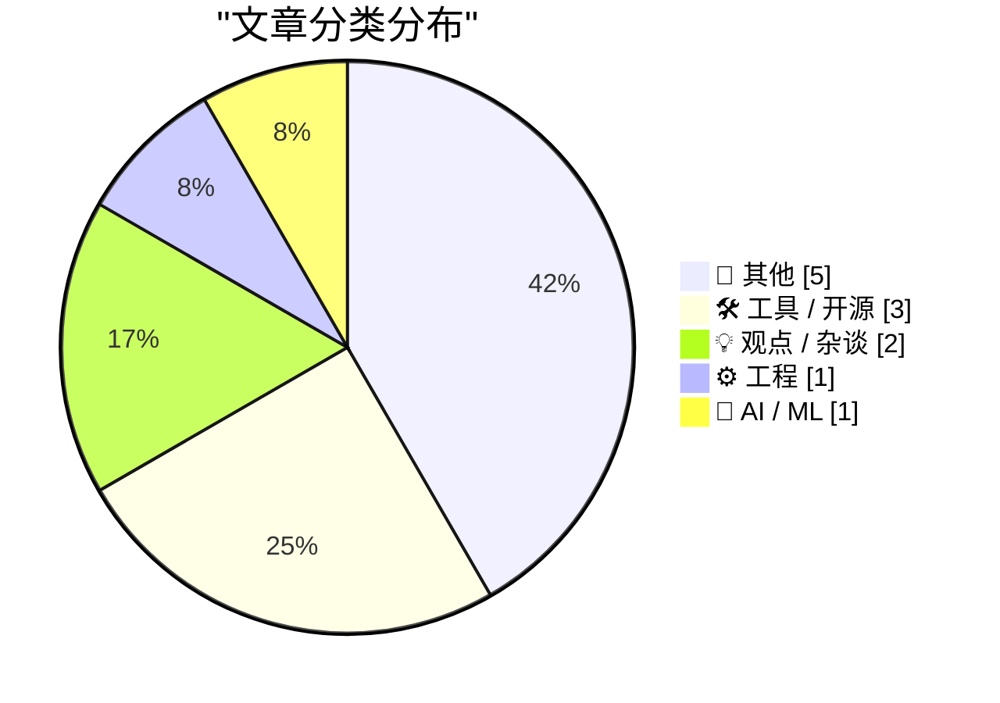
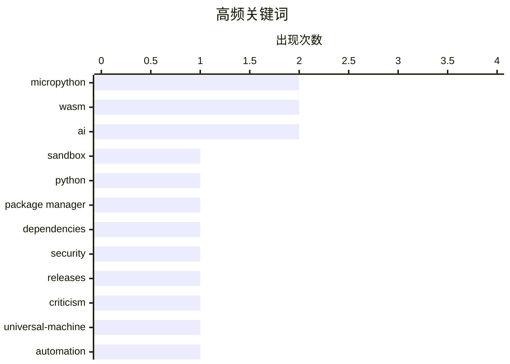

# 📰 AI 博客每日精选 — 2026-06-07

> 来自 Karpathy 推荐的 92 个顶级技术博客，AI 精选 Top 12

## 📝 今日看点

今日技术圈聚焦三大脉络：WebAssembly 沙箱与软件供应链安全形成加固基石的合力，从在浏览器中安全执行 Python 到多包生态集中应对漏洞劫持，隔离执行与依赖审查成为关键防线。与此同时，行业掀起理性祛魅浪潮，从对“万能 AI”的尖锐批判，到千兆宽带被反复证伪实际体验，集体反思过度承诺与技术泡沫。开放精神也在持续蔓延，有创作者主动取消付费墙，推动知识无障碍流通。

---

## 🏆 今日必读

🥇 **使用 MicroPython 和 WASM 在沙箱中运行 Python 代码**

[Running Python code in a sandbox with MicroPython and WASM](https://simonwillison.net/2026/Jun/6/micropython-in-a-sandbox/#atom-everything) — simonwillison.net · 20 小时前 · ⚙️ 工程

> Simon Willison 发布了 micropython-wasm 的 alpha 版本，通过将 MicroPython 编译为 WebAssembly，首次实现在浏览器沙箱中安全执行任意 Python 代码。该方案利用 Web Worker 隔离与超时机制，限制不受信任代码的资源占用，彻底避免服务器端执行的风险。新沙箱已被用于 Datasette Agent 的代码执行插件，并提供了 CLI 工具方便演示与调试。这个尝试整合了作者多年探索的全部期望特性，标志着客户端安全代码执行的重要一步。

💡 **为什么值得读**: 展示了一种在客户端安全运行用户代码的轻量级架构，对需要代码解释器的 Web 应用有直接借鉴价值。

🏷️ sandbox, micropython, wasm, python

🥈 **包管理周报：2026年6月6日**

[This Week in Package Management: 6 June 2026](https://nesbitt.io/2026/06/06/this-week-in-package-management.html) — nesbitt.io · 14 小时前 · 🛠 工具 / 开源

> 本周报汇总了 npm、PyPI、Cargo 等主要包生态的重要版本发布、安全通告和相关文章。重点包括若干关键包的漏洞修复与劫持事件应对，并讨论了依赖审查和供应链安全的最新趋势。报告以事件为线索串联信息，帮助开发者快速把握一周内的关键动态。

💡 **为什么值得读**: 一站式获取跨语言包管理的最新安全与发布情报，省去逐源追踪的时间。

🏷️ package manager, dependencies, security, releases

🥉 **多元主义：批判万能机器 (2026年6月6日)**

[Pluralistic: Criticizing the everything machine (06 Jun 2026)](https://pluralistic.net/2026/06/06/applied-counterescatology/) — pluralistic.net · 6 小时前 · 🤖 AI / ML

> Cory Doctorow 批判当前将技术塑造成“万能机器”的叙事，指出这种宣传掩盖了 AI 系统的实际局限和负面后果。他通过“切片、切块甚至造回形针”的比喻，揭示功能分散背后的过度承诺与风险。文章强调必须对技术进行真正批判，拒绝盲目的技术崇拜，并给出了对 Paperclip Maximizer 等思想实验的当代回响。

💡 **为什么值得读**: 以辛辣的讽刺解构 AI 万能论，为技术热潮提供冷静的反对声音。

🏷️ ai, criticism, universal-machine, automation

---

## 📊 数据概览

| 扫描源 | 抓取文章 | 时间范围 | 精选 |
|:---:|:---:|:---:|:---:|
| 76/92 | 2342 篇 → 12 篇 | 24h | **12 篇** |

### 分类分布



### 高频关键词



<details>
<summary>📈 纯文本关键词图（终端友好）</summary>

```
micropython     │ ████████████████████ 2
wasm            │ ████████████████████ 2
ai              │ ████████████████████ 2
sandbox         │ ██████████░░░░░░░░░░ 1
python          │ ██████████░░░░░░░░░░ 1
package manager │ ██████████░░░░░░░░░░ 1
dependencies    │ ██████████░░░░░░░░░░ 1
security        │ ██████████░░░░░░░░░░ 1
releases        │ ██████████░░░░░░░░░░ 1
criticism       │ ██████████░░░░░░░░░░ 1
```

</details>

### 🏷️ 话题标签

**micropython**(2) · **wasm**(2) · **ai**(2) · sandbox(1) · python(1) · package manager(1) · dependencies(1) · security(1) · releases(1) · criticism(1) · universal-machine(1) · automation(1) · cli(1) · release(1) · go(1) · sdk(1) · tigris(1) · s3(1) · kepler(1) · bessel(1)

---

## 📝 其他

### 1. 从开普勒到贝塞尔

[From Kepler to Bessel](https://www.johndcook.com/blog/2026/06/06/from-kepler-to-bessel/) — **johndcook.com** · 5 小时前 · ⭐ 18/30

> 贝塞尔函数的积分表示源于求解开普勒方程，该方程用于描述行星在椭圆轨道上的位置。本文深入细节，展示了如何从开普勒方程——具有历史命名的轨道描述——出发，推导出贝塞尔函数的积分形式，揭示了天文学与特殊函数之间的深层联系。

🏷️ kepler, bessel, mathematics, history

---

### 2. 阅读清单 2026年6月6日

[Reading List 06/06/26](https://www.construction-physics.com/p/reading-list-060626) — **construction-physics.com** · 12 小时前 · ⭐ 15/30

> 本周阅读清单涵盖五篇跨领域文章：聊天机器人取代房地产经纪人、中国人工钻石产业观察、澳大利亚电池储能项目进展、Meta 数据中心帐篷式建筑，以及更多链接。清单以简短介绍串联各篇，方便快速决定阅读优先级。

🏷️ AI, chatbots, data centers, synthetic diamonds

---

### 3. 更新：终止付费订阅，拥抱免费与开放

[Update: ending paid subscriptions, + Substack](https://www.joanwestenberg.com/update-ending-paid-subscriptions-substack/) — **joanwestenberg.com** · 52 分钟前 · ⭐ 8/30

> Joan Westenberg 宣布停止所有付费订阅，不再将写作置于付费墙后。她表示希望自己的作品保持免费、公开，任何觉得有用的人都能无障碍阅读。同期她也在 Substack 发布内容，推动知识开放。

🏷️ newsletter, substack, paywall, subscription

---

### 4. 三位《60分钟》记者决定留任，但对节目价值与独立性的损害深感失望

[60 Minutes Correspondents Lesley Stahl, Bill Whitaker, and the Other Guy Will Stay at Show](https://www.nytimes.com/2026/06/05/business/media/60-minutes-cbs-stahl-whitaker-wertheim.html?unlocked_article_code=1.oFA.xooG.Pz8cQv8odz7Z) — **daringfireball.net** · 3 小时前 · ⭐ 6/30

> 莱斯莉·斯塔尔、比尔·惠特克和乔恩·沃特海姆在致《60分钟》员工的备忘录中宣布，在经历被解雇的制片人风波后，他们决定留在节目。两位备受尊重的制片人坦娅和德拉甘因坚持《60分钟》的价值观、捍卫独立与诚信而被无理解雇，管理层至今未给出任何解释。三位记者表示对事件“深感不安”，但仍选择留下来继续坚守新闻理想。这一选择折射出顶级新闻人在机构性压力与个人职业信念之间的艰难权衡。

🏷️ media, cbs, 60-minutes

---

### 5. 特朗普律师称总统有权拆毁自由女神像而完全不受司法挑战

[Trump Lawyer Argues Trump Can Tear Down Statue of Liberty](https://talkingpointsmemo.com/edblog/trump-can-tear-down-statue-of-liberty-says-trump-lawyer) — **daringfireball.net** · 4 小时前 · ⭐ 5/30

> 在关于特朗普总统推倒白宫东翼并计划修建大型宴会厅的听证会上，联邦上诉法院法官帕特里夏·米利特提出一个尖锐假设：总统是否也可以拆毁自由女神像而不受任何法律追诉。司法部律师雅科夫·罗思明确回答“是的”，总统可以明天就动手，无人能阻拦。这一问答直击总统豁免权主张的极限边界，将“统一行政理论”推至极其荒谬却逻辑自洽的极端场景，暴露了当前司法辩论中权力制衡的深层危机。

🏷️ trump, statue-of-liberty, legal

---

## 🛠 工具 / 开源

### 6. 包管理周报：2026年6月6日

[This Week in Package Management: 6 June 2026](https://nesbitt.io/2026/06/06/this-week-in-package-management.html) — **nesbitt.io** · 14 小时前 · ⭐ 23/30

> 本周报汇总了 npm、PyPI、Cargo 等主要包生态的重要版本发布、安全通告和相关文章。重点包括若干关键包的漏洞修复与劫持事件应对，并讨论了依赖审查和供应链安全的最新趋势。报告以事件为线索串联信息，帮助开发者快速把握一周内的关键动态。

🏷️ package manager, dependencies, security, releases

---

### 7. micropython-wasm 0.1a2

[micropython-wasm 0.1a2](https://simonwillison.net/2026/Jun/6/micropython-wasm/#atom-everything) — **simonwillison.net** · 19 小时前 · ⭐ 21/30

> micropython-wasm 0.1a2 版本发布，新增命令行界面工具。该 CLI 允许在终端直接启动沙箱并运行 Python 代码，灵感来源于同一作者的博客文章中对沙箱功能的说明，旨在提供更便捷的测试与演示体验。此版本延续了前一日发布的沙箱核心机制。

🏷️ micropython, wasm, cli, release

---

### 8. 给你的 Go 应用赋予 Tigris 超能力

[Giving your Go apps Tigris superpowers](https://www.tigrisdata.com/blog/storage-sdk-go/) — **xeiaso.net** · -2877 分钟前 · ⭐ 21/30

> Tigris 推出官方 Go SDK，以直接调用其独有的对象存储功能，如存储桶分叉、快照和对象重命名。该 SDK 提供两个模块：storage 包是标准 S3 客户端的直接替换，内置 Tigris 专用方法；simplestorage 包则是更高级别的简化 API。开发者无需再用 AWS SDK 的冗长变通方案即可获得这些“超能力”。

🏷️ go, sdk, tigris, s3

---

## 💡 观点 / 杂谈

### 9. 追求有益的困难

[In pursuit of desirable difficulties](https://www.joanwestenberg.com/in-pursuit-of-desirable-difficulties/) — **joanwestenberg.com** · 22 小时前 · ⭐ 17/30

> 心理学家 Robert Bjork 提出“有益的困难”概念，主张学习时适当增加提取难度能显著增强长期记忆。研究显示，费力检索答案的学生比轻松获得答案的学生记得更牢、更清晰。文章探讨了这一反直觉原理在教育、培训和个人精进中的实践方式。

🏷️ learning, psychology, desirable-difficulties, education

---

### 10. 千兆宽带仍然毫无意义

[There's still no point in gigabit broadband](https://shkspr.mobi/blog/2026/06/theres-still-no-point-in-gigabit-broadband/) — **shkspr.mobi** · 12 小时前 · ⭐ 13/30

> 作者六年后再次审视千兆宽带，虽然每月仅需 30 英镑获得了 Gig1 套餐，但实际体验发现视频流、游戏和日常浏览的带宽需求远低于 1Gbps。在多数家庭场景下，超高带宽带来的可感知收益几乎为零。结论仍然是：千兆宽带对普通用户仍是营销噱头，没有实际意义。

🏷️ gigabit, broadband, networking, opinion

---

## ⚙️ 工程

### 11. 使用 MicroPython 和 WASM 在沙箱中运行 Python 代码

[Running Python code in a sandbox with MicroPython and WASM](https://simonwillison.net/2026/Jun/6/micropython-in-a-sandbox/#atom-everything) — **simonwillison.net** · 20 小时前 · ⭐ 25/30

> Simon Willison 发布了 micropython-wasm 的 alpha 版本，通过将 MicroPython 编译为 WebAssembly，首次实现在浏览器沙箱中安全执行任意 Python 代码。该方案利用 Web Worker 隔离与超时机制，限制不受信任代码的资源占用，彻底避免服务器端执行的风险。新沙箱已被用于 Datasette Agent 的代码执行插件，并提供了 CLI 工具方便演示与调试。这个尝试整合了作者多年探索的全部期望特性，标志着客户端安全代码执行的重要一步。

🏷️ sandbox, micropython, wasm, python

---

## 🤖 AI / ML

### 12. 多元主义：批判万能机器 (2026年6月6日)

[Pluralistic: Criticizing the everything machine (06 Jun 2026)](https://pluralistic.net/2026/06/06/applied-counterescatology/) — **pluralistic.net** · 6 小时前 · ⭐ 22/30

> Cory Doctorow 批判当前将技术塑造成“万能机器”的叙事，指出这种宣传掩盖了 AI 系统的实际局限和负面后果。他通过“切片、切块甚至造回形针”的比喻，揭示功能分散背后的过度承诺与风险。文章强调必须对技术进行真正批判，拒绝盲目的技术崇拜，并给出了对 Paperclip Maximizer 等思想实验的当代回响。

🏷️ ai, criticism, universal-machine, automation

---

*生成于 2026-06-07 00:03 | 扫描 76 源 → 获取 2342 篇 → 精选 12 篇*
*基于 [Hacker News Popularity Contest 2025](https://refactoringenglish.com/tools/hn-popularity/) RSS 源列表，由 [Andrej Karpathy](https://x.com/karpathy) 推荐*
*由「懂点儿AI」制作，欢迎关注同名微信公众号获取更多 AI 实用技巧 💡*
