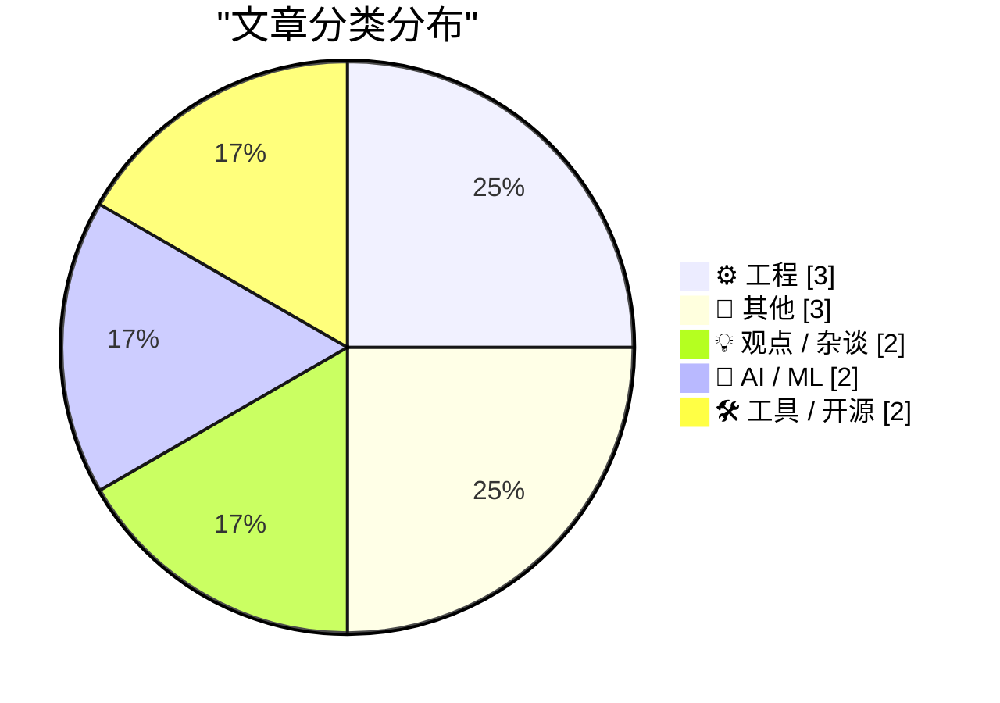
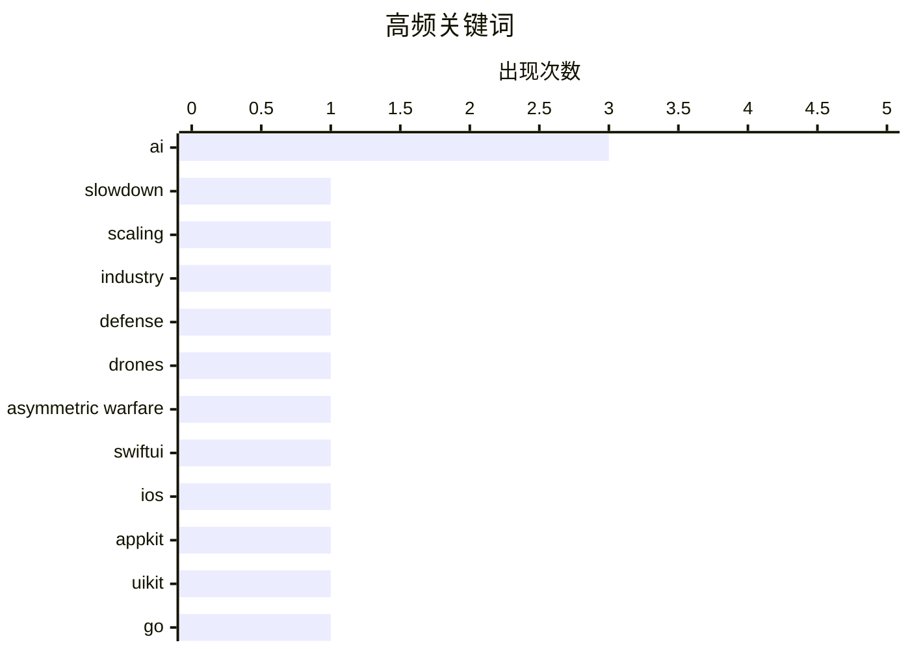

# 📰 AI 博客每日精选 — 2026-06-09

> 来自 Karpathy 推荐的 92 个顶级技术博客，AI 精选 Top 12

## 📝 今日看点

今日技术圈聚焦两大动向：一是AI热潮的理性降温，从基础模型的Scaling Law回报递减蔓延到消费产品可感知提升的乏力，苹果Siri AI屡屡失信的“前车之鉴”更让业界对宏大承诺保持集体怀疑；二是开发者工具的反思浪潮，SwiftUI推出七年仍被批评“让烂应用变容易”，而包管理器专利汇编则暴露了“简化开发”之路的暗礁与壁垒。穿插其间的历史冷知识，从域名连字符的规则考古到80年代PC兼容机厂商的兴衰，恰好提醒人们：技术圈的许多冲动与阵痛，往往早有历史注脚。

---

## 🏆 今日必读

🥇 **AI发展正在放缓**

[AI Is Slowing Down](https://www.wheresyoured.at/ai-is-slowing-down/) — wheresyoured.at · 9 小时前 · 💡 观点 / 杂谈

> AI能力提升的曲线正在明显减速，而非加速。Scaling Law的回报递减已从实验室蔓延到消费产品，GPT-4到GPT-5的跳跃远不如前几代显著，用户可感知的进步越来越小。核心原因在于高质量人类生成训练数据几近耗尽，转向合成数据后模型出现"同质化崩溃"，输出越来越趋同平庸。OpenAI内部模型o2 Pro仅比o1提升35%，而成本高出300%，经济账已经算不过来。AI产业正进入"后scaling"时代，范式级飞跃可能已经过去，接下来是渐进式改进和特定领域工具化的阶段。

💡 **为什么值得读**: 这篇文章尖锐地挑战了AI正指数级进化并很快超越人类的主流叙事，用具体指标和产业数据揭示了合成数据的隐性成本与模型同质化问题，对评估AI产业投资泡沫极具参考价值。

🏷️ AI, slowdown, scaling, industry

🥈 **斯坦福2026年国防黑客课程：经验教训报告**

[Hacking for Defense @ Stanford 2026 – Lessons Learned Presentations](https://steveblank.com/2026/06/08/g-for-defense-stanford-2026-lessons-learned-presentations/) — steveblank.com · 12 小时前 · 🤖 AI / ML

> 这是斯坦福Hacking for Defense课程第11年的结课总结，课程面貌因非对称战争、无人机、商用现货技术和AI的冲击而大为不同。学生在国防部实际问题中应用精益创业方法论，快速迭代解决方案，直面采购流程、用户获取和技术验证等真实挑战。课程强调了初创友好的国防采购体系如何让民间技术更快进入战场，非传统承包商正在重塑国防科技生态。

💡 **为什么值得读**: 斯坦福这门课程已成为连接硅谷创新文化与国防体系的标杆性教育项目，第11年的总结揭示了军民融合的前沿趋势和可复制的方法论框架。

🏷️ defense, AI, drones, asymmetric warfare

🥉 **SwiftUI只会让开发烂应用变得容易**

[★ SwiftUI Only Makes It Easy to Develop Bad Apps](https://daringfireball.net/2026/06/swiftui_only_makes_it_easy_to_develop_bad_apps) — daringfireball.net · 23 小时前 · ⚙️ 工程

> John Gruber对SwiftUI给出了尖锐批评：推出七年后，SwiftUI依然只能轻松构建体验糟糕的应用，与苹果曾经"让开发优秀原生应用变简单"的理念背道而驰。对比AppKit和UIKit至今仍能让开发者产出符合平台惯例的高质量应用，SwiftUI在UI精雕细琢、平台特性遵循方面始终残缺不全。他认为苹果的开发者信息传递已从"容易做好"退化到"容易做出来就行"，SwiftUI是为演示与教程设计的框架，而非为真实产品设计。

💡 **为什么值得读**: 这是对SwiftUI最直言不讳的资深批评之一，Gruber触及了苹果生态开发者体验的根本性断裂，对于正在SwiftUI和UIKit间做技术选型的团队是重要参考。

🏷️ SwiftUI, iOS, AppKit, UIKit

---

## 📊 数据概览

| 扫描源 | 抓取文章 | 时间范围 | 精选 |
|:---:|:---:|:---:|:---:|
| 79/92 | 2387 篇 → 12 篇 | 24h | **12 篇** |

### 分类分布



### 高频关键词



<details>
<summary>📈 纯文本关键词图（终端友好）</summary>

```
ai                 │ ████████████████████ 3
slowdown           │ ███████░░░░░░░░░░░░░ 1
scaling            │ ███████░░░░░░░░░░░░░ 1
industry           │ ███████░░░░░░░░░░░░░ 1
defense            │ ███████░░░░░░░░░░░░░ 1
drones             │ ███████░░░░░░░░░░░░░ 1
asymmetric warfare │ ███████░░░░░░░░░░░░░ 1
swiftui            │ ███████░░░░░░░░░░░░░ 1
ios                │ ███████░░░░░░░░░░░░░ 1
appkit             │ ███████░░░░░░░░░░░░░ 1
```

</details>

### 🏷️ 话题标签

**ai**(3) · **slowdown**(1) · **scaling**(1) · industry(1) · defense(1) · drones(1) · asymmetric warfare(1) · swiftui(1) · ios(1) · appkit(1) · uikit(1) · go(1) · sdk(1) · tigris(1) · s3(1) · siri(1) · apple(1) · wwdc(1) · domain names(1) · hyphen(1)

---

## ⚙️ 工程

### 1. SwiftUI只会让开发烂应用变得容易

[★ SwiftUI Only Makes It Easy to Develop Bad Apps](https://daringfireball.net/2026/06/swiftui_only_makes_it_easy_to_develop_bad_apps) — **daringfireball.net** · 23 小时前 · ⭐ 21/30

> John Gruber对SwiftUI给出了尖锐批评：推出七年后，SwiftUI依然只能轻松构建体验糟糕的应用，与苹果曾经"让开发优秀原生应用变简单"的理念背道而驰。对比AppKit和UIKit至今仍能让开发者产出符合平台惯例的高质量应用，SwiftUI在UI精雕细琢、平台特性遵循方面始终残缺不全。他认为苹果的开发者信息传递已从"容易做好"退化到"容易做出来就行"，SwiftUI是为演示与教程设计的框架，而非为真实产品设计。

🏷️ SwiftUI, iOS, AppKit, UIKit

---

### 2. 域名里到底能有多少个连续连字符？

[How many consecutive hyphens can you have in a domain name?](https://shkspr.mobi/blog/2026/06/how-many-consecutive-hyphens-can-you-have-in-a-domain-name/) — **shkspr.mobi** · 13 小时前 · ⭐ 18/30

> 一个看似简单的问题牵引出一段深入DNS标准历史的探索。技术上，RFC规范对连字符的使用有明确规定，顶级域各自的限制也不尽相同，且存在许多历史遗留的异常案例。域名系统并非一块纯净的规则织锦，而是几十年兼容性与妥协累积而来，看似奇怪的边界情况背后都有其历史成因。

🏷️ domain names, hyphen, DNS, RFC

---

### 3. 包管理器相关的专利清单

[Package Manager Patents](https://nesbitt.io/2026/06/08/package-manager-patents.html) — **nesbitt.io** · 15 小时前 · ⭐ 17/30

> 一份关于包管理器设计的专利与专利申请的参考资料汇编，每项专利均附有对现有技术的注释。文章旨在记录哪些包管理器的设计概念已被纳入专利主张范围，为开发者、设计者和法律研究者提供一份方便检索的专利全景图。

🏷️ package manager, patents, prior art

---

## 📝 其他

### 4. 异域镇魂曲，第二部分：走向桌面

[Planescape: Torment, Part 2: …to the Desktop](https://www.filfre.net/2026/06/planescape-torment-part-2-to-the-desktop/) — **filfre.net** · 9 小时前 · ⭐ 15/30

> 这是龙与地下城IP在桌面与计算机上交织历史的一章。重点讲述异域镇魂曲如何从纸上角色扮演游戏的概念框架走向CRPG桌面界面，主设计师Chris Avellone的"最长对话选项就是最佳选项"理念贯穿设计始终。文章回溯了Interplay将浓缩的TRPG叙事哲学移植到数字载体的过程与取舍。

🏷️ Planescape: Torment, RPG, game history, D&D

---

### 5. Eagle Computer：早期PC兼容机厂商的崛起与陨落

[Eagle Computer: The rise and fall of an early PC clone](https://dfarq.homeip.net/eagle-computer-the-rise-and-fall-of-an-early-pc-clone/?utm_source=rss&#038;utm_medium=rss&#038;utm_campaign=eagle-computer-the-rise-and-fall-of-an-early-pc-clone) — **dfarq.homeip.net** · 14 小时前 · ⭐ 12/30

> Eagle Computer在1983年达到巅峰，月销12000台并每季度翻倍增长，是IBM PC兼容机浪潮中最耀眼的新星之一。其迅速崛起得益于对IBM PC架构的精准克隆和巨大市场缺口，但同样迅速的陨落源于IBM的版权诉讼和在操作系统授权上的致命失误。这是一个关于速度、野心和冒进风险如何在一夜之间摧毁一家高速成长企业的经典硅谷前史。

🏷️ Eagle Computer, PC clone, computer history

---

### 6. 铸铁锅与大型科技公司

[De gietijzeren pan en big tech](https://berthub.eu/articles/posts/de-gietijzeren-pan-en-big-tech/) — **berthub.eu** · 14 小时前 · ⭐ 7/30

> 作者以家庭十年使用铸铁锅的经历切入，指出不粘锅的特氟龙涂层会随时间脱落，并被人体摄入，而铸铁锅不仅耐用，且十年无需更换。对比之下，铸铁锅代表了一种持久、可靠的选择，暗示大型科技公司的产品可能像不粘锅一样，表面便利但牺牲了长期的安全性与耐用性。文章借用日常烹饪工具的选择，隐喻对技术消费模式的反思。

🏷️ cast iron, teflon, cooking, consumer

---

## 💡 观点 / 杂谈

### 7. AI发展正在放缓

[AI Is Slowing Down](https://www.wheresyoured.at/ai-is-slowing-down/) — **wheresyoured.at** · 9 小时前 · ⭐ 25/30

> AI能力提升的曲线正在明显减速，而非加速。Scaling Law的回报递减已从实验室蔓延到消费产品，GPT-4到GPT-5的跳跃远不如前几代显著，用户可感知的进步越来越小。核心原因在于高质量人类生成训练数据几近耗尽，转向合成数据后模型出现"同质化崩溃"，输出越来越趋同平庸。OpenAI内部模型o2 Pro仅比o1提升35%，而成本高出300%，经济账已经算不过来。AI产业正进入"后scaling"时代，范式级飞跃可能已经过去，接下来是渐进式改进和特定领域工具化的阶段。

🏷️ AI, slowdown, scaling, industry

---

### 8. ppclp.ai宣布生产力提升100倍

[ppclp.ai announces 100x Productivity Gains](https://idiallo.com/blog/100x-productivity-gain) — **idiallo.com** · 5 小时前 · ⭐ 17/30

> ppclp.ai自称北美第三大AI原生高端金属丝办公紧固件制造商，宣布通过名为"Streamline项目"的18个月全公司计划，将组织生产力指数提升100倍，声称进入"运营卓越的新时代"。实际上这是一篇对公司效率崇拜和AI炒作话术的辛辣讽刺，用空洞的咨询术语和荒谬的KPI堆砌揭露了当代企业"生产力"叙事的虚妄。

🏷️ satire, AI hype, productivity

---

## 🤖 AI / ML

### 9. 斯坦福2026年国防黑客课程：经验教训报告

[Hacking for Defense @ Stanford 2026 – Lessons Learned Presentations](https://steveblank.com/2026/06/08/g-for-defense-stanford-2026-lessons-learned-presentations/) — **steveblank.com** · 12 小时前 · ⭐ 22/30

> 这是斯坦福Hacking for Defense课程第11年的结课总结，课程面貌因非对称战争、无人机、商用现货技术和AI的冲击而大为不同。学生在国防部实际问题中应用精益创业方法论，快速迭代解决方案，直面采购流程、用户获取和技术验证等真实挑战。课程强调了初创友好的国防采购体系如何让民间技术更快进入战场，非传统承包商正在重塑国防科技生态。

🏷️ defense, AI, drones, asymmetric warfare

---

### 10. 2026 WWDC：Siri AI与苹果智能的新承诺

[Siri AI at WWDC 2026](https://simonwillison.net/2026/Jun/8/wwdc/#atom-everything) — **simonwillison.net** · 1 小时前 · ⭐ 20/30

> Simon Willison对苹果WWDC 2026公布的Siri AI新功能保持"看到实机再说"的严格怀疑态度，源于此前2024年Apple Intelligence承诺大面积落空的前车之鉴。新Siri AI至少在当前技术水平看来是可行的，不像上次那样的明显超前承诺。但他强调，发布演示与真实产品交付之间横亘着巨大的执行鸿沟，苹果需要先用实际产品重建被严重透支的信任。

🏷️ Siri, Apple, AI, WWDC

---

## 🛠 工具 / 开源

### 11. 为你的Go应用注入Tigris超级能力

[Giving your Go apps Tigris superpowers](https://www.tigrisdata.com/blog/storage-sdk-go/) — **xeiaso.net** · 1 小时前 · ⭐ 21/30

> Tigris虽兼容S3 API，但其独家特性如bucket分叉、快照、对象重命名等，需要绕过AWS SDK的限制才能使用。新发布的TiGris Go SDK提供两个层次：storage包是标准S3客户端的直接替代，以一等公民方式支持Tigris特有操作；simplestorage则是更高级的抽象，进一步降低使用门槛。这让Go开发者无需痛苦变通就能完整利用Tigris平台的全部差异化能力。

🏷️ Go, SDK, Tigris, S3

---

### 12. Mux：面向开发者的视频平台

[Mux — Video for Developers](https://www.mux.com/?utm_campaign=fireball&amp;utm_source=DF) — **daringfireball.net** · 23 小时前 · ⭐ 10/30

> Mux 是面向开发者的视频基础设施，提供名为 Mux Robots 的 AI 工作流，能够自动解锁视频中的隐藏数据，完成摘要生成、字幕翻译、内容审核等任务。工作流只需配置一次，后续上传的视频会自动触发处理。该平台已被 Patreon、Substack 和 Synthesia 等服务采用，开发者可通过免费额度开始构建，使用代码 FIRE 获取优惠。核心价值在于将复杂的视频数据处理流程化、自动化，降低开发门槛。

🏷️ Mux, video, AI workflows, developer tools

---

*生成于 2026-06-09 01:18 | 扫描 79 源 → 获取 2387 篇 → 精选 12 篇*
*基于 [Hacker News Popularity Contest 2025](https://refactoringenglish.com/tools/hn-popularity/) RSS 源列表，由 [Andrej Karpathy](https://x.com/karpathy) 推荐*
*由「懂点儿AI」制作，欢迎关注同名微信公众号获取更多 AI 实用技巧 💡*
