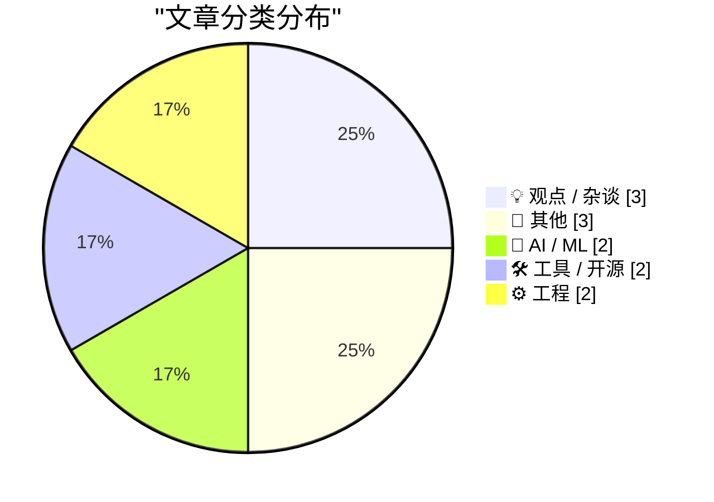
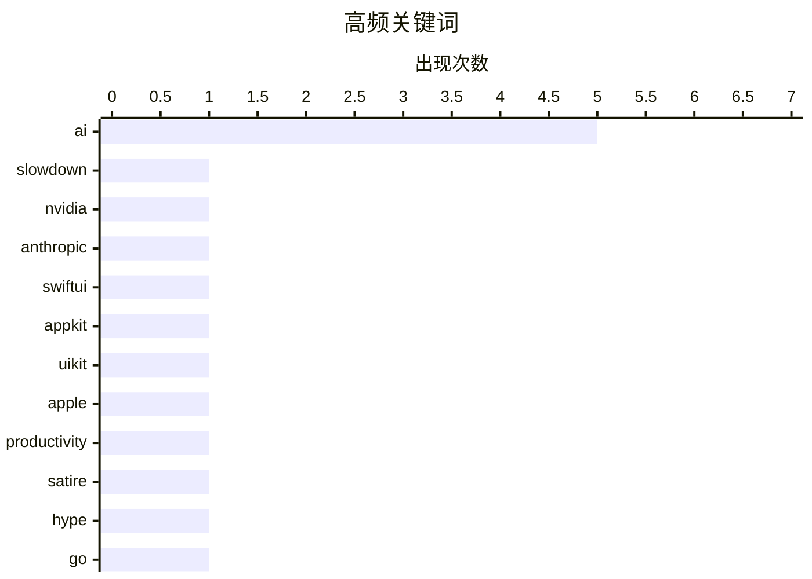

# 📰 AI 博客每日精选 — 2026-06-09

> 来自 Karpathy 推荐的 92 个顶级技术博客，AI 精选 Top 12

## 📝 今日看点

今日技术圈围绕人工智能的“冰与火”展开交锋：一面是“AI发展正放缓”的警钟敲响，另一面却有初创公司宣称实现百倍生产力颠覆，而苹果即将在WWDC亮相的Siri AI则为这场争论增添了务实期待。开发者生态同样焦灼，SwiftUI因助长劣质应用遭到尖锐批判，Go语言则借助Tigris平台获得后端能力跃升。此外，包管理器专利问题与域名规范等深层基础设施议题，也持续牵动着工程界的关注。

---

## 🏆 今日必读

🥇 **AI Is Slowing Down**

[AI Is Slowing Down](https://www.wheresyoured.at/ai-is-slowing-down/) — wheresyoured.at · 9 小时前 · 🤖 AI / ML

> AI Is Slowing Down

🏷️ AI, slowdown, NVIDIA, Anthropic

🥈 **★ SwiftUI Only Makes It Easy to Develop Bad Apps**

[★ SwiftUI Only Makes It Easy to Develop Bad Apps](https://daringfireball.net/2026/06/swiftui_only_makes_it_easy_to_develop_bad_apps) — daringfireball.net · 23 小时前 · 💡 观点 / 杂谈

> ★ SwiftUI Only Makes It Easy to Develop Bad Apps

🏷️ SwiftUI, AppKit, UIKit, Apple

🥉 **ppclp.ai announces 100x Productivity Gains**

[ppclp.ai announces 100x Productivity Gains](https://idiallo.com/blog/100x-productivity-gain) — idiallo.com · 5 小时前 · 💡 观点 / 杂谈

> ppclp.ai announces 100x Productivity Gains

🏷️ AI, productivity, satire, hype

---

## 📊 数据概览

| 扫描源 | 抓取文章 | 时间范围 | 精选 |
|:---:|:---:|:---:|:---:|
| 78/92 | 2377 篇 → 12 篇 | 24h | **12 篇** |

### 分类分布



### 高频关键词



<details>
<summary>📈 纯文本关键词图（终端友好）</summary>

```
ai           │ ████████████████████ 5
slowdown     │ ████░░░░░░░░░░░░░░░░ 1
nvidia       │ ████░░░░░░░░░░░░░░░░ 1
anthropic    │ ████░░░░░░░░░░░░░░░░ 1
swiftui      │ ████░░░░░░░░░░░░░░░░ 1
appkit       │ ████░░░░░░░░░░░░░░░░ 1
uikit        │ ████░░░░░░░░░░░░░░░░ 1
apple        │ ████░░░░░░░░░░░░░░░░ 1
productivity │ ████░░░░░░░░░░░░░░░░ 1
satire       │ ████░░░░░░░░░░░░░░░░ 1
```

</details>

### 🏷️ 话题标签

**ai**(5) · **slowdown**(1) · **nvidia**(1) · anthropic(1) · swiftui(1) · appkit(1) · uikit(1) · apple(1) · productivity(1) · satire(1) · hype(1) · go(1) · sdk(1) · tigris(1) · s3(1) · defense(1) · drones(1) · asymmetric warfare(1) · siri(1) · wwdc(1)

---

## 💡 观点 / 杂谈

### 1. ★ SwiftUI Only Makes It Easy to Develop Bad Apps

[★ SwiftUI Only Makes It Easy to Develop Bad Apps](https://daringfireball.net/2026/06/swiftui_only_makes_it_easy_to_develop_bad_apps) — **daringfireball.net** · 23 小时前 · ⭐ 22/30

> ★ SwiftUI Only Makes It Easy to Develop Bad Apps

🏷️ SwiftUI, AppKit, UIKit, Apple

---

### 2. ppclp.ai announces 100x Productivity Gains

[ppclp.ai announces 100x Productivity Gains](https://idiallo.com/blog/100x-productivity-gain) — **idiallo.com** · 5 小时前 · ⭐ 22/30

> ppclp.ai announces 100x Productivity Gains

🏷️ AI, productivity, satire, hype

---

### 3. Siri AI at WWDC 2026

[Siri AI at WWDC 2026](https://simonwillison.net/2026/Jun/8/wwdc/#atom-everything) — **simonwillison.net** · 1 小时前 · ⭐ 20/30

> Siri AI at WWDC 2026

🏷️ Siri, WWDC, Apple Intelligence, AI

---

## 📝 其他

### 4. Eagle Computer: The rise and fall of an early PC clone

[Eagle Computer: The rise and fall of an early PC clone](https://dfarq.homeip.net/eagle-computer-the-rise-and-fall-of-an-early-pc-clone/?utm_source=rss&#038;utm_medium=rss&#038;utm_campaign=eagle-computer-the-rise-and-fall-of-an-early-pc-clone) — **dfarq.homeip.net** · 14 小时前 · ⭐ 13/30

> Eagle Computer: The rise and fall of an early PC clone

🏷️ Eagle Computer, PC clone, history, 1980s

---

### 5. Planescape: Torment, Part 2: …to the Desktop

[Planescape: Torment, Part 2: …to the Desktop](https://www.filfre.net/2026/06/planescape-torment-part-2-to-the-desktop/) — **filfre.net** · 9 小时前 · ⭐ 12/30

> Planescape: Torment, Part 2: …to the Desktop

🏷️ Planescape Torment, DnD, game history

---

### 6. 铸铁锅与科技巨头的隐喻

[De gietijzeren pan en big tech](https://berthub.eu/articles/posts/de-gietijzeren-pan-en-big-tech/) — **berthub.eu** · 14 小时前 · ⭐ 5/30

> 作者以家庭十年来使用铸铁锅的经历为切入点，对比了特氟龙不粘锅与铸铁锅的本质差异。铸铁锅使用十年无需更换，而特氟龙涂层锅随着时间推移，其防粘涂层会逐渐脱落，使用者可能在不知不觉中吃掉了相当多的涂层材料。作者借此隐喻对科技巨头的批判：表面便利的产品往往隐藏着不可见的健康或隐私代价。

🏷️ cooking, cast iron, pans

---

## 🤖 AI / ML

### 7. AI Is Slowing Down

[AI Is Slowing Down](https://www.wheresyoured.at/ai-is-slowing-down/) — **wheresyoured.at** · 9 小时前 · ⭐ 26/30

> AI Is Slowing Down

🏷️ AI, slowdown, NVIDIA, Anthropic

---

### 8. Hacking for Defense @ Stanford 2026 – Lessons Learned Presentations

[Hacking for Defense @ Stanford 2026 – Lessons Learned Presentations](https://steveblank.com/2026/06/08/g-for-defense-stanford-2026-lessons-learned-presentations/) — **steveblank.com** · 12 小时前 · ⭐ 21/30

> Hacking for Defense @ Stanford 2026 – Lessons Learned Presentations

🏷️ defense, AI, drones, asymmetric warfare

---

## 🛠 工具 / 开源

### 9. Giving your Go apps Tigris superpowers

[Giving your Go apps Tigris superpowers](https://www.tigrisdata.com/blog/storage-sdk-go/) — **xeiaso.net** · 1 小时前 · ⭐ 22/30

> Giving your Go apps Tigris superpowers

🏷️ Go, SDK, Tigris, S3

---

### 10. Mux — 为开发者打造的视频基础设施

[Mux — Video for Developers](https://www.mux.com/?utm_campaign=fireball&amp;utm_source=DF) — **daringfireball.net** · 23 小时前 · ⭐ 10/30

> Mux 是一套面向开发者的视频基础设施平台，核心能力是通过名为 Mux Robots 的 AI 工作流自动解锁视频文件中的隐藏数据。这些工作流可配置一次后自动运行，实现视频摘要生成、字幕翻译、内容审核等功能。平台已被 Patreon、Substack 和 Synthesia 等知名公司信赖采用。Mux 提供免费起步方案，使用优惠码 FIRE 即可开始构建。

🏷️ Mux, video, API, AI

---

## ⚙️ 工程

### 11. How many consecutive hyphens can you have in a domain name?

[How many consecutive hyphens can you have in a domain name?](https://shkspr.mobi/blog/2026/06/how-many-consecutive-hyphens-can-you-have-in-a-domain-name/) — **shkspr.mobi** · 13 小时前 · ⭐ 18/30

> How many consecutive hyphens can you have in a domain name?

🏷️ domain name, hyphen, DNS, RFC

---

### 12. Package Manager Patents

[Package Manager Patents](https://nesbitt.io/2026/06/08/package-manager-patents.html) — **nesbitt.io** · 15 小时前 · ⭐ 16/30

> Package Manager Patents

🏷️ package manager, patents, prior art

---

*生成于 2026-06-09 01:26 | 扫描 78 源 → 获取 2377 篇 → 精选 12 篇*
*基于 [Hacker News Popularity Contest 2025](https://refactoringenglish.com/tools/hn-popularity/) RSS 源列表，由 [Andrej Karpathy](https://x.com/karpathy) 推荐*
*由「懂点儿AI」制作，欢迎关注同名微信公众号获取更多 AI 实用技巧 💡*
