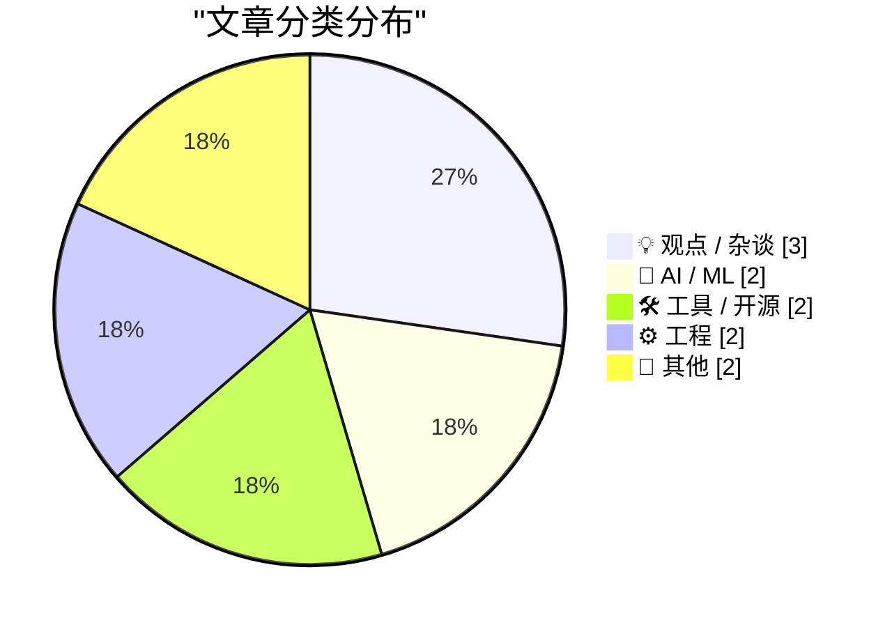
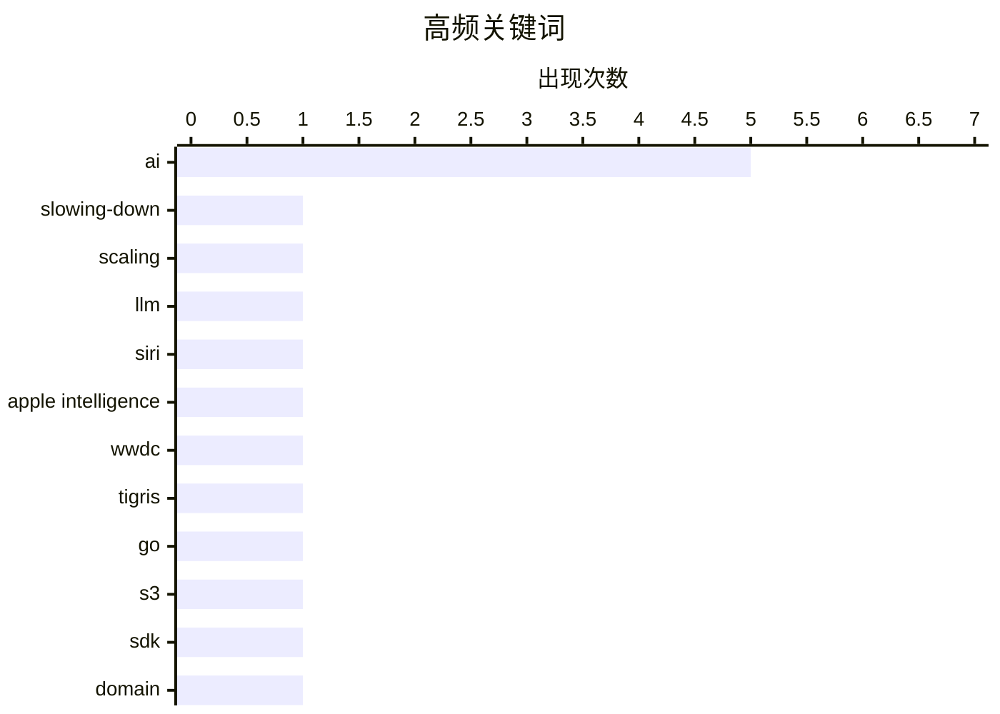

# 📰 AI 博客每日精选 — 2026-06-09

> 来自 Karpathy 推荐的 92 个顶级技术博客，AI 精选 Top 11

## 📝 今日看点

今日技术圈呈现三重变奏：AI 狂热正在退潮，模型缩放定律效益递减、资本回报鸿沟扩大，行业从盲目扩张转向审慎验证，无论是苹果 Siri 的“眼见为实”还是 AI 初创公司令人侧目的百倍生产力宣称，都标志着泡沫之后的务实审视。与此同时，开发者工具继续向下扎根，从面向 Go 语言的云存储原生 SDK 到视频 AI 工作流平台的涌现，基础设施在集成度与自动化上加速进化。另一条隐线是对科技依赖的长期反思，大型科技服务如同不粘锅涂层，初期顺滑，日久却可能带来隐性侵蚀。

---

## 🏆 今日必读

🥇 **AI 正在放缓**

[AI Is Slowing Down](https://www.wheresyoured.at/ai-is-slowing-down/) — wheresyoured.at · 9 小时前 · 🤖 AI / ML

> AI 的发展速度正在从爆炸式增长进入平台期。模型的缩放定律（Scaling Laws）效益递减，更多数据和算力带来的性能提升越来越小，资本支出与实际商业回报之间的差距正在扩大。像 NVIDIA 这样的基础设施提供商面临需求可持续性质疑，而 Anthropic 等前沿实验室则陷入高成本、低利润循环。核心观点是：AI 行业必须从“规模至上”转向效率优先和实际应用落地，否则泡沫可能破裂。

💡 **为什么值得读**: 直击当前 AI 行业最尖锐的降温信号，用数据和商业逻辑拆解“规模神话”的破灭，适合关注 AI 投资与产业趋势的读者冷静思考。

🏷️ AI, slowing-down, scaling, LLM

🥈 **WWDC 2026 上的 Siri AI**

[Siri AI at WWDC 2026](https://simonwillison.net/2026/Jun/8/wwdc/#atom-everything) — simonwillison.net · 1 小时前 · 🤖 AI / ML

> Simon Willison 对苹果在 WWDC 2026 上宣布的新一代 Siri AI 功能持谨慎观望态度，明确表示“眼见为实”。回想 2024 年 Apple Intelligence 的过度承诺与实际交付的巨大落差，许多开发者曾被严重误导。不过，他承认这次展示的新功能在技术上看是可行的，不像前代那样依赖尚未成熟的云端大模型能力。结论是：功能逻辑说得通，但需要实际产品验证苹果的执行力。

💡 **为什么值得读**: 一位资深技术评论员对苹果 AI 战略的清醒审视，对比两次 WWDC 承诺，是判断苹果 AI 真实进展的绝佳视角。

🏷️ Siri, Apple Intelligence, WWDC, AI

🥉 **赋予你的 Go 应用 Tigris 超级能力**

[Giving your Go apps Tigris superpowers](https://www.tigrisdata.com/blog/storage-sdk-go/) — xeiaso.net · 1 小时前 · 🛠 工具 / 开源

> Tigris 虽然兼容 S3 协议，但其独有功能如 Bucket 分叉、快照、对象重命名等在 AWS SDK 中只能通过迂回方法实现，体验欠佳。新发布的 Go SDK 解决了这一痛点，提供两种风格：storage 包作为标准 S3 客户端的直接替换，对 Tigris 专有操作提供一等公民支持；simplestorage 则是更高级的封装。这让 Go 开发者可以无缝调用 Tigris 的全部能力，而无需绕过 S3 兼容层的限制。

💡 **为什么值得读**: 为 Go 开发者展示了如何用原生 SDK 优雅解锁 Tigris 的差异化功能，是提升云存储开发体验的实用参考。

🏷️ Tigris, Go, S3, SDK

---

## 📊 数据概览

| 扫描源 | 抓取文章 | 时间范围 | 精选 |
|:---:|:---:|:---:|:---:|
| 75/92 | 2327 篇 → 11 篇 | 24h | **11 篇** |

### 分类分布



### 高频关键词



<details>
<summary>📈 纯文本关键词图（终端友好）</summary>

```
ai                 │ ████████████████████ 5
slowing-down       │ ████░░░░░░░░░░░░░░░░ 1
scaling            │ ████░░░░░░░░░░░░░░░░ 1
llm                │ ████░░░░░░░░░░░░░░░░ 1
siri               │ ████░░░░░░░░░░░░░░░░ 1
apple intelligence │ ████░░░░░░░░░░░░░░░░ 1
wwdc               │ ████░░░░░░░░░░░░░░░░ 1
tigris             │ ████░░░░░░░░░░░░░░░░ 1
go                 │ ████░░░░░░░░░░░░░░░░ 1
s3                 │ ████░░░░░░░░░░░░░░░░ 1
```

</details>

### 🏷️ 话题标签

**ai**(5) · **slowing-down**(1) · **scaling**(1) · llm(1) · siri(1) · apple intelligence(1) · wwdc(1) · tigris(1) · go(1) · s3(1) · sdk(1) · domain(1) · dns(1) · hyphen(1) · rfc(1) · defense(1) · drones(1) · startup(1) · productivity(1) · satire(1)

---

## 💡 观点 / 杂谈

### 1. Hacking for Defense @ Stanford 2026 – 经验总结报告

[Hacking for Defense @ Stanford 2026 – Lessons Learned Presentations](https://steveblank.com/2026/06/08/g-for-defense-stanford-2026-lessons-learned-presentations/) — **steveblank.com** · 12 小时前 · ⭐ 19/30

> 斯坦福大学 Hacking for Defense 课程进入第 11 年，其教学内容因非对称战争、商用无人机和 AI 等革命性技术而彻底改变。今年的课程重点关注如何让国防部采购系统变得对创业公司友好，以及如何将商业航天、人工智能等颠覆性技术快速转化为军事能力。学生团队展示了从问题发现到解决方案原型构建的全过程，展现出国防创新生态的加速演变。

🏷️ defense, AI, drones, startup

---

### 2. ppclp.ai 宣布实现 100 倍生产力提升

[ppclp.ai announces 100x Productivity Gains](https://idiallo.com/blog/100x-productivity-gain) — **idiallo.com** · 5 小时前 · ⭐ 18/30

> 北美第三大 AI 原生高端金属办公紧固件制造商 ppclp.ai（前身为 Paper Clip Company）公布了一项惊人的运营成果：其专有组织生产力指数 (OPI) 提升 100 倍。这一突破源于为期 18 个月的公司级倡议 Project Streamline，强制所有 340 名员工完成效率培训。领导层称其创造了“操作卓越的新纪元”，甚至被称为“有点小奇迹”。

🏷️ AI, productivity, satire, hype

---

### 3. 铸铁锅与大型科技公司

[De gietijzeren pan en big tech](https://berthub.eu/articles/posts/de-gietijzeren-pan-en-big-tech/) — **berthub.eu** · 14 小时前 · ⭐ 16/30

> 作者从家庭使用铸铁锅十年不用更换的体验出发，对比特氟龙等不粘锅涂层随时间损耗、可能被食用的潜在风险。由此引申出大型科技公司的服务类比：它们就像不粘锅涂层，起初顺滑便利，但长期使用后劣质部分不断被你吸收，最终需要替换。铸铁锅则象征耐用、可持久依赖的朴素技术方案。核心观点是警惕便利性背后的隐性成本，提倡选择经得起时间考验的基础工具。

🏷️ big-tech, cast-iron, planned-obsolescence, sustainability

---

## 🤖 AI / ML

### 4. AI 正在放缓

[AI Is Slowing Down](https://www.wheresyoured.at/ai-is-slowing-down/) — **wheresyoured.at** · 9 小时前 · ⭐ 26/30

> AI 的发展速度正在从爆炸式增长进入平台期。模型的缩放定律（Scaling Laws）效益递减，更多数据和算力带来的性能提升越来越小，资本支出与实际商业回报之间的差距正在扩大。像 NVIDIA 这样的基础设施提供商面临需求可持续性质疑，而 Anthropic 等前沿实验室则陷入高成本、低利润循环。核心观点是：AI 行业必须从“规模至上”转向效率优先和实际应用落地，否则泡沫可能破裂。

🏷️ AI, slowing-down, scaling, LLM

---

### 5. WWDC 2026 上的 Siri AI

[Siri AI at WWDC 2026](https://simonwillison.net/2026/Jun/8/wwdc/#atom-everything) — **simonwillison.net** · 1 小时前 · ⭐ 24/30

> Simon Willison 对苹果在 WWDC 2026 上宣布的新一代 Siri AI 功能持谨慎观望态度，明确表示“眼见为实”。回想 2024 年 Apple Intelligence 的过度承诺与实际交付的巨大落差，许多开发者曾被严重误导。不过，他承认这次展示的新功能在技术上看是可行的，不像前代那样依赖尚未成熟的云端大模型能力。结论是：功能逻辑说得通，但需要实际产品验证苹果的执行力。

🏷️ Siri, Apple Intelligence, WWDC, AI

---

## 🛠 工具 / 开源

### 6. 赋予你的 Go 应用 Tigris 超级能力

[Giving your Go apps Tigris superpowers](https://www.tigrisdata.com/blog/storage-sdk-go/) — **xeiaso.net** · 1 小时前 · ⭐ 21/30

> Tigris 虽然兼容 S3 协议，但其独有功能如 Bucket 分叉、快照、对象重命名等在 AWS SDK 中只能通过迂回方法实现，体验欠佳。新发布的 Go SDK 解决了这一痛点，提供两种风格：storage 包作为标准 S3 客户端的直接替换，对 Tigris 专有操作提供一等公民支持；simplestorage 则是更高级的封装。这让 Go 开发者可以无缝调用 Tigris 的全部能力，而无需绕过 S3 兼容层的限制。

🏷️ Tigris, Go, S3, SDK

---

### 7. Mux — 面向开发者的视频平台

[Mux — Video for Developers](https://www.mux.com/?utm_campaign=fireball&amp;utm_source=DF) — **daringfireball.net** · 23 小时前 · ⭐ 15/30

> Mux 是一个为开发者打造的视频基础设施平台，提供视频数据的 AI 工作流（Mux Robots），可自动完成摘要生成、字幕翻译、内容审核等任务，配置一次即可对新上传视频持续运行。其客户包括 Patreon、Substack 和 Synthesia 等知名内容平台。使用促销代码 FIREBALL 可免费开始构建。

🏷️ Mux, video, API, AI

---

## ⚙️ 工程

### 8. 域名中最多能有多少个连续连字符？

[How many consecutive hyphens can you have in a domain name?](https://shkspr.mobi/blog/2026/06/how-many-consecutive-hyphens-can-you-have-in-a-domain-name/) — **shkspr.mobi** · 13 小时前 · ⭐ 20/30

> 一个看似简单的问题引出了对域名标准历史的深挖。从 1978 年的主机命名规范到现代 TLD 限制，RFC 标准与各注册局的实现存在微妙差异。一些域名注册机构在技术上允许超长连字符序列，但实践中几乎无人使用，且部分协议解析器可能因严格遵循旧规范而拒绝此类域名。结论是：技术标准并未明确禁止，但规范的碎片化导致兼容性是最大风险。

🏷️ domain, DNS, hyphen, RFC

---

### 9. 包管理器相关专利列表

[Package Manager Patents](https://nesbitt.io/2026/06/08/package-manager-patents.html) — **nesbitt.io** · 15 小时前 · ⭐ 14/30

> 一份整理好的包管理器设计相关专利和专利申请参考清单，并附有对现有先前技术的注解。这些专利可能涉及包解析、依赖解析、增量更新、安全签名等包管理系统的核心机制。作者旨在提供一份集中的资料，帮助开发者和研究者了解该领域的知识产权分布与潜在法律风险，同时指出某些专利可能受到现有技术挑战。

🏷️ package-manager, patents, prior-art, open-source

---

## 📝 其他

### 10. 《异域镇魂曲》开发史，第二部分：登上桌面

[Planescape: Torment, Part 2: …to the Desktop](https://www.filfre.net/2026/06/planescape-torment-part-2-to-the-desktop/) — **filfre.net** · 9 小时前 · ⭐ 16/30

> 本部分继续讲述龙与地下城从桌面到计算机的演化，聚焦经典游戏《异域镇魂曲》的开发过程。核心设计理念由 Chris Avellone 主导：最长的对话选项往往是最好且最有故事深度的选择，体现出游戏对哲学叙事和角色扮演深度的极致追求。文章通过回顾 Interplay 如何改编 William Gibson 的小说《神经漫游者》等事件，揭示那个时代 RPG 游戏创作的文化背景和设计哲学。

🏷️ Planescape-Torment, game-history, Dungeons-Dragons, Interplay

---

### 11. Eagle Computer: The rise and fall of an early PC clone

[Eagle Computer: The rise and fall of an early PC clone](https://dfarq.homeip.net/eagle-computer-the-rise-and-fall-of-an-early-pc-clone/?utm_source=rss&#038;utm_medium=rss&#038;utm_campaign=eagle-computer-the-rise-and-fall-of-an-early-pc-clone) — **dfarq.homeip.net** · 14 小时前 · ⭐ 14/30

> When it comes to 80s computer brands, few flew as high as Eagle Computer flew in 1983. The aptly named company was selling 12,000 computers a month and had been doubling sales every quarter under the 

🏷️ Eagle-Computer, PC-clone, history, 1980s

---

*生成于 2026-06-09 01:32 | 扫描 75 源 → 获取 2327 篇 → 精选 11 篇*
*基于 [Hacker News Popularity Contest 2025](https://refactoringenglish.com/tools/hn-popularity/) RSS 源列表，由 [Andrej Karpathy](https://x.com/karpathy) 推荐*
*由「懂点儿AI」制作，欢迎关注同名微信公众号获取更多 AI 实用技巧 💡*
