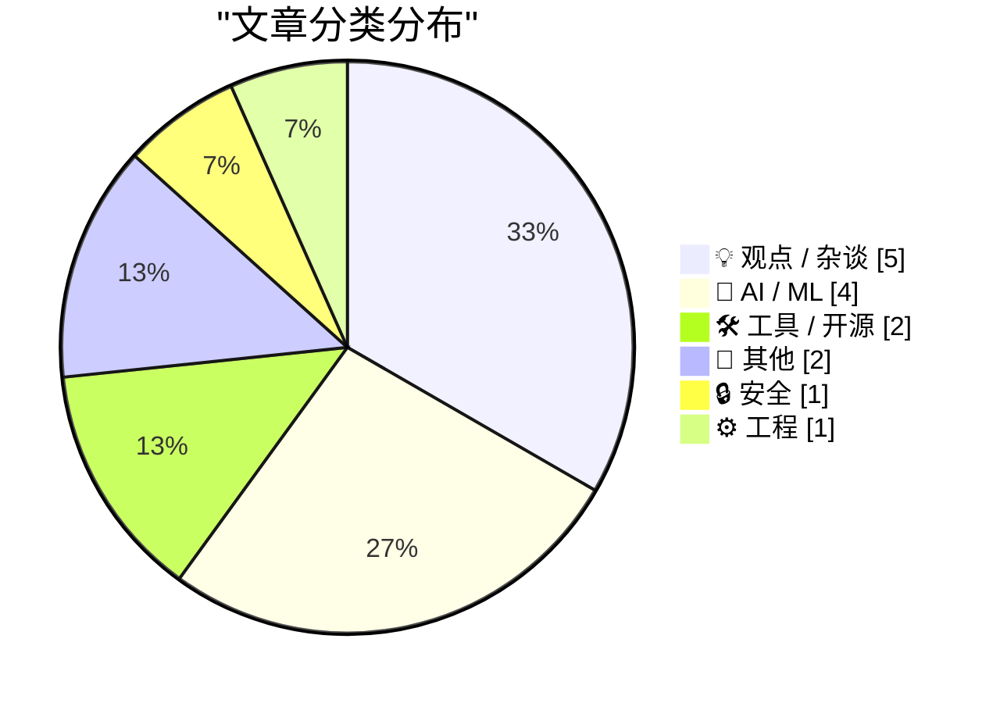
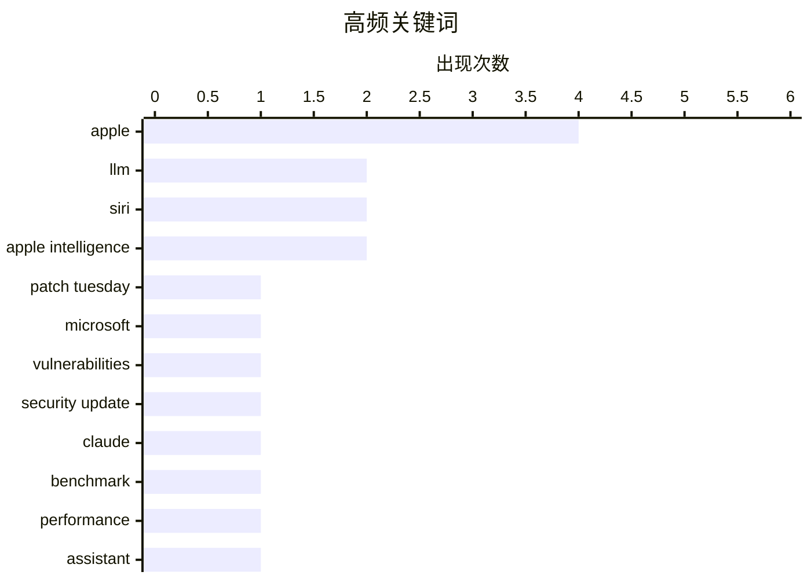

# 📰 AI 博客每日精选 — 2026-06-10

> 来自 Karpathy 推荐的 92 个顶级技术博客，AI 精选 Top 15

## 📝 今日看点

今日技术圈聚焦三大动向：苹果全面拥抱 AI 平台化，不仅发布深度融合个人情境的 Siri AI 与 Apple Intelligence 系统，还透露将向第三方助手开放 Siri，试图将 iPhone 重塑为 AI 入口；大模型军备赛再掀高潮，Claude Fable 5 以“猛兽”级表现证明前沿模型仍在大幅跃升，而 Andrej Karpathy 指出软件生成成本骤降正引发需求暴增的杰文斯悖论；安全领域同样敲响警钟，微软 6 月补丁修复近 200 个漏洞，其中近 30 个为最高危急级别，创下单月修复纪录。

---

## 🏆 今日必读

🥇 **2026年6月创纪录的补丁星期二**

[A Record-Breaking Patch Tuesday for June 2026](https://krebsonsecurity.com/2026/06/a-record-breaking-patch-tuesday-for-june-2026/) — krebsonsecurity.com · 2 小时前 · 🔒 安全

> 微软在2026年6月的补丁星期二发布了近200个安全修复，创下月度修复数量的历史纪录。其中接近30个漏洞被评为最高严重等级的“危急”级别，至少3个漏洞的利用代码已公开可获取。此次更新覆盖Windows操作系统及受支持的软件，凸显了当前威胁态势的严峻性。

💡 **为什么值得读**: 补丁规模创纪录，且已有公开利用代码，企业安全团队需紧急评估并优先部署修复。

🏷️ Patch Tuesday, Microsoft, vulnerabilities, security update

🥈 **Claude Fable 5 初步印象**

[Initial impressions of Claude Fable 5](https://simonwillison.net/2026/Jun/9/claude-fable-5/#atom-everything) — simonwillison.net · 36 分钟前 · 🤖 AI / ML

> Simon Willison 在Claude Fable 5发布当天进行了5.5小时的密集测试，称其为“猛兽”。该模型速度较慢、成本高昂，但成功处理了所有被分配的任务，展现出当前前沿模型的强悍能力。主要挑战已从寻找它能做的事情，转变为寻找它无法完成的任务。

💡 **为什么值得读**: 来自知名开发者的第一时间真实体验，直击新一代模型的能力边界与使用成本痛点。

🏷️ Claude, LLM, benchmark, performance

🥉 **苹果推出Siri AI**

[Apple Introduces Siri AI](https://www.apple.com/newsroom/2026/06/apple-introduces-siri-ai-a-profoundly-more-capable-and-personal-assistant/) — daringfireball.net · 7 小时前 · 🤖 AI / ML

> 苹果正式发布基于Apple Intelligence的全新Siri AI，具备深度个人情境理解能力。用户可以跨信息、邮件、照片等隐私数据向Siri提问，例如查找朋友推荐过的餐厅、提取旧邮件中的酒店确认号、展示近期旅途中的合影。个人情境理解能力还将扩展到第三方应用，使Siri成为更强大的系统级助手。

💡 **为什么值得读**: 苹果将AI深度融入Siri并打通个人私有数据，标志着语音助手从命令执行者向主动情境服务者转型。

🏷️ Siri, Apple Intelligence, assistant, personal context

---

## 📊 数据概览

| 扫描源 | 抓取文章 | 时间范围 | 精选 |
|:---:|:---:|:---:|:---:|
| 77/92 | 2367 篇 → 19 篇 | 24h | **15 篇** |

### 分类分布



### 高频关键词



<details>
<summary>📈 纯文本关键词图（终端友好）</summary>

```
apple              │ ████████████████████ 4
llm                │ ██████████░░░░░░░░░░ 2
siri               │ ██████████░░░░░░░░░░ 2
apple intelligence │ ██████████░░░░░░░░░░ 2
patch tuesday      │ █████░░░░░░░░░░░░░░░ 1
microsoft          │ █████░░░░░░░░░░░░░░░ 1
vulnerabilities    │ █████░░░░░░░░░░░░░░░ 1
security update    │ █████░░░░░░░░░░░░░░░ 1
claude             │ █████░░░░░░░░░░░░░░░ 1
benchmark          │ █████░░░░░░░░░░░░░░░ 1
```

</details>

### 🏷️ 话题标签

**apple**(4) · **llm**(2) · **siri**(2) · apple intelligence(2) · patch tuesday(1) · microsoft(1) · vulnerabilities(1) · security update(1) · claude(1) · benchmark(1) · performance(1) · assistant(1) · personal context(1) · foundation models(1) · gemini(1) · collaboration(1) · auth.md(1) · oauth(1) · ai agents(1) · protocol(1)

---

## 💡 观点 / 杂谈

### 1. Andrej Karpathy 谈软件需求的杰文斯悖论

[Quoting Andrej Karpathy](https://simonwillison.net/2026/Jun/9/andrej-karpathy/#atom-everything) — **simonwillison.net** · 5 小时前 · ⭐ 19/30

> Andrej Karpathy 指出,随着一键生成可工作软件的能力增强,杰文斯悖论正在软件领域显现:软件成本大幅下降反而导致需求急剧膨胀。开发者可以随意要求生成解释器、可视化仪表盘、超定制的一次性应用、自动优化代码、运行大规模研究项目等,软件生产即将进入无限供给时代。

🏷️ AI, software demand, Jevons paradox, Karpathy

---

### 2. 苹果的 WWDC AI 演示是真实的实时操作

[Apple’s WWDC AI Demos Were Real and in Real Time](https://techcrunch.com/2026/06/08/apples-wwdc-ai-demos-looked-more-real-after-250m-false-ad-settlement/) — **daringfireball.net** · 6 小时前 · ⭐ 19/30

> TechCrunch 分析指出,苹果此次 WWDC 的 Apple Intelligence 演示虽为预录,但大部分场景是真人手持手机、实时按键或语音指令,响应在另一镜头下真实呈现。相比 2024 年 WWDC 的静态模拟展示,今年演示更接近可工作的功能样貌。苹果刚刚因虚假广告支付 2.5 亿美元和解,这一展示策略也被视为一种自我证明。

🏷️ Apple, AI demo, live, real time

---

### 3. 《Incorruptible》

[Incorruptible](https://steveblank.com/2026/06/09/incorruptible/) — **steveblank.com** · 11 小时前 · ⭐ 18/30

> Eric Ries 的新书《Incorruptible: Why Good Companies Go Bad… and How Great Companies Stay Great》探讨好公司走向腐败而伟大的公司保持基业长青的底层原因。作者称阅读此书如同服下红色药丸,将彻底改变你看待组织、商业与增长的世界观。书中提供了一套防止企业堕落的系统性方法论。

🏷️ startup, corporate culture, Eric Ries, Incorruptible

---

### 4. Apple OS 27：细微之处的匠心

[Apple OS 27: The Small Things](https://blog.oneberri.com/posts/wwdc26-the-small-things) — **daringfireball.net** · 3 小时前 · ⭐ 17/30

> 作者认为 Apple 最令人喜爱的更新并非炫目功能，而是那些被悄悄修复的痛点、更流畅的工作流和精心打磨的毛边。文章对 WWDC26 中即将到来的系统改进进行了分类整理，列举了大量此类“小修补”。这些细节被视为一家公司真正在乎其产品工艺的最明确信号。

🏷️ Apple, user experience, OS updates, refinement

---

### 5. 主动回忆：通过写作增强记忆

[Active recall](https://herman.bearblog.dev/active-recall/) — **herman.bearblog.dev** · 9 小时前 · ⭐ 16/30

> 文章聚焦于主动回忆这一高效学习策略，强调通过写作来检索和输出信息，而非被动重读。书中探讨了利用写作迫使大脑进行知识重建，从而强化长期记忆的具体方法。核心观点是，将思维转化为文字是检验并巩固理解的最有效手段。

🏷️ active recall, memory, writing, learning

---

## 🤖 AI / ML

### 6. Claude Fable 5 初步印象

[Initial impressions of Claude Fable 5](https://simonwillison.net/2026/Jun/9/claude-fable-5/#atom-everything) — **simonwillison.net** · 36 分钟前 · ⭐ 26/30

> Simon Willison 在Claude Fable 5发布当天进行了5.5小时的密集测试，称其为“猛兽”。该模型速度较慢、成本高昂，但成功处理了所有被分配的任务，展现出当前前沿模型的强悍能力。主要挑战已从寻找它能做的事情，转变为寻找它无法完成的任务。

🏷️ Claude, LLM, benchmark, performance

---

### 7. 苹果推出Siri AI

[Apple Introduces Siri AI](https://www.apple.com/newsroom/2026/06/apple-introduces-siri-ai-a-profoundly-more-capable-and-personal-assistant/) — **daringfireball.net** · 7 小时前 · ⭐ 23/30

> 苹果正式发布基于Apple Intelligence的全新Siri AI，具备深度个人情境理解能力。用户可以跨信息、邮件、照片等隐私数据向Siri提问，例如查找朋友推荐过的餐厅、提取旧邮件中的酒店确认号、展示近期旅途中的合影。个人情境理解能力还将扩展到第三方应用，使Siri成为更强大的系统级助手。

🏷️ Siri, Apple Intelligence, assistant, personal context

---

### 8. 苹果在WWDC发布全新Apple Intelligence系统

[Apple’s WWDC Announcement of the New Apple Intelligence System](https://www.apple.com/newsroom/2026/06/apple-intelligence-brings-powerful-ai-capabilities-into-everyday-experiences/) — **daringfireball.net** · 7 小时前 · ⭐ 23/30

> Apple Intelligence系统由下一代苹果基础模型驱动，并与谷歌Gemini模型深度合作定制，提供深度整合的AI体验。这些新模型支持在设备和私有云计算服务器上本地运行，整个架构以隐私优先为设计原则。该发布标志着苹果在设备端AI与云AI的隐私整合上迈出关键一步。

🏷️ Apple Intelligence, foundation models, Gemini, collaboration

---

### 9. 知情人士：Siri AI 扩展即将向第三方助手开放

[From the Annals of People Having Knowledge of the Matter, Siri AI Extensions Edition](https://www.bloomberg.com/news/articles/2026-03-26/apple-plans-to-open-up-siri-to-rival-ai-assistants-beyond-chatgpt-in-ios-27) — **daringfireball.net** · 22 小时前 · ⭐ 18/30

> 据知情人士透露,苹果计划在 iOS 27 中彻底开放 Siri,允许外部人工智能助手(不限于 ChatGPT)成为其底层引擎。此举旨在将 iPhone 打造为 AI 平台,让用户可以通过 Siri 调用多个竞争性的 AI 服务。该报道在 WWDC 发布两个月前由 Mark Gurman 披露,与最新公布方向吻合。

🏷️ Siri, Apple, AI extensions, iOS

---

## 🛠 工具 / 开源

### 10. WorkOS 推出 auth.md——面向 AI 代理注册的开放协议

[[Sponsor] WorkOS Launches auth.md — an Open Protocol for Agent Registration](https://youtu.be/Dqp_b8GHLXU?t=1074) — **daringfireball.net** · 20 小时前 · ⭐ 23/30

> WorkOS 发布开放协议 auth.md，解决 AI 代理如何以编程方式注册服务的问题。通过在服务根目录暴露一个机器可读的 Markdown 文件，AI 代理可以动态发现 OAuth 受保护资源元数据、解析所需授权范围并实现无缝认证。该协议已在 WorkOS AuthKit 中获得原生支持，为 AI 工具提供了标准化且安全的登录方案。

🏷️ auth.md, OAuth, AI agents, protocol

---

### 11. 在 AgentsView 中为模型设置自定义价格

[Setting a custom price for a model in AgentsView](https://simonwillison.net/2026/Jun/9/agentsview-custom-model-price/#atom-everything) — **simonwillison.net** · 3 小时前 · ⭐ 15/30

> Simon Willison 分享了他在使用 AI 使用量追踪工具 AgentsView 时的一个解决方案。由于新发布的 Claude Fable 5 模型尚未被该工具的定价数据库收录，他通过逆向工程的方法为其设置了自定义价格。这让开发者能继续精准监控本地编码代理在不同模型上的 Token 消耗成本。

🏷️ AgentsView, token usage, pricing, LLM

---

## 📝 其他

### 12. Apple WWDC 2026 主题演讲

[Apple WWDC 2026 Keynote](https://www.youtube.com/watch?v=hF8swzNR1-o) — **daringfireball.net** · 6 小时前 · ⭐ 12/30

> 此次 WWDC 2026 主题演讲时长仅 76 分钟，节奏紧凑，甚至包含了片尾彩蛋音乐视频。相比过去几年，时长缩短了约半小时左右。

🏷️ WWDC, keynote, duration, Apple

---

### 13. Naomi Kritzer 的《Obstetrix》：当强制生育派变成强制产科武装分子

[Pluralistic: Naomi Kritzer's "Obstetrix" (09 Jun 2026)](https://pluralistic.net/2026/06/09/deliver-us/) — **pluralistic.net** · 11 小时前 · ⭐ 12/30

> Cory Doctorow 在博客中推介了 Naomi Kritzer 的科幻短篇《Obstetrix》。故事探讨了在反堕胎狂热者演变为“强制产科”武装执法者的反乌托邦背景下，产科护理如何被恐怖手段扭曲。文章通过这篇小说批判了现实中将生育政治化并诉诸暴力的极端趋势，并附带了关于 DD-WRT、iTunes DRM 等科技与政治交叉话题的多元链接。

🏷️ Obstetrix, DD-WRT, DRM, passwords

---

## 🔒 安全

### 14. 2026年6月创纪录的补丁星期二

[A Record-Breaking Patch Tuesday for June 2026](https://krebsonsecurity.com/2026/06/a-record-breaking-patch-tuesday-for-june-2026/) — **krebsonsecurity.com** · 2 小时前 · ⭐ 28/30

> 微软在2026年6月的补丁星期二发布了近200个安全修复，创下月度修复数量的历史纪录。其中接近30个漏洞被评为最高严重等级的“危急”级别，至少3个漏洞的利用代码已公开可获取。此次更新覆盖Windows操作系统及受支持的软件，凸显了当前威胁态势的严峻性。

🏷️ Patch Tuesday, Microsoft, vulnerabilities, security update

---

## ⚙️ 工程

### 15. 开源治理形式的多样性

[Forms of Open Source Government](https://nesbitt.io/2026/06/09/forms-of-open-source-government.html) — **nesbitt.io** · 14 小时前 · ⭐ 20/30

> 开源社区拥有的治理形式比全球国家的政体类型还要丰富。从仁慈的独裁者模式到委员会驱动、基金会托管等各种结构并存，不同治理模型直接影响项目的决策效率、社区健康度和长期可持续性。作者认为理解这些治理形式是参与开源的核心前提。

🏷️ open source, governance, community

---

*生成于 2026-06-10 00:36 | 扫描 77 源 → 获取 2367 篇 → 精选 15 篇*
*基于 [Hacker News Popularity Contest 2025](https://refactoringenglish.com/tools/hn-popularity/) RSS 源列表，由 [Andrej Karpathy](https://x.com/karpathy) 推荐*
*由「懂点儿AI」制作，欢迎关注同名微信公众号获取更多 AI 实用技巧 💡*
