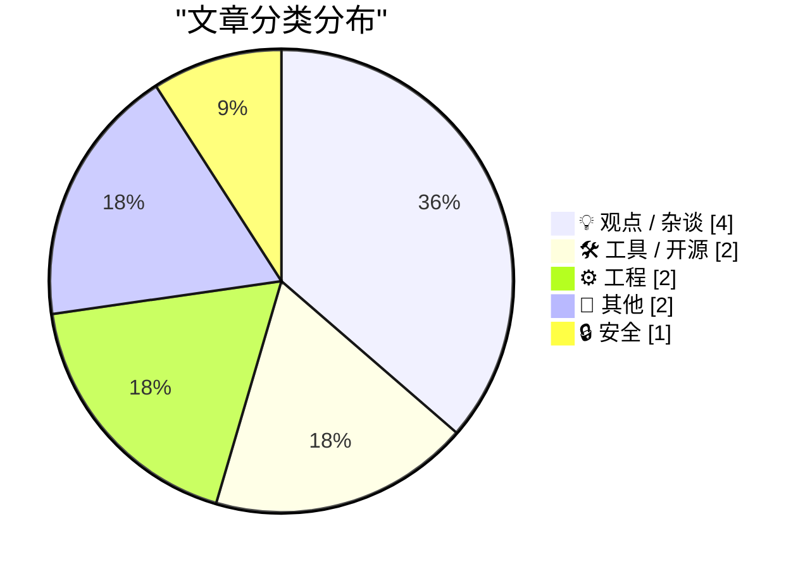
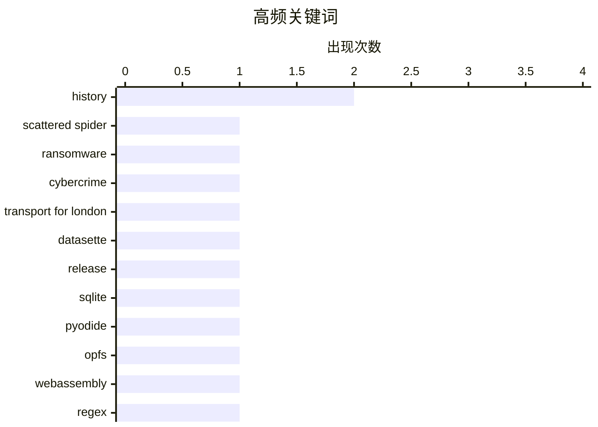

# 📰 AI 博客每日精选 — 2026-06-24

> 来自 Karpathy 推荐的 92 个顶级技术博客，AI 精选 Top 11

## 📝 今日看点

今日技术圈呈现三条并行主线：浏览器正在加速成为全栈应用平台，Datasette 1.0a35 与基于 OPFS 的 Pyodide 工具同步探索在浏览器端实现持久化 SQLite，让复杂数据场景彻底摆脱服务端依赖。工程实践中，开发者一边梳理真正跨环境通用的正则语法以对抗碎片化，一边手动补位 Auth0 文档缺失的 JWT 验证环节，折射出社区对标准化与务实落地的双重专注。安全前沿，瘫痪伦敦交通局的 Scattered Spider 核心成员当庭认罪，再次为关键基础设施敲响高产能网络犯罪组织的警钟。

---

## 🏆 今日必读

🥇 **Scattered Spider 黑客组织成员开庭首日即认罪**

[Scattered Spider Hackers Plead Guilty on Day 1 of Trial](https://krebsonsecurity.com/2026/06/scattered-spider-hackers-plead-guilty-on-day-1-of-trial/) — krebsonsecurity.com · 21 小时前 · 🔒 安全

> 两名男子因参与2024年8月瘫痪伦敦交通局（Transport for London）的网络攻击在英国认罪，他们是高产的网络犯罪组织Scattered Spider的核心成员。该案原计划进行六周审判，但被告在第一天即当庭认罪。

💡 **为什么值得读**: 披露了重要勒索软件组织成员快速认罪的司法进展，有助于了解跨国网络犯罪追责动态。

🏷️ Scattered Spider, ransomware, cybercrime, Transport for London

🥈 **datasette 1.0a35 发布**

[datasette 1.0a35](https://simonwillison.net/2026/Jun/23/datasette/#atom-everything) — simonwillison.net · 16 小时前 · 🛠 工具 / 开源

> Datasette 1.0a35 版本发布，重点包括新增数据库操作菜单中的“创建表”界面，该功能后端对应 /<database>/-/create JSON API，支持定义列、主键和自定义约束。

💡 **为什么值得读**: Datasette 作为轻量级数据探索工具持续演进，新增的 API 驱动建表功能大幅提升了浏览器端操作数据库的灵活性。

🏷️ datasette, release, SQLite

🥉 **OPFS + Pyodide 测试工具：探索浏览器端持久化 SQLite**

[OPFS + Pyodide test harness](https://simonwillison.net/2026/Jun/23/opfs-pyodide/#atom-everything) — simonwillison.net · 18 小时前 · 🛠 工具 / 开源

> Simon Willison 发布了一个 OPFS（Origin Private File System）与 Pyodide 结合的测试工具，用于验证 Datasette Lite 是否能在浏览器中编辑用户本机持久化的 SQLite 文件。该方案利用 WebAssembly 与浏览器私有文件系统 API，尝试让完全运行在浏览器内的 Python 应用获得文件读写能力。

💡 **为什么值得读**: 展现了 WebAssembly 与浏览器文件系统结合的前沿实践，若成功将使 Datasette Lite 从只读演示工具进化为可编辑的本地数据管理环境。

🏷️ Pyodide, OPFS, WebAssembly

---

## 📊 数据概览

| 扫描源 | 抓取文章 | 时间范围 | 精选 |
|:---:|:---:|:---:|:---:|
| 75/92 | 2291 篇 → 11 篇 | 24h | **11 篇** |

### 分类分布



### 高频关键词



<details>
<summary>📈 纯文本关键词图（终端友好）</summary>

```
history              │ ████████████████████ 2
scattered spider     │ ██████████░░░░░░░░░░ 1
ransomware           │ ██████████░░░░░░░░░░ 1
cybercrime           │ ██████████░░░░░░░░░░ 1
transport for london │ ██████████░░░░░░░░░░ 1
datasette            │ ██████████░░░░░░░░░░ 1
release              │ ██████████░░░░░░░░░░ 1
sqlite               │ ██████████░░░░░░░░░░ 1
pyodide              │ ██████████░░░░░░░░░░ 1
opfs                 │ ██████████░░░░░░░░░░ 1
```

</details>

### 🏷️ 话题标签

**history**(2) · **scattered spider**(1) · **ransomware**(1) · cybercrime(1) · transport for london(1) · datasette(1) · release(1) · sqlite(1) · pyodide(1) · opfs(1) · webassembly(1) · regex(1) · compatibility(1) · programming(1) · auth0(1) · jwt(1) · php(1) · authentication(1) · cargo cult(1) · tech culture(1)

---

## 💡 观点 / 杂谈

### 1. Cargo Culture

[Cargo Culture](https://www.wheresyoured.at/cargo-culture/) — **wheresyoured.at** · 22 小时前 · ⭐ 18/30

> 文章标题“Cargo Culture”借用人类学概念，内容为订阅制时事通讯的宣传，提供每周长篇深度分析，涵盖 NVIDIA、Anthropic 等科技公司，年费 70 美元或月付 7 美元。

🏷️ cargo cult, tech culture, analysis

---

### 2. The Talk Show: ‘Perp Walk for Selfies’

[The Talk Show: ‘Perp Walk for Selfies’](https://daringfireball.net/thetalkshow/2026/06/23/ep-450) — **daringfireball.net** · 21 小时前 · ⭐ 17/30

> Jason Snell 作为嘉宾回归 The Talk Show，与主持人 John Gruber 回顾 WWDC 2026，并预告他与 Myke Hurley 即将推出的 50 集苹果历史播客《Designed in California》。节目得到 Factor、Squarespace 和 Finalist 赞助。

🏷️ WWDC, Apple, podcast, history

---

### 3. 写博客有时候就是陈述显而易见的事实

[Blogging Can Just Be Stating The Obvious](https://blog.jim-nielsen.com/2026/blogging-stating-the-obvious/) — **blog.jim-nielsen.com** · -308 分钟前 · ⭐ 15/30

> 作者引述 John Gruber 对网站侵入式弹窗的批评，并延伸出博客写作的元思考：直白地指出那些“明显”但被普遍容忍的糟糕体验，本身就是有价值的博客题材。

🏷️ blogging, writing, obvious

---

### 4. 汤米·麦克休身上发生的最美妙的事

[The most wonderful thing that happened to Tommy McHugh](https://www.experimental-history.com/p/the-most-wonderful-thing-that-happened) — **experimental-history.com** · 21 小时前 · ⭐ 11/30

> 文章以一句颇具冲击力的话为标题：‘...是边如厕边中风’，暗示将讲述一个非典型的中风体验故事，很可能涉及神经科学或个体认知转变的奇妙经历。

🏷️ stroke, neuroplasticity, creativity, personal-story

---

## 🛠 工具 / 开源

### 5. datasette 1.0a35 发布

[datasette 1.0a35](https://simonwillison.net/2026/Jun/23/datasette/#atom-everything) — **simonwillison.net** · 16 小时前 · ⭐ 21/30

> Datasette 1.0a35 版本发布，重点包括新增数据库操作菜单中的“创建表”界面，该功能后端对应 /<database>/-/create JSON API，支持定义列、主键和自定义约束。

🏷️ datasette, release, SQLite

---

### 6. OPFS + Pyodide 测试工具：探索浏览器端持久化 SQLite

[OPFS + Pyodide test harness](https://simonwillison.net/2026/Jun/23/opfs-pyodide/#atom-everything) — **simonwillison.net** · 18 小时前 · ⭐ 21/30

> Simon Willison 发布了一个 OPFS（Origin Private File System）与 Pyodide 结合的测试工具，用于验证 Datasette Lite 是否能在浏览器中编辑用户本机持久化的 SQLite 文件。该方案利用 WebAssembly 与浏览器私有文件系统 API，尝试让完全运行在浏览器内的 Python 应用获得文件读写能力。

🏷️ Pyodide, OPFS, WebAssembly

---

## ⚙️ 工程

### 7. 真正“到处”可用的正则表达式

[Regular expressions that work “everywhere”](https://www.johndcook.com/blog/2026/06/23/regex-everywhere/) — **johndcook.com** · 13 小时前 · ⭐ 21/30

> 正则表达式最令人沮丧的问题是不同环境实现差异巨大，Perl 作为功能最丰富的正则环境，让作者在其他工具中经常碰壁。文章旨在梳理在各类编程语言和工具中都能稳定工作的通用正则语法子集。

🏷️ regex, compatibility, programming

---

### 8. Auth0 PHP 手动验证 JWT idToken 的方法

[Auth0 PHP - manually authenticating JWT idTokens](https://shkspr.mobi/blog/2026/06/auth0-php-manually-authenticating-tokens/) — **shkspr.mobi** · 2 小时前 · ⭐ 18/30

> 作者批评 Auth0 文档严重不足，并给出了手动验证 Auth0 颁发的 JWT idToken 的具体步骤。用户完成认证后会获得 accessToken 和 idToken，仅需使用 idToken 即可完成身份验证。

🏷️ Auth0, JWT, PHP, authentication

---

## 📝 其他

### 9. Weekly Update 509

[Weekly Update 509](https://www.troyhunt.com/weekly-update-509/) — **troyhunt.com** · 8 小时前 · ⭐ 12/30

> Troy Hunt 在周报中讨论家庭影院音响知识，坦承自己处于“有意识的无能”阶段，与大多数人“无意识的无能”状态不同，并强调对专业领域保持谦逊。

🏷️ weekly update, personal, Troy Hunt

---

### 10. Windows 98 shipped June 25, 1998

[Windows 98 shipped June 25, 1998](https://dfarq.homeip.net/windows-98-shipped-june-25-1998/?utm_source=rss&#038;utm_medium=rss&#038;utm_campaign=windows-98-shipped-june-25-1998) — **dfarq.homeip.net** · 2 小时前 · ⭐ 7/30

> It was late and it was overhyped. But it was better than Windows 95. On June 25, 1998, Microsoft shipped Windows 98, and while it didn’t get the fanfare Windows 95 did, it was better than Windows 95. 

🏷️ Windows 98, history, Microsoft

---

## 🔒 安全

### 11. Scattered Spider 黑客组织成员开庭首日即认罪

[Scattered Spider Hackers Plead Guilty on Day 1 of Trial](https://krebsonsecurity.com/2026/06/scattered-spider-hackers-plead-guilty-on-day-1-of-trial/) — **krebsonsecurity.com** · 21 小时前 · ⭐ 25/30

> 两名男子因参与2024年8月瘫痪伦敦交通局（Transport for London）的网络攻击在英国认罪，他们是高产的网络犯罪组织Scattered Spider的核心成员。该案原计划进行六周审判，但被告在第一天即当庭认罪。

🏷️ Scattered Spider, ransomware, cybercrime, Transport for London

---

*生成于 2026-06-24 13:52 | 扫描 75 源 → 获取 2291 篇 → 精选 11 篇*
*基于 [Hacker News Popularity Contest 2025](https://refactoringenglish.com/tools/hn-popularity/) RSS 源列表，由 [Andrej Karpathy](https://x.com/karpathy) 推荐*
*由「懂点儿AI」制作，欢迎关注同名微信公众号获取更多 AI 实用技巧 💡*
