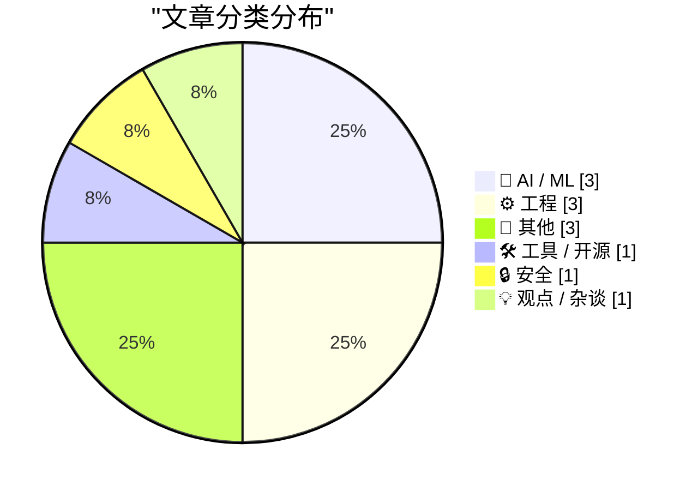
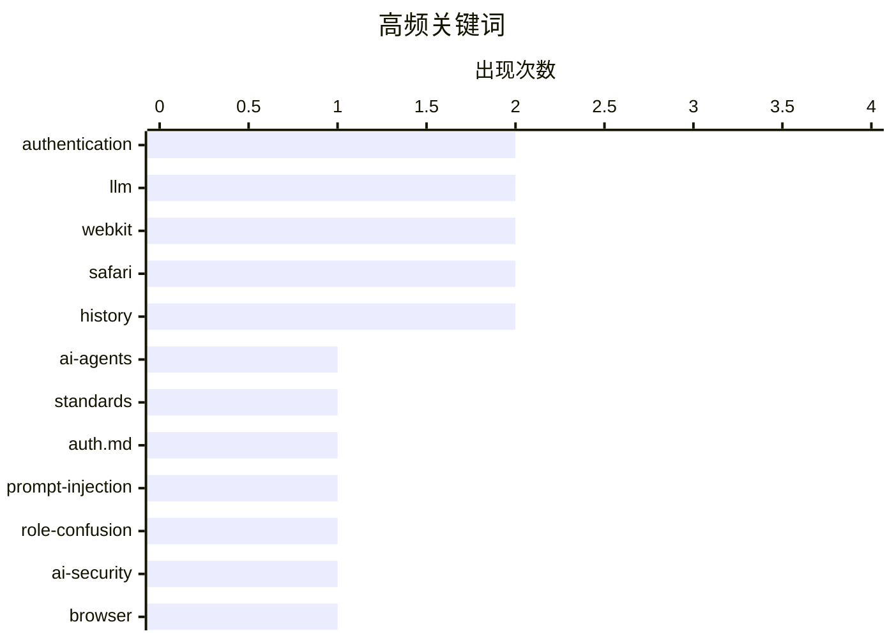

# 📰 AI 博客每日精选 — 2026-06-25

> 来自 Karpathy 推荐的 92 个顶级技术博客，AI 精选 Top 12

## 📝 今日看点

今日技术圈的焦点交织在 AI 代理、生成内容边界与 Web 基础设施这三大方向。AI 代理开始获得专用的身份验证规范，研究者则从“角色混淆”的视角重新审视提示注入攻击，安全与权限体系正从概念走向落地。与此同时，LLM 生成的求职材料泛滥，引发对人机协作真实性的强烈反思。在 Web 领域，Safari 27 Beta 以多达 525 项修复夯实平台正确性，而浏览器兼容性数据被转化为 SQLite 工具，让前端底层知识更容易为开发者所用。

---

## 🏆 今日必读

🥇 **WorkOS：AI 代理需要身份验证，现在有规范了**

[[Sponsor] WorkOS: Agents Need Auth. There’s Now a Spec for It.](http://workos.com/auth-md?utm_source=daringfireball&amp;utm_medium=newsletter&amp;utm_campaign=q32026) — daringfireball.net · 6 小时前 · 🤖 AI / ML

> AI 代理在尝试为用户执行需要注册账户的任务时，面临一个根本性障碍：注册表单没有供代理使用的标准接口。auth.md 是一种托管在域名根目录下的文件，它告诉 AI 代理如何为用户注册应用、支持哪些授权流程、暴露了哪些权限范围，以及凭证如何发放，相当于 robots.txt 的代理注册版。该规范基于现有 OAuth 标准组合而成。Cloudflare、Firecrawl 和 Resend 已经采用了这一方案。

💡 **为什么值得读**: auth.md 有望成为 AI 代理时代的 robots.txt，如果你在构建面向代理的应用或平台，这是必须了解的新基础设施协议。

🏷️ AI-agents, authentication, standards, auth.md

🥈 **关于角色混淆的思考**

[Thoughts on Role Confusion](https://www.gilesthomas.com/2026/06/role-confusion) — gilesthomas.com · 4 小时前 · 🤖 AI / ML

> Charles Ye、Jasmine Cui 和 Dylan Hadfield-Menell 在论文《Prompt Injection as Role Confusion》中发现，LLM 几乎完全忽略了 <system>、<user> 或 <think> 等角色标签，而是根据文本语气和风格来判断应该扮演什么角色。这一发现挑战了当前提示工程中对系统提示和角色标签的依赖。论文通过博客形式发布，由 Simon Willison 推荐传播。

💡 **为什么值得读**: 这篇论文的发现从根本上颠覆了我们对 LLM 安全护栏的认知——如果模型是靠语气而非标签来判断角色，那么提示注入攻击的防护策略需要彻底重新思考。

🏷️ prompt-injection, role-confusion, AI-security, LLM

🥉 **Safari 27 Beta 中的 WebKit 更新**

[WebKit in Safari 27 Beta](https://webkit.org/blog/17967/news-from-wwdc26-webkit-in-safari-27-beta/) — daringfireball.net · 6 小时前 · ⚙️ 工程

> Safari 27 包含 58 个全新功能和 525 个修复，是近年来 Safari 发行版中修复数量最多的一次。但 WebKit 团队强调，这次发布的核心并非新增功能，而是让现有功能行为更正确、处理更多边缘情况、并让不同功能之间以用户期望的方式协调工作。团队将大量时间投入到质量提升而非功能堆叠上。

💡 **为什么值得读**: 这是一个罕见的以「打磨」为主的大版本更新，525 个修复背后是对边缘情况的系统性梳理，前端和 WebKit 相关开发者值得逐项排查这些修复是否影响自己的应用。

🏷️ WebKit, Safari, browser, beta

---

## 📊 数据概览

| 扫描源 | 抓取文章 | 时间范围 | 精选 |
|:---:|:---:|:---:|:---:|
| 76/92 | 2353 篇 → 12 篇 | 24h | **12 篇** |

### 分类分布



### 高频关键词



<details>
<summary>📈 纯文本关键词图（终端友好）</summary>

```
authentication   │ ████████████████████ 2
llm              │ ████████████████████ 2
webkit           │ ████████████████████ 2
safari           │ ████████████████████ 2
history          │ ████████████████████ 2
ai-agents        │ ██████████░░░░░░░░░░ 1
standards        │ ██████████░░░░░░░░░░ 1
auth.md          │ ██████████░░░░░░░░░░ 1
prompt-injection │ ██████████░░░░░░░░░░ 1
role-confusion   │ ██████████░░░░░░░░░░ 1
```

</details>

### 🏷️ 话题标签

**authentication**(2) · **llm**(2) · **webkit**(2) · safari(2) · history(2) · ai-agents(1) · standards(1) · auth.md(1) · prompt-injection(1) · role-confusion(1) · ai-security(1) · browser(1) · beta(1) · job-applications(1) · ai-generated(1) · hiring(1) · browser-compat(1) · mdn(1) · mcp(1) · web-development(1)

---

## 🤖 AI / ML

### 1. WorkOS：AI 代理需要身份验证，现在有规范了

[[Sponsor] WorkOS: Agents Need Auth. There’s Now a Spec for It.](http://workos.com/auth-md?utm_source=daringfireball&amp;utm_medium=newsletter&amp;utm_campaign=q32026) — **daringfireball.net** · 6 小时前 · ⭐ 23/30

> AI 代理在尝试为用户执行需要注册账户的任务时，面临一个根本性障碍：注册表单没有供代理使用的标准接口。auth.md 是一种托管在域名根目录下的文件，它告诉 AI 代理如何为用户注册应用、支持哪些授权流程、暴露了哪些权限范围，以及凭证如何发放，相当于 robots.txt 的代理注册版。该规范基于现有 OAuth 标准组合而成。Cloudflare、Firecrawl 和 Resend 已经采用了这一方案。

🏷️ AI-agents, authentication, standards, auth.md

---

### 2. 关于角色混淆的思考

[Thoughts on Role Confusion](https://www.gilesthomas.com/2026/06/role-confusion) — **gilesthomas.com** · 4 小时前 · ⭐ 22/30

> Charles Ye、Jasmine Cui 和 Dylan Hadfield-Menell 在论文《Prompt Injection as Role Confusion》中发现，LLM 几乎完全忽略了 <system>、<user> 或 <think> 等角色标签，而是根据文本语气和风格来判断应该扮演什么角色。这一发现挑战了当前提示工程中对系统提示和角色标签的依赖。论文通过博客形式发布，由 Simon Willison 推荐传播。

🏷️ prompt-injection, role-confusion, AI-security, LLM

---

### 3. 引用 Tom MacWright：LLM 生成的求职材料让人一无所知

[Quoting Tom MacWright](https://simonwillison.net/2026/Jun/24/tom-macwright/#atom-everything) — **simonwillison.net** · 6 小时前 · ⭐ 20/30

> Tom MacWright 观察到，最近几个月的求职申请中出现了完全由 LLM 协作的模式：求职信是 LLM 写的，作品集网站是 LLM 生成的，GitHub 项目及其提交信息也都是 LLM 产出的。他坦言，面对这样的申请者，自己对这个人「一无所知」——他们没有展露真实自我，没有说过任何真实的话。

🏷️ LLM, job-applications, AI-generated, hiring

---

## ⚙️ 工程

### 4. Safari 27 Beta 中的 WebKit 更新

[WebKit in Safari 27 Beta](https://webkit.org/blog/17967/news-from-wwdc26-webkit-in-safari-27-beta/) — **daringfireball.net** · 6 小时前 · ⭐ 21/30

> Safari 27 包含 58 个全新功能和 525 个修复，是近年来 Safari 发行版中修复数量最多的一次。但 WebKit 团队强调，这次发布的核心并非新增功能，而是让现有功能行为更正确、处理更多边缘情况、并让不同功能之间以用户期望的方式协调工作。团队将大量时间投入到质量提升而非功能堆叠上。

🏷️ WebKit, Safari, browser, beta

---

### 5. Framework 的 10G 以太网模块暴露了 USB-C 的复杂性

[Framework's 10G Ethernet module exposes USB-C's complexity](https://www.jeffgeerling.com/blog/2026/framework-10g-ethernet-module-usb-c-complexity/) — **jeffgeerling.com** · 11 小时前 · ⭐ 19/30

> Jeff Geerling 一直在关注 WisdPi 为 Framework 笔记本开发的 5Gbps 和 10Gbps 以太网适配器模块。最新的 10G 模块虽然在性能上达到了目标，但开发过程充分暴露了 USB-C 接口在实现高带宽外设时的协议和兼容性复杂性。

🏷️ USB-C, Framework, Ethernet, hardware

---

### 6. WebKit 在所有应用中始终启用「复制」菜单项

[WebKit Always Enables the Copy Menu Item in Every App](https://lapcatsoftware.com/articles/2026/6/5.html) — **daringfireball.net** · 3 小时前 · ⭐ 15/30

> Daring Fireball 的 John Gruber 发现 Safari 中即使未选中任何内容，「复制」菜单项也始终可用，Jeff Johnson 成功复现了该问题。调查后确认这是 WebKit 的 bug，且同样影响 Mail 应用。由于 WebKit 是 Apple 平台上的公共 API，大量第三方应用也被波及。

🏷️ WebKit, Safari, bug, UI

---

## 📝 其他

### 7. 《加州设计》：一部关于苹果历史的播客

[Designed in California: An Apple History Podcast](https://designed.fm/) — **daringfireball.net** · 9 小时前 · ⭐ 14/30

> Jason Snell 和 Myke Hurley 发起 Kickstarter 众筹，制作一部名为《Designed in California》的 50 集叙事播客，讲述苹果公司 50 年的历史，通过延伸目标实际集数将超过 50 集。项目已达成主要筹资目标，距离活动结束还有一周。John Gruber 在自己播客中对该项目进行了长篇对话推荐。

🏷️ Apple, podcast, history, Kickstarter

---

### 8. Windows 98 shipped June 25, 1998

[Windows 98 shipped June 25, 1998](https://dfarq.homeip.net/windows-98-shipped-june-25-1998/?utm_source=rss&#038;utm_medium=rss&#038;utm_campaign=windows-98-shipped-june-25-1998) — **dfarq.homeip.net** · 14 小时前 · ⭐ 10/30

> It was late and it was overhyped. But it was better than Windows 95. On June 25, 1998, Microsoft shipped Windows 98, and while it didn’t get the fanfare Windows 95 did, it was better than Windows 95. 

🏷️ Windows 98, history, Microsoft, legacy

---

### 9. Weekly Update 509

[Weekly Update 509](https://www.troyhunt.com/weekly-update-509/) — **troyhunt.com** · 19 小时前 · ⭐ 10/30

> I know enough about home cinema audiovisual to know there&apos;s a lot I don&apos;t know. It&apos;s conscious incompetence, if you like, which is different to the unconscious incompetence most people 

🏷️ home cinema, audiovisual, personal

---

## 🛠 工具 / 开源

### 10. Simon Willison 的 browser-compat-db 项目

[simonw/browser-compat-db](https://simonwillison.net/2026/Jun/24/browser-compat-db/#atom-everything) — **simonwillison.net** · 1 小时前 · ⭐ 19/30

> 受到 Mozilla 新发布的 MDN MCP 服务启发，Simon Willison 将 MDN 的 browser-compat-data 仓库中全面的浏览器兼容性数据转换成了 SQLite 数据库。该项目名为 simonw/browser-compat-db，将结构化兼容性数据打包为本地可查询的格式。

🏷️ browser-compat, MDN, MCP, web-development

---

## 🔒 安全

### 11. Auth0 PHP：手动验证 JWT idToken

[Auth0 PHP - manually authenticating JWT idTokens](https://shkspr.mobi/blog/2026/06/auth0-php-manually-authenticating-tokens/) — **shkspr.mobi** · 13 小时前 · ⭐ 16/30

> Auth0（Okta 旗下）拥有大量客户和资金，但其文档严重不足。用户通过 Auth0 认证后会获得 accessToken 和 idToken，但官方文档几乎没有清晰说明如何手动验证这些令牌。本文给出了在 PHP 中成功验证 Auth0 提供的 JWT idToken 的具体方法。

🏷️ Auth0, JWT, PHP, authentication

---

## 💡 观点 / 杂谈

### 12. 写博客可以是陈述显而易见的事

[Blogging Can Just Be Stating The Obvious](https://blog.jim-nielsen.com/2026/blogging-stating-the-obvious/) — **blog.jim-nielsen.com** · 6 小时前 · ⭐ 13/30

> Jim Nielsen 在阅读 John Gruber 批判网站弹窗的文章后，注意到其中关于博客的元评论：Gruber 认为，有时候博客文章的意义就在于陈述那些「显而易见」但已被行业遗忘或忽视的道理。Nielsen 引申认为，把被遗忘的常识重新说清楚，本身就是有价值的写作。

🏷️ blogging, writing, tech-culture

---

*生成于 2026-06-25 01:12 | 扫描 76 源 → 获取 2353 篇 → 精选 12 篇*
*基于 [Hacker News Popularity Contest 2025](https://refactoringenglish.com/tools/hn-popularity/) RSS 源列表，由 [Andrej Karpathy](https://x.com/karpathy) 推荐*
*由「懂点儿AI」制作，欢迎关注同名微信公众号获取更多 AI 实用技巧 💡*
