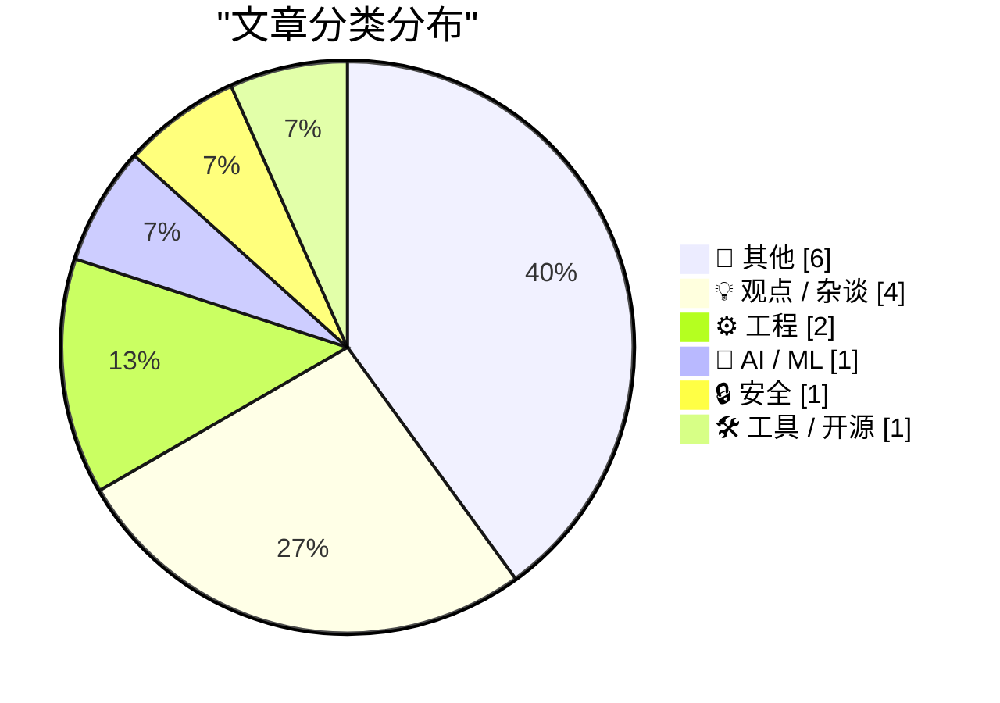
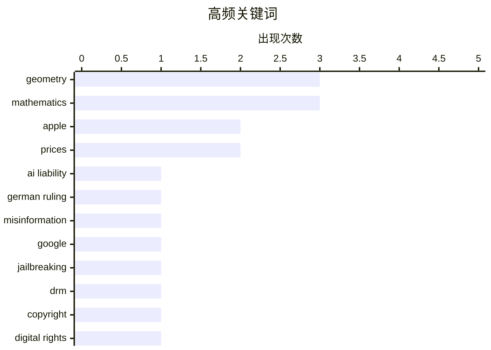

# 📰 AI 博客每日精选 — 2026-06-26

> 来自 Karpathy 推荐的 92 个顶级技术博客，AI 精选 Top 15

## 📝 今日看点

今日技术圈焦点密集：德国法院一项里程碑式判决要求谷歌为AI概览错误担责，将AI代理视为部署者的法律延伸，由此拉开AI致害归责的新序幕。围绕封闭生态的博弈同步加剧——苹果针对Mac与iPad大幅提价最高25%，仅保留iPhone等核心入口不动，阶梯式定价意在加固生态围墙；与此同时，Cory Doctorow正面驳斥越狱等同盗版的双重标准，掀起数字权利与DRM道德叙事的激烈辩论。在开源一侧，新工具Scrutineer的出现直指安全警报泛滥造成的维护者疲劳，试图以精准信息替代重复轰炸，为可持续的安全治理探路。

---

## 🏆 今日必读

🥇 **AI 与法律责任**

[AI and Liability](https://simonwillison.net/2026/Jun/25/ai-and-liability/#atom-everything) — simonwillison.net · 2 小时前 · 🤖 AI / ML

> 德国一项里程碑式的裁决认定，谷歌必须为其 AI 概览功能引入的错误负责。Bruce Schneier 评论指出，AI 代理应被视为部署它们的个人或组织的代理人，并据此承担相应法律责任。这一判决将对 AI 系统的问责机制产生深远影响，明确 AI 输出不是无主之言。

💡 **为什么值得读**: AI 责任归属是当下最紧迫的治理议题，这篇短评结合德国最新司法实践，给出了清晰的归责框架。

🏷️ AI liability, German ruling, misinformation, Google

🥈 **越狱并非盗窃**

[Pluralistic: Jailbreaking isn't theft (25 Jun 2026)](https://pluralistic.net/2026/06/25/thieve-different/) — pluralistic.net · 15 小时前 · 💡 观点 / 杂谈

> Cory Doctorow 反驳将设备越狱等同于盗版的双重标准，指出当年企业打破开放标准不是进步，如今用户破解封闭系统也不是盗版。文章捍卫消费者的数字权利，质疑围绕 DRM 和“知识产权”构建的道德叙事。

💡 **为什么值得读**: 以犀利的逻辑揭露数字版权争议中的伪善，为你提供抵制技术锁定的道德与行动依据。

🏷️ jailbreaking, DRM, copyright, digital rights

🥉 **苹果 Journal 应用严重的撤销错误已修复（且 SwiftUI 本身并非罪魁祸首）**

[Apple Journal’s Atrocious Undo Bug Has Been Fixed (and SwiftUI, Per Se, Is Not to Blame)](https://daringfireball.net/2026/06/swiftui_only_makes_it_easy_to_develop_bad_apps) — daringfireball.net · 2 小时前 · ⚙️ 工程

> 在 macOS 26 Tahoe 上，Journal 应用曾出现严重撤销错误：删除一个单词后执行撤销操作，整句内容会全部消失。该问题现已修复。John Gruber 此前指责 SwiftUI 导致此类糟糕体验，但此次调查表明，错误根因在于应用自身实现，SwiftUI 并非直接原因。

💡 **为什么值得读**: 既呈现苹果自家应用的尴尬漏洞，又深入探讨 SwiftUI 是否真会让开发者更容易写出糟糕应用的持续争论。

🏷️ SwiftUI, Apple Journal, app development, bug

---

## 📊 数据概览

| 扫描源 | 抓取文章 | 时间范围 | 精选 |
|:---:|:---:|:---:|:---:|
| 77/92 | 2383 篇 → 16 篇 | 24h | **15 篇** |

### 分类分布



### 高频关键词



<details>
<summary>📈 纯文本关键词图（终端友好）</summary>

```
geometry       │ ████████████████████ 3
mathematics    │ ████████████████████ 3
apple          │ █████████████░░░░░░░ 2
prices         │ █████████████░░░░░░░ 2
ai liability   │ ███████░░░░░░░░░░░░░ 1
german ruling  │ ███████░░░░░░░░░░░░░ 1
misinformation │ ███████░░░░░░░░░░░░░ 1
google         │ ███████░░░░░░░░░░░░░ 1
jailbreaking   │ ███████░░░░░░░░░░░░░ 1
drm            │ ███████░░░░░░░░░░░░░ 1
```

</details>

### 🏷️ 话题标签

**geometry**(3) · **mathematics**(3) · **apple**(2) · prices(2) · ai liability(1) · german ruling(1) · misinformation(1) · google(1) · jailbreaking(1) · drm(1) · copyright(1) · digital rights(1) · swiftui(1) · apple journal(1) · app development(1) · bug(1) · dll(1) · windows(1) · debugging(1) · memory(1)

---

## 📝 其他

### 1. Om Malik，1966-2026

[Om Malik, 1966-2026](https://om.co/2026/06/24/1966-2026/) — **daringfireball.net** · 4 小时前 · ⭐ 17/30

> 著名科技记者、Gigaom 创始人 Om Malik 于 2026 年 6 月 24 日在斯坦福医院因长期心脏病去世，终年 60 岁。家人发文宣布了这一消息，并邀请读者分享对他的回忆。Om Malik 生前一直低调对抗疾病。

🏷️ Om Malik, obituary, technology journalist

---

### 2. Hart’s theorem

[Hart’s theorem](https://www.johndcook.com/blog/2026/06/25/harts-theorem/) — **johndcook.com** · 5 小时前 · ⭐ 12/30

> Hart’s theorem says If a triangle be formed by the arcs of three circles, the inscribed and the three escribed circles are all tangent to a new circle or line. Here “triangle” means a three-sided figu

🏷️ geometry, Hart's theorem, circles, mathematics

---

### 3. Incircles and Excircles of Pythagorean triangles

[Incircles and Excircles of Pythagorean triangles](https://www.johndcook.com/blog/2026/06/25/incircle-excircle/) — **johndcook.com** · 10 小时前 · ⭐ 12/30

> This post will reveal the connection between my two previous posts: one on the Star Trek lemma and one on Pythagorean triples. In the process of writing the latter, I looked at the Wikipedia article o

🏷️ Pythagorean triangles, incircles, excircles, geometry

---

### 4. Consecutive Pythagorean triangle sides

[Consecutive Pythagorean triangle sides](https://www.johndcook.com/blog/2026/06/25/consecutive-pythagorean/) — **johndcook.com** · 12 小时前 · ⭐ 12/30

> In this post we find all Pythagorean triples that contain consecutive numbers, all Pythagorean triples (a, b, c) such that a + 1 = b or b + 1 = c. a + 1 = b George Osborne wrote a paper [1] addressing

🏷️ Pythagorean triples, consecutive sides, mathematics

---

### 5. The Star Trek lemma

[The Star Trek lemma](https://www.johndcook.com/blog/2026/06/24/star-trek-lemma/) — **johndcook.com** · 22 小时前 · ⭐ 12/30

> I was reading an article this evening and saw a footnote to a book by Arthur Baragar [1]. This caught my eye because he was my officemate at UT for a year. I found his book on Archive.org and was surp

🏷️ Star Trek lemma, geometry, mathematics

---

### 6. US Subways Build Too Many Cross Passages

[US Subways Build Too Many Cross Passages](https://www.construction-physics.com/p/us-subways-build-too-many-cross-passages) — **construction-physics.com** · 10 小时前 · ⭐ 12/30

> I wrote the following piece for IFP’s Transit Abundance Playbook, a collection of 15 ideas to improve transit delivery in the US.

🏷️ subways, cross passages, transit, construction

---

## 💡 观点 / 杂谈

### 7. 越狱并非盗窃

[Pluralistic: Jailbreaking isn't theft (25 Jun 2026)](https://pluralistic.net/2026/06/25/thieve-different/) — **pluralistic.net** · 15 小时前 · ⭐ 24/30

> Cory Doctorow 反驳将设备越狱等同于盗版的双重标准，指出当年企业打破开放标准不是进步，如今用户破解封闭系统也不是盗版。文章捍卫消费者的数字权利，质疑围绕 DRM 和“知识产权”构建的道德叙事。

🏷️ jailbreaking, DRM, copyright, digital rights

---

### 8. 苹果多数产品提价 15%-25%，但 iPhone、手表和 AirPods 除外

[Apple Raises Prices on Most Products by 15–25 Percent, but Not iPhones, Watches, or AirPods](https://www.wsj.com/tech/apple-raises-prices-on-macs-ipads-by-200-or-more-on-some-models-a7463f99?st=zse57R) — **daringfireball.net** · 7 小时前 · ⭐ 19/30

> 苹果将 Mac 系列产品价格上调约 15% 至 20%，iPad 价格上调 15% 至 25%。基础款 MacBook Air 涨价 200 美元至 1299 美元，MacBook Pro 涨价 300 美元至 1999 美元。与此同时，iPhone、Apple Watch 和 AirPods 的价格保持不变。

🏷️ Apple, prices, iPhone, Mac

---

### 9. ★ 昂贵的想法

[★ Spensive Thoughts](https://daringfireball.net/2026/06/spensive_thoughts) — **daringfireball.net** · 2 小时前 · ⭐ 18/30

> John Gruber 对苹果当日的价格调整做出快速评论，聚焦于哪些硬件涨价、哪些未涨价，并分析背后可能的逻辑。他认为苹果在关税和成本压力下采取了阶梯式定价保护核心生态入口。

🏷️ Apple, hardware, prices, tariffs

---

### 10. VA Linux 退出硬件业务后的转型

[VA Linux’s transformation after leaving the hardware business](https://dfarq.homeip.net/va-linuxs-transformation-after-leaving-the-hardware-business/?utm_source=rss&#038;utm_medium=rss&#038;utm_campaign=va-linuxs-transformation-after-leaving-the-hardware-business) — **dfarq.homeip.net** · 13 小时前 · ⭐ 14/30

> 2001 年 6 月 26 日，IPO 记录保持者 VA Linux 决定退出硬件业务，以应对互联网泡沫破灭。这一决策虽显奇怪，却让公司得以生存近 25 年，并转型为软件和服务公司。文章回顾了这一转折点及其战略意义。

🏷️ VA Linux, hardware business, transformation, dotcom

---

## ⚙️ 工程

### 11. 苹果 Journal 应用严重的撤销错误已修复（且 SwiftUI 本身并非罪魁祸首）

[Apple Journal’s Atrocious Undo Bug Has Been Fixed (and SwiftUI, Per Se, Is Not to Blame)](https://daringfireball.net/2026/06/swiftui_only_makes_it_easy_to_develop_bad_apps) — **daringfireball.net** · 2 小时前 · ⭐ 21/30

> 在 macOS 26 Tahoe 上，Journal 应用曾出现严重撤销错误：删除一个单词后执行撤销操作，整句内容会全部消失。该问题现已修复。John Gruber 此前指责 SwiftUI 导致此类糟糕体验，但此次调查表明，错误根因在于应用自身实现，SwiftUI 并非直接原因。

🏷️ SwiftUI, Apple Journal, app development, bug

---

### 12. 内存中不存在的 DLL 之谜：虽未正式卸载却不翼而飞，第一部分

[The case of the DLL that was not present in memory despite not being formally unloaded, part 1](https://devblogs.microsoft.com/oldnewthing/20260625-00/?p=112467) — **devblogs.microsoft.com/oldnewthing** · 10 小时前 · ⭐ 21/30

> Raymond Chen 开启新一系列调试故事，追查一个未被正式卸载的 DLL 如何从进程内存中神秘消失。文章将抽丝剥茧，展示系统性排查过程。

🏷️ DLL, Windows, debugging, memory

---

## 🤖 AI / ML

### 13. AI 与法律责任

[AI and Liability](https://simonwillison.net/2026/Jun/25/ai-and-liability/#atom-everything) — **simonwillison.net** · 2 小时前 · ⭐ 24/30

> 德国一项里程碑式的裁决认定，谷歌必须为其 AI 概览功能引入的错误负责。Bruce Schneier 评论指出，AI 代理应被视为部署它们的个人或组织的代理人，并据此承担相应法律责任。这一判决将对 AI 系统的问责机制产生深远影响，明确 AI 输出不是无主之言。

🏷️ AI liability, German ruling, misinformation, Google

---

## 🔒 安全

### 14. Scrutineer：不淹没维护者的开源安全扫描

[Scrutineer: scanning open source without flooding maintainers](https://nesbitt.io/2026/06/25/scrutineer.html) — **nesbitt.io** · 14 小时前 · ⭐ 21/30

> Scrutineer 是一款新工具，旨在解决开源安全扫描中常见的维护者疲劳问题。它能够在发现漏洞后避免向维护者发送大量重复、低价值的报告，只提供有效信息。作者认为找到漏洞容易，难的是在不打扰维护者的前提下完成扫描。

🏷️ open source, vulnerability scanning, maintainers, security

---

## 🛠 工具 / 开源

### 15. datasette-export-database 0.3a2

[datasette-export-database 0.3a2](https://simonwillison.net/2026/Jun/25/datasette-export-database/#atom-everything) — **simonwillison.net** · 7 小时前 · ⭐ 15/30

> Datasette 插件 datasette-export-database 发布 0.3a2 版本，修复了一个细微但严重的依赖问题：pyproject.toml 中之前固定了 datasette==1.0a27，导致插件与其他 Datasette 版本不兼容，现已修正为 datasette>=1.0a27。

🏷️ datasette, export, database, plugin

---

*生成于 2026-06-26 00:52 | 扫描 77 源 → 获取 2383 篇 → 精选 15 篇*
*基于 [Hacker News Popularity Contest 2025](https://refactoringenglish.com/tools/hn-popularity/) RSS 源列表，由 [Andrej Karpathy](https://x.com/karpathy) 推荐*
*由「懂点儿AI」制作，欢迎关注同名微信公众号获取更多 AI 实用技巧 💡*
