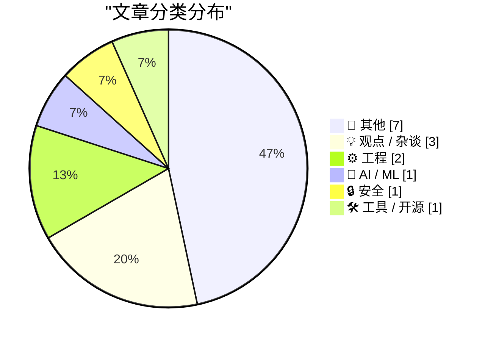
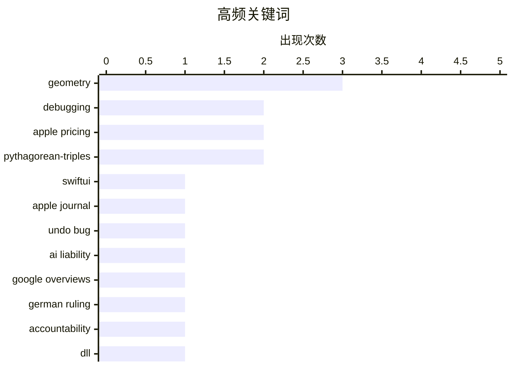

# 📰 AI 博客每日精选 — 2026-06-26

> 来自 Karpathy 推荐的 92 个顶级技术博客，AI 精选 Top 15

## 📝 今日看点

今日技术圈聚焦苹果产品策略调整、AI法律责任界定与技术伦理边界。苹果对Mac与iPad大幅提价，而iPhone等核心产品线未受影响，同时Journal应用的撤消漏洞修复也平息了此前针对SwiftUI的批评。德国法院裁定谷歌须为其AI概述中的错误信息担责，将AI代理视同组织言论，为AI治理立下关键判例。此外，围绕越狱数字权利与开源漏洞扫描“不淹没维护者”的讨论，反映出社区对厂商锁定与可持续安全之间平衡的深层反思。

---

## 🏆 今日必读

🥇 **苹果 Journal 应用的严重撤销漏洞已修复（且 SwiftUI 本身并非罪魁祸首）**

[Apple Journal’s Atrocious Undo Bug Has Been Fixed (and SwiftUI, Per Se, Is Not to Blame)](https://daringfireball.net/2026/06/swiftui_only_makes_it_easy_to_develop_bad_apps) — daringfireball.net · 2 小时前 · ⚙️ 工程

> 在 macOS 26 Tahoe 的 Journal 应用中，删除某个单词并执行撤销操作会导致整句话消失，重做也无法完整恢复。作者曾在 WWDC 前夕以此为例批评 SwiftUI 让开发糟糕应用变得容易，但此次澄清该缺陷并非 SwiftUI 框架本身的问题，并确认该漏洞已被修复。

💡 **为什么值得读**: 以具体技术漏洞的详细复现和修复过程，澄清了对 SwiftUI 框架的误解，值得关心 Apple 开发工具品质的人一读。

🏷️ SwiftUI, Apple Journal, undo bug, debugging

🥈 **AI 与法律责任**

[AI and Liability](https://simonwillison.net/2026/Jun/25/ai-and-liability/#atom-everything) — simonwillison.net · 2 小时前 · 🤖 AI / ML

> 德国法院裁定，谷歌应对其 AI 概述中生成的错误信息承担法律责任，视同谷歌自身的言论。Bruce Schneier 据此评论，AI 代理应被视为部署该 AI 的个人或组织的代理人，并应被等同对待。这标志着法律如何界定 AI 输出责任的重要转变。

💡 **为什么值得读**: 从法律先例和权威安全学者的视角探讨 AI 输出的责任归属，对关注 AI 合规与风险的人有重要启示。

🏷️ AI liability, Google Overviews, German ruling, accountability

🥉 **DLL 在内存中消失之迷案（第一部分）**

[The case of the DLL that was not present in memory despite not being formally unloaded, part 1](https://devblogs.microsoft.com/oldnewthing/20260625-00/?p=112467) — devblogs.microsoft.com/oldnewthing · 10 小时前 · ⚙️ 工程

> 文章排查一个奇怪的问题：某个 DLL 在并未被正式卸载的情况下从内存中消失。作者通过逐步分析，重现和追踪 DLL 缺失原因的过程，为读者展示 Windows 上复杂的内存和加载机制。

💡 **为什么值得读**: Raymond Chen 的经典调试故事，展示如何抽丝剥茧排查长尾技术问题，是系统开发者的实战教材。

🏷️ DLL, Windows, debugging, memory management

---

## 📊 数据概览

| 扫描源 | 抓取文章 | 时间范围 | 精选 |
|:---:|:---:|:---:|:---:|
| 78/92 | 2386 篇 → 16 篇 | 24h | **15 篇** |

### 分类分布



### 高频关键词



<details>
<summary>📈 纯文本关键词图（终端友好）</summary>

```
geometry            │ ████████████████████ 3
debugging           │ █████████████░░░░░░░ 2
apple pricing       │ █████████████░░░░░░░ 2
pythagorean-triples │ █████████████░░░░░░░ 2
swiftui             │ ███████░░░░░░░░░░░░░ 1
apple journal       │ ███████░░░░░░░░░░░░░ 1
undo bug            │ ███████░░░░░░░░░░░░░ 1
ai liability        │ ███████░░░░░░░░░░░░░ 1
google overviews    │ ███████░░░░░░░░░░░░░ 1
german ruling       │ ███████░░░░░░░░░░░░░ 1
```

</details>

### 🏷️ 话题标签

**geometry**(3) · **debugging**(2) · **apple pricing**(2) · pythagorean-triples(2) · swiftui(1) · apple journal(1) · undo bug(1) · ai liability(1) · google overviews(1) · german ruling(1) · accountability(1) · dll(1) · windows(1) · memory management(1) · open-source(1) · vulnerability-scanning(1) · maintainer-burden(1) · security(1) · price hike(1) · mac(1)

---

## 📝 其他

### 1. 苹果多数产品涨价 15%-25%，但 iPhone、手表和 AirPods 未受波及

[Apple Raises Prices on Most Products by 15–25 Percent, but Not iPhones, Watches, or AirPods](https://www.wsj.com/tech/apple-raises-prices-on-macs-ipads-by-200-or-more-on-some-models-a7463f99?st=zse57R) — **daringfireball.net** · 7 小时前 · ⭐ 22/30

> 苹果上调 Mac 与 iPad 等产品价格，涨幅为 15% 到 25%。基础款 MacBook Air 上涨 200 美元至 1299 美元，基础款 MacBook Pro 上涨 300 美元至 1999 美元，入门 MacBook Neo 涨至 699 美元；iPad Air 同样提价。然而 iPhone、Apple Watch 和 AirPods 价格保持不变。

🏷️ Apple pricing, price hike, Mac, iPad

---

### 2. Om Malik，1966-2026

[Om Malik, 1966-2026](https://om.co/2026/06/24/1966-2026/) — **daringfireball.net** · 4 小时前 · ⭐ 18/30

> 科技记者和 GigaOm 创始人 Om Malik 于 2026 年 6 月 24 日在斯坦福医院因长期心脏病去世，身边有家人和朋友陪伴。家人此前对其健康状况极为保密，消息令许多人震惊。

🏷️ Om Malik, obituary, tech journalism, tribute

---

### 3. 哈特定理

[Hart’s theorem](https://www.johndcook.com/blog/2026/06/25/harts-theorem/) — **johndcook.com** · 5 小时前 · ⭐ 14/30

> 哈特定理指出：如果由三段圆弧围成一个三角形，那么它的内切圆和三个旁切圆全都与同一个新圆或一条直线相切。这里的“三角形”指由三条圆弧段组成的图形，而非通常的直线边三角形。该定理是圆几何中一个极为对称而优美的结果，揭示了曲线三角形与经典三角形内切/旁切结构之间的深层联系。

🏷️ Hart's theorem, geometry, tangent circles, mathematics

---

### 4. 美国地铁修建了过多的交叉通道

[US Subways Build Too Many Cross Passages](https://www.construction-physics.com/p/us-subways-build-too-many-cross-passages) — **construction-physics.com** · 10 小时前 · ⭐ 13/30

> 本文为IFP《公共交通丰饶手册》中的一篇，指出美国地铁隧道建设成本高昂的一个重要技术原因：过度设置横向交叉通道。交叉通道作为安全疏散和运维的必要设施，在美国规范中常被要求过密，却显著推高了每公里造价。文章主张重新审视标准，在保障安全的前提下减少不必要的通道数量，以降低地铁建设成本。

🏷️ subway, cross-passages, infrastructure

---

### 5. 毕达哥拉斯三角形的内切圆与旁切圆

[Incircles and Excircles of Pythagorean triangles](https://www.johndcook.com/blog/2026/06/25/incircle-excircle/) — **johndcook.com** · 10 小时前 · ⭐ 12/30

> 本文串联了作者关于《星际迷航引理》与毕达哥拉斯三元组的前两篇博文，聚焦于所有毕达哥拉斯三角形的内切圆与旁切圆半径均为整数这一优雅性质。作者受维基百科条目启发，进一步探讨这些半径如何由直角三角形的边长公式自然生成。这一发现将初等数论与古典几何紧密联系起来，展现毕达哥拉斯三元组额外的整齐结构。

🏷️ Pythagorean-triples, geometry, incircles

---

### 6. 连续边长的毕达哥拉斯三角形

[Consecutive Pythagorean triangle sides](https://www.johndcook.com/blog/2026/06/25/consecutive-pythagorean/) — **johndcook.com** · 12 小时前 · ⭐ 12/30

> 文章系统搜寻所有包含连续整数的毕达哥拉斯三元组，即满足a+1=b或b+1=c的直角三角形边长组合。通过分类讨论，作者给出仅有有限几种解，其中最著名的例子是(3,4,5)和(20,21,29)等。这些解来源于特定的丢番图方程，并非无穷无尽。结论明确否定了大量存在此类“连续勾股数”的直观猜想。

🏷️ Pythagorean-triples, number-theory, consecutive-integers

---

### 7. 星际迷航引理

[The Star Trek lemma](https://www.johndcook.com/blog/2026/06/24/star-trek-lemma/) — **johndcook.com** · 22 小时前 · ⭐ 12/30

> 作者在研究文献时意外发现前同事撰写的书中包含一个名为“星际迷航引理”的几何命题。该引理以一个科幻作品命名，内容涉及某种平面几何构造。文章旨在探寻这一幽默名称背后的数学实质，展示数学家如何将流行文化标签贴上严肃定理，以及该引理所揭示的不变量关系。

🏷️ Star-Trek-lemma, geometry, math

---

## 💡 观点 / 杂谈

### 8. 越狱不是盗窃

[Pluralistic: Jailbreaking isn't theft (25 Jun 2026)](https://pluralistic.net/2026/06/25/thieve-different/) — **pluralistic.net** · 15 小时前 · ⭐ 22/30

> Cory Doctorow 主张越狱行为不应被视为盗窃，厂商锁定用户的做法并非进步，而用户反向越狱也不是盗版。文章将越狱置于数字权利与反抗锁定的大框架下讨论，列举近期关注案例。

🏷️ jailbreaking, digital rights, anti-circumvention, piracy

---

### 9. 对价格上调的随想

[★ Spensive Thoughts](https://daringfireball.net/2026/06/spensive_thoughts) — **daringfireball.net** · 2 小时前 · ⭐ 20/30

> 作者对苹果当日硬件涨价及某些产品线未涨价的现象给出简短的个人分析与感想。评论涉及产品定位、市场策略等方面的推测。

🏷️ Apple pricing, hardware, price increase, reaction

---

### 10. VA Linux 退出硬件业务后的转型

[VA Linux’s transformation after leaving the hardware business](https://dfarq.homeip.net/va-linuxs-transformation-after-leaving-the-hardware-business/?utm_source=rss&#038;utm_medium=rss&#038;utm_campaign=va-linuxs-transformation-after-leaving-the-hardware-business) — **dfarq.homeip.net** · 13 小时前 · ⭐ 15/30

> 互联网泡沫破裂后，创纪录上市的 VA Linux 于 2001 年 6 月 26 日做出退出硬件业务的艰难决定。此举虽看似激进，但帮助公司生存下来并完成后续转型。

🏷️ VA-Linux, business-transformation, open-source-history

---

## ⚙️ 工程

### 11. 苹果 Journal 应用的严重撤销漏洞已修复（且 SwiftUI 本身并非罪魁祸首）

[Apple Journal’s Atrocious Undo Bug Has Been Fixed (and SwiftUI, Per Se, Is Not to Blame)](https://daringfireball.net/2026/06/swiftui_only_makes_it_easy_to_develop_bad_apps) — **daringfireball.net** · 2 小时前 · ⭐ 25/30

> 在 macOS 26 Tahoe 的 Journal 应用中，删除某个单词并执行撤销操作会导致整句话消失，重做也无法完整恢复。作者曾在 WWDC 前夕以此为例批评 SwiftUI 让开发糟糕应用变得容易，但此次澄清该缺陷并非 SwiftUI 框架本身的问题，并确认该漏洞已被修复。

🏷️ SwiftUI, Apple Journal, undo bug, debugging

---

### 12. DLL 在内存中消失之迷案（第一部分）

[The case of the DLL that was not present in memory despite not being formally unloaded, part 1](https://devblogs.microsoft.com/oldnewthing/20260625-00/?p=112467) — **devblogs.microsoft.com/oldnewthing** · 10 小时前 · ⭐ 23/30

> 文章排查一个奇怪的问题：某个 DLL 在并未被正式卸载的情况下从内存中消失。作者通过逐步分析，重现和追踪 DLL 缺失原因的过程，为读者展示 Windows 上复杂的内存和加载机制。

🏷️ DLL, Windows, debugging, memory management

---

## 🤖 AI / ML

### 13. AI 与法律责任

[AI and Liability](https://simonwillison.net/2026/Jun/25/ai-and-liability/#atom-everything) — **simonwillison.net** · 2 小时前 · ⭐ 24/30

> 德国法院裁定，谷歌应对其 AI 概述中生成的错误信息承担法律责任，视同谷歌自身的言论。Bruce Schneier 据此评论，AI 代理应被视为部署该 AI 的个人或组织的代理人，并应被等同对待。这标志着法律如何界定 AI 输出责任的重要转变。

🏷️ AI liability, Google Overviews, German ruling, accountability

---

## 🔒 安全

### 14. Scrutineer：在不淹没维护者的情况下扫描开源软件

[Scrutineer: scanning open source without flooding maintainers](https://nesbitt.io/2026/06/25/scrutineer.html) — **nesbitt.io** · 14 小时前 · ⭐ 23/30

> Scrutineer 项目旨在寻找开源软件中的安全漏洞，但强调真正的挑战不是发现漏洞，而是如何做到不因海量自动化报告而加重维护者负担。它提供了一种更友好的漏洞扫描方法。

🏷️ open-source, vulnerability-scanning, maintainer-burden, security

---

## 🛠 工具 / 开源

### 15. datasette-export-database 0.3a2

[datasette-export-database 0.3a2](https://simonwillison.net/2026/Jun/25/datasette-export-database/#atom-everything) — **simonwillison.net** · 7 小时前 · ⭐ 16/30

> 发布版本 0.3a2，修复了一个因 pyproject.toml 中依赖固定为 datasette==1.0a27 导致插件与其他 Datasette 版本不兼容的问题，现更改为 datasette>=1.0a27。

🏷️ datasette, export, SQLite, plugin release

---

*生成于 2026-06-26 00:51 | 扫描 78 源 → 获取 2386 篇 → 精选 15 篇*
*基于 [Hacker News Popularity Contest 2025](https://refactoringenglish.com/tools/hn-popularity/) RSS 源列表，由 [Andrej Karpathy](https://x.com/karpathy) 推荐*
*由「懂点儿AI」制作，欢迎关注同名微信公众号获取更多 AI 实用技巧 💡*
