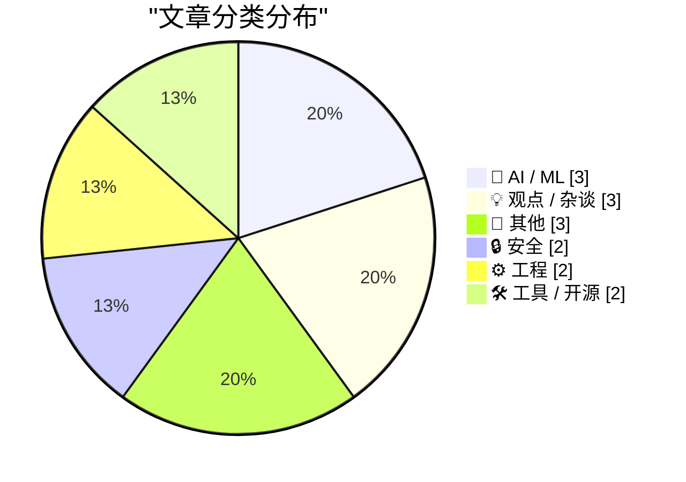
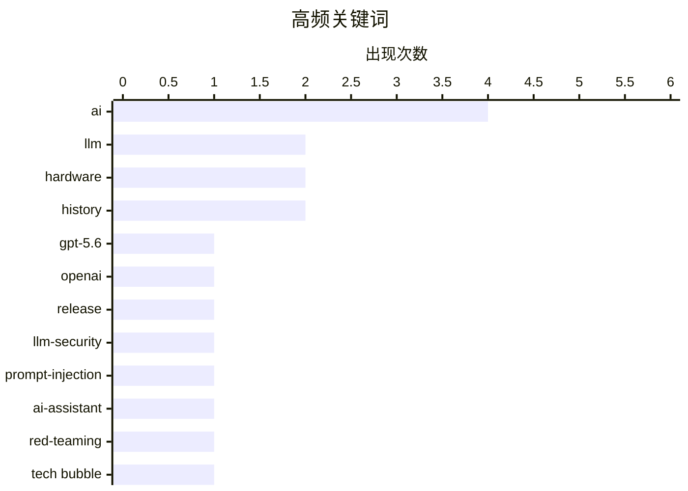

# 📰 AI 博客每日精选 — 2026-06-27

> 来自 Karpathy 推荐的 92 个顶级技术博客，AI 精选 Top 15

## 📝 今日看点

今日 AI 圈的焦点集中在模型迭代的紧迫感与失控风险上：OpenAI 预览 GPT-5.6 三款模型，用一半价格提供旗舰级性能，而前沿模型依赖发布初期的短暂盈利窗口，延迟即意味着利润蒸发。与此同时，两个虚构的 AI 代理事故报告敲响警钟，自动化系统陷入无限争论、消耗巨额推理费用，揭示出智能体失控后的连锁代价。另一条暗线是 AI 算力扩张已反噬消费电子，苹果以内存和存储成本空前上涨为由大幅提价，四年前的老款 Apple TV 4K 也未能幸免。

---

## 🏆 今日必读

🥇 **OpenAI 预览 GPT-5.6 系列模型**

[Quoting OpenAI](https://simonwillison.net/2026/Jun/26/openai/#atom-everything) — simonwillison.net · 7 小时前 · 🤖 AI / ML

> OpenAI 开始有限预览 GPT-5.6 系列，共三个模型：旗舰 Sol、平衡日常工作的 Terra，以及快速低成本的 Luna。Terra 性能与 GPT-5.5 相当，但价格只有一半，Luna 以最低价格提供强大能力。这些模型计划在未来几周内全面开放使用。

💡 **为什么值得读**: 第一时间了解 OpenAI 最新模型如何在性价比上突破，尤其 Terra 性能不变却成本减半值得关注。

🏷️ GPT-5.6, OpenAI, LLM, release

🥈 **2000 人尝试攻击我的 AI 助手后发生了什么**

[What happened after 2,000 people tried to hack my AI assistant](https://simonwillison.net/2026/Jun/26/hack-my-ai-assistant/#atom-everything) — simonwillison.net · 5 小时前 · 🔒 安全

> Fernando Irarrázaval 发起挑战，让 2000 人通过邮件攻击其 OpenClaw AI 助手实例，试图泄露其持有的秘密。在超过 6000 次尝试、花费 500 美元 token 费用并导致 Google 账号因入站邮件过多被暂停后，仍然无人成功泄露秘密。

💡 **为什么值得读**: 真实世界 AI 助手安全压力测试的全过程，结果惊人地稳健，对 AI 安全设计有参考价值。

🏷️ LLM-security, prompt-injection, AI-assistant, red-teaming

🥉 **气泡笔记，第一卷**

[Premium: Notes From The Bubble, Volume 1](https://www.wheresyoured.at/premium-notes-from-the-bubble-volume-1/) — wheresyoured.at · 5 小时前 · 💡 观点 / 杂谈

> 作者因时间紧张无法完成原本计划的《Hater's Guide》，转而启动新系列《Notes From The Bubble》，分享近期科技行业的多周观察与评论。

💡 **为什么值得读**: 了解科技泡沫从业者的内部观察与反思，适合关注产业动态的读者。

🏷️ tech bubble, AI, venture capital, startup

---

## 📊 数据概览

| 扫描源 | 抓取文章 | 时间范围 | 精选 |
|:---:|:---:|:---:|:---:|
| 76/92 | 2353 篇 → 15 篇 | 24h | **15 篇** |

### 分类分布



### 高频关键词



<details>
<summary>📈 纯文本关键词图（终端友好）</summary>

```
ai               │ ████████████████████ 4
llm              │ ██████████░░░░░░░░░░ 2
hardware         │ ██████████░░░░░░░░░░ 2
history          │ ██████████░░░░░░░░░░ 2
gpt-5.6          │ █████░░░░░░░░░░░░░░░ 1
openai           │ █████░░░░░░░░░░░░░░░ 1
release          │ █████░░░░░░░░░░░░░░░ 1
llm-security     │ █████░░░░░░░░░░░░░░░ 1
prompt-injection │ █████░░░░░░░░░░░░░░░ 1
ai-assistant     │ █████░░░░░░░░░░░░░░░ 1
```

</details>

### 🏷️ 话题标签

**ai**(4) · **llm**(2) · **hardware**(2) · history(2) · gpt-5.6(1) · openai(1) · release(1) · llm-security(1) · prompt-injection(1) · ai-assistant(1) · red-teaming(1) · tech bubble(1) · venture capital(1) · startup(1) · cve(1) · lgtm(1) · incident(1) · economics(1) · frontier-models(1) · apple-tv(1)

---

## 🤖 AI / ML

### 1. OpenAI 预览 GPT-5.6 系列模型

[Quoting OpenAI](https://simonwillison.net/2026/Jun/26/openai/#atom-everything) — **simonwillison.net** · 7 小时前 · ⭐ 25/30

> OpenAI 开始有限预览 GPT-5.6 系列，共三个模型：旗舰 Sol、平衡日常工作的 Terra，以及快速低成本的 Luna。Terra 性能与 GPT-5.5 相当，但价格只有一半，Luna 以最低价格提供强大能力。这些模型计划在未来几周内全面开放使用。

🏷️ GPT-5.6, OpenAI, LLM, release

---

### 2. 引用 Dean W. Ball

[Quoting Dean W. Ball](https://simonwillison.net/2026/Jun/26/dean-w-ball/#atom-everything) — **simonwillison.net** · 2 小时前 · ⭐ 22/30

> 前沿模型训练成本巨大，大部分收入依赖发布后最初几个月的黄金窗口。一旦模型成为次前沿，竞争出现、利润压缩，任何延迟发布都会侵蚀这短暂的盈利期。

🏷️ AI, LLM, economics, frontier-models

---

### 3. 事故报告：CVE-2026-LGTM

[Incident Report: CVE-2026-LGTM](https://simonwillison.net/2026/Jun/26/incident-report/#atom-everything) — **simonwillison.net** · 6 小时前 · ⭐ 19/30

> 虚构事件报告：两个来自不同供应商的 AI 代码审查代理，为判断某个软件包是否恶意，在 PR 下陷入无限争论循环，累计产生 340 条评论、消耗 41,255 美元推理费用后，财务部门请求暂停。

🏷️ AI-agents, code-review, security, hypothetical

---

## 💡 观点 / 杂谈

### 4. 气泡笔记，第一卷

[Premium: Notes From The Bubble, Volume 1](https://www.wheresyoured.at/premium-notes-from-the-bubble-volume-1/) — **wheresyoured.at** · 5 小时前 · ⭐ 24/30

> 作者因时间紧张无法完成原本计划的《Hater's Guide》，转而启动新系列《Notes From The Bubble》，分享近期科技行业的多周观察与评论。

🏷️ tech bubble, AI, venture capital, startup

---

### 5. 涨价后的 Apple TV 4K 已四岁

[The Price-Hiked Apple TV 4K Is 4 Years Old](https://buyersguide.macrumors.com/#Apple_TV) — **daringfireball.net** · 8 小时前 · ⭐ 21/30

> 目前在售的 Apple TV 4K 发布于 2022 年 10 月，搭载 A15 仿生芯片（2021 年发布），硬件已显老旧。苹果大幅提价，64GB 基础款从 130 美元涨至 200 美元，128GB 款从 150 美元涨至 250 美元，与低价流媒体棒的价差进一步拉大，但新款预计将在今年秋季推出。

🏷️ Apple-TV, hardware, A15-chip, pricing

---

### 6. Quoting Timothy B. Lee

[Quoting Timothy B. Lee](https://simonwillison.net/2026/Jun/26/timothy-b-lee/#atom-everything) — **simonwillison.net** · 3 小时前 · ⭐ 15/30

> <blockquote cite="https://twitter.com/binarybits/status/2070527944817053862"><p>This is like saying there's no learning curve to being a manager because your employees will just do whatever you tell t

🏷️ AI, agents, management, automation

---

## 📝 其他

### 7. Spyglass: A web browsing pioneer’s IPO

[Spyglass: A web browsing pioneer’s IPO](https://dfarq.homeip.net/spyglass-a-web-browsing-pioneers-ipo/?utm_source=rss&#038;utm_medium=rss&#038;utm_campaign=spyglass-a-web-browsing-pioneers-ipo) — **dfarq.homeip.net** · 13 小时前 · ⭐ 16/30

> Quick: Who was the first browser manufacturer to hold an IPO in the dotcom era? Netscape? WRONG! Its competitor Spyglass beat it out, holding its IPO June 27, 1995. Its IPO did rather well too, issuin

🏷️ Spyglass, browser, IPO, history

---

### 8. ★ Om

[★ Om](https://daringfireball.net/2026/06/om) — **daringfireball.net** · 1 小时前 · ⭐ 14/30

> This is going to sound cornier than a bucket of Jiffy-Pop, but it is a profound irony that a man with such a big and beautiful figurative heart could have such a lousy literal one.

🏷️ obituary, personal

---

### 9. This Week on The Analog Antiquarian

[This Week on The Analog Antiquarian](https://www.filfre.net/2026/06/this-week-on-the-analog-antiquarian/) — **filfre.net** · 8 小时前 · ⭐ 10/30

> Opus 3: Henry VI, Part 2

🏷️ Shakespeare, Henry VI, history, literature

---

## 🔒 安全

### 10. 2000 人尝试攻击我的 AI 助手后发生了什么

[What happened after 2,000 people tried to hack my AI assistant](https://simonwillison.net/2026/Jun/26/hack-my-ai-assistant/#atom-everything) — **simonwillison.net** · 5 小时前 · ⭐ 24/30

> Fernando Irarrázaval 发起挑战，让 2000 人通过邮件攻击其 OpenClaw AI 助手实例，试图泄露其持有的秘密。在超过 6000 次尝试、花费 500 美元 token 费用并导致 Google 账号因入站邮件过多被暂停后，仍然无人成功泄露秘密。

🏷️ LLM-security, prompt-injection, AI-assistant, red-teaming

---

### 11. 事故报告：CVE-2026-LGTM

[Incident Report: CVE-2026-LGTM](https://nesbitt.io/2026/06/26/incident-report-cve-2026-lgtm.html) — **nesbitt.io** · 20 小时前 · ⭐ 23/30

> 一篇虚构的事故报告，描绘了一系列不幸的 AI 代理事件，副标题为“一连串不幸的代理”，暗示自动化系统失控带来的连锁灾难。

🏷️ CVE, LGTM, AI, incident

---

## ⚙️ 工程

### 12. 苹果关于昨日涨价的完整声明

[Apple’s Full Statement on Yesterday’s Price Increases](https://www.macrumors.com/2026/06/25/apple-explains-why-it-raised-prices/) — **daringfireball.net** · 7 小时前 · ⭐ 20/30

> 苹果解释消费电子行业正面临 AI 数据中心扩张导致的内存和存储需求空前激增，组件价格出现前所未见的快速上涨。此前一直自行消化成本，现在不得不开始对包括 Apple TV 在内的多款产品提价。

🏷️ AI-datacenters, hardware, supply-chain, Apple

---

### 13. 未正式卸载但内存中不存在的 DLL 案例（第二部分）

[The case of the DLL that was not present in memory despite not being formally unloaded, part 2](https://devblogs.microsoft.com/oldnewthing/20260626-00/?p=112472) — **devblogs.microsoft.com/oldnewthing** · 10 小时前 · ⭐ 19/30

> 继续上一部分，将两个 bug 关联起来，深入分析为什么一个 DLL 明明没有被正式调用 FreeLibrary 却从进程内存中消失，揭示 Windows 内部机制的意外行为。

🏷️ DLL, debugging, Windows, memory

---

## 🛠 工具 / 开源

### 14. 使用 ffmpeg 快速应用 LUT 进行调色

[Quickly apply LUTs (color grading) with ffmpeg](https://www.jeffgeerling.com/blog/2026/apply-lut-color-grade-with-ffmpeg/) — **jeffgeerling.com** · 22 小时前 · ⭐ 19/30

> 作者长期避免使用 LUT 和 Log 视频，原因在于额外的工作流。现在借助 ffmpeg 可以快速对 Log 素材应用 LUT 进行色彩分级，操作简便，类似处理 RAW 照片，并给出了具体命令示例。

🏷️ ffmpeg, LUT, video-processing, color-grading

---

### 15. Review: Gamrombo PS5 controller - including Linux set up ★★★★☆

[Review: Gamrombo PS5 controller - including Linux set up ★★★★☆](https://shkspr.mobi/blog/2026/06/review-gamrombo-ps5-controller-including-linux-set-up/) — **shkspr.mobi** · 12 小时前 · ⭐ 14/30

> I'm not paying seventy bloody quid for an official PS5 controller - so I found a knock-off version for a smidge under £40. And this one has lots of unnecessary blinkenlights!    Gamrombo is the consum

🏷️ PS5-controller, Linux, gamepad, review

---

*生成于 2026-06-27 00:32 | 扫描 76 源 → 获取 2353 篇 → 精选 15 篇*
*基于 [Hacker News Popularity Contest 2025](https://refactoringenglish.com/tools/hn-popularity/) RSS 源列表，由 [Andrej Karpathy](https://x.com/karpathy) 推荐*
*由「懂点儿AI」制作，欢迎关注同名微信公众号获取更多 AI 实用技巧 💡*
