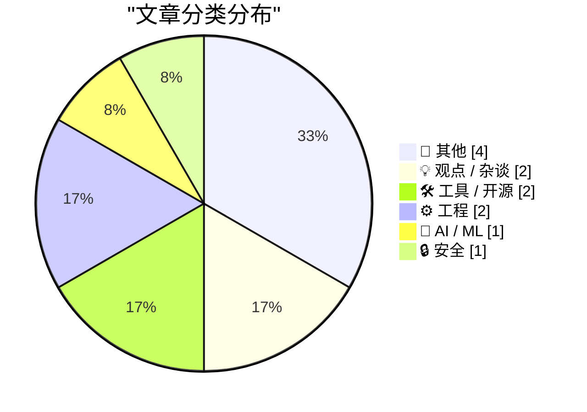
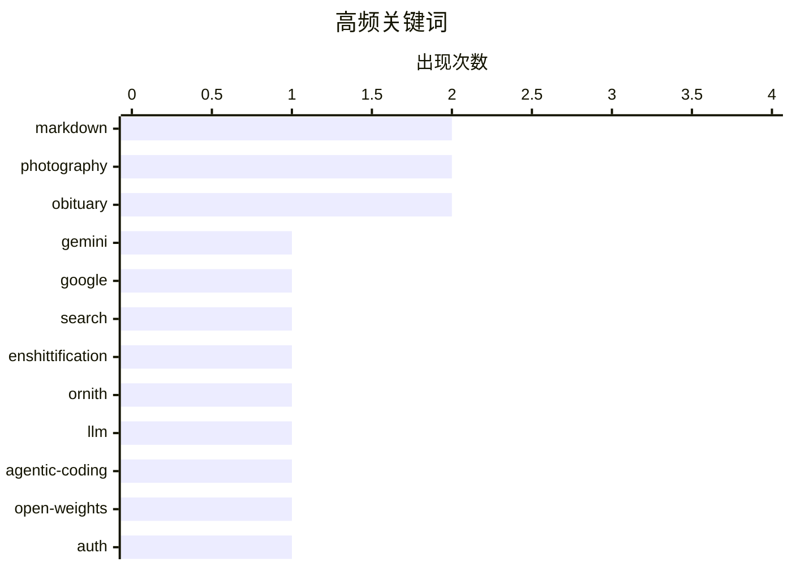

# 📰 AI 博客每日精选 — 2026-06-30

> 来自 Karpathy 推荐的 92 个顶级技术博客，AI 精选 Top 12

## 📝 今日看点

今天的技术圈呈现两大焦点：一是 AI 代理生态加速成形，从能自我构建的编程模型到为智能体设计的开放注册协议，AI 正重新定义开发与交互的边界；二是对传统系统可信度的集体反思——搜索质量的劣化让 Gemini 等 AI 成为替代入口，而开发者开始在 Grok 式即时答案与正式文档之间艰难抉择，工具层面的实用主义回归也愈发明显。

---

## 🏆 今日必读

🥇 **Pluralistic: Gemini is better than search because Google enshittified search (29 Jun 2026)**

[Pluralistic: Gemini is better than search because Google enshittified search (29 Jun 2026)](https://pluralistic.net/2026/06/29/arsonist-firefighters/) — pluralistic.net · 8 小时前 · 💡 观点 / 杂谈

> Pluralistic: Gemini is better than search because Google enshittified search (29 Jun 2026)

🏷️ Gemini, Google, search, enshittification

🥈 **Ornith-1.0: Self-Scaffolding LLMs for Agentic Coding**

[Ornith-1.0: Self-Scaffolding LLMs for Agentic Coding](https://simonwillison.net/2026/Jun/29/ornith/#atom-everything) — simonwillison.net · 8 小时前 · 🤖 AI / ML

> Ornith-1.0: Self-Scaffolding LLMs for Agentic Coding

🏷️ Ornith, LLM, agentic-coding, open-weights

🥉 **Auth.md — an Open Protocol for Agent Registration From WorkOS**

[Auth.md — an Open Protocol for Agent Registration From WorkOS](https://workos.com/auth-md?utm_source=daringfireball&amp;utm_medium=newsletter&amp;utm_campaign=q22026) — daringfireball.net · 23 小时前 · 🔒 安全

> Auth.md — an Open Protocol for Agent Registration From WorkOS

🏷️ auth, protocol, agent-registration, markdown

---

## 📊 数据概览

| 扫描源 | 抓取文章 | 时间范围 | 精选 |
|:---:|:---:|:---:|:---:|
| 76/92 | 2376 篇 → 12 篇 | 24h | **12 篇** |

### 分类分布



### 高频关键词



<details>
<summary>📈 纯文本关键词图（终端友好）</summary>

```
markdown         │ ████████████████████ 2
photography      │ ████████████████████ 2
obituary         │ ████████████████████ 2
gemini           │ ██████████░░░░░░░░░░ 1
google           │ ██████████░░░░░░░░░░ 1
search           │ ██████████░░░░░░░░░░ 1
enshittification │ ██████████░░░░░░░░░░ 1
ornith           │ ██████████░░░░░░░░░░ 1
llm              │ ██████████░░░░░░░░░░ 1
agentic-coding   │ ██████████░░░░░░░░░░ 1
```

</details>

### 🏷️ 话题标签

**markdown**(2) · **photography**(2) · **obituary**(2) · gemini(1) · google(1) · search(1) · enshittification(1) · ornith(1) · llm(1) · agentic-coding(1) · open-weights(1) · auth(1) · protocol(1) · agent-registration(1) · html(1) · table(1) · conversion(1) · bc(1) · grok(1) · documentation(1)

---

## 📝 其他

### 1. [Sponsor] Day One Journal

[[Sponsor] Day One Journal](https://dayoneapp.com/blog/introducing-daily-chat/) — **daringfireball.net** · 1 小时前 · ⭐ 6/30

> [Sponsor] Day One Journal

🏷️ journaling, day-one, app

---

### 2. Daniel Agee: ‘Remembering Om’

[Daniel Agee: ‘Remembering Om’](https://glass.photo/highlights/remembering-om) — **daringfireball.net** · 23 小时前 · ⭐ 5/30

> Daniel Agee: ‘Remembering Om’

🏷️ photography, obituary

---

### 3. 奥姆：一个热爱人性的人

[Matt Mullenweg: ‘All Roads Lead to Om’](https://ma.tt/2026/06/om-forever/) — **daringfireball.net** · 23 小时前 · ⭐ 5/30

> 这篇文章是 Matt Mullenweg 对 Om（一位已故的朋友）的追思。Om 无论走到哪里都能迅速与普通人建立深厚连接，他不仅会记住咖啡师的名字和故事，还会关心社区里的狗和每个人。他拥有百科全书般的知识和图像式记忆，这种能力让他在旧金山乃至全球旅行时都编织出人际关系网。他的好奇心与尊重不分对方的社会地位，平等地给予每一个遇见的灵魂。作者通过个人回忆，刻画了一个真正热爱人性、以开放和温暖连接世界的朋友形象。

🏷️ photography, obituary, community

---

### 4. 我把书的序章做成了一支短片

[I turned my prologue into a short video](https://idiallo.com/byte-size/my-prologue-to-short-video) — **idiallo.com** · 22 小时前 · ⭐ 4/30

> 作者坦言写完整本书很困难，因此暂时选择另一种创作形式。他将自己未完成书稿的序章改编成了一部短片，邀请读者观看。这篇短文更像是更新项目状态的个人笔记，同时附上了视频作品。

🏷️ book, video, prologue

---

## 💡 观点 / 杂谈

### 5. Pluralistic: Gemini is better than search because Google enshittified search (29 Jun 2026)

[Pluralistic: Gemini is better than search because Google enshittified search (29 Jun 2026)](https://pluralistic.net/2026/06/29/arsonist-firefighters/) — **pluralistic.net** · 8 小时前 · ⭐ 28/30

> Pluralistic: Gemini is better than search because Google enshittified search (29 Jun 2026)

🏷️ Gemini, Google, search, enshittification

---

### 6. What happened to Altavista

[What happened to Altavista](https://dfarq.homeip.net/what-happened-to-altavista/?utm_source=rss&#038;utm_medium=rss&#038;utm_campaign=what-happened-to-altavista) — **dfarq.homeip.net** · 13 小时前 · ⭐ 11/30

> What happened to Altavista

🏷️ Altavista, search engine, internet history, web

---

## 🛠 工具 / 开源

### 7. HTML table extractor

[HTML table extractor](https://simonwillison.net/2026/Jun/29/html-table-extractor/#atom-everything) — **simonwillison.net** · 1 小时前 · ⭐ 21/30

> HTML table extractor

🏷️ html, table, conversion, markdown

---

### 8. Count the number of Safari tabs

[Count the number of Safari tabs](https://simonwillison.net/2026/Jun/29/safari-tab-count/#atom-everything) — **simonwillison.net** · 6 小时前 · ⭐ 13/30

> Count the number of Safari tabs

🏷️ applescript, safari, tabs, count

---

## ⚙️ 工程

### 9. Who you gonna believe: Grok or the docs?

[Who you gonna believe: Grok or the docs?](https://www.johndcook.com/blog/2026/06/29/who-you-gonna-believe/) — **johndcook.com** · 12 小时前 · ⭐ 19/30

> Who you gonna believe: Grok or the docs?

🏷️ bc, Grok, documentation, Bessel

---

### 10. Unbundling the standard library

[Unbundling the standard library](https://nesbitt.io/2026/06/29/unbundling-the-standard-library.html) — **nesbitt.io** · 14 小时前 · ⭐ 18/30

> Unbundling the standard library

🏷️ standard library, unbundling, modularity, software engineering

---

## 🤖 AI / ML

### 11. Ornith-1.0: Self-Scaffolding LLMs for Agentic Coding

[Ornith-1.0: Self-Scaffolding LLMs for Agentic Coding](https://simonwillison.net/2026/Jun/29/ornith/#atom-everything) — **simonwillison.net** · 8 小时前 · ⭐ 26/30

> Ornith-1.0: Self-Scaffolding LLMs for Agentic Coding

🏷️ Ornith, LLM, agentic-coding, open-weights

---

## 🔒 安全

### 12. Auth.md — an Open Protocol for Agent Registration From WorkOS

[Auth.md — an Open Protocol for Agent Registration From WorkOS](https://workos.com/auth-md?utm_source=daringfireball&amp;utm_medium=newsletter&amp;utm_campaign=q22026) — **daringfireball.net** · 23 小时前 · ⭐ 23/30

> Auth.md — an Open Protocol for Agent Registration From WorkOS

🏷️ auth, protocol, agent-registration, markdown

---

*生成于 2026-06-30 00:43 | 扫描 76 源 → 获取 2376 篇 → 精选 12 篇*
*基于 [Hacker News Popularity Contest 2025](https://refactoringenglish.com/tools/hn-popularity/) RSS 源列表，由 [Andrej Karpathy](https://x.com/karpathy) 推荐*
*由「懂点儿AI」制作，欢迎关注同名微信公众号获取更多 AI 实用技巧 💡*
