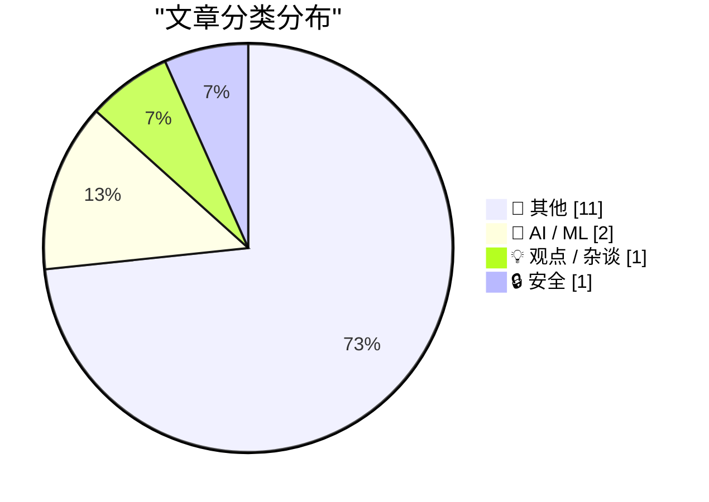
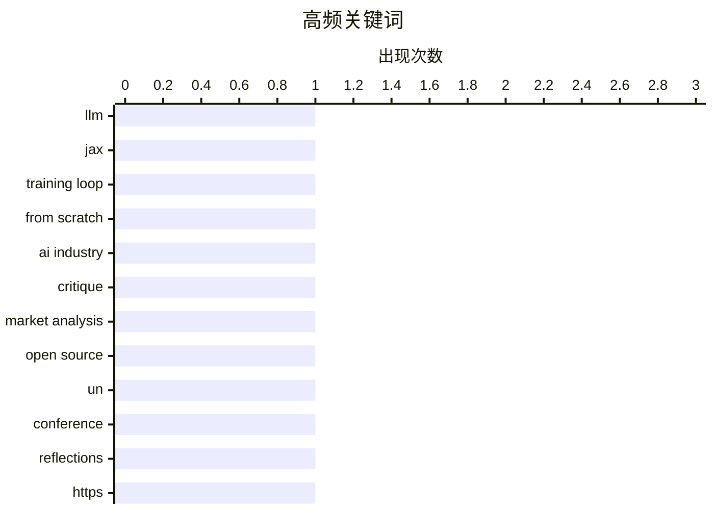

# 📰 AI 博客每日精选 — 2026-07-01

> 来自 Karpathy 推荐的 92 个顶级技术博客，AI 精选 Top 15

## 📝 今日看点

今日技术圈聚焦两大主线：AI开发工具与模型正以前所未有的速度迭代，从谷歌极速廉价的图像模型到Claude Sonnet 5的性能跃升，再到自动化代理视频录制工具的涌现，开发者生态进入“卷效率”的新阶段。与此同时，美国最高法院针对苹果应用商店合规案、地理围栏搜查令隐私权以及出生公民权的系列裁决，正在重塑科技公司的监管边界和数字时代的宪法权利框架。技术与法律的密集交锋，让这一天充满了产业加速度与规则定调的张力。

---

## 🏆 今日必读

🥇 **Gnome：看似简单却极为聪明的 GIF 应用**

[Writing an LLM from scratch, part 34a -- building a JAX training loop for an LLM training run](https://www.gilesthomas.com/2026/06/llm-from-scratch-34a-building-a-jax-training-loop-for-an-llm-training-run) — gilesthomas.com · 5 小时前 · 🤖 AI / ML

> 动画 GIF 是现代人际沟通的关键支柱，但在 Slack、iMessage 等工具中发送一张 GIF 往往需要打开浏览器、搜索、复制、切换窗口并粘贴，整个过程足以让幽默冷却。Lex Friedman 推出的 Gnome 专为解决这一痛点而设计，让用户无需离开当前对话即可快速选中并分享 GIF。该应用以“欺骗性的聪明”方式将 GIF 搜索与插入无缝融入消息工作流，确保笑话能在恰当的瞬间送达。Gnome 用极简交互省去了繁琐步骤，使 GIF 回归即时沟通的乐趣。

💡 **为什么值得读**: 如果你经常因发送 GIF 的繁琐流程而错失幽默时机，这款小工具或许能大幅提升你的聊天效率和欢乐指数。

🏷️ LLM, JAX, training loop, from scratch

🥈 **最高法院同意审理苹果在“苹果诉 Epic Games”案中的藐视裁决上诉**

[The AI Industry Is Losing](https://www.wheresyoured.at/the-ai-industry-is-losing/) — wheresyoured.at · 9 小时前 · 🤖 AI / ML

> 美国最高法院签发调卷令，同意审理苹果的上诉，但仅限问题 1：苹果因违反禁令精神而被认定民事藐视法庭是否成立。此前的禁令禁止苹果限制开发者告知用户使用外部支付，苹果随后允许外链却对这类交易收取佣金，Epic 指控其违反禁令意图，地区法院因此判定苹果藐视并处以罚款。苹果辩称其行为完全符合禁令的字面规定，上诉的核心在于禁令解释应遵循字面含义还是实质精神。最高法院的判决将为反引导规则的执行边界提供关键法律判例。该案走向不仅影响苹果与 Epic 的长期对抗，还可能重塑应用内支付与平台合规的实践框架。

💡 **为什么值得读**: 这是苹果与 Epic 世纪诉讼的延续，将决定法庭禁令究竟是按字面还是按精神执行，对全球应用分发规则有示范效应。

🏷️ AI industry, critique, market analysis

🥉 **最高法院以 6 比 3 裁定维持出生公民权**

[Taking Roads and Bridges literally](https://nesbitt.io/2026/06/30/taking-roads-and-bridges-literally.html) — nesbitt.io · 14 小时前 · 💡 观点 / 杂谈

> 最高法院以 6 比 3（或 5.5 比 3.5）的票数裁定维持美国出生公民权的合宪性。Josh Marshall 评论称，这一正确判决不能掩盖法院的整体腐败，改革需求依然迫切。少数异议者主张废除出生公民权，但多数大法官坚守了宪法文本。Marshall 强调，偶尔的非腐败裁决不应让公众放松对法院诚信体系的审视。该判决虽在宪政层面具有里程碑意义，却再次凸显司法系统正面临深层的信任危机。

💡 **为什么值得读**: 文章没有止步于报道判决结果，而是借此深入反思最高法院的腐败与改革必要性，对关注美国司法现状的读者很有启发。

🏷️ open source, UN, conference, reflections

---

## 📊 数据概览

| 扫描源 | 抓取文章 | 时间范围 | 精选 |
|:---:|:---:|:---:|:---:|
| 77/92 | 2384 篇 → 27 篇 | 24h | **15 篇** |

### 分类分布



### 高频关键词



<details>
<summary>📈 纯文本关键词图（终端友好）</summary>

```
llm             │ ████████████████████ 1
jax             │ ████████████████████ 1
training loop   │ ████████████████████ 1
from scratch    │ ████████████████████ 1
ai industry     │ ████████████████████ 1
critique        │ ████████████████████ 1
market analysis │ ████████████████████ 1
open source     │ ████████████████████ 1
un              │ ████████████████████ 1
conference      │ ████████████████████ 1
```

</details>

### 🏷️ 话题标签

**llm**(1) · **jax**(1) · **training loop**(1) · from scratch(1) · ai industry(1) · critique(1) · market analysis(1) · open source(1) · un(1) · conference(1) · reflections(1) · https(1) · transport security(1) · web security(1)

---

## 📝 其他

### 1. 三名日本男足球员 vs 100 名学童

[Quoting Anthropic](https://simonwillison.net/2026/Jun/30/anthropic/#atom-everything) — **simonwillison.net** · 57 分钟前 · ⭐ 15/30

> 一段 2018 年的日本视频展示三名日本男子国家队球员与 100 名学童进行足球对抗赛，场面兼具职业技巧与人数悬殊带来的喜剧效果。John Gruber 称，尽管本周世界杯激战正酣，这却是他很久以来看到的最佳足球视频。该视频以轻松、纯粹的方式展现了足球的另一面魅力，在紧张赛程中间提供了一段可贵的欢乐插曲。

---

### 2. Nano Banana 2 Lite

[Nano Banana 2 Lite](https://simonwillison.net/2026/Jun/30/nano-banana-2-lite/#atom-everything) — **simonwillison.net** · 2 小时前 · ⭐ 15/30

> 谷歌推出Nano Banana 2 Lite，即Gemini 3.1 Flash Lite Image模型，是目前最快、最便宜的Gemini图像生成模型，专为速度和规模优化。用户可通过AI Studio和Gemini API直接调用。Simon Willison展示了该模型的快速图像生成效果。

---

### 3. Claude Sonnet 5 新特性

[What's new in Claude Sonnet 5](https://simonwillison.net/2026/Jun/30/claude-sonnet-5/#atom-everything) — **simonwillison.net** · 3 小时前 · ⭐ 15/30

> Anthropic发布Claude Sonnet 5模型，其性能接近高端Opus 4.8，但价格更低。官方开发者文档提供了比新闻稿更具操作性的信息，包括性能基准对比、成本优势以及API调用方式等。该模型在性价比上瞄准更广泛的开发者市场。

---

### 4. AI指南针

[The AI Compass](https://simonwillison.net/2026/Jun/30/the-ai-compass/#atom-everything) — **simonwillison.net** · 7 小时前 · ⭐ 15/30

> 这是一个政治罗盘风格的AI伦理测试，由bambamramfan创建，通过29个问题将参与者划分为30种AI态度原型。Simon Willison首次测试被归为“车库修补匠”类型，该原型代表独立动手、自下而上的AI探索者。测试结果提供了对个人AI伦理立场的趣味性洞察。

---

### 5. 让你的代理用shot-scraper video录制工作视频演示

[Have your agent record video demos of its work with shot-scraper video](https://simonwillison.net/2026/Jun/30/shot-scraper-video/#atom-everything) — **simonwillison.net** · 8 小时前 · ⭐ 15/30

> shot-scraper 1.10新增video命令，通过定义storyboard.yml故事板文件，用户可以编排浏览器自动化操作，并使用Playwright录制整个过程为视频。这一功能专为AI代理的工作流程可视化设计，让代理的每次操作都留下可回放、可验证的视频记录。

---

### 6. shot-scraper 1.10 发布

[shot-scraper 1.10](https://simonwillison.net/2026/Jun/30/shot-scraper/#atom-everything) — **simonwillison.net** · 9 小时前 · ⭐ 15/30

> shot-scraper 1.10版本发布，核心新特性为shot-scraper video命令，该命令支持通过YAML故事板录制浏览器操作视频。此外可能包含其他改进和修复。该版本进一步增强了对Web自动化任务的记录与展示能力。

---

### 7. Gnome

[Gnome](https://lexfriedman.com/gnome/) — **daringfireball.net** · 4 小时前 · ⭐ 15/30

> Gnome is a deceptively clever animated GIF app by Lex Friedman:


  The truest thing about animated GIFs is that they are a critical
pillar of modern human communication, and yet getting one into a
Sl

---

### 8. Supreme Court Agrees to Review Apple’s Petition Regarding Civil Contempt Finding in ‘Apple v. Epic Games’

[Supreme Court Agrees to Review Apple’s Petition Regarding Civil Contempt Finding in ‘Apple v. Epic Games’](https://www.supremecourt.gov/orders/courtorders/063026zor_3f14.pdf) — **daringfireball.net** · 4 小时前 · ⭐ 15/30

> Speaking of the Supreme Court’s end-of-term rulings, they today agreed to grant certiorari to Apple’s petition from last month, ordering:


  APPLE INC. V. EPIC GAMES, INC. 
The petition for a writ of

---

### 9. Supreme Court Upholds Birthright Citizenship in 6-3 Decision

[Supreme Court Upholds Birthright Citizenship in 6-3 Decision](https://talkingpointsmemo.com/edblog/the-birthright-citizenship-decision-is-more-evidence-for-court-reform/sharetoken/e2bf9547-fa9b-468c-8af3-aa09e72ca698) — **daringfireball.net** · 5 小时前 · ⭐ 15/30

> Josh Marshall, writing at TPM (gift link):


  As you’ve seen, the Supreme Court upheld the constitutionality of
birthright citizenship by a 6 — or perhaps 5½ — vote margin.
See Kate Riga’s report on 

---

### 10. ★ The Supreme Court Rules That Law Enforcement’s Use of ‘Geofence Warrant’ Was a ‘Search’ (But May Be Moot, Technically, Since 2024)

[★ The Supreme Court Rules That Law Enforcement’s Use of ‘Geofence Warrant’ Was a ‘Search’ (But May Be Moot, Technically, Since 2024)](https://daringfireball.net/2026/06/scotus_geofence_warrant_search) — **daringfireball.net** · 6 小时前 · ⭐ 15/30

> Google no longer collects this information in a way that is susceptible to geofence warrants, and, more importantly, Apple never did.

---

### 11. Three Players From the Japanese Men’s National Team vs. 100 School Children

[Three Players From the Japanese Men’s National Team vs. 100 School Children](https://x.com/BallStreet/status/950382135969566720) — **daringfireball.net** · 6 小时前 · ⭐ 15/30

> I know there’s been a lot of exciting World Cup action this week, but this 2018 clip from Japan is the best soccer video I’ve seen a long while.


 ★

---

## 🤖 AI / ML

### 12. Gnome：看似简单却极为聪明的 GIF 应用

[Writing an LLM from scratch, part 34a -- building a JAX training loop for an LLM training run](https://www.gilesthomas.com/2026/06/llm-from-scratch-34a-building-a-jax-training-loop-for-an-llm-training-run) — **gilesthomas.com** · 5 小时前 · ⭐ 25/30

> 动画 GIF 是现代人际沟通的关键支柱，但在 Slack、iMessage 等工具中发送一张 GIF 往往需要打开浏览器、搜索、复制、切换窗口并粘贴，整个过程足以让幽默冷却。Lex Friedman 推出的 Gnome 专为解决这一痛点而设计，让用户无需离开当前对话即可快速选中并分享 GIF。该应用以“欺骗性的聪明”方式将 GIF 搜索与插入无缝融入消息工作流，确保笑话能在恰当的瞬间送达。Gnome 用极简交互省去了繁琐步骤，使 GIF 回归即时沟通的乐趣。

🏷️ LLM, JAX, training loop, from scratch

---

### 13. 最高法院同意审理苹果在“苹果诉 Epic Games”案中的藐视裁决上诉

[The AI Industry Is Losing](https://www.wheresyoured.at/the-ai-industry-is-losing/) — **wheresyoured.at** · 9 小时前 · ⭐ 25/30

> 美国最高法院签发调卷令，同意审理苹果的上诉，但仅限问题 1：苹果因违反禁令精神而被认定民事藐视法庭是否成立。此前的禁令禁止苹果限制开发者告知用户使用外部支付，苹果随后允许外链却对这类交易收取佣金，Epic 指控其违反禁令意图，地区法院因此判定苹果藐视并处以罚款。苹果辩称其行为完全符合禁令的字面规定，上诉的核心在于禁令解释应遵循字面含义还是实质精神。最高法院的判决将为反引导规则的执行边界提供关键法律判例。该案走向不仅影响苹果与 Epic 的长期对抗，还可能重塑应用内支付与平台合规的实践框架。

🏷️ AI industry, critique, market analysis

---

## 💡 观点 / 杂谈

### 14. 最高法院以 6 比 3 裁定维持出生公民权

[Taking Roads and Bridges literally](https://nesbitt.io/2026/06/30/taking-roads-and-bridges-literally.html) — **nesbitt.io** · 14 小时前 · ⭐ 23/30

> 最高法院以 6 比 3（或 5.5 比 3.5）的票数裁定维持美国出生公民权的合宪性。Josh Marshall 评论称，这一正确判决不能掩盖法院的整体腐败，改革需求依然迫切。少数异议者主张废除出生公民权，但多数大法官坚守了宪法文本。Marshall 强调，偶尔的非腐败裁决不应让公众放松对法院诚信体系的审视。该判决虽在宪政层面具有里程碑意义，却再次凸显司法系统正面临深层的信任危机。

🏷️ open source, UN, conference, reflections

---

## 🔒 安全

### 15. 最高法院裁定“地理围栏搜查令”构成搜查（但自 2024 年起已无实际影响）

[Weekly Update 510: Live From Mallorca with Scott Helme](https://www.troyhunt.com/weekly-update-510/) — **troyhunt.com** · 9 小时前 · ⭐ 18/30

> 最高法院裁定，执法部门使用地理围栏搜查令要求谷歌提供特定时间、地点内所有设备信息的行为，构成宪法第四修正案下的“搜查”，须有令状为基础。然而，谷歌自 2024 年起已改变位置数据的存储方式，不再收集可供此类搜查令提取的信息，使得这一裁定在实务上基本落空。更关键的是，苹果从未收集过这类数据。John Gruber 指出，虽然判决确立了隐私保护先例，但科技公司数据实践的提前转向已使其“技术上失效”。法律层面的胜利与执法现实之间的差距，反映出隐私保护终究离不开技术实现。

🏷️ HTTPS, transport security, web security

---

*生成于 2026-07-01 00:56 | 扫描 77 源 → 获取 2384 篇 → 精选 15 篇*
*基于 [Hacker News Popularity Contest 2025](https://refactoringenglish.com/tools/hn-popularity/) RSS 源列表，由 [Andrej Karpathy](https://x.com/karpathy) 推荐*
*由「懂点儿AI」制作，欢迎关注同名微信公众号获取更多 AI 实用技巧 💡*
