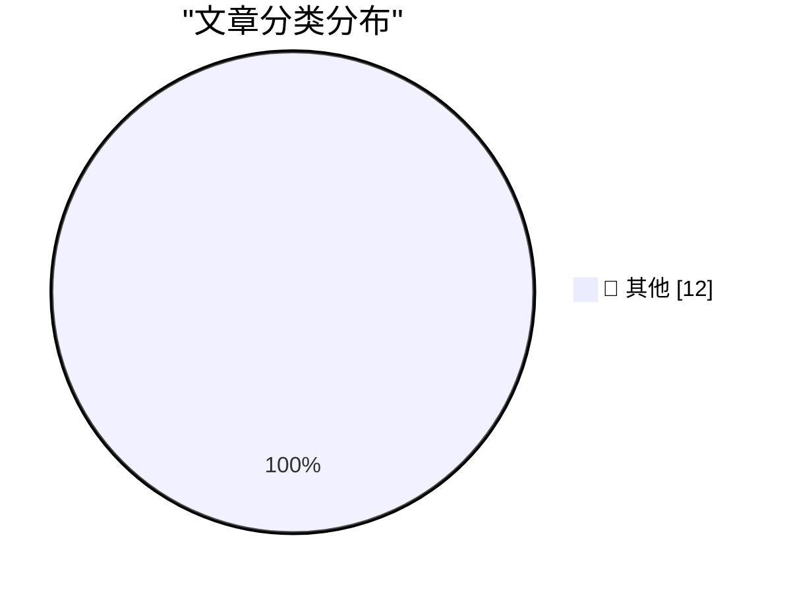

# 📰 AI 博客每日精选 — 2026-07-02

> 来自 Karpathy 推荐的 92 个顶级技术博客，AI 精选 Top 12

## 📝 今日看点

今日技术圈的焦点围绕硬件商业逻辑的反思、隐私安全的持续失守，以及开源生态的隐性负担展开。移动体验的核心矛盾正从性能转向能效与续航，而 Valve 拒绝补贴硬件的立场与苹果因成本上调售价的做法，共同揭示了行业对健康盈利模式的重建。与此同时，iCloud 漏洞长达一年未修复的事实，连同欧盟《网络复原力法案》将成本转嫁给开源社区，暴露出平台责任与基础设施维护的深层脱节。

---

## 🏆 今日必读

🥇 **两款调制解调器的故事**

[★ A Tale of Two Modems](https://daringfireball.net/2026/07/a_tale_of_two_modems) — daringfireball.net · 1 小时前 · 📝 其他

> 蜂窝网络下载速度和信号接收对于作者的需求而言，已经近乎是一个已解决的问题。然而，电池续航能力仍然是明显的短板。文章通过两款调制解调器的对比，强调在移动设备体验中，能效与续航才是目前真正的关键瓶颈。

💡 **为什么值得读**: 换个视角看技术选型：当大多数人还在追逐峰值速率时，这篇文章指出电池寿命才是决定实际体验的胜负手。

🥈 **PlayStation Plus 与 Xbox Game Pass 订阅**

[PlayStation Plus and Xbox Game Pass Subscriptions](https://daringfireball.net/linked/2026/07/01/valve-on-subsidizing-hardware) — daringfireball.net · 4 小时前 · 📝 其他

> 继 Valve 反对亏本销售游戏主机硬件的观点后，作者补充指出 PlayStation Plus 起步价为每月 11 美元（最高 20 美元），Xbox Game Pass 起步价为每月 10 美元（最高 23 美元）。这些订阅的吸引力不仅在于游戏库的访问权，更在于玩家必须订阅才能进行在线多人游戏，而如今大多数游戏都要求联网。

💡 **为什么值得读**: 揭示了主机游戏订阅服务的双重锁定机制：既有内容库吸引，又有联网游戏刚需的强制性绑定，看清这笔隐性成本。

🥉 **Valve 解释为何不补贴其硬件平台**

[Valve Explains Why It Doesn’t Subsidize Its Hardware Platforms](https://www.theverge.com/games/952004/valve-steam-machine-price-not-subsidizing) — daringfireball.net · 6 小时前 · 📝 其他

> Valve 在向 The Verge 发表的声明中阐述了其不亏本销售 Steam Deck 或 Steam Machine 的原因。公司认为亏本卖硬件虽然看似简单，但并不符合其关于健康生态系统的理念——Valve 深信开放系统对自身和用户的长期发展都更为有利，PC 生态的开放性正是其成为游戏创新主要驱动力的原因。

💡 **为什么值得读**: Valve 罕见的经营哲学自白：用拒绝烧钱换市场的商业逻辑，解释开放生态为何比补贴锁客更可持续。

---

## 📊 数据概览

| 扫描源 | 抓取文章 | 时间范围 | 精选 |
|:---:|:---:|:---:|:---:|
| 76/92 | 2381 篇 → 12 篇 | 24h | **12 篇** |

### 分类分布

---

## 📝 其他

### 1. 两款调制解调器的故事

[★ A Tale of Two Modems](https://daringfireball.net/2026/07/a_tale_of_two_modems) — **daringfireball.net** · 1 小时前 · ⭐ 15/30

> 蜂窝网络下载速度和信号接收对于作者的需求而言，已经近乎是一个已解决的问题。然而，电池续航能力仍然是明显的短板。文章通过两款调制解调器的对比，强调在移动设备体验中，能效与续航才是目前真正的关键瓶颈。

---

### 2. PlayStation Plus 与 Xbox Game Pass 订阅

[PlayStation Plus and Xbox Game Pass Subscriptions](https://daringfireball.net/linked/2026/07/01/valve-on-subsidizing-hardware) — **daringfireball.net** · 4 小时前 · ⭐ 15/30

> 继 Valve 反对亏本销售游戏主机硬件的观点后，作者补充指出 PlayStation Plus 起步价为每月 11 美元（最高 20 美元），Xbox Game Pass 起步价为每月 10 美元（最高 23 美元）。这些订阅的吸引力不仅在于游戏库的访问权，更在于玩家必须订阅才能进行在线多人游戏，而如今大多数游戏都要求联网。

---

### 3. Valve 解释为何不补贴其硬件平台

[Valve Explains Why It Doesn’t Subsidize Its Hardware Platforms](https://www.theverge.com/games/952004/valve-steam-machine-price-not-subsidizing) — **daringfireball.net** · 6 小时前 · ⭐ 15/30

> Valve 在向 The Verge 发表的声明中阐述了其不亏本销售 Steam Deck 或 Steam Machine 的原因。公司认为亏本卖硬件虽然看似简单，但并不符合其关于健康生态系统的理念——Valve 深信开放系统对自身和用户的长期发展都更为有利，PC 生态的开放性正是其成为游戏创新主要驱动力的原因。

---

### 4. 脱口秀节目：‘吃药增肥’

[The Talk Show: ‘Taking Drugs to Get Fat’](https://daringfireball.net/thetalkshow/2026/06/30/ep-451) — **daringfireball.net** · 9 小时前 · ⭐ 15/30

> John Moltz 回归节目，重点讨论了苹果因全球 RAM/SSD 短缺而上调硬件价格这一话题。此外，节目中还即兴点评了 MacOS 27 Golden Gate 测试版中讨人喜欢的用户界面变化，并涉及赞助商 Coax 和 Even Realities G2 智能眼镜等内容。

---

### 5. 404 Media：iCloud“隐藏我的邮件”漏洞导致用户真实邮箱地址泄露

[404 Media: Vulnerability in iCloud’s ‘Hide My Email’ Reveals Peoples’ Real Email Addresses](https://www.404media.co/apple-hide-my-email-vulnerability-reveals-peoples-real-email-addresses/) — **daringfireball.net** · 10 小时前 · ⭐ 15/30

> 安全研究员发现苹果 iCloud“隐藏我的邮件”功能存在漏洞，可导致用户本应被保护的真实邮箱地址遭到泄露。404 Media 已向苹果报告该问题及复现步骤超过一年，但截至发稿时漏洞依然未被修复，可以继续被利用。出于安全考量，具体的漏洞细节仍被保密。

---

### 6. 多面：技术癌变化（2026年7月1日）

[Pluralistic: Technocarcinization (01 Jul 2026)](https://pluralistic.net/2026/07/01/ontogeny/) — **pluralistic.net** · 9 小时前 · ⭐ 15/30

> Cory Doctorow 以“技术癌变化”为题，论述了“平台恶化”是大势所趋的冲击力平权器。文章涵盖了一系列链接摘要，包括伊丽莎白·沃伦关于垄断的观点、Spotify 与苹果的反垄断案、埃克森美孚说客的供词等。同时列出了即将在伦敦、爱丁堡、悉尼等地的线下露面行程。

---

### 7. 这更像是站在密封舱门的另一侧：更改管理设置

[It rather involved being on the other side of this airtight hatchway: Changing administrative settings](https://devblogs.microsoft.com/oldnewthing/20260701-00/?p=112498) — **devblogs.microsoft.com/oldnewthing** · 10 小时前 · ⭐ 15/30

> 文章讨论了从系统内部解锁门径的安全防御逻辑。当攻击者已经获得足够权限去更改管理设置时，他们实际上已经站在了密封舱门的“这一侧”，因此所谓的突破在安全模型中并不构成真正的漏洞，仅仅是已有权限的必然结果。

---

### 8. CRA 并非关于开源

[The CRA is not about open source](https://nesbitt.io/2026/07/01/the-cra-is-not-about-open-source.html) — **nesbitt.io** · 14 小时前 · ⭐ 15/30

> 欧盟《网络复原力法案》虽然创设了“开源管理员”这一角色，却未为其提供任何资金支持。文章指出 CRA 的立法初衷并非真正为了扶持或监管开源软件，而是将维护这一关键生态的重担无成本地转嫁到了社区身上。

---

### 9. 现存最早的 Tom’s Hardware Guide 文章

[The earliest surviving Tom’s Hardware Guide article](https://dfarq.homeip.net/the-earliest-surviving-toms-hardware-guide-article/?utm_source=rss&#038;utm_medium=rss&#038;utm_campaign=the-earliest-surviving-toms-hardware-guide-article) — **dfarq.homeip.net** · 13 小时前 · ⭐ 15/30

> Tom’s Hardware Guide 站点上现存最早的一篇文章可追溯至 1996 年 7 月 1 日，主题是关于 CPU 软菜单技术。这种当时仅能在特定 Abit 主板上找到的功能，如今已成为硬件配置中理所当然的基础特性。

---

### 10. 2026年4月至6月阅读摘要

[Summary of reading: April - June 2026](https://eli.thegreenplace.net/2026/summary-of-reading-april-june-2026/) — **eli.thegreenplace.net** · 23 小时前 · ⭐ 15/30

> 本季度的重点书评包括：约翰·图萨与安·图萨合著的《纽伦堡审判》，该书详尽而严谨地还原了审判过程，虽偏学术枯燥但不离主线。另一本是《事物成为其他事物：一次行走……》，题材更偏向漫步随想。

---

### 11. AIVD与MIVD的批量数据集：影子情报机构

[Bulkdatasets AIVD en MIVD: de schaduw geheime dienst](https://berthub.eu/articles/posts/de-schaduwgeheimedienst/) — **berthub.eu** · 16 小时前 · ⭐ 15/30

> 荷兰情报机构AIVD和MIVD在处理涉及数百万普通民众的批量数据集时，被曝操作草率且时有违法。这些数据集可能来自线人、其他政府机构、外国情报部门或商业公司，但机构对其来源、内容和合规性缺乏足够审查。调查显示，机构往往在未评估必要性与比例原则的情况下，便将数据用于分析或与盟友共享。报告呼吁立即建立更严格的监管框架，以防止大规模隐私侵犯持续发生。

---

### 12. ClickHouse正在赢得可观测性之战

[Clickhouse is winning the Observability Wars](https://matduggan.com/clickhouse-is-winning-the-observability-wars/) — **matduggan.com** · 11 小时前 · ⭐ 15/30

> 过去近十年，可观测性逐渐取代传统监控，成为IT运维核心概念，而ClickHouse在这一领域正脱颖而出。文章指出，ClickHouse凭借极高的查询性能、压缩效率和灵活的SQL接口，在日志、指标和追踪等可观测性数据存储中迅速取代Elasticsearch、InfluxDB等竞品。越来越多的可观测性平台如SigNoz、Hydrolix直接采用ClickHouse作为存储引擎，甚至Datadog也加入了对其的兼容支持。作者认为，ClickHouse的成功源于它对大规模时序数据实时分析的极致优化，并且社区驱动的生态正在形成滚雪球效应，使其成为事实标准。

---

*生成于 2026-07-02 00:52 | 扫描 76 源 → 获取 2381 篇 → 精选 12 篇*
*基于 [Hacker News Popularity Contest 2025](https://refactoringenglish.com/tools/hn-popularity/) RSS 源列表，由 [Andrej Karpathy](https://x.com/karpathy) 推荐*
*由「懂点儿AI」制作，欢迎关注同名微信公众号获取更多 AI 实用技巧 💡*
